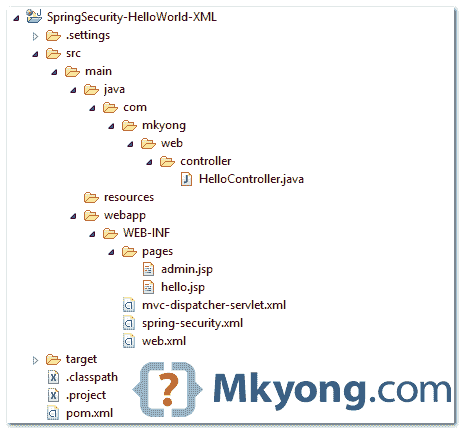
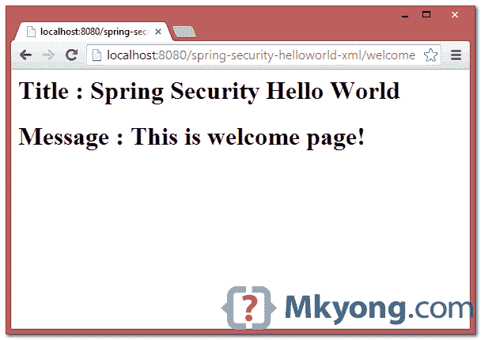
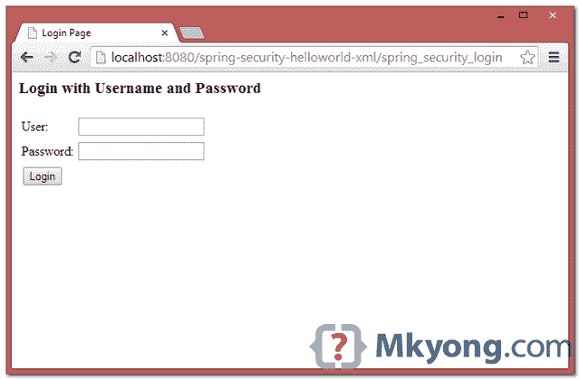
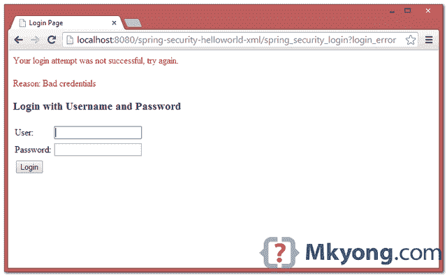
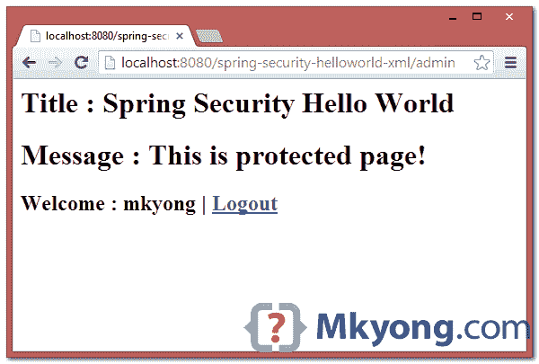

# Spring Security hello world 示例

> 原文：<http://web.archive.org/web/20230101150211/http://www.mkyong.com/spring-security/spring-security-hello-world-example/>

在本教程中，我们将向您展示如何将 Spring Security 与 Spring MVC web 应用程序集成在一起，以保护 URL 访问。在实现了 Spring Security 之后，要访问“管理”页面的内容，用户需要输入正确的“用户名”和“密码”。

使用的技术:

1.  弹簧 3.2.8 释放
2.  Spring Security 3.2.3 .发布
3.  Eclipse 4.2
4.  JDK 1.6
5.  maven3

**Note**
Spring Security 3.0 requires Java 5.0 Runtime Environment or higher

## 1.项目演示

[//web.archive.org/web/20210223165920if_/https://www.youtube.com/embed/hblHPyMuHJc](//web.archive.org/web/20210223165920if_/https://www.youtube.com/embed/hblHPyMuHJc)

freestar.config.enabled_slots.push({ placementName: "mkyong_incontent_1", slotId: "mkyong_incontent_1" });

## 2.目录结构

查看本教程的最终目录结构。

<noscript></noscript>



## 3.Spring 安全依赖项

要使用 Spring security，需要`spring-security-web`和`spring-security-config`。

pom.xml

```
 <properties>
		<jdk.version>1.6</jdk.version>
		<spring.version>3.2.8.RELEASE</spring.version>
		<spring.security.version>3.2.3.RELEASE</spring.security.version>
		<jstl.version>1.2</jstl.version>
	</properties>

	<dependencies>

		<!-- Spring dependencies -->
		<dependency>
			<groupId>org.springframework</groupId>
			<artifactId>spring-core</artifactId>
			<version>${spring.version}</version>
		</dependency>

		<dependency>
			<groupId>org.springframework</groupId>
			<artifactId>spring-web</artifactId>
			<version>${spring.version}</version>
		</dependency>

		<dependency>
			<groupId>org.springframework</groupId>
			<artifactId>spring-webmvc</artifactId>
			<version>${spring.version}</version>
		</dependency>

		<!-- Spring Security -->
		<dependency>
			<groupId>org.springframework.security</groupId>
			<artifactId>spring-security-web</artifactId>
			<version>${spring.security.version}</version>
		</dependency>

		<dependency>
			<groupId>org.springframework.security</groupId>
			<artifactId>spring-security-config</artifactId>
			<version>${spring.security.version}</version>
		</dependency>

		<!-- jstl for jsp page -->
		<dependency>
			<groupId>jstl</groupId>
			<artifactId>jstl</artifactId>
			<version>${jstl.version}</version>
		</dependency>

	</dependencies> 
```

## 4.Spring MVC Web 应用程序

一个简单的控制器:

1.  如果 URL = `/welcome`或`/`，返回 hello 页面。
2.  如果 URL = `/admin`，返回管理页面。

稍后，我们将向您展示如何使用 Spring Security 来保护带有用户登录表单的“/admin”URL。

HelloController.java

```
 package com.mkyong.web.controller;

import org.springframework.stereotype.Controller;
import org.springframework.web.bind.annotation.RequestMapping;
import org.springframework.web.bind.annotation.RequestMethod;
import org.springframework.web.servlet.ModelAndView;

@Controller
public class HelloController {

	@RequestMapping(value = { "/", "/welcome**" }, method = RequestMethod.GET)
	public ModelAndView welcomePage() {

		ModelAndView model = new ModelAndView();
		model.addObject("title", "Spring Security Hello World");
		model.addObject("message", "This is welcome page!");
		model.setViewName("hello");
		return model;

	}

	@RequestMapping(value = "/admin**", method = RequestMethod.GET)
	public ModelAndView adminPage() {

		ModelAndView model = new ModelAndView();
		model.addObject("title", "Spring Security Hello World");
		model.addObject("message", "This is protected page!");
		model.setViewName("admin");

		return model;

	}

} 
```

两个 JSP 页面。

hello.jsp

```
 <%@page session="false"%>
<html>
<body>
	<h1>Title : ${title}</h1>	
	<h1>Message : ${message}</h1>	
</body>
</html> 
```

admin.jsp

```
 <%@taglib prefix="c" uri="http://java.sun.com/jsp/jstl/core"%>
<%@page session="true"%>
<html>
<body>
	<h1>Title : ${title}</h1>
	<h1>Message : ${message}</h1>

	<c:if test="${pageContext.request.userPrincipal.name != null}">
	   <h2>Welcome : ${pageContext.request.userPrincipal.name} 
           | <a href="<c:url value="/j_spring_security_logout" />" > Logout</a></h2>  
	</c:if>
</body>
</html> 
```

mvc-dispatcher-servlet.xml

```
 <beans 
	xmlns:context="http://www.springframework.org/schema/context"
	xmlns:xsi="http://www.w3.org/2001/XMLSchema-instance"
	xsi:schemaLocation="
        http://www.springframework.org/schema/beans     
        http://www.springframework.org/schema/beans/spring-beans-3.0.xsd
        http://www.springframework.org/schema/context 
        http://www.springframework.org/schema/context/spring-context-3.0.xsd">

	<context:component-scan base-package="com.mkyong.*" />

	<bean
	  class="org.springframework.web.servlet.view.InternalResourceViewResolver">
	  <property name="prefix">
		<value>/WEB-INF/pages/</value>
	  </property>
	  <property name="suffix">
		<value>.jsp</value>
	  </property>
	</bean>

</beans> 
```

## 5.Spring 安全性:用户认证

创建一个 Spring 安全 XML 文件。

spring-security.xml

```
 <beans:beans 
	xmlns:beans="http://www.springframework.org/schema/beans" 
	xmlns:xsi="http://www.w3.org/2001/XMLSchema-instance"
	xsi:schemaLocation="http://www.springframework.org/schema/beans
	http://www.springframework.org/schema/beans/spring-beans-3.0.xsd
	http://www.springframework.org/schema/security
	http://www.springframework.org/schema/security/spring-security-3.2.xsd">

	<http auto-config="true">
		<intercept-url pattern="/admin**" access="ROLE_USER" />
	</http>

	<authentication-manager>
	  <authentication-provider>
	    <user-service>
		<user name="mkyong" password="123456" authorities="ROLE_USER" />
	    </user-service>
	  </authentication-provider>
	</authentication-manager>

</beans:beans> 
```

它告诉我们，只有用户“mkyong”被允许访问`/admin` URL。

## 6.集成 Spring 安全

要将 Spring security 与 Spring MVC web 应用程序集成，只需将`DelegatingFilterProxy`声明为一个 servlet 过滤器来拦截任何传入的请求。

web.xml

```
 <web-app id="WebApp_ID" version="2.4"

	xmlns:xsi="http://www.w3.org/2001/XMLSchema-instance"
	xsi:schemaLocation="http://java.sun.com/xml/ns/j2ee 
	http://java.sun.com/xml/ns/j2ee/web-app_2_4.xsd">

	<display-name>Spring MVC Application</display-name>

	<!-- Spring MVC -->
	<servlet>
		<servlet-name>mvc-dispatcher</servlet-name>
		<servlet-class>org.springframework.web.servlet.DispatcherServlet
		</servlet-class>
		<load-on-startup>1</load-on-startup>
	</servlet>
	<servlet-mapping>
		<servlet-name>mvc-dispatcher</servlet-name>
		<url-pattern>/</url-pattern>
	</servlet-mapping>

	<listener>
		<listener-class>org.springframework.web.context.ContextLoaderListener
		</listener-class>
	</listener>

        <!-- Loads Spring Security config file -->
	<context-param>
		<param-name>contextConfigLocation</param-name>
		<param-value>
			/WEB-INF/spring-security.xml
		</param-value>
	</context-param>

	<!-- Spring Security -->
	<filter>
		<filter-name>springSecurityFilterChain</filter-name>
		<filter-class>org.springframework.web.filter.DelegatingFilterProxy
		</filter-class>
	</filter>

	<filter-mapping>
		<filter-name>springSecurityFilterChain</filter-name>
		<url-pattern>/*</url-pattern>
	</filter-mapping>

</web-app> 
```

## 7.演示

就这些，但是等等…登录表单在哪里？不用担心，如果您没有定义任何定制的登录表单，Spring 会自动创建一个简单的登录表单。

**Custom Login Form**
Read this “[Spring Security form login example](http://web.archive.org/web/20210223165920/http://www.mkyong.com/spring-security/spring-security-form-login-example/)” to understand how to create a custom login form in Spring Security.

1.欢迎页面-`http://localhost:8080/spring-security-helloworld-xml/welcome`

<noscript></noscript>



2.尝试访问`/admin`页面，Spring Security 会拦截请求并重定向到`/spring_security_login`，会显示一个预定义的登录表单。

<noscript></noscript>



3.如果用户名和密码不正确，就会显示错误消息，Spring 会重定向到这个 URL `/spring_security_login?login_error`。

<noscript></noscript>



4.如果用户名和密码正确，Spring 会将请求重定向到最初请求的 URL 并显示页面。

<noscript></noscript>



## 下载源代码

Download it – [spring-security-helloworld-xml.zip](http://web.archive.org/web/20210223165920/http://www.mkyong.com/wp-content/uploads/2011/08/spring-security-helloworld-xml.zip) (9 KB)

## 参考

1.  [春安官方网站](http://web.archive.org/web/20210223165920/https://projects.spring.io/spring-security/)
2.  [Spring 3 MVC hello world 示例](http://web.archive.org/web/20210223165920/http://www.mkyong.com/spring3/spring-3-mvc-hello-world-example/)
3.  [Spring 安全表单登录示例(认证)](http://web.archive.org/web/20210223165920/http://www.mkyong.com/spring-security/spring-security-form-login-example/)

Tags : [hello world](http://web.archive.org/web/20210223165920/https://mkyong.com/tag/hello-world/) [spring security](http://web.archive.org/web/20210223165920/https://mkyong.com/tag/spring-security/)freestar.config.enabled_slots.push({ placementName: "mkyong_leaderboard_btf", slotId: "mkyong_leaderboard_btf" });<input type="hidden" id="mkyong-current-postId" value="10002">