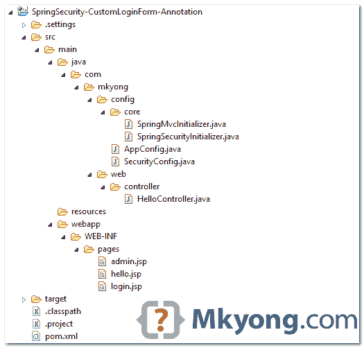
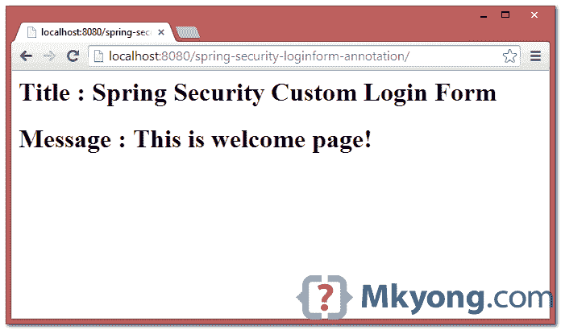
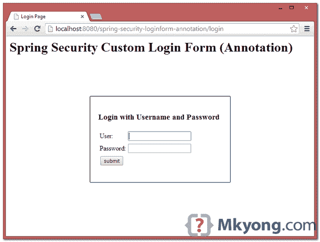
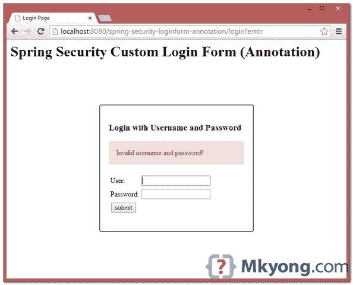
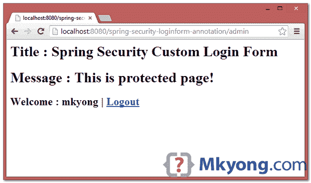
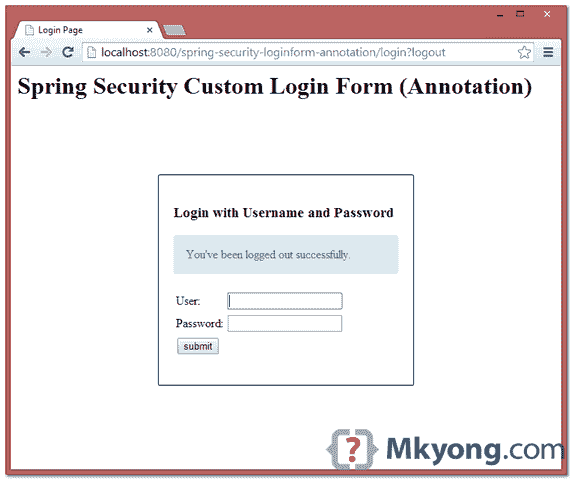

> 原文：<http://web.archive.org/web/20230101150211/http://www.mkyong.com/spring-security/spring-security-custom-login-form-annotation-example/>

# Spring 安全自定义登录表单注释示例

在本教程中，我们将把之前的 [Spring Security 定制登录表单(XML)](http://web.archive.org/web/20190303104611/http://www.mkyong.com/spring-security/spring-security-form-login-example/) 项目转换成一个纯粹的基于注释的项目。

使用的技术:

1.  弹簧 3.2.8 释放
2.  Spring Security 3.2.3 .发布
3.  Eclipse 4.2
4.  JDK 1.6
5.  maven3
6.  Tomcat 7 (Servlet 3.x)

**Note**
In this example, last [Spring Security hello world annotation example](http://web.archive.org/web/20190303104611/http://www.mkyong.com/spring-security/spring-security-hello-world-annotation-example/) will be reused, enhance it to support a custom login form.

## 1.项目演示

[//web.archive.org/web/20190303104611if_/http://www.youtube.com/embed/Th5keN9Cqx4](//web.archive.org/web/20190303104611if_/http://www.youtube.com/embed/Th5keN9Cqx4)

 <ins class="adsbygoogle" style="display:block; text-align:center;" data-ad-format="fluid" data-ad-layout="in-article" data-ad-client="ca-pub-2836379775501347" data-ad-slot="6894224149">## 2.目录结构

查看本教程的最终目录结构。

 <ins class="adsbygoogle" style="display:block" data-ad-client="ca-pub-2836379775501347" data-ad-slot="8821506761" data-ad-format="auto" data-ad-region="mkyongregion">## 3.Spring 安全配置

通过注释进行 Spring 安全配置。

SecurityConfig.java

```java
 package com.mkyong.config;

import org.springframework.beans.factory.annotation.Autowired;
import org.springframework.context.annotation.Configuration;
import org.springframework.security.config.annotation.authentication.builders.AuthenticationManagerBuilder;
import org.springframework.security.config.annotation.web.builders.HttpSecurity;
import org.springframework.security.config.annotation.web.configuration.EnableWebSecurity;
import org.springframework.security.config.annotation.web.configuration.WebSecurityConfigurerAdapter;

@Configuration
@EnableWebSecurity
public class SecurityConfig extends WebSecurityConfigurerAdapter {

	@Autowired
	public void configureGlobal(AuthenticationManagerBuilder auth) throws Exception {
		auth.inMemoryAuthentication()
                   .withUser("mkyong").password("123456").roles("USER");
	}

	//.csrf() is optional, enabled by default, if using WebSecurityConfigurerAdapter constructor
	@Override
	protected void configure(HttpSecurity http) throws Exception {

	    http.authorizeRequests()
		.antMatchers("/admin/**").access("hasRole('ROLE_USER')")
		.and()
		    .formLogin().loginPage("/login").failureUrl("/login?error")
		    .usernameParameter("username").passwordParameter("password")		
		.and()
		    .logout().logoutSuccessUrl("/login?logout")
		.and()
		    .csrf(); 		
	}
} 
```

相当于 Spring Security XML 文件:

```java
 <http auto-config="true">
	  <intercept-url pattern="/admin**" access="ROLE_USER" />
	  <form-login 
		login-page="/login" 
	        default-target-url="/welcome" 
		authentication-failure-url="/login?error" 
		username-parameter="username"
		password-parameter="password" />
	  <logout logout-success-url="/login?logout" />
	  <!-- enable csrf protection -->
	  <csrf/>
	</http>

	<authentication-manager>
	  <authentication-provider>
	    <user-service>
		<user name="mkyong" password="123456" authorities="ROLE_USER" />
	    </user-service>
	  </authentication-provider>
	</authentication-manager> 
```

## 4.自定义登录表单

4.1 显示自定义登录表单的页面。如果启用了 CSRF 保护，记得在登录和注销表单中添加`${_csrf.token}`。

login.jsp

```java
 <%@ taglib prefix="c" uri="http://java.sun.com/jsp/jstl/core"%>
<html>
<head>
<title>Login Page</title>
<style>
.error {
	padding: 15px;
	margin-bottom: 20px;
	border: 1px solid transparent;
	border-radius: 4px;
	color: #a94442;
	background-color: #f2dede;
	border-color: #ebccd1;
}

.msg {
	padding: 15px;
	margin-bottom: 20px;
	border: 1px solid transparent;
	border-radius: 4px;
	color: #31708f;
	background-color: #d9edf7;
	border-color: #bce8f1;
}

#login-box {
	width: 300px;
	padding: 20px;
	margin: 100px auto;
	background: #fff;
	-webkit-border-radius: 2px;
	-moz-border-radius: 2px;
	border: 1px solid #000;
}
</style>
</head>
<body onload='document.loginForm.username.focus();'>

	<h1>Spring Security Custom Login Form (Annotation)</h1>

	<div id="login-box">

		<h2>Login with Username and Password</h2>

		<c:if test="${not empty error}">
			<div class="error">${error}</div>
		</c:if>
		<c:if test="${not empty msg}">
			<div class="msg">${msg}</div>
		</c:if>

		<form name='loginForm'
		    action="<c:url value='j_spring_security_check' />" method='POST'>

		    <table>
			<tr>
				<td>User:</td>
				<td><input type='text' name='user' value=''></td>
			</tr>
			<tr>
				<td>Password:</td>
				<td><input type='password' name='pass' /></td>
			</tr>
			<tr>
			        <td colspan='2'>
                                <input name="submit" type="submit" value="submit" />
                                </td>
			</tr>
		   </table>

		   <input type="hidden" 
                     name="${_csrf.parameterName}" value="${_csrf.token}" />
		</form>
	</div>

</body>
</html> 
```

4.2 显示欢迎消息的页面，默认页面。

hello.jsp

```java
 <%@page session="false"%>
<html>
<body>
	<h1>Title : ${title}</h1>	
	<h1>Message : ${message}</h1>	
</body>
</html> 
```

4.3 本页面受密码保护，只有通过认证的用户才可以访问。

admin.jsp + logout

```java
 <%@taglib prefix="c" uri="http://java.sun.com/jsp/jstl/core"%>
<%@page session="true"%>
<html>
<body>
	<h1>Title : ${title}</h1>
	<h1>Message : ${message}</h1>

	<c:url value="/j_spring_security_logout" var="logoutUrl" />

		<!-- csrt support -->
	<form action="${logoutUrl}" method="post" id="logoutForm">
		<input type="hidden" 
			name="${_csrf.parameterName}"
			value="${_csrf.token}" />
	</form>

	<script>
		function formSubmit() {
			document.getElementById("logoutForm").submit();
		}
	</script>

	<c:if test="${pageContext.request.userPrincipal.name != null}">
		<h2>
			Welcome : ${pageContext.request.userPrincipal.name} | <a
				href="javascript:formSubmit()"> Logout</a>
		</h2>
	</c:if>

</body>
</html> 
```

## 5.Spring MVC 控制器

简单的控制器。

HelloController.java

```java
 package com.mkyong.web.controller;

import org.springframework.stereotype.Controller;
import org.springframework.web.bind.annotation.RequestMapping;
import org.springframework.web.bind.annotation.RequestMethod;
import org.springframework.web.bind.annotation.RequestParam;
import org.springframework.web.servlet.ModelAndView;

@Controller
public class HelloController {

	@RequestMapping(value = { "/", "/welcome**" }, method = RequestMethod.GET)
	public ModelAndView welcomePage() {

		ModelAndView model = new ModelAndView();
		model.addObject("title", "Spring Security Custom Login Form");
		model.addObject("message", "This is welcome page!");
		model.setViewName("hello");
		return model;

	}

	@RequestMapping(value = "/admin**", method = RequestMethod.GET)
	public ModelAndView adminPage() {

		ModelAndView model = new ModelAndView();
		model.addObject("title", "Spring Security Custom Login Form");
		model.addObject("message", "This is protected page!");
		model.setViewName("admin");

		return model;

	}

	//Spring Security see this :
	@RequestMapping(value = "/login", method = RequestMethod.GET)
	public ModelAndView login(
		@RequestParam(value = "error", required = false) String error,
		@RequestParam(value = "logout", required = false) String logout) {

		ModelAndView model = new ModelAndView();
		if (error != null) {
			model.addObject("error", "Invalid username and password!");
		}

		if (logout != null) {
			model.addObject("msg", "You've been logged out successfully.");
		}
		model.setViewName("login");

		return model;

	}

} 
```

## 6.初始值设定项类

下面是初始化器类，使它成为一个纯粹的基于注释的项目。

6.1 启用 Spring 安全配置的初始化器类。

SpringSecurityInitializer.java

```java
 package com.mkyong.config.core;

import org.springframework.security.web.context.AbstractSecurityWebApplicationInitializer;
public class SpringSecurityInitializer extends AbstractSecurityWebApplicationInitializer {

} 
```

6.2 启用 Spring MVC 的初始化器类。

SpringMvcInitializer.java

```java
 package com.mkyong.config.core;

import org.springframework.web.servlet.support.AbstractAnnotationConfigDispatcherServletInitializer;
import com.mkyong.config.AppConfig;

public class SpringMvcInitializer 
	extends AbstractAnnotationConfigDispatcherServletInitializer {

	@Override
	protected Class<?>[] getRootConfigClasses() {
		return new Class[] { AppConfig.class };
	}

	@Override
	protected Class<?>[] getServletConfigClasses() {
		return null;
	}

	@Override
	protected String[] getServletMappings() {
		return new String[] { "/" };
	}

} 
```

AppConfig.java

```java
 package com.mkyong.config;

import org.springframework.context.annotation.Bean;
import org.springframework.context.annotation.ComponentScan;
import org.springframework.context.annotation.Configuration;
import org.springframework.context.annotation.Import;
import org.springframework.web.servlet.config.annotation.EnableWebMvc;
import org.springframework.web.servlet.view.InternalResourceViewResolver;
import org.springframework.web.servlet.view.JstlView;

@EnableWebMvc
@Configuration
@ComponentScan({ "com.mkyong.web.*" })
@Import({ SecurityConfig.class })
public class AppConfig {

	@Bean
	public InternalResourceViewResolver viewResolver() {
		InternalResourceViewResolver viewResolver
                           = new InternalResourceViewResolver();
		viewResolver.setViewClass(JstlView.class);
		viewResolver.setPrefix("/WEB-INF/pages/");
		viewResolver.setSuffix(".jsp");
		return viewResolver;
	}

} 
```

## 7.演示

7.1.欢迎页面-*http://localhost:8080/spring-security-loginform-annotation/*



7.2 尝试访问`/admin`页面，显示您的自定义登录表单。



7.3.如果用户名和密码不正确，显示`/login?error`。



7.4.如果用户名和密码正确，Spring 会将请求重定向到最初请求的 URL 并显示页面。



7.5.尝试注销，会重定向到`/login?logout`页面。



## 下载源代码

Download it – [spring-security-custom-login-form-annotation.zip](http://web.archive.org/web/20190303104611/http://www.mkyong.com/wp-content/uploads/2014/04/spring-security-custom-login-form-annotation.zip) (19 KB)

## 参考

1.  [春安你好世界注释示例](http://web.archive.org/web/20190303104611/http://www.mkyong.com/spring-security/spring-security-hello-world-annotation-example/)
2.  [创建自定义登录表单](http://web.archive.org/web/20190303104611/http://docs.spring.io/spring-security/site/docs/3.2.0.RELEASE/guides/form.html)
3.  [春安 3.2.0.RC1 亮点:CSRF 保护](http://web.archive.org/web/20190303104611/http://spring.io/blog/2013/08/21/spring-security-3-2-0-rc1-highlights-csrf-protection/)
4.  [维基百科:跨站请求伪造](http://web.archive.org/web/20190303104611/http://en.wikipedia.org/wiki/Cross-site_request_forgery)

[login form](http://web.archive.org/web/20190303104611/http://www.mkyong.com/tag/login-form/) [spring security](http://web.archive.org/web/20190303104611/http://www.mkyong.com/tag/spring-security/)</ins></ins> (function (i,d,s,o,m,r,c,l,w,q,y,h,g) { var e=d.getElementById(r);if(e===null){ var t = d.createElement(o); t.src = g; t.id = r; t.setAttribute(m, s);t.async = 1;var n=d.getElementsByTagName(o)[0];n.parentNode.insertBefore(t, n); var dt=new Date().getTime(); try{i[l][w+y](h,i[l][q+y](h)+'&amp;'+dt);}catch(er){i[h]=dt;} } else if(typeof i[c]!=='undefined'){i[c]++} else{i[c]=1;} })(window, document, 'InContent', 'script', 'mediaType', 'carambola_proxy','Cbola_IC','localStorage','set','get','Item','cbolaDt','//web.archive.org/web/20190303104611/http://route.carambo.la/inimage/getlayer?pid=myky82&amp;did=112239&amp;wid=0')<input type="hidden" id="mkyong-postId" value="13259">

#### 关于作者


##### mkyong

Founder of [Mkyong.com](http://web.archive.org/web/20190303104611/http://mkyong.com/), love Java and open source stuff. Follow him on [Twitter](http://web.archive.org/web/20190303104611/https://twitter.com/mkyong), or befriend him on [Facebook](http://web.archive.org/web/20190303104611/http://www.facebook.com/java.tutorial) or [Google Plus](http://web.archive.org/web/20190303104611/https://plus.google.com/110948163568945735692?rel=author). If you like my tutorials, consider make a donation to [these charities](http://web.archive.org/web/20190303104611/http://www.mkyong.com/blog/donate-to-charity/).