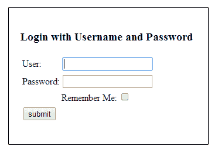
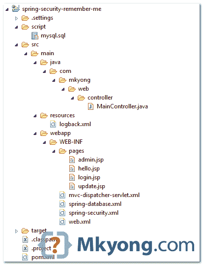
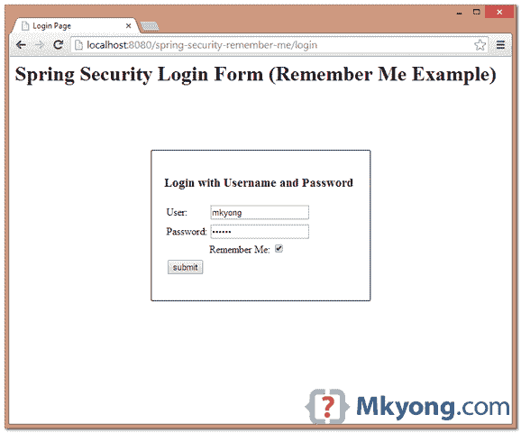
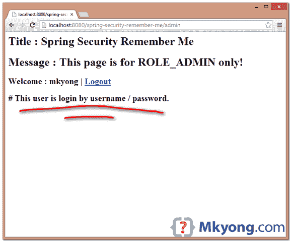
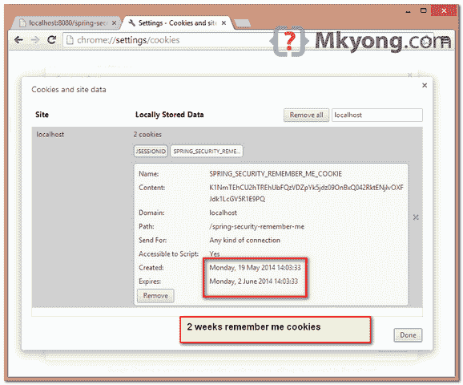
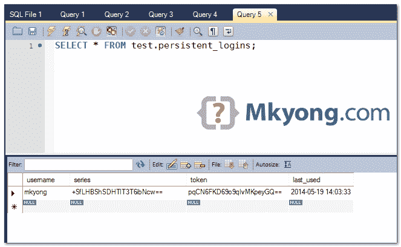
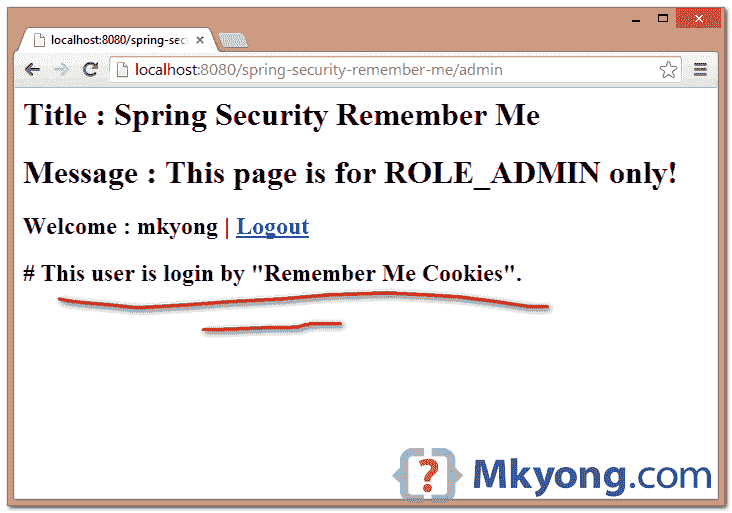
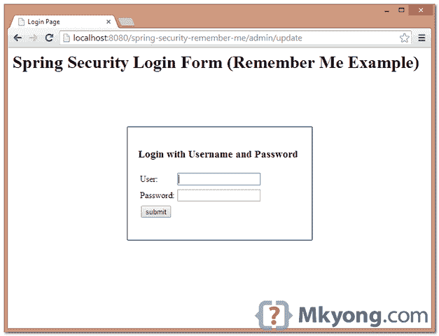
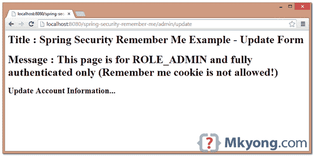

> 原文：<http://web.archive.org/web/20230101150211/http://www.mkyong.com/spring-security/spring-security-remember-me-example/>

# Spring Security 记住我示例



在本教程中，我们将向您展示如何在 Spring Security 中实现“记住我”登录功能，这意味着，即使在用户的会话过期后，系统也会记住用户并执行自动登录。

使用的技术和工具:

1.  弹簧 3.2.8 释放
2.  Spring Security 3.2.3 .发布
3.  春季 JDBC 3.2.3 .发布
4.  Eclipse 4.2
5.  JDK 1.6
6.  maven3
7.  MySQL 服务器 5.6
8.  Tomcat 6 和 7 (Servlet 3.x)
9.  用谷歌浏览器测试

一些快速注释:

1.  在 Spring Security 中，有两种实现“记住我”的方法——简单的基于哈希的令牌和持久令牌方法。
2.  要了解“记住我”是如何工作的，请阅读这些文章-[Spring remember me reference](http://web.archive.org/web/20190225101058/http://docs.spring.io/spring-security/site/docs/3.2.3.RELEASE/reference/htmlsingle/#remember-me)、[持久登录 Cookie 最佳实践](http://web.archive.org/web/20190225101058/http://fishbowl.pastiche.org/2004/01/19/persistent_login_cookie_best_practice/)、[改进的持久登录 Cookie 最佳实践](http://web.archive.org/web/20190225101058/http://jaspan.com/improved_persistent_login_cookie_best_practice)。
3.  这个例子使用的是“持久令牌方法”，参考 Spring 的`PersistentTokenBasedRememberMeServices`。
4.  这个例子使用了 MySQL 和数据库认证(通过 Spring JDBC)。
5.  将创建表“persistent_logins”来存储登录令牌和序列。

项目工作流:

1.  如果用户登录时勾选了“记住我”，系统将在请求的浏览器中存储一个“记住我”cookie。
2.  如果用户的浏览器提供了有效的“记住我”cookie，系统将执行自动登录。
3.  如果用户通过“记住我”cookie 登录，要更新用户详细信息，用户需要再次键入用户名和密码(这是一种避免窃取 cookie 来更新用户信息的良好做法。

这是“记住我”应该如何工作的一个非常高的水平，详情请参考“快速笔记”中的以上链接。

## 1.项目演示

[//web.archive.org/web/20190225101058if_/http://www.youtube.com/embed/HUnGc4WKgRk](//web.archive.org/web/20190225101058if_/http://www.youtube.com/embed/HUnGc4WKgRk)

 <ins class="adsbygoogle" style="display:block; text-align:center;" data-ad-format="fluid" data-ad-layout="in-article" data-ad-client="ca-pub-2836379775501347" data-ad-slot="6894224149">## 2.项目目录

查看项目目录结构。

 <ins class="adsbygoogle" style="display:block" data-ad-client="ca-pub-2836379775501347" data-ad-slot="8821506761" data-ad-format="auto" data-ad-region="mkyongregion">## 3.MySQL 脚本

创建`users`、`user_roles`和`persistent_logins`的 SQL 脚本。

```
 CREATE  TABLE users (
  username VARCHAR(45) NOT NULL ,
  password VARCHAR(45) NOT NULL ,
  enabled TINYINT NOT NULL DEFAULT 1 ,
  PRIMARY KEY (username));

CREATE TABLE user_roles (
  user_role_id int(11) NOT NULL AUTO_INCREMENT,
  username varchar(45) NOT NULL,
  role varchar(45) NOT NULL,
  PRIMARY KEY (user_role_id),
  UNIQUE KEY uni_username_role (role,username),
  KEY fk_username_idx (username),
  CONSTRAINT fk_username FOREIGN KEY (username) REFERENCES users (username));

INSERT INTO users(username,password,enabled)
VALUES ('mkyong','123456', true);

INSERT INTO user_roles (username, role)
VALUES ('mkyong', 'ROLE_USER');
INSERT INTO user_roles (username, role)
VALUES ('mkyong', 'ROLE_ADMIN');

CREATE TABLE persistent_logins (
    username varchar(64) not null,
    series varchar(64) not null,
    token varchar(64) not null,
    last_used timestamp not null,
    PRIMARY KEY (series)
); 
```

## 4.记住我(XML 示例)

为了在 XML 配置中启用“记住我”,将`remember-me`标记放在`http`中，如下所示:

spring-security.xml

```
 <!-- enable use-expressions -->
  <http auto-config="true" use-expressions="true">
    <intercept-url pattern="/admin**" access="hasRole('ROLE_ADMIN')" />

    <form-login login-page="/login" 
	default-target-url="/welcome"
	authentication-failure-url="/login?error" 
	username-parameter="username"
	password-parameter="password" 
	login-processing-url="/auth/login_check"
	authentication-success-handler-ref="savedRequestAwareAuthenticationSuccessHandler" />

    <logout logout-success-url="/login?logout" delete-cookies="JSESSIONID" />
    <csrf />

    <!-- enable remember me -->
    <remember-me 
        token-validity-seconds="1209600"
	remember-me-parameter="remember-me" 
	data-source-ref="dataSource" />

  </http> 
```

spring-database.xml

```
 <bean id="dataSource"
	class="org.springframework.jdbc.datasource.DriverManagerDataSource">

	<property name="driverClassName" value="com.mysql.jdbc.Driver" />
	<property name="url" value="jdbc:mysql://localhost:3306/test" />
	<property name="username" value="root" />
	<property name="password" value="password" />
  </bean>

  <!-- If request parameter "targetUrl" is existed, then forward to this url --> 
  <!-- For update login form -->
  <bean id="savedRequestAwareAuthenticationSuccessHandler"
	class="org.springframework.security.web.authentication.SavedRequestAwareAuthenticationSuccessHandler">
	<property name="targetUrlParameter" value="targetUrl" />
  </bean> 
```

1.  **token-validity-seconds**—“勿忘我”cookie 的过期日期，以秒为单位。例如，1209600 = 2 周(14 天)，86400 = 1 天，18000 = 5 小时。
2.  **记住我的参数**–“复选框”的名称。默认为' _spring_security_remember_me '。
3.  **data-source-ref**–如果指定，将使用“持久令牌方法”。默认为“简单的基于散列的令牌方法”。

## 5.记住我(注释示例)

相当于注释:

SecurityConfig.java

```
 package com.mkyong.config;

import javax.sql.DataSource;
import org.springframework.beans.factory.annotation.Autowired;
import org.springframework.context.annotation.Bean;
import org.springframework.context.annotation.Configuration;
import org.springframework.security.config.annotation.authentication.builders.AuthenticationManagerBuilder;
import org.springframework.security.config.annotation.web.builders.HttpSecurity;
import org.springframework.security.config.annotation.web.configuration.EnableWebSecurity;
import org.springframework.security.config.annotation.web.configuration.WebSecurityConfigurerAdapter;
import org.springframework.security.web.authentication.SavedRequestAwareAuthenticationSuccessHandler;
import org.springframework.security.web.authentication.rememberme.JdbcTokenRepositoryImpl;
import org.springframework.security.web.authentication.rememberme.PersistentTokenRepository;

@Configuration
@EnableWebSecurity
public class SecurityConfig extends WebSecurityConfigurerAdapter {

	@Autowired
	DataSource dataSource;
	//...

	@Override
	protected void configure(HttpSecurity http) throws Exception {

	  http.authorizeRequests()
	      .antMatchers("/admin/**").access("hasRole('ROLE_ADMIN')")
	    .and()
	      .formLogin()
	        .successHandler(savedRequestAwareAuthenticationSuccessHandler())
		.loginPage("/login")
	        .failureUrl("/login?error")
		.loginProcessingUrl("/auth/login_check")
		.usernameParameter("username")
		.passwordParameter("password")
	    .and()
		.logout().logoutSuccessUrl("/login?logout")
	    .and()
	        .csrf()
	    .and()
		.rememberMe().tokenRepository(persistentTokenRepository())
		.tokenValiditySeconds(1209600);
	}

	@Bean
	public PersistentTokenRepository persistentTokenRepository() {
		JdbcTokenRepositoryImpl db = new JdbcTokenRepositoryImpl();
		db.setDataSource(dataSource);
		return db;
	}

	@Bean
	public SavedRequestAwareAuthenticationSuccessHandler 
                savedRequestAwareAuthenticationSuccessHandler() {

               SavedRequestAwareAuthenticationSuccessHandler auth 
                    = new SavedRequestAwareAuthenticationSuccessHandler();
		auth.setTargetUrlParameter("targetUrl");
		return auth;
	}	

} 
```

*P.S 在批注配置中，“记住我”复选框的默认 http 名称是“记住我”。*

## 6.HTML/JSP 页面

6.1 在 JSP 中，您可以使用 Spring 安全标签`sec:authorize access="isRememberMe()"`来确定该用户是否通过“记住我”cookies 登录。

admin.jsp

```
 <%@taglib prefix="sec"
	uri="http://www.springframework.org/security/tags"%>
<%@taglib prefix="c" uri="http://java.sun.com/jsp/jstl/core"%>
<%@page session="true"%>
<html>
<body>
	<h1>Title : ${title}</h1>
	<h1>Message : ${message}</h1>

	<c:url value="/j_spring_security_logout" var="logoutUrl" />
	<form action="${logoutUrl}" method="post" id="logoutForm">
		<input type="hidden" name="${_csrf.parameterName}"
			value="${_csrf.token}" />
	</form>
	<script>
		function formSubmit() {
			document.getElementById("logoutForm").submit();
		}
	</script>

	<c:if test="${pageContext.request.userPrincipal.name != null}">
	  <h2>
		Welcome : ${pageContext.request.userPrincipal.name} | <a
			href="javascript:formSubmit()"> Logout</a>
	  </h2>
	</c:if>

	<sec:authorize access="isRememberMe()">
		<h2># This user is login by "Remember Me Cookies".</h2>
	</sec:authorize>

	<sec:authorize access="isFullyAuthenticated()">
		<h2># This user is login by username / password.</h2>
	</sec:authorize>

</body>
</html> 
```

6.2 带有“记住我”复选框的简单登录表单。

login.jsp

```
 <form name='loginForm'
	action="<c:url value='/auth/login_check?targetUrl=${targetUrl}' />"
	method='POST'>

	<table>
	<tr>
		<td>User:</td>
		<td><input type='text' name='username'></td>
	</tr>
	<tr>
		<td>Password:</td>
		<td><input type='password' name='password' /></td>
	</tr>

	<!-- if this is login for update, ignore remember me check -->
	<c:if test="${empty loginUpdate}">
	<tr>
		<td></td>
		<td>Remember Me: <input type="checkbox" name="remember-me" /></td>
	</tr>
	</c:if>

	<tr>
	        <td colspan='2'><input name="submit" type="submit"
		value="submit" /></td>
	</tr>

	</table>

	<input type="hidden" name="${_csrf.parameterName}"
		value="${_csrf.token}" />

  </form> 
```

6.3 更新页面。只有使用密码登录的用户才能访问此页面。

update.jsp

```
 <%@taglib prefix="c" uri="http://java.sun.com/jsp/jstl/core"%>
<%@page session="true"%>
<html>
<body>
	<h1>Title : Spring Security Remember Me Example - Update Form</h1>
	<h1>Message : This page is for ROLE_ADMIN and fully authenticated only 
            (Remember me cookie is not allowed!)</h1>

	<h2>Update Account Information...</h2>
</body>
</html> 
```

## 7.控制器

Spring 控制器类，阅读注释不言自明。

MainController.java

```
 package com.mkyong.web.controller;

import javax.servlet.http.HttpServletRequest;
import javax.servlet.http.HttpSession;
import org.springframework.security.authentication.RememberMeAuthenticationToken;
import org.springframework.security.core.Authentication;
import org.springframework.security.core.context.SecurityContextHolder;
import org.springframework.stereotype.Controller;
import org.springframework.util.StringUtils;
import org.springframework.web.bind.annotation.RequestMapping;
import org.springframework.web.bind.annotation.RequestMethod;
import org.springframework.web.bind.annotation.RequestParam;
import org.springframework.web.servlet.ModelAndView;

@Controller
public class MainController {

	@RequestMapping(value = { "/", "/welcome**" }, method = RequestMethod.GET)
	public ModelAndView defaultPage() {

		ModelAndView model = new ModelAndView();
		model.addObject("title", "Spring Security Remember Me");
		model.addObject("message", "This is default page!");
		model.setViewName("hello");
		return model;

	}

	@RequestMapping(value = "/admin**", method = RequestMethod.GET)
	public ModelAndView adminPage() {

		ModelAndView model = new ModelAndView();
		model.addObject("title", "Spring Security Remember Me");
		model.addObject("message", "This page is for ROLE_ADMIN only!");
		model.setViewName("admin");

		return model;

	}

	/**
	 * This update page is for user login with password only.
	 * If user is login via remember me cookie, send login to ask for password again.
	 * To avoid stolen remember me cookie to update info
	 */
	@RequestMapping(value = "/admin/update**", method = RequestMethod.GET)
	public ModelAndView updatePage(HttpServletRequest request) {

		ModelAndView model = new ModelAndView();

		if (isRememberMeAuthenticated()) {
			//send login for update
			setRememberMeTargetUrlToSession(request);
			model.addObject("loginUpdate", true);
			model.setViewName("/login");

		} else {
			model.setViewName("update");
		}

		return model;

	}

	/**
	 * both "normal login" and "login for update" shared this form.
	 * 
	 */
	@RequestMapping(value = "/login", method = RequestMethod.GET)
	public ModelAndView login(@RequestParam(value = "error", required = false) String error,
	  @RequestParam(value = "logout", required = false) String logout, 
          HttpServletRequest request) {

		ModelAndView model = new ModelAndView();
		if (error != null) {
			model.addObject("error", "Invalid username and password!");

			//login form for update page
                        //if login error, get the targetUrl from session again.
			String targetUrl = getRememberMeTargetUrlFromSession(request);
			System.out.println(targetUrl);
			if(StringUtils.hasText(targetUrl)){
				model.addObject("targetUrl", targetUrl);
				model.addObject("loginUpdate", true);
			}

		}

		if (logout != null) {
			model.addObject("msg", "You've been logged out successfully.");
		}
		model.setViewName("login");

		return model;

	}

	/**
	 * Check if user is login by remember me cookie, refer
	 * org.springframework.security.authentication.AuthenticationTrustResolverImpl
	 */
	private boolean isRememberMeAuthenticated() {

		Authentication authentication = 
                    SecurityContextHolder.getContext().getAuthentication();
		if (authentication == null) {
			return false;
		}

		return RememberMeAuthenticationToken.class.isAssignableFrom(authentication.getClass());
	}

	/**
	 * save targetURL in session
	 */
	private void setRememberMeTargetUrlToSession(HttpServletRequest request){
		HttpSession session = request.getSession(false);
		if(session!=null){
			session.setAttribute("targetUrl", "/admin/update");
		}
	}

	/**
	 * get targetURL from session
	 */
	private String getRememberMeTargetUrlFromSession(HttpServletRequest request){
		String targetUrl = "";
		HttpSession session = request.getSession(false);
		if(session!=null){
			targetUrl = session.getAttribute("targetUrl")==null?""
                             :session.getAttribute("targetUrl").toString();
		}
		return targetUrl;
	}

} 
```

## 8.演示

8.1 访问受保护页面-*http://localhost:8080/spring-security-remember-me/admin*，系统会将用户重定向到登录表单。尝试在选中“记住我”的情况下登录。



8.2 在 Google Chrome 中，设置->显示高级设置->隐私、内容设置… ->“所有 cookie 和站点数据”——有两个 cookie 用于本地主机，一个用于当前会话，一个用于“记住我”登录 cookie。



8.3 审查表“持久登录”，用户名、系列和令牌已存储。



8.4 重启 web 应用，去 Chrome“所有 cookies 和站点数据”，移除浏览器的 session“JSESSIONID”。再次尝试访问登录页面。现在，系统将“记住你”，并通过浏览器中的登录 cookies 自动登录。



8.5 尝试访问“更新”页面-*http://localhost:8080/spring-security-remember-me/admin/update*，如果用户通过“记住我”cookies 登录，系统会将用户重新重定向到登录表单。这是一个很好的做法，可以避免通过窃取 cookie 来更新用户详细信息。



8.6 搞定。



## 9.混杂的

要学习的一些重要的 Spring 安全类:

1.  org . spring framework . security . config . annotation . web . configurers . remember me configurer . Java
2.  org . spring framework . security . web . authentic ation . remember me . abstractrememberservices . Java
3.  org . spring framework . security . web . authentic ation . remember me . persistenttokenbasedrememberservices . Java
4.  org . spring framework . security . web . authentic ation . remember me . tokenbasedremembermeservices . Java
5.  org . spring framework . security . web . authentic ation . remember me . remembermeauthenticationfilter

## 下载源代码

Download it – [spring-security-remember-me.zip](http://web.archive.org/web/20190225101058/http://www.mkyong.com/wp-content/uploads/2014/05/spring-security-remember-me.zip) (18 KB)Download it – [spring-security-remember-me-annotation.zip](http://web.archive.org/web/20190225101058/http://www.mkyong.com/wp-content/uploads/2014/05/spring-security-remember-me-annotation.zip) (25 KB)

## 参考

1.  [春安记得我参考资料](http://web.archive.org/web/20190225101058/http://docs.spring.io/spring-security/site/docs/3.2.3.RELEASE/reference/htmlsingle/#remember-me)
2.  [持久登录 Cookie 最佳实践](http://web.archive.org/web/20190225101058/http://fishbowl.pastiche.org/2004/01/19/persistent_login_cookie_best_practice/)
3.  [改进的持久登录 Cookie 最佳实践](http://web.archive.org/web/20190225101058/http://jaspan.com/improved_persistent_login_cookie_best_practice)
4.  对于一个网站来说，实现“记住我”的最好方法是什么？
5.  [Spring JDBC template JavaDoc](http://web.archive.org/web/20190225101058/http://docs.spring.io/spring-framework/docs/4.0.x/javadoc-api/org/springframework/jdbc/core/JdbcTemplate.html)
6.  [使用数据库的 Spring 安全表单登录–XML 和注释示例](http://web.archive.org/web/20190225101058/http://www.mkyong.com/spring-security/spring-security-form-login-using-database/)

[login form](http://web.archive.org/web/20190225101058/http://www.mkyong.com/tag/login-form/) [remember me](http://web.archive.org/web/20190225101058/http://www.mkyong.com/tag/remember-me/) [spring security](http://web.archive.org/web/20190225101058/http://www.mkyong.com/tag/spring-security/)</ins></ins> (function (i,d,s,o,m,r,c,l,w,q,y,h,g) { var e=d.getElementById(r);if(e===null){ var t = d.createElement(o); t.src = g; t.id = r; t.setAttribute(m, s);t.async = 1;var n=d.getElementsByTagName(o)[0];n.parentNode.insertBefore(t, n); var dt=new Date().getTime(); try{i[l][w+y](h,i[l][q+y](h)+'&amp;'+dt);}catch(er){i[h]=dt;} } else if(typeof i[c]!=='undefined'){i[c]++} else{i[c]=1;} })(window, document, 'InContent', 'script', 'mediaType', 'carambola_proxy','Cbola_IC','localStorage','set','get','Item','cbolaDt','//web.archive.org/web/20190225101058/http://route.carambo.la/inimage/getlayer?pid=myky82&amp;did=112239&amp;wid=0')<input type="hidden" id="mkyong-postId" value="13306">

#### 关于作者


##### mkyong

Founder of [Mkyong.com](http://web.archive.org/web/20190225101058/http://mkyong.com/), love Java and open source stuff. Follow him on [Twitter](http://web.archive.org/web/20190225101058/https://twitter.com/mkyong), or befriend him on [Facebook](http://web.archive.org/web/20190225101058/http://www.facebook.com/java.tutorial) or [Google Plus](http://web.archive.org/web/20190225101058/https://plus.google.com/110948163568945735692?rel=author). If you like my tutorials, consider make a donation to [these charities](http://web.archive.org/web/20190225101058/http://www.mkyong.com/blog/donate-to-charity/).