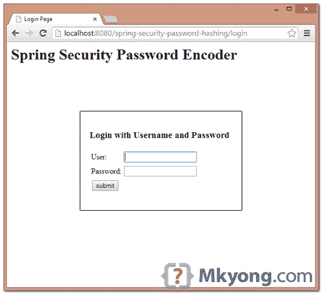
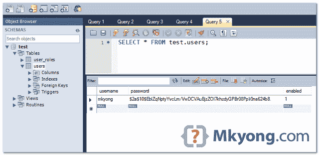

# Spring 安全密码哈希示例

> 原文：<http://web.archive.org/web/20230101150211/http://www.mkyong.com/spring-security/spring-security-password-hashing-example/>

在本教程中，我们将向您展示如何使用`BCryptPasswordEncoder`散列密码并在 Spring Security 中执行登录验证。

在过去，通常情况下，我们使用 MD5 `Md5PasswordEncoder`或 SHA `ShaPasswordEncoder`哈希算法对密码进行编码……您仍然可以使用任何您喜欢的编码器，但 Spring 建议使用 [BCrypt](http://web.archive.org/web/20220427232537/https://en.wikipedia.org/wiki/Bcrypt) `BCryptPasswordEncoder`，这是一种更强的哈希算法，带有随机生成的 salt。

使用的技术:

1.  弹簧 3.2.8 释放
2.  Spring Security 3.2.3 .发布
3.  春季 JDBC 3.2.3 .发布
4.  MySQL 服务器 5.6

## 1.查看密码编码

熟悉的旧认证`PasswordEncoder`界面已被弃用…

```
 package org.springframework.security.authentication.encoding;

//Implementation : Md5PasswordEncoder and ShaPasswordEncoder
@Deprecated
public interface PasswordEncoder { 
```

相反，你应该使用这个新的加密接口。

```
 package org.springframework.security.crypto.password;

//Implementation : BCryptPasswordEncoder
public interface PasswordEncoder { 
```

## 2.生成 BCrypt 密码

首先，散列一个密码，并将其放入数据库中，以便以后进行登录验证。这个例子使用`BCryptPasswordEncoder`散列一个密码“123456”。

PasswordEncoderGenerator.java

```
 package com.mkyong.web.controller;

import org.springframework.security.crypto.bcrypt.BCryptPasswordEncoder;

public class PasswordEncoderGenerator {

  public static void main(String[] args) {

	int i = 0;
	while (i < 10) {
		String password = "123456";
		BCryptPasswordEncoder passwordEncoder = new BCryptPasswordEncoder();
		String hashedPassword = passwordEncoder.encode(password);

		System.out.println(hashedPassword);
		i++;
	}

  }
} 
```

在 BCrypt 哈希算法中，每次都会生成长度为 60 的不同哈希值。

```
 $2a$10$EblZqNptyYvcLm/VwDCVAuBjzZOI7khzdyGPBr08PpIi0na624b8.
$2a$10$trT3.R/Nfey62eczbKEnueTcIbJXW.u1ffAo/XfyLpofwNDbEB86O
$2a$10$teJrCEnsxNT49ZpXU7n22O27aCGbVYYe/RG6/XxdWPJbOLZubLIi2
$2a$10$BHG59UT6p7bgT6U2fQ/9wOyTIdejh4Rk1vWilvl4b6ysNPdhnViUS
$2a$10$W9oRWeFmOT0bByL5fmAceucetmEYFg2yzq3e50mcu.CO7rUDb/poG
$2a$10$HApapHvDStTEwjjneMCvxuqUKVyycXZRfXMwjU0rRmaWMsjWQp/Zu
$2a$10$GYCkBzp2NlpGS/qjp5f6NOWHeF56ENAlHNuSssSJpE1MMYJevHBWO
$2a$10$gwbTCaIR/qE1uYhvEY6GG.bNDQcZuYQX9tkVwaK/aD7ZLPptC.7QC
$2a$10$5uKS72xK2ArGDgb2CwjYnOzQcOmB7CPxK6fz2MGcDBM9vJ4rUql36
$2a$10$6TajU85/gVrGUm5fv5Z8beVF37rlENohyLk3BEpZJFi6Av9JNkw9O 
```

每次用 BCrypt 散列一个值都会得到不同的值，这很正常，因为 salt 是随机生成的。在本教程中，我们获得第一个输出，并将其插入数据库。

## 3.数据库ˌ资料库

创建表并插入用户“mkyong”进行测试。

```
 CREATE  TABLE users (
  username VARCHAR(45) NOT NULL ,
  password VARCHAR(60) NOT NULL ,
  enabled TINYINT NOT NULL DEFAULT 1 ,
  PRIMARY KEY (username));

CREATE TABLE user_roles (
  user_role_id int(11) NOT NULL AUTO_INCREMENT,
  username varchar(45) NOT NULL,
  role varchar(45) NOT NULL,
  PRIMARY KEY (user_role_id),
  UNIQUE KEY uni_username_role (role,username),
  KEY fk_username_idx (username),
  CONSTRAINT fk_username FOREIGN KEY (username) REFERENCES users (username));

INSERT INTO users(username,password,enabled)
VALUES ('mkyong','$2a$10$EblZqNptyYvcLm/VwDCVAuBjzZOI7khzdyGPBr08PpIi0na624b8.', true);

INSERT INTO user_roles (username, role)
VALUES ('mkyong', 'ROLE_USER');
INSERT INTO user_roles (username, role)
VALUES ('mkyong', 'ROLE_ADMIN'); 
```

## 4.启用密码编码器

在 XML 配置中启用密码编码器的几种方法。

4.1 使用默认的 *BCryptPasswordEncoder* 。

spring-security.xml

```
 <authentication-manager>
	<authentication-provider>
	    <password-encoder hash="bcrypt" />
	</authentication-provider>
  </authentication-manager> 
```

4.2 向 *BCryptPasswordEncoder* 传递一个“强度”参数。

spring-security.xml

```
 <authentication-manager>
	<authentication-provider>
	    <password-encoder ref="encoder" />
	</authentication-provider>
  </authentication-manager>

  <beans:bean id="encoder" 
	class="org.springframework.security.crypto.bcrypt.BCryptPasswordEncoder">
	<beans:constructor-arg name="strength" value="11" />
  </beans:bean> 
```

4.3 将编码器传递给*DaoAuthenticationProvider*。

spring-security.xml

```
 <bean id="authProvider" 
	class="org.springframework.security.authentication.dao.DaoAuthenticationProvider">
	<property name="userDetailsService" ref="customUserService" />
	<property name="passwordEncoder" ref="encoder" />
  </bean>

  <bean id="encoder" 
	class="org.springframework.security.crypto.bcrypt.BCryptPasswordEncoder"/> 
```

4.4 注释示例。

```
 @Configuration
@EnableWebSecurity
public class SecurityConfig extends WebSecurityConfigurerAdapter {

	@Autowired
	DataSource dataSource;

	@Autowired
	public void configAuthentication(AuthenticationManagerBuilder auth) 
		throws Exception {

		auth.jdbcAuthentication().dataSource(dataSource)
			.passwordEncoder(passwordEncoder())
			.usersByUsernameQuery("sql...")
			.authoritiesByUsernameQuery("sql...");
	}	

	@Bean
	public PasswordEncoder passwordEncoder(){
		PasswordEncoder encoder = new BCryptPasswordEncoder();
		return encoder;
	} 
```

## 5.项目演示

访问密码保护页面:*localhost:8080/spring-security-password-hashing/admin*，显示登录页面。输入密码“123456”，Spring Security 将对密码进行哈希处理，并与数据库中的哈希密码进行比较。



数据库中的用户和密码。



## 下载源代码

Download – [spring-security-password-hashing.zip](http://web.archive.org/web/20220427232537/http://www.mkyong.com/wp-content/uploads/2011/08/spring-security-password-hashing.zip)(18 KB)Download – [spring-security-password-hashing-annotation.zip](http://web.archive.org/web/20220427232537/http://www.mkyong.com/wp-content/uploads/2011/08/spring-security-password-hashing-annotation.zip) (22 KB)

## 参考

1.  [维基百科:Bcrypt](http://web.archive.org/web/20220427232537/https://en.wikipedia.org/wiki/Bcrypt)
2.  [BCryptPasswordEncoder JavaDoc](http://web.archive.org/web/20220427232537/https://docs.spring.io/spring-security/site/docs/3.2.3.RELEASE/apidocs/org/springframework/security/crypto/bcrypt/BCryptPasswordEncoder.html)
3.  [Spring 安全参考:密码编码器](http://web.archive.org/web/20220427232537/https://docs.spring.io/spring-security/site/docs/3.2.3.RELEASE/reference/htmlsingle/#nsa-password-encoder)

<input type="hidden" id="mkyong-current-postId" value="10047">