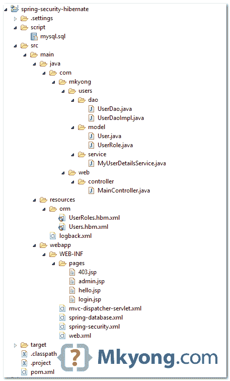
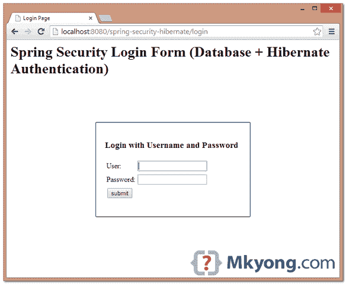
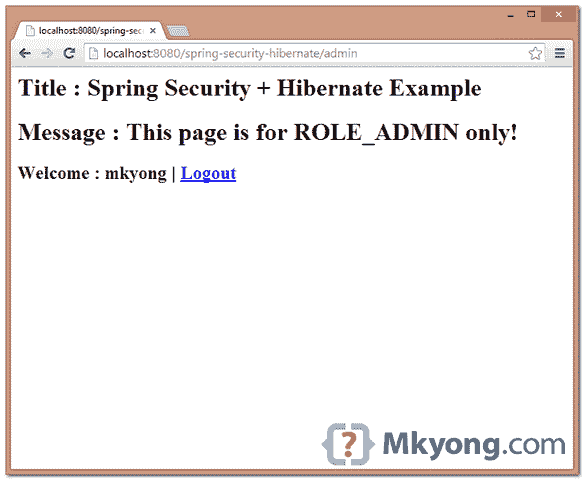
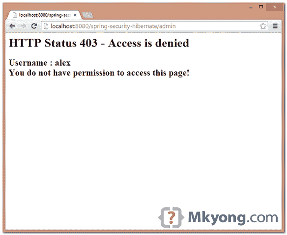

> 原文：<http://web.archive.org/web/20230101150211/http://www.mkyong.com/spring-security/spring-security-hibernate-xml-example/>

# Spring Security + Hibernate XML 示例


在本教程中，我们将向您展示如何在 Spring Security、XML 配置示例中集成 Hibernate 4。

**Note**
For annotation version, please read this [Spring Security + Hibernate Annotation Example](http://web.archive.org/web/20190223081526/http://www.mkyong.com/spring-security/spring-security-hibernate-annotation-example/).

使用的技术:

1.  弹簧 3.2.8 释放
2.  Spring Security 3.2.3 .发布
3.  Hibernate 4.2.11 .最终版
4.  MySQL 服务器 5.6
5.  JDK 1.6
6.  maven3
7.  Eclipse 4.3

快速笔记

1.  用`hibernate4.LocalSessionFactoryBean`创建一个会话工厂
2.  将会话工厂注入用户道
3.  为了与 Spring Security 集成，创建一个实现`UserDetailsService`接口的类，并用 UserDao 加载用户
4.  必须声明事务管理器，否则 Hibernate 在 Spring 中将无法工作

## 1.项目目录

最终项目目录结构。

 <ins class="adsbygoogle" style="display:block; text-align:center;" data-ad-format="fluid" data-ad-layout="in-article" data-ad-client="ca-pub-2836379775501347" data-ad-slot="6894224149">## 2.项目依赖性

POM 文件中项目依赖项的列表。

pom.xml

```java
 <properties>
		<spring.version>3.2.8.RELEASE</spring.version>
		<spring.security.version>3.2.3.RELEASE</spring.security.version>
		<jstl.version>1.2</jstl.version>
		<mysql.connector.version>5.1.30</mysql.connector.version>
		<logback.version>1.1.2</logback.version>
		<slf4j.version>1.7.6</slf4j.version>
		<hibernate.version>4.2.11.Final</hibernate.version>
		<dbcp.version>1.4</dbcp.version>
		<servletapi.version>2.5</servletapi.version>
	</properties>

	<dependencies>

		<!-- database pool -->
		<dependency>
			<groupId>commons-dbcp</groupId>
			<artifactId>commons-dbcp</artifactId>
			<version>${dbcp.version}</version>
		</dependency>

		<!-- Hibernate ORM -->
		<dependency>
			<groupId>org.hibernate</groupId>
			<artifactId>hibernate-core</artifactId>
			<version>${hibernate.version}</version>
		</dependency>

		<!-- Spring 3 dependencies -->
		<dependency>
			<groupId>org.springframework</groupId>
			<artifactId>spring-core</artifactId>
			<version>${spring.version}</version>
			<exclusions>
			  <exclusion>
				<groupId>commons-logging</groupId>
				<artifactId>commons-logging</artifactId>
			  </exclusion>
			</exclusions>
		</dependency>

		<!-- Spring MVC -->
		<dependency>
			<groupId>org.springframework</groupId>
			<artifactId>spring-webmvc</artifactId>
			<version>${spring.version}</version>
		</dependency>

		<!-- Spring + aspects -->
		<dependency>
			<groupId>org.springframework</groupId>
			<artifactId>spring-aspects</artifactId>
			<version>${spring.version}</version>
		</dependency>

		<!-- ORM integration, e.g Hibernate -->
		<dependency>
			<groupId>org.springframework</groupId>
			<artifactId>spring-orm</artifactId>
			<version>${spring.version}</version>
		</dependency>

		<!-- Spring Security -->
		<dependency>
			<groupId>org.springframework.security</groupId>
			<artifactId>spring-security-web</artifactId>
			<version>${spring.security.version}</version>
		</dependency>

		<dependency>
			<groupId>org.springframework.security</groupId>
			<artifactId>spring-security-config</artifactId>
			<version>${spring.security.version}</version>
		</dependency>

		<!-- Spring Security JSP Taglib -->
		<dependency>
			<groupId>org.springframework.security</groupId>
			<artifactId>spring-security-taglibs</artifactId>
			<version>${spring.security.version}</version>
		</dependency>

		<!-- jstl for jsp page -->
		<dependency>
			<groupId>jstl</groupId>
			<artifactId>jstl</artifactId>
			<version>${jstl.version}</version>
		</dependency>

		<!-- MySql Driver -->
		<dependency>
			<groupId>mysql</groupId>
			<artifactId>mysql-connector-java</artifactId>
			<version>${mysql.connector.version}</version>
		</dependency>

		<!-- logging, slf4j -->
		<dependency>
			<groupId>org.slf4j</groupId>
			<artifactId>slf4j-api</artifactId>
			<version>${slf4j.version}</version>
		</dependency>

		<dependency>
			<groupId>org.slf4j</groupId>
			<artifactId>jcl-over-slf4j</artifactId>
			<version>${slf4j.version}</version>
		</dependency>

		<dependency>
			<groupId>ch.qos.logback</groupId>
			<artifactId>logback-classic</artifactId>
			<version>${logback.version}</version>
		</dependency>

		<dependency>
			<groupId>javax.servlet</groupId>
			<artifactId>servlet-api</artifactId>
			<version>${servletapi.version}</version>
			<scope>provided</scope>
		</dependency>

	</dependencies> 
```

 <ins class="adsbygoogle" style="display:block" data-ad-client="ca-pub-2836379775501347" data-ad-slot="8821506761" data-ad-format="auto" data-ad-region="mkyongregion">## 3.用户表

创建存储用户和用户角色的表的 SQL 脚本。

mysql.sql

```java
 CREATE  TABLE users (
  username VARCHAR(45) NOT NULL ,
  password VARCHAR(60) NOT NULL ,
  enabled TINYINT NOT NULL DEFAULT 1 ,
  PRIMARY KEY (username));

CREATE TABLE user_roles (
  user_role_id int(11) NOT NULL AUTO_INCREMENT,
  username varchar(45) NOT NULL,
  role varchar(45) NOT NULL,
  PRIMARY KEY (user_role_id),
  UNIQUE KEY uni_username_role (role,username),
  KEY fk_username_idx (username),
  CONSTRAINT fk_username FOREIGN KEY (username) REFERENCES users (username));

INSERT INTO users(username,password,enabled)
VALUES ('mkyong','$2a$10$04TVADrR6/SPLBjsK0N30.Jf5fNjBugSACeGv1S69dZALR7lSov0y', true);
INSERT INTO users(username,password,enabled)
VALUES ('alex','$2a$10$04TVADrR6/SPLBjsK0N30.Jf5fNjBugSACeGv1S69dZALR7lSov0y', true);

INSERT INTO user_roles (username, role)
VALUES ('mkyong', 'ROLE_USER');
INSERT INTO user_roles (username, role)
VALUES ('mkyong', 'ROLE_ADMIN');
INSERT INTO user_roles (username, role)
VALUES ('alex', 'ROLE_USER'); 
```

## 4.用户模型+ Hibernate XML 映射

模型类及其 XML 映射文件。

User.java

```java
 package com.mkyong.users.model;

import java.util.HashSet;
import java.util.Set;

public class User {

	private String username;
	private String password;
	private boolean enabled;
	private Set<UserRole> userRole = new HashSet<UserRole>(0);

	//getter and setter methods
} 
```

UserRole.java

```java
 package com.mkyong.users.model;

public class UserRole{

	private Integer userRoleId;
	private User user;
	private String role;

	//getter and setter methods
} 
```

Users.hbm.xml

```java
 <?xml version="1.0"?>
<!DOCTYPE hibernate-mapping PUBLIC "-//Hibernate/Hibernate Mapping DTD 3.0//EN"
"http://www.hibernate.org/dtd/hibernate-mapping-3.0.dtd">
<hibernate-mapping>
    <class name="com.mkyong.users.model.User" table="users" catalog="test">
        <id name="username" type="string">
            <column name="username" length="45" />
            <generator class="assigned" />
        </id>
        <property name="password" type="string">
            <column name="password" length="60" not-null="true" />
        </property>
        <property name="enabled" type="boolean">
            <column name="enabled" not-null="true" />
        </property>
        <set name="userRole" table="user_roles" inverse="true" lazy="true" fetch="select">
            <key>
                <column name="username" length="45" not-null="true" />
            </key>
            <one-to-many class="com.mkyong.users.model.UserRole" />
        </set>
    </class>
</hibernate-mapping> 
```

UserRoles.hbm.xml

```java
 <?xml version="1.0"?>
<!DOCTYPE hibernate-mapping PUBLIC "-//Hibernate/Hibernate Mapping DTD 3.0//EN"
"http://www.hibernate.org/dtd/hibernate-mapping-3.0.dtd">
<hibernate-mapping>
    <class name="com.mkyong.users.model.UserRole" table="user_roles" catalog="test">
        <id name="userRoleId" type="java.lang.Integer">
            <column name="user_role_id" />
            <generator class="identity" />
        </id>
        <many-to-one name="user" class="com.mkyong.users.model.User" fetch="select">
            <column name="username" length="45" not-null="true" />
        </many-to-one>
        <property name="role" type="string">
            <column name="role" length="45" not-null="true" />
        </property>
    </class>
</hibernate-mapping> 
```

## 5.道类

创建一个`UserDao`类，通过 Hibernate 从数据库加载用户。

UserDao.java

```java
 package com.mkyong.users.dao;

import com.mkyong.users.model.User;

public interface UserDao {

	User findByUserName(String username);

} 
```

UserDaoImpl.java

```java
 package com.mkyong.users.dao;

import java.util.ArrayList;
import java.util.List;
import org.hibernate.SessionFactory;

import com.mkyong.users.model.User;

public class UserDaoImpl implements UserDao {

	private SessionFactory sessionFactory;

	@SuppressWarnings("unchecked")
	public User findByUserName(String username) {

		List<User> users = new ArrayList<User>();

		users = getSessionFactory().getCurrentSession()
			.createQuery("from User where username=?")
			.setParameter(0, username).list();

		if (users.size() > 0) {
			return users.get(0);
		} else {
			return null;
		}

	}

	public SessionFactory getSessionFactory() {
		return sessionFactory;
	}

	public void setSessionFactory(SessionFactory sessionFactory) {
		this.sessionFactory = sessionFactory;
	}

} 
```

## 6.用户详细信息服务

创建一个自定义的`UserDetailsService`，从`UserDao`加载用户，然后建立用户的权限。

**Note**
Example is reference from this Spring’s [JdbcDaoImpl](org.springframework.security.core.userdetails.jdbc.JdbcDaoImpl)MyUserDetailsService.java

```java
 package com.mkyong.users.service;

import java.util.ArrayList;
import java.util.HashSet;
import java.util.List;
import java.util.Set;

import org.springframework.security.core.GrantedAuthority;
import org.springframework.security.core.authority.SimpleGrantedAuthority;
import org.springframework.security.core.userdetails.User;
import org.springframework.security.core.userdetails.UserDetails;
import org.springframework.security.core.userdetails.UserDetailsService;
import org.springframework.security.core.userdetails.UsernameNotFoundException;

import com.mkyong.users.dao.UserDao;
import com.mkyong.users.model.UserRole;

public class MyUserDetailsService implements UserDetailsService {

	private UserDao userDao;

	@Override
	public UserDetails loadUserByUsername(final String username) 
               throws UsernameNotFoundException {

		com.mkyong.users.model.User user = userDao.findByUserName(username);
		List<GrantedAuthority> authorities = buildUserAuthority(user.getUserRole());

		return buildUserForAuthentication(user, authorities);

	}

	// Converts com.mkyong.users.model.User user to
	// org.springframework.security.core.userdetails.User
	private User buildUserForAuthentication(com.mkyong.users.model.User user, 
		List<GrantedAuthority> authorities) {
		return new User(user.getUsername(), 
			user.getPassword(), user.isEnabled(), 
                        true, true, true, authorities);
	}

	private List<GrantedAuthority> buildUserAuthority(Set<UserRole> userRoles) {

		Set<GrantedAuthority> setAuths = new HashSet<GrantedAuthority>();

		// Build user's authorities
		for (UserRole userRole : userRoles) {
			setAuths.add(new SimpleGrantedAuthority(userRole.getRole()));
		}

		List<GrantedAuthority> Result = new ArrayList<GrantedAuthority>(setAuths);

		return Result;
	}

	public UserDao getUserDao() {
		return userDao;
	}

	public void setUserDao(UserDao userDao) {
		this.userDao = userDao;
	}

} 
```

## 7.Spring 安全 XML

看评论，应该不言自明。

spring-security.xml

```java
 <beans:beans 
	xmlns:beans="http://www.springframework.org/schema/beans" 
	xmlns:xsi="http://www.w3.org/2001/XMLSchema-instance"
	xsi:schemaLocation="http://www.springframework.org/schema/beans
	http://www.springframework.org/schema/beans/spring-beans-3.0.xsd
	http://www.springframework.org/schema/security
	http://www.springframework.org/schema/security/spring-security-3.2.xsd">

	<!-- enable use-expressions -->
	<http auto-config="true" use-expressions="true">
		<intercept-url pattern="/admin**" access="hasRole('ROLE_ADMIN')" />

		<!-- access denied page -->
		<access-denied-handler error-page="/403" />
		<form-login 
		    login-page="/login" 
		    default-target-url="/welcome"
			authentication-failure-url="/login?error" 
			username-parameter="username"
			password-parameter="password" />
		<logout logout-success-url="/login?logout" />
		<!-- enable csrf protection -->
		<csrf />
	</http>

	<authentication-manager>
		<authentication-provider user-service-ref="myUserDetailsService" >
			<password-encoder hash="bcrypt" />    
		</authentication-provider>
	</authentication-manager>

</beans:beans> 
```

spring-database.xml

```java
 <beans 
	xmlns:xsi="http://www.w3.org/2001/XMLSchema-instance" 
	xmlns:aop="http://www.springframework.org/schema/aop"
	xmlns:tx="http://www.springframework.org/schema/tx"
	xsi:schemaLocation="http://www.springframework.org/schema/beans
	http://www.springframework.org/schema/beans/spring-beans-3.0.xsd 
	http://www.springframework.org/schema/aop 
	http://www.springframework.org/schema/aop/spring-aop-3.0.xsd
	http://www.springframework.org/schema/tx
    http://www.springframework.org/schema/tx/spring-tx-3.0.xsd">

	<!-- MySQL data source -->
	<bean id="dataSource" class="org.apache.commons.dbcp.BasicDataSource"
		destroy-method="close">

		<property name="driverClassName" value="com.mysql.jdbc.Driver" />
		<property name="url" value="jdbc:mysql://localhost:3306/test" />
		<property name="username" value="root" />
		<property name="password" value="password" />
	</bean>

	<!-- Hibernate session factory -->
	<bean id="sessionFactory"
		class="org.springframework.orm.hibernate4.LocalSessionFactoryBean">
		<property name="dataSource" ref="dataSource" />
		<property name="mappingResources">
			<list>
				<value>orm/Users.hbm.xml</value>
				<value>orm/UserRoles.hbm.xml</value>
			</list>
		</property>
		<property name="hibernateProperties">
		    <props>
			<prop key="hibernate.dialect">
                           org.hibernate.dialect.MySQL5Dialect
                        </prop>
			<prop key="hibernate.format_sql">true</prop>
			<prop key="hibernate.show_sql">true</prop>
		    </props>
		</property>
	</bean>

	<bean id="userDao" class="com.mkyong.users.dao.UserDaoImpl">
		<property name="sessionFactory" ref="sessionFactory" />
	</bean>

	<bean id="myUserDetailsService" 
                class="com.mkyong.users.service.MyUserDetailsService">
		<property name="userDao" ref="userDao" />
	</bean>

	<!-- MUST have transaction manager, using aop and aspects  -->
	<bean id="transactionManager"
		class="org.springframework.orm.hibernate4.HibernateTransactionManager">
		<property name="sessionFactory" ref="sessionFactory"></property>
	</bean>

	<tx:advice id="txAdvice" transaction-manager="transactionManager">
	    <tx:attributes>
		<tx:method name="get*" read-only="true" />
		<tx:method name="find*" read-only="true" />
		<tx:method name="*" />
	    </tx:attributes>
	</tx:advice>

	<aop:config>
	    <aop:pointcut id="userServicePointCut"
		expression="execution(* com.mkyong.users.service.*Service.*(..))" />
	    <aop:advisor advice-ref="txAdvice" pointcut-ref="userServicePointCut" />
	</aop:config>

</beans> 
```

完成了。

**Note**
Those JSP, web.xml and controller files are omitted, it’s quite a standard code, if you are interested on it, please download the full source code at the end of the article.

## 8.项目演示

下面的视频演示是针对 [Spring 安全数据库登录与 JDBC](http://web.archive.org/web/20190223081526/http://www.mkyong.com/spring-security/spring-security-form-login-using-database/) 教程的。由于本教程生成相同的输出，但是使用 Hibernate 来加载用户，所以视频演示被重用。

[//web.archive.org/web/20190223081526if_/http://www.youtube.com/embed/2ms57c2EdUg](//web.archive.org/web/20190223081526if_/http://www.youtube.com/embed/2ms57c2EdUg)

8.1 访问受密码保护的页面:http://localhost:8080/spring-security-hibernate/admin，显示登录页面。



8.2 输入用户“mkyong”和密码“123456”。



8.3 使用用户“alex”和密码“123456”尝试访问`/admin`页面，将显示 403 页面。



## 下载源代码

Download it – [spring-security-hibernate.zip](http://web.archive.org/web/20190223081526/http://www.mkyong.com/wp-content/uploads/2014/05/spring-security-hibernate.zip) (30 KB)

## 参考

1.  [春季 ORM–冬眠](http://web.archive.org/web/20190223081526/http://docs.spring.io/spring/docs/3.2.x/spring-framework-reference/htmlsingle/#orm-hibernate)
2.  [春季冬眠 4 LocalSessionFactoryBean JavaDoc](http://web.archive.org/web/20190223081526/http://docs.spring.io/spring/docs/3.2.x/javadoc-api/org/springframework/orm/hibernate4/LocalSessionFactoryBean.html)
3.  [春季冬眠 3 LocalSessionFactoryBean JavaDoc](http://web.archive.org/web/20190223081526/http://docs.spring.io/spring/docs/3.2.x/javadoc-api/org/springframework/orm/hibernate3/LocalSessionFactoryBean.html)
4.  [春季交易管理](http://web.archive.org/web/20190223081526/http://docs.spring.io/spring/docs/3.2.x/spring-framework-reference/htmlsingle/#transaction)
5.  [Hibernate ORM 文档](http://web.archive.org/web/20190223081526/http://hibernate.org/orm/documentation/)
6.  [用 JDBC 的 Spring 安全表单登录数据库](http://web.archive.org/web/20190223081526/http://www.mkyong.com/spring-security/spring-security-form-login-using-database/)
7.  [休眠:没有为当前线程](http://web.archive.org/web/20190223081526/http://www.mkyong.com/spring/spring-hibernate-no-session-found-for-current-thread/)找到会话

[hibernate](http://web.archive.org/web/20190223081526/http://www.mkyong.com/tag/hibernate/) [spring hibernate](http://web.archive.org/web/20190223081526/http://www.mkyong.com/tag/spring-hibernate/) [spring security](http://web.archive.org/web/20190223081526/http://www.mkyong.com/tag/spring-security/)</ins></ins> (function (i,d,s,o,m,r,c,l,w,q,y,h,g) { var e=d.getElementById(r);if(e===null){ var t = d.createElement(o); t.src = g; t.id = r; t.setAttribute(m, s);t.async = 1;var n=d.getElementsByTagName(o)[0];n.parentNode.insertBefore(t, n); var dt=new Date().getTime(); try{i[l][w+y](h,i[l][q+y](h)+'&amp;'+dt);}catch(er){i[h]=dt;} } else if(typeof i[c]!=='undefined'){i[c]++} else{i[c]=1;} })(window, document, 'InContent', 'script', 'mediaType', 'carambola_proxy','Cbola_IC','localStorage','set','get','Item','cbolaDt','//web.archive.org/web/20190223081526/http://route.carambo.la/inimage/getlayer?pid=myky82&amp;did=112239&amp;wid=0')<input type="hidden" id="mkyong-postId" value="13336">

#### 关于作者


##### mkyong

Founder of [Mkyong.com](http://web.archive.org/web/20190223081526/http://mkyong.com/), love Java and open source stuff. Follow him on [Twitter](http://web.archive.org/web/20190223081526/https://twitter.com/mkyong), or befriend him on [Facebook](http://web.archive.org/web/20190223081526/http://www.facebook.com/java.tutorial) or [Google Plus](http://web.archive.org/web/20190223081526/https://plus.google.com/110948163568945735692?rel=author). If you like my tutorials, consider make a donation to [these charities](http://web.archive.org/web/20190223081526/http://www.mkyong.com/blog/donate-to-charity/).