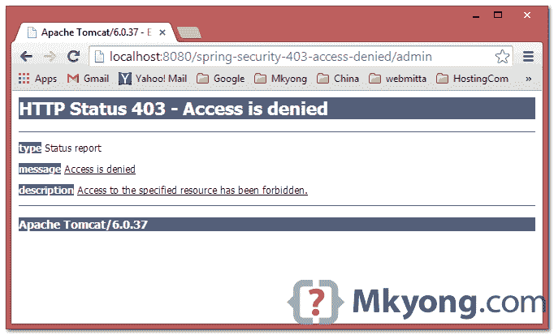
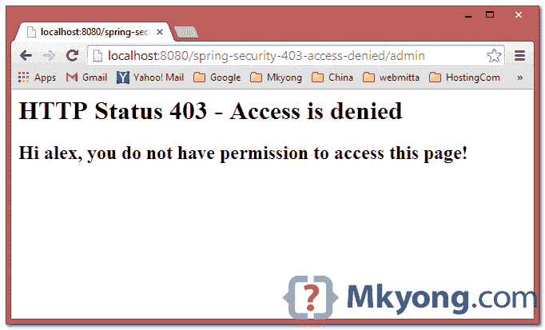
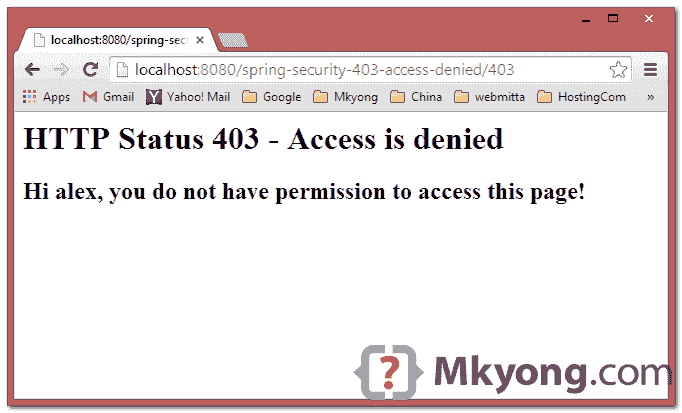

# Spring Security:自定义 403 拒绝访问页面

> 原文：<http://web.archive.org/web/20230101150211/http://www.mkyong.com/spring-security/customize-http-403-access-denied-page-in-spring-security/>

在 Spring Security 中，如果非授权用户试图访问受保护的页面，将显示默认的“ **http 403 access denied** ”:



在本教程中，我们将向您展示如何在 Spring Security 中自定义 403 访问被拒绝页面。

## 1.Spring 安全配置

查看配置，如果“alex”试图访问`/admin`页面，将显示上面的 403 访问被拒绝页面。

Spring-Security.xml

```
 <http auto-config="true">
	<access-denied-handler error-page="/403" />
	<intercept-url pattern="/admin**" access="ROLE_ADMIN" />
  </http>

  <authentication-manager>
	<authentication-provider>
	  <user-service>
		<user name="alex" password="123456" authorities="ROLE_USER" />
		<user name="mkyong" password="123456" authorities="ROLE_USER, ROLE_ADMIN" />
	  </user-service>
	</authentication-provider>
  </authentication-manager> 
```

## 2.解决方案–自定义 403 页面

2.1 创建一个新的 403 页面。

403.jsp

```
 <html>
<body>
	<h1>HTTP Status 403 - Access is denied</h1>
	<h2>${msg}</h2>
</body>
</html> 
```

2.2.要显示以上页面，添加一个如下所示的`error-page`:

Spring-Security.xml

```
 <http auto-config="true">
		<access-denied-handler error-page="/403" />
		<intercept-url pattern="/admin**" access="ROLE_ADMIN" />
	</http> 
```

2.3 在控制器类中，添加“/403”URL 的映射:

HelloController.java

```
 package com.mkyong.web.controller;

import java.security.Principal;
import org.springframework.stereotype.Controller;
import org.springframework.web.bind.annotation.RequestMapping;
import org.springframework.web.bind.annotation.RequestMethod;
import org.springframework.web.servlet.ModelAndView;

@Controller
public class HelloController {

	// for 403 access denied page
	@RequestMapping(value = "/403", method = RequestMethod.GET)
	public ModelAndView accesssDenied(Principal user) {

		ModelAndView model = new ModelAndView();

		if (user != null) {
			model.addObject("msg", "Hi " + user.getName() 
			+ ", you do not have permission to access this page!");
		} else {
			model.addObject("msg", 
			"You do not have permission to access this page!");
		}

		model.setViewName("403");
		return model;

	}

} 
```

完成了。

对于注释用户，使用此`.exceptionHandling().accessDeniedPage("/403")`。

SecurityConfig.java

```
 package com.mkyong.config;

import org.springframework.context.annotation.Configuration;
import org.springframework.security.config.annotation.web.builders.HttpSecurity;
import org.springframework.security.config.annotation.web.configuration.EnableWebSecurity;
import org.springframework.security.config.annotation.web.configuration.WebSecurityConfigurerAdapter;

@Configuration
@EnableWebSecurity
public class SecurityConfig extends WebSecurityConfigurerAdapter {

	@Override
	protected void configure(HttpSecurity http) throws Exception {

	 http.authorizeRequests()
	    .antMatchers("/admin/**").access("hasRole('ROLE_ADMIN')")
	    .and().formLogin()
		.loginPage("/login").failureUrl("/login?error")
		.usernameParameter("username")
		.passwordParameter("password")
	    .and().logout().logoutSuccessUrl("/login?logout")
	    .and()
		.exceptionHandling().accessDeniedPage("/403")
	}
} 
```

## 3.AccessDeniedHandler

另外，您可以创建一个自定义的`AccessDeniedHandler`来执行一些业务逻辑，然后将 URL 传递给`/403`映射。

MyAccessDeniedHandler.java

```
 package com.mkyong.web.exception;

import java.io.IOException;
import javax.servlet.ServletException;
import javax.servlet.http.HttpServletRequest;
import javax.servlet.http.HttpServletResponse;
import org.springframework.security.access.AccessDeniedException;
import org.springframework.security.web.access.AccessDeniedHandler;

public class MyAccessDeniedHandler implements AccessDeniedHandler {

	private String errorPage;

	public MyAccessDeniedHandler() {
	}

	public MyAccessDeniedHandler(String errorPage) {
		this.errorPage = errorPage;
	}

	public String getErrorPage() {
		return errorPage;
	}

	public void setErrorPage(String errorPage) {
		this.errorPage = errorPage;
	}

	@Override
	public void handle(HttpServletRequest request, HttpServletResponse response,
		AccessDeniedException accessDeniedException) 
                throws IOException, ServletException {

		//do some business logic, then redirect to errorPage url
		response.sendRedirect(errorPage);

	}

} 
```

给 http 标签添加一个`ref`。

Spring-Security.xml

```
 <http auto-config="true">
		<access-denied-handler ref="my403" />
		<intercept-url pattern="/admin**" access="ROLE_ADMIN" />
	</http>

	<beans:bean id="my403"
		class="com.mkyong.web.exception.MyAccessDeniedHandler">
		<beans:property name="errorPage" value="403" />
	</beans:bean> 
```

完成了。

## 4.演示

当“alex”试图访问`/admin`页面时，将显示上述自定义 403 访问被拒绝页面。

4.1 如果使用`error-page`，url 将显示如下:

*http://localhost:8080/spring-security-403-access-denied/admin*



4.2 如果使用自定义拒绝访问处理程序`ref`，url 将显示如下:

*http://localhost:8080/spring-security-403-access-denied/403*



## 下载源代码

Download it – [spring-security-403-access-denied.zip](http://web.archive.org/web/20220402162518/http://www.mkyong.com/wp-content/uploads/2011/08/spring-security-403-access-denied.zip) (26 KB)

## 参考

1.  [StackOverflow:如何用 Spring Security 3.0.x 处理 HTTP 403](http://web.archive.org/web/20220402162518/https://stackoverflow.com/questions/4186697/how-to-handle-http-403-with-spring-security-3-0-x)
2.  [Spring Security:AccessDeniedHandler 引用](http://web.archive.org/web/20220402162518/https://docs.spring.io/spring-security/site/docs/3.0.8.RELEASE/apidocs/org/springframework/security/web/access/AccessDeniedHandler.html)

<input type="hidden" id="mkyong-current-postId" value="10084">