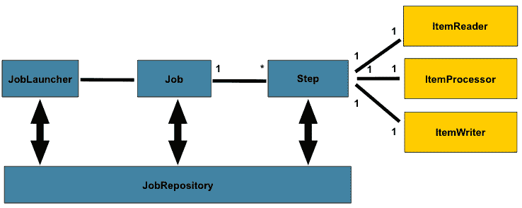

> 原文：<http://web.archive.org/web/20230101150211/https://mkyong.com/tutorials/spring-batch-tutorial/>

# 春季批量教程

*图片来源:[春天来源](http://web.archive.org/web/20190306165316/http://static.springsource.org/spring-batch/reference/html/domain.html)*

Spring Batch 是一个用于批处理的开源框架——执行一系列的任务。Spring Batch 提供了用于读/写资源、事务管理、作业处理统计、作业重启和分区技术的类和 API，以处理大量数据。

以下 Spring 批处理教程和示例是通过以下方式测试的:

1.  弹簧芯 3.2.2 .释放
2.  春季批次 2.2.0 .发布

P.S Spring Batch 是 Spring 产品组合的一部分。

## 1.快速指南

一个简单的批处理作业，用命令行运行。

*   [Spring Batch Hello World 示例](http://web.archive.org/web/20190306165316/http://www.mkyong.com/spring-batch/spring-batch-hello-world-example/)
    关于 Spring Batch 的简短描述，并创建一个作业从 CSV 文件中读取数据，对其进行处理，并将其写入 XML 文件(JAXB)。
*   [Spring Batch TaskletStep 示例](http://web.archive.org/web/20190306165316/http://www.mkyong.com/spring-batch/spring-batch-tasklet-example/)
    示例在批处理作业完成后清理资源。
*   [用命令行运行 Spring 批处理作业 Runner](http://web.archive.org/web/20190306165316/http://www.mkyong.com/spring-batch/run-spring-batch-job-with-commandlinejobrunner/)
    用命令行运行 Spring 批处理作业。

 <ins class="adsbygoogle" style="display:block; text-align:center;" data-ad-format="fluid" data-ad-layout="in-article" data-ad-client="ca-pub-2836379775501347" data-ad-slot="6894224149">## 2.项目读取器、项目处理器、项目写入器

几个例子展示了使用 Spring 批处理类来读/写资源(csv、xml 和数据库)。

*   [Spring 批处理示例–CSV 文件到 MySQL 数据库](http://web.archive.org/web/20190306165316/http://www.mkyong.com/spring-batch/spring-batch-example-csv-file-to-database/)
    从 CSV 文件中读取数据并将其写入 MySQL 数据库，作业元存储在数据库中。
*   [Spring Batch Example–XML File To MongoDB database](http://web.archive.org/web/20190306165316/http://www.mkyong.com/spring-batch/spring-batch-example-xml-file-to-database/)
    从 XML 文件(XStream)中读取数据，并将其写入 nosql 数据库 MongoDB，同时对批处理作业进行单元测试。
*   [Spring 批处理示例–XML 文件到 CSV 文件](http://web.archive.org/web/20190306165316/http://www.mkyong.com/spring-batch/spring-batch-example-xml-file-to-csv-file/)
    从 XML 文件(JAXB2)中读取数据，用 ItemProcessor 处理并写入 CSV 文件。它还向您展示了如何通过 JAXB2 在 Date 和 BigDecimal 数据类型与 object 之间进行转换。
*   [Spring 批处理示例——MySQL 数据库转 XML](http://web.archive.org/web/20190306165316/http://www.mkyong.com/spring-batch/spring-batch-example-mysql-database-to-xml/)
    从 MySQL 数据库中读取数据并将其写入 XML 文件(XStream)，同样使用了 jobParameters。
*   [Spring Batch MultiResourceItemReader 示例](http://web.archive.org/web/20190306165316/http://www.mkyong.com/spring-batch/spring-batch-multiresourceitemreader-example/)
    一个 ItemReader 读取多个文件。

 <ins class="adsbygoogle" style="display:block" data-ad-client="ca-pub-2836379775501347" data-ad-slot="8821506761" data-ad-format="auto" data-ad-region="mkyongregion">## 3.调度程序

使用调度程序框架运行批处理作业。

*   [Spring Batch+Spring task scheduler 示例](http://web.archive.org/web/20190306165316/http://www.mkyong.com/spring-batch/spring-batch-and-spring-taskscheduler-example/)
    Spring TaskScheduler 安排一个批处理作业每 5 秒运行一次。
*   [Spring Batch + Quartz 调度器示例](http://web.archive.org/web/20190306165316/http://www.mkyong.com/spring-batch/spring-batch-and-quartz-scheduler-example/)
    集成 Quartz 来调度一个每 10 秒运行一次的批处理作业。

## 4.单元测试

*   [Spring Batch 单元测试示例](http://web.archive.org/web/20190306165316/http://www.mkyong.com/spring-batch/spring-batch-unit-test-example/)
    如何对一个批处理作业或单个步骤进行单元测试。

## 5.预先的

*   [Spring Batch partitioner 示例](http://web.archive.org/web/20190306165316/http://www.mkyong.com/spring-batch/spring-batch-partitioning-example/)
    多线程处理一系列数据。
*   [Spring 批处理监听器示例](http://web.archive.org/web/20190306165316/http://www.mkyong.com/spring-batch/spring-batch-listeners-example/)
    示例拦截一个批处理作业的执行步骤。

## 6.春季批次常见问题

春批的一些常见问答。

*   [如何在 BeanWrapperFieldSetMapper 中转换日期](http://web.archive.org/web/20190306165316/http://www.mkyong.com/spring-batch/how-to-convert-date-in-beanwrapperfieldsetmapper/)
*   [Spring Batch:对于参数={}](http://web.archive.org/web/20190306165316/http://www.mkyong.com/spring-batch/spring-batch-a-job-instance-already-exists-and-is-complete-for-parameters/) ,作业实例已经存在并且是完整的
*   [Spring 批量元数据表不是自动创建的？](http://web.archive.org/web/20190306165316/http://www.mkyong.com/spring-batch/spring-batch-metadata-tables-are-not-created-automatically/)
*   [nosuchbean definitionexception:没有 JobLauncherTestUtils 类型的合格 bean](http://web.archive.org/web/20190306165316/http://www.mkyong.com/spring-batch/nosuchbeandefinitionexception-no-qualifying-bean-of-type-joblaunchertestutils/)
*   [在 BeanExpressionContext 类型的对象上找不到 jobParameters】](http://web.archive.org/web/20190306165316/http://www.mkyong.com/spring-batch/jobparameters-cannot-be-found-on-object-of-type-beanexpressioncontext/)

## 参考

*   [春批官网](http://web.archive.org/web/20190306165316/http://static.springsource.org/spring-batch/)
*   [春季批次参考文件](http://web.archive.org/web/20190306165316/http://static.springsource.org/spring-batch/reference/html/)
*   [维基百科:春批](http://web.archive.org/web/20190306165316/http://en.wikipedia.org/wiki/Spring_Batch)
*   [春季批次样品](http://web.archive.org/web/20190306165316/http://static.springsource.org/spring-batch/trunk/spring-batch-samples/)

[spring batch](http://web.archive.org/web/20190306165316/http://www.mkyong.com/tag/spring-batch/) [tutorials](http://web.archive.org/web/20190306165316/http://www.mkyong.com/tag/tutorials/)</ins></ins> (function (i,d,s,o,m,r,c,l,w,q,y,h,g) { var e=d.getElementById(r);if(e===null){ var t = d.createElement(o); t.src = g; t.id = r; t.setAttribute(m, s);t.async = 1;var n=d.getElementsByTagName(o)[0];n.parentNode.insertBefore(t, n); var dt=new Date().getTime(); try{i[l][w+y](h,i[l][q+y](h)+'&amp;'+dt);}catch(er){i[h]=dt;} } else if(typeof i[c]!=='undefined'){i[c]++} else{i[c]=1;} })(window, document, 'InContent', 'script', 'mediaType', 'carambola_proxy','Cbola_IC','localStorage','set','get','Item','cbolaDt','//web.archive.org/web/20190306165316/http://route.carambo.la/inimage/getlayer?pid=myky82&amp;did=112239&amp;wid=0')<input type="hidden" id="mkyong-postId" value="13046">

#### 关于作者

##### mkyong

Founder of [Mkyong.com](http://web.archive.org/web/20190306165316/http://mkyong.com/), love Java and open source stuff. Follow him on [Twitter](http://web.archive.org/web/20190306165316/https://twitter.com/mkyong), or befriend him on [Facebook](http://web.archive.org/web/20190306165316/http://www.facebook.com/java.tutorial) or [Google Plus](http://web.archive.org/web/20190306165316/https://plus.google.com/110948163568945735692?rel=author). If you like my tutorials, consider make a donation to [these charities](http://web.archive.org/web/20190306165316/http://www.mkyong.com/blog/donate-to-charity/).