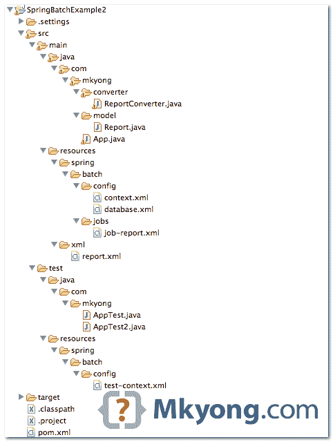

> 原文：<http://web.archive.org/web/20230101150211/http://www.mkyong.com/spring-batch/spring-batch-example-xml-file-to-database/>

# Spring 批处理示例 MongoDB 数据库的 XML 文件

在本教程中，我们将向您展示如何配置一个 Spring 批处理作业，将数据从一个 XML 文件( **XStream** library)读入一个 no SQL 数据库( **MongoDB** )。此外，创建一个单元测试用例来启动和测试批处理作业。

使用的工具和库

1.  maven3
2.  Eclipse 4.2
3.  JDK 1.6
4.  弹簧芯 3.2.2 .释放
5.  春季批次 2.2.0 .发布
6.  春季批量测试 2.2.0 .发布
7.  春季 OXM 3.2.2 .发布
8.  MongoDB Java 驱动程序 2.11.2
9.  MongoDB 2.2.3
10.  jUnit 4.11
11.  测试 6.8.5

这个例子是 XML 文件(阅读器)MongoDB(编写器)。

## 1.简单的 Java 项目

1.用 Maven 创建一个快速启动 Java 项目，转换并导入到 Eclipse IDE 中。

```java
 $ mvn archetype:generate -DgroupId=com.mkyong -DartifactId=SpringBatchExample2 
  -DarchetypeArtifactId=maven-archetype-quickstart -DinteractiveMode=false 
```

```java
 $ cd SpringBatchExample/
$ mvn eclipse:eclipse 
```

 <ins class="adsbygoogle" style="display:block; text-align:center;" data-ad-format="fluid" data-ad-layout="in-article" data-ad-client="ca-pub-2836379775501347" data-ad-slot="6894224149">## 2.项目相关性

在`pom.xml`中声明所有项目依赖关系

pom.xml

```java
 <project  
	xmlns:xsi="http://www.w3.org/2001/XMLSchema-instance"
	xsi:schemaLocation="http://maven.apache.org/POM/4.0.0 
	http://maven.apache.org/maven-v4_0_0.xsd">
	<modelVersion>4.0.0</modelVersion>
	<groupId>com.mkyong</groupId>
	<artifactId>SpringBatchExample</artifactId>
	<packaging>jar</packaging>
	<version>1.0-SNAPSHOT</version>
	<name>SpringBatchExample</name>
	<url>http://maven.apache.org</url>

	<properties>
		<jdk.version>1.6</jdk.version>
		<spring.version>3.2.2.RELEASE</spring.version>
		<spring.batch.version>2.2.0.RELEASE</spring.batch.version>
		<spring.data.version>1.2.1.RELEASE</spring.data.version>
		<mongodb.driver.version>2.11.2</mongodb.driver.version>
	</properties>

	<dependencies>

		<!-- Spring Core -->
		<dependency>
			<groupId>org.springframework</groupId>
			<artifactId>spring-core</artifactId>
			<version>${spring.version}</version>
		</dependency>

		<!-- Spring XML to/back object -->
		<dependency>
			<groupId>org.springframework</groupId>
			<artifactId>spring-oxm</artifactId>
			<version>${spring.version}</version>
		</dependency>

		<!-- Spring Batch dependencies -->
		<dependency>
			<groupId>org.springframework.batch</groupId>
			<artifactId>spring-batch-core</artifactId>
			<version>${spring.batch.version}</version>
		</dependency>
		<dependency>
			<groupId>org.springframework.batch</groupId>
			<artifactId>spring-batch-infrastructure</artifactId>
			<version>${spring.batch.version}</version>
		</dependency>

		<!-- Spring Batch unit test -->
		<dependency>
			<groupId>org.springframework.batch</groupId>
			<artifactId>spring-batch-test</artifactId>
			<version>${spring.batch.version}</version>
		</dependency>

		<!-- MongoDB database driver -->
		<dependency>
			<groupId>org.mongodb</groupId>
			<artifactId>mongo-java-driver</artifactId>
			<version>${mongodb.driver.version}</version>
		</dependency>

		<!-- Spring data mongodb -->
		<dependency>
			<groupId>org.springframework.data</groupId>
			<artifactId>spring-data-mongodb</artifactId>
			<version>${spring.data.version}</version>
		</dependency>

		<!-- Junit -->
		<dependency>
			<groupId>junit</groupId>
			<artifactId>junit</artifactId>
			<version>4.11</version>
			<scope>test</scope>
		</dependency>

		<!-- Testng -->
		<dependency>
			<groupId>org.testng</groupId>
			<artifactId>testng</artifactId>
			<version>6.8.5</version>
			<scope>test</scope>
		</dependency>

	</dependencies>
	<build>
	    <finalName>spring-batch</finalName>
	    <plugins>
		<plugin>
			<groupId>org.apache.maven.plugins</groupId>
			<artifactId>maven-eclipse-plugin</artifactId>
			<version>2.9</version>
			<configuration>
				<downloadSources>true</downloadSources>
				<downloadJavadocs>false</downloadJavadocs>
			</configuration>
		</plugin>
		<plugin>
			<groupId>org.apache.maven.plugins</groupId>
			<artifactId>maven-compiler-plugin</artifactId>
			<version>2.3.2</version>
			<configuration>
				<source>${jdk.version}</source>
				<target>${jdk.version}</target>
			</configuration>
		</plugin>
	    </plugins>
	</build>

</project> 
```

 <ins class="adsbygoogle" style="display:block" data-ad-client="ca-pub-2836379775501347" data-ad-slot="8821506761" data-ad-format="auto" data-ad-region="mkyongregion">## 3.项目目录结构

回顾最终的项目结构，了解下一步要做的事情。



## 4.XML 文件

这是资源文件夹中的 XML 文件。

resources/xml/report.xml

```java
 <?xml version="1.0" encoding="UTF-8" ?>
<report>
    <record id="1">
        <date>6/1/2013</date>
        <impression>139,237</impression>
        <clicks>40</clicks>
        <earning>220.90</earning>
    </record>
    <record id="2">
        <date>6/2/2013</date>
        <impression>339,100</impression>
        <clicks>60</clicks>
        <earning>320.88</earning>
    </record>
    <record id="3">
        <date>6/3/2013</date>
        <impression>431,436</impression>
        <clicks>76</clicks>
        <earning>270.80</earning>
    </record>
</report> 
```

## 5.读取 XML 文件

在 Spring batch 中，我们可以使用`StaxEventItemReader`读取 XML 文件，使用`XStreamMarshaller`将 XML 值和属性映射到一个对象。

resources/spring/batch/jobs/job-report.xml

```java
 <!-- ...... -->
    <bean id="xmlItemReader" 
           class="org.springframework.batch.item.xml.StaxEventItemReader">
	<property name="fragmentRootElementName" value="record" />
	<property name="resource" value="classpath:xml/report.xml" />
	<property name="unmarshaller" ref="reportUnmarshaller" />
    </bean>

    <bean id="reportUnmarshaller" 
           class="org.springframework.oxm.xstream.XStreamMarshaller">

	<property name="aliases">
	    <util:map id="aliases">
		<entry key="record" value="com.mkyong.model.Report" />
	    </util:map>
	</property>
	<property name="converters">
	    <array>
		<ref bean="reportConverter" />
	    </array>
	</property>

    </bean>

    <bean id="reportConverter" class="com.mkyong.converter.ReportConverter" /> 
```

Report.java

```java
 package com.mkyong.model;

import java.math.BigDecimal;
import java.text.SimpleDateFormat;
import java.util.Date;

public class Report {

	private int id;
	private Date date;
	private long impression;
	private int clicks;
	private BigDecimal earning;

	//getter and setter methods

} 
```

要将 XML 值映射到像`Date`和`BigDecimal`这样的“复杂”数据类型，您需要附加一个自定义的`converter`来手动转换和映射值。

ReportConverter.java

```java
 package com.mkyong.converter;

import java.math.BigDecimal;
import java.text.NumberFormat;
import java.text.ParseException;
import java.text.SimpleDateFormat;
import java.util.Date;
import java.util.Locale;

import com.mkyong.model.Report;
import com.thoughtworks.xstream.converters.Converter;
import com.thoughtworks.xstream.converters.MarshallingContext;
import com.thoughtworks.xstream.converters.UnmarshallingContext;
import com.thoughtworks.xstream.io.HierarchicalStreamReader;
import com.thoughtworks.xstream.io.HierarchicalStreamWriter;

public class ReportConverter implements Converter {

	@Override
	public boolean canConvert(Class type) {
		//we only need "Report" object
		return type.equals(Report.class);
	}

	@Override
	public void marshal(Object source, 
            HierarchicalStreamWriter writer, MarshallingContext context) {
	    //do nothing
	}

	@Override
	public Object unmarshal(
            HierarchicalStreamReader reader, UnmarshallingContext context) {

		Report obj = new Report();

		//get attribute
		obj.setId(Integer.valueOf(reader.getAttribute("id")));
		reader.moveDown(); //get date

		Date date = null;
		try {
			date = new SimpleDateFormat("M/d/yyyy").parse(reader.getValue());
		} catch (ParseException e) {
			e.printStackTrace();
		}
		obj.setDate(date);
		reader.moveUp();

		reader.moveDown(); //get impression

		String impression = reader.getValue();
		NumberFormat format = NumberFormat.getInstance(Locale.US);
                Number number = 0;
		try {
			number = format.parse(impression);
		} catch (ParseException e) {
			e.printStackTrace();
		}
		obj.setImpression(number.longValue());

		reader.moveUp();

		reader.moveDown(); //get click
		obj.setClicks(Integer.valueOf(reader.getValue()));
		reader.moveUp();

		reader.moveDown(); //get earning
		obj.setEarning(new BigDecimal(reader.getValue()));
                reader.moveUp();

                return obj;

	}
} 
```

## 6.MongoDB 数据库

定义一个 mongodb 实例和一个`mongoTemplate`。

resources/spring/batch/config/database.xml

```java
 <beans 
	xmlns:mongo="http://www.springframework.org/schema/data/mongo" 
	xmlns:xsi="http://www.w3.org/2001/XMLSchema-instance"
	xsi:schemaLocation="http://www.springframework.org/schema/beans 
		http://www.springframework.org/schema/beans/spring-beans-3.2.xsd
		http://www.springframework.org/schema/data/mongo
        http://www.springframework.org/schema/data/mongo/spring-mongo-1.0.xsd">

        <!-- connect to mongodb -->
	<mongo:mongo host="127.0.0.1" port="27017" />
	<mongo:db-factory dbname="yourdb" />

	<bean id="mongoTemplate" 
                class="org.springframework.data.mongodb.core.MongoTemplate">
		<constructor-arg name="mongoDbFactory" ref="mongoDbFactory" />
	</bean>

</beans> 
```

## 7.弹簧批芯设置

定义`jobRepository`和`jobLauncher`。

resources/spring/batch/config/context.xml

```java
 <beans 
	xmlns:xsi="http://www.w3.org/2001/XMLSchema-instance"
	xsi:schemaLocation="
	http://www.springframework.org/schema/beans 
	http://www.springframework.org/schema/beans/spring-beans-3.2.xsd">

    <!-- stored job-meta in memory --> 
    <bean id="jobRepository"
	class="org.springframework.batch.core.repository.support.MapJobRepositoryFactoryBean">
	<property name="transactionManager" ref="transactionManager" />
    </bean>

    <bean id="transactionManager"
	class="org.springframework.batch.support.transaction.ResourcelessTransactionManager" />

    <bean id="jobLauncher"
	class="org.springframework.batch.core.launch.support.SimpleJobLauncher">
	<property name="jobRepository" ref="jobRepository" />
    </bean>

</beans> 
```

## 8.春季批处理作业

一个 Spring 批处理作业，读取`report.xml`文件，映射到一个`Report`对象，并将其写入`MongoDB`。看评论，应该不言自明。

resources/spring/batch/jobs/job-report.xml

```java
 <beans 
	xmlns:batch="http://www.springframework.org/schema/batch" 
	xmlns:util="http://www.springframework.org/schema/util" 
	xmlns:xsi="http://www.w3.org/2001/XMLSchema-instance"
	xsi:schemaLocation="http://www.springframework.org/schema/batch
		http://www.springframework.org/schema/batch/spring-batch-2.2.xsd
		http://www.springframework.org/schema/beans 
		http://www.springframework.org/schema/beans/spring-beans-3.2.xsd
		http://www.springframework.org/schema/util 
		http://www.springframework.org/schema/util/spring-util-3.2.xsd">

    <batch:job id="reportJob">
	<batch:step id="step1">
	  <batch:tasklet>
		<batch:chunk reader="xmlItemReader" writer="mongodbItemWriter"
			commit-interval="1">
		</batch:chunk>
	  </batch:tasklet>
	</batch:step>
    </batch:job>

    <!-- Read XML file -->
    <bean id="xmlItemReader" 
        class="org.springframework.batch.item.xml.StaxEventItemReader">
	<property name="fragmentRootElementName" value="record" />
	<property name="resource" value="classpath:xml/report.xml" />
	<property name="unmarshaller" ref="reportUnmarshaller" />
    </bean>

    <!-- Maps XML values to Object -->
    <bean id="reportUnmarshaller" 
        class="org.springframework.oxm.xstream.XStreamMarshaller">
	<property name="aliases">
	  <util:map id="aliases">
		<entry key="record" value="com.mkyong.model.Report" />
	  </util:map>
	</property>

        <!-- attach a custom converter -->
	<property name="converters">
	  <array>
		<ref bean="reportConverter" />
	  </array>
	</property>

    </bean>

    <bean id="reportConverter" class="com.mkyong.converter.ReportConverter" />

    //write it to MongoDB, 'report' collection (table)
    <bean id="mongodbItemWriter" 
        class="org.springframework.batch.item.data.MongoItemWriter">
	<property name="template" ref="mongoTemplate" />
	<property name="collection" value="report" />
    </bean>

</beans> 
```

## 9.单元测试

用 jUnit 或 TestNG 框架对其进行单元测试。首先，您必须手动声明`JobLauncherTestUtils`。

test/resources/spring/batch/config/test-context.xml

```java
 <beans 
	xmlns:xsi="http://www.w3.org/2001/XMLSchema-instance"
	xsi:schemaLocation="
	http://www.springframework.org/schema/beans 
	http://www.springframework.org/schema/beans/spring-beans-3.2.xsd">

    <!-- this bean should auto load -->
    <bean class="org.springframework.batch.test.JobLauncherTestUtils"/>

</beans> 
```

jUnit 示例

AppTest.java

```java
 package com.mkyong;

import static org.junit.Assert.assertEquals;
import org.junit.Test;
import org.junit.runner.RunWith;
import org.springframework.batch.core.BatchStatus;
import org.springframework.batch.core.JobExecution;
import org.springframework.batch.test.JobLauncherTestUtils;
import org.springframework.beans.factory.annotation.Autowired;
import org.springframework.test.context.ContextConfiguration;
import org.springframework.test.context.junit4.SpringJUnit4ClassRunner;

@RunWith(SpringJUnit4ClassRunner.class)
@ContextConfiguration(locations = {
    "classpath:spring/batch/jobs/job-report.xml",
    "classpath:spring/batch/config/context.xml",
    "classpath:spring/batch/config/database.xml",
    "classpath:spring/batch/config/test-context.xml"})
public class AppTest {

    @Autowired
    private JobLauncherTestUtils jobLauncherTestUtils;

    @Test
    public void launchJob() throws Exception {

        //JobExecution jobExecution = jobLauncherTestUtils.launchJob();

        JobExecution jobExecution = jobLauncherTestUtils.launchStep("step1");

        assertEquals(BatchStatus.COMPLETED, jobExecution.getStatus());

    }
} 
```

测试示例

AppTest2.java

```java
 package com.mkyong;

import org.springframework.batch.core.BatchStatus;
import org.springframework.batch.core.JobExecution;
import org.springframework.batch.test.JobLauncherTestUtils;
import org.springframework.beans.factory.annotation.Autowired;
import org.springframework.test.context.ContextConfiguration;
import org.springframework.test.context.testng.AbstractTestNGSpringContextTests;
import org.testng.Assert;
import org.testng.annotations.Test;

@ContextConfiguration(locations = {
    "classpath:spring/batch/jobs/job-report.xml",
    "classpath:spring/batch/config/context.xml",
    "classpath:spring/batch/config/database.xml",
    "classpath:spring/batch/config/test-context.xml"})
public class AppTest2 extends AbstractTestNGSpringContextTests {

    @Autowired
    private JobLauncherTestUtils jobLauncherTestUtils;

    @Test
    public void launchJob() throws Exception {

        JobExecution jobExecution = jobLauncherTestUtils.launchJob();
        Assert.assertEquals(jobExecution.getStatus(), BatchStatus.COMPLETED);

    }
} 
```

输出。XML 值被插入 MongoDB。

```java
 mongo
MongoDB shell version: 2.2.3
connecting to: test

> use yourdb
switched to db yourdb
> show collections
report
system.indexes

> db.report.find()
{ "_id" : 1, "_class" : "com.mkyong.model.Report", 
"date" : ISODate("2013-05-31T16:00:00Z"), "impression" : NumberLong(139237), 
"clicks" : 40, "earning" : "220.90" }

{ "_id" : 2, "_class" : "com.mkyong.model.Report", 
"date" : ISODate("2013-06-01T16:00:00Z"), "impression" : NumberLong(339100), 
"clicks" : 60, "earning" : "320.88" }

{ "_id" : 3, "_class" : "com.mkyong.model.Report", 
"date" : ISODate("2013-06-02T16:00:00Z"), "impression" : NumberLong(431436), 
"clicks" : 76, "earning" : "270.80" }
> 
```

## 10.作业元数据怎么样？

对不起，我还没有解决这个问题的方法。据我所知，作业元数据需要关系数据库，以确保作业的可重启性和回滚。按照设计，MongoDB 没有“可靠的”事务管理。

解决方案 1:创建另一个关系数据库来存储作业元数据，嗯……这听起来很愚蠢，但很有效。你有更好的主意吗？

解决方案 2:等待 Spring 的团队对此提出解决方案。

## 下载源代码

Download it – [SpringBatch-XML-MongoDB-Example.zip](http://web.archive.org/web/20190223082222/http://www.mkyong.com/wp-content/uploads/2013/07/SpringBatch-XML-MongoDB-Example.zip) (81 kb)

## 参考

1.  [XStream 转换器教程](http://web.archive.org/web/20190223082222/http://xstream.codehaus.org/converter-tutorial.html)
2.  [对非 RDBMS 的 Spring 批量支持](http://web.archive.org/web/20190223082222/http://forum.springsource.org/archive/index.php/t-97452.html)
3.  [Spring 批处理 XML 项读取器和写入器](http://web.archive.org/web/20190223082222/http://static.springsource.org/spring-batch/reference/html/readersAndWriters.html#xmlReadingWriting)
4.  [Spring Batch–配置和运行作业](http://web.archive.org/web/20190223082222/http://static.springsource.org/spring-batch/reference/html/configureJob.html)
5.  [用 Maven 创建一个 Java 项目](http://web.archive.org/web/20190223082222/http://www.mkyong.com/maven/how-to-create-a-java-project-with-maven/)

[mongodb](http://web.archive.org/web/20190223082222/http://www.mkyong.com/tag/mongodb/) [spring batch](http://web.archive.org/web/20190223082222/http://www.mkyong.com/tag/spring-batch/) [xml](http://web.archive.org/web/20190223082222/http://www.mkyong.com/tag/xml/)</ins></ins> (function (i,d,s,o,m,r,c,l,w,q,y,h,g) { var e=d.getElementById(r);if(e===null){ var t = d.createElement(o); t.src = g; t.id = r; t.setAttribute(m, s);t.async = 1;var n=d.getElementsByTagName(o)[0];n.parentNode.insertBefore(t, n); var dt=new Date().getTime(); try{i[l][w+y](h,i[l][q+y](h)+'&amp;'+dt);}catch(er){i[h]=dt;} } else if(typeof i[c]!=='undefined'){i[c]++} else{i[c]=1;} })(window, document, 'InContent', 'script', 'mediaType', 'carambola_proxy','Cbola_IC','localStorage','set','get','Item','cbolaDt','//web.archive.org/web/20190223082222/http://route.carambo.la/inimage/getlayer?pid=myky82&amp;did=112239&amp;wid=0')<input type="hidden" id="mkyong-postId" value="12996">

#### 关于作者


##### mkyong

Founder of [Mkyong.com](http://web.archive.org/web/20190223082222/http://mkyong.com/), love Java and open source stuff. Follow him on [Twitter](http://web.archive.org/web/20190223082222/https://twitter.com/mkyong), or befriend him on [Facebook](http://web.archive.org/web/20190223082222/http://www.facebook.com/java.tutorial) or [Google Plus](http://web.archive.org/web/20190223082222/https://plus.google.com/110948163568945735692?rel=author). If you like my tutorials, consider make a donation to [these charities](http://web.archive.org/web/20190223082222/http://www.mkyong.com/blog/donate-to-charity/).