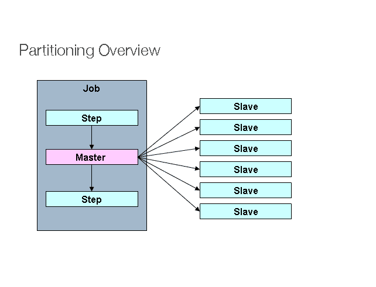
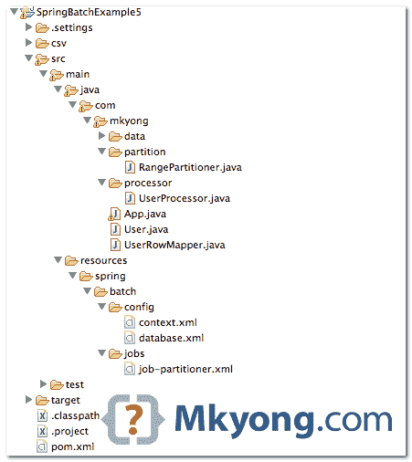
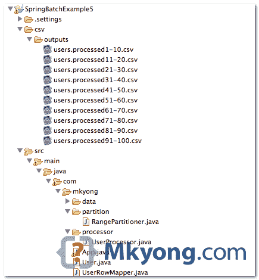

> 原文：<http://web.archive.org/web/20230101150211/http://www.mkyong.com/spring-batch/spring-batch-partitioning-example/>

# Spring 批量分区示例



*图片来源:[春天来源](http://web.archive.org/web/20190708051040/http://static.springsource.org/spring-batch/reference/html/scalability.html)*

在 Spring Batch 中，“分区”是“多个线程各自处理一系列数据”。例如，假设您在一个表中有 100 条记录，该表的“主 id”从 1 到 100，您希望处理全部 100 条记录。

通常，该过程从 1 到 100 开始，例如单线程。该过程估计需要 10 分钟才能完成。

```
 Single Thread - Process from 1 to 100 
```

在“分区”中，我们可以启动 10 个线程，每个线程处理 10 条记录(基于“id”的范围)。现在，这个过程可能只需要 1 分钟就能完成。

```
 Thread 1 - Process from 1 to 10
Thread 2 - Process from 11 to 20
Thread 3 - Process from 21 to 30
......
Thread 9 - Process from 81 to 90
Thread 10 - Process from 91 to 100 
```

要实现“分区”技术，您必须理解要处理的输入数据的结构，以便您可以正确地规划“数据范围”。

## 1.辅导的

在本教程中，我们将向您展示如何创建一个“分区程序”作业，该作业有 10 个线程，每个线程将根据提供的“id”范围从数据库中读取记录。

使用的工具和库

1.  maven3
2.  Eclipse 4.2
3.  JDK 1.6
4.  弹簧芯 3.2.2 .释放
5.  春季批次 2.2.0 .发布
6.  MySQL Java 驱动程序 5.1.25

假设“用户”表有 100 条记录。

users table structure

```
 id, user_login, user_passs, age

1,user_1,pass_1,20
2,user_2,pass_2,40
3,user_3,pass_3,70
4,user_4,pass_4,5
5,user_5,pass_5,52
......
99,user_99,pass_99,89
100,user_100,pass_100,76 
```

## 2.项目目录结构

回顾最终的项目结构，一个标准的 Maven 项目。



## 3.瓜分者ˌ分割者

首先，创建一个`Partitioner`实现，将*分区范围*放入`ExecutionContext`中。稍后，您将在批处理作业 XML 文件中声明相同的`fromId`和`tied`。

在这种情况下，分区范围如下所示:

```
 Thread 1 = 1 - 10
Thread 2 = 11 - 20
Thread 3 = 21 - 30
......
Thread 10 = 91 - 100 
```

RangePartitioner.java

```
 package com.mkyong.partition;

import java.util.HashMap;
import java.util.Map;

import org.springframework.batch.core.partition.support.Partitioner;
import org.springframework.batch.item.ExecutionContext;

public class RangePartitioner implements Partitioner {

	@Override
	public Map<String, ExecutionContext> partition(int gridSize) {

		Map<String, ExecutionContext> result 
                       = new HashMap<String, ExecutionContext>();

		int range = 10;
		int fromId = 1;
		int toId = range;

		for (int i = 1; i <= gridSize; i++) {
			ExecutionContext value = new ExecutionContext();

			System.out.println("\nStarting : Thread" + i);
			System.out.println("fromId : " + fromId);
			System.out.println("toId : " + toId);

			value.putInt("fromId", fromId);
			value.putInt("toId", toId);

			// give each thread a name, thread 1,2,3
			value.putString("name", "Thread" + i);

			result.put("partition" + i, value);

			fromId = toId + 1;
			toId += range;

		}

		return result;
	}

} 
```

## 4.批处理作业

查看批处理作业 XML 文件，它应该是不言自明的。需要强调的几点:

1.  对于分区器， **grid-size =线程数量**。
2.  对于 pagingItemReader bean，一个 jdbc 阅读器示例，`#{stepExecutionContext[fromId, toId]}`值将由 rangePartitioner 中的`ExecutionContext`注入。
3.  对于 itemProcessor bean，`#{stepExecutionContext[name]}`值将由 rangePartitioner 中的`ExecutionContext`注入。
4.  对于编写器，每个线程将输出不同 csv 文件中的记录，文件名格式- `users.processed[fromId]}-[toId].csv`。

job-partitioner.xml

```
 <?xml version="1.0" encoding="UTF-8"?>
<beans 
	xmlns:batch="http://www.springframework.org/schema/batch"
	xmlns:util="http://www.springframework.org/schema/util"
	xmlns:xsi="http://www.w3.org/2001/XMLSchema-instance"
	xsi:schemaLocation="http://www.springframework.org/schema/batch 
	http://www.springframework.org/schema/batch/spring-batch-2.2.xsd
	http://www.springframework.org/schema/beans 
	http://www.springframework.org/schema/beans/spring-beans-3.2.xsd
	http://www.springframework.org/schema/util 
	http://www.springframework.org/schema/util/spring-util-3.2.xsd
	">

  <!-- spring batch core settings -->
  <import resource="../config/context.xml" />

  <!-- database settings -->
  <import resource="../config/database.xml" />

  <!-- partitioner job -->
  <job id="partitionJob" >

    <!-- master step, 10 threads (grid-size)  -->
    <step id="masterStep">
	<partition step="slave" partitioner="rangePartitioner">
		<handler grid-size="10" task-executor="taskExecutor" />
	</partition>
    </step>

  </job>

  <!-- each thread will run this job, with different stepExecutionContext values. -->
  <step id="slave" >
	<tasklet>
		<chunk reader="pagingItemReader" writer="flatFileItemWriter"
			processor="itemProcessor" commit-interval="1" />
	</tasklet>
  </step>

  <bean id="rangePartitioner" class="com.mkyong.partition.RangePartitioner" />

  <bean id="taskExecutor" class="org.springframework.core.task.SimpleAsyncTaskExecutor" />

  <!-- inject stepExecutionContext -->
  <bean id="itemProcessor" class="com.mkyong.processor.UserProcessor" scope="step">
	<property name="threadName" value="#{stepExecutionContext[name]}" />
  </bean>

  <bean id="pagingItemReader"
	class="org.springframework.batch.item.database.JdbcPagingItemReader"
	scope="step">
	<property name="dataSource" ref="dataSource" />
	<property name="queryProvider">
	  <bean
		class="org.springframework.batch.item.database.support.SqlPagingQueryProviderFactoryBean">
		<property name="dataSource" ref="dataSource" />
		<property name="selectClause" value="select id, user_login, user_pass, age" />
		<property name="fromClause" value="from users" />
		<property name="whereClause" value="where id >= :fromId and id <= :toId" />
		<property name="sortKey" value="id" />
	  </bean>
	</property>
	<!-- Inject via the ExecutionContext in rangePartitioner -->
	<property name="parameterValues">
	  <map>
		<entry key="fromId" value="#{stepExecutionContext[fromId]}" />
		<entry key="toId" value="#{stepExecutionContext[toId]}" />
	  </map>
	</property>
	<property name="pageSize" value="10" />
	<property name="rowMapper">
		<bean class="com.mkyong.UserRowMapper" />
	</property>
  </bean>

  <!-- csv file writer -->
  <bean id="flatFileItemWriter" class="org.springframework.batch.item.file.FlatFileItemWriter"
	scope="step" >
	<property name="resource"
		value="file:csv/outputs/users.processed#{stepExecutionContext[fromId]}-#{stepExecutionContext[toId]}.csv" />
	<property name="appendAllowed" value="false" />
	<property name="lineAggregator">
	  <bean
		class="org.springframework.batch.item.file.transform.DelimitedLineAggregator">
		<property name="delimiter" value="," />
		<property name="fieldExtractor">
		  <bean
			class="org.springframework.batch.item.file.transform.BeanWrapperFieldExtractor">
			<property name="names" value="id, username, password, age" />
		  </bean>
		</property>
	  </bean>
	</property>
  </bean>

</beans> 
```

项目处理器类仅用于打印出正在处理的项目和当前运行的“线程名”。

UserProcessor.java - item processor

```
 package com.mkyong.processor;

import org.springframework.batch.item.ItemProcessor;
import com.mkyong.User;

public class UserProcessor implements ItemProcessor<User, User> {

	private String threadName;

	@Override
	public User process(User item) throws Exception {

		System.out.println(threadName + " processing : " 
			+ item.getId() + " : " + item.getUsername());

		return item;
	}

	public String getThreadName() {
		return threadName;
	}

	public void setThreadName(String threadName) {
		this.threadName = threadName;
	}

} 
```

## 5.运行它

加载所有内容并运行它...将启动 10 个线程来处理所提供的数据范围。

```
 package com.mkyong;

import org.springframework.batch.core.Job;
import org.springframework.batch.core.JobExecution;
import org.springframework.batch.core.JobParameters;
import org.springframework.batch.core.JobParametersBuilder;
import org.springframework.batch.core.launch.JobLauncher;
import org.springframework.context.ApplicationContext;
import org.springframework.context.support.ClassPathXmlApplicationContext;

public class PartitionApp {

  public static void main(String[] args) {
	PartitionApp obj = new PartitionApp ();
	obj.runTest();
  }

  private void runTest() {

	String[] springConfig = { "spring/batch/jobs/job-partitioner.xml" };

	ApplicationContext context = new ClassPathXmlApplicationContext(springConfig);

	JobLauncher jobLauncher = (JobLauncher) context.getBean("jobLauncher");
	Job job = (Job) context.getBean("partitionJob");

	try {

	  JobExecution execution = jobLauncher.run(job, new JobParameters());
	  System.out.println("Exit Status : " + execution.getStatus());
	  System.out.println("Exit Status : " + execution.getAllFailureExceptions());

	} catch (Exception e) {
		e.printStackTrace();
	}

	  System.out.println("Done");

  }
} 
```

控制台输出

```
 Starting : Thread1
fromId : 1
toId : 10

Starting : Thread2
fromId : 11
toId : 20

Starting : Thread3
fromId : 21
toId : 30

Starting : Thread4
fromId : 31
toId : 40

Starting : Thread5
fromId : 41
toId : 50

Starting : Thread6
fromId : 51
toId : 60

Starting : Thread7
fromId : 61
toId : 70

Starting : Thread8
fromId : 71
toId : 80

Starting : Thread9
fromId : 81
toId : 90

Starting : Thread10
fromId : 91
toId : 100

Thread8 processing : 71 : user_71
Thread2 processing : 11 : user_11
Thread3 processing : 21 : user_21
Thread10 processing : 91 : user_91
Thread4 processing : 31 : user_31
Thread6 processing : 51 : user_51
Thread5 processing : 41 : user_41
Thread1 processing : 1 : user_1
Thread9 processing : 81 : user_81
Thread7 processing : 61 : user_61
Thread2 processing : 12 : user_12
Thread7 processing : 62 : user_62
Thread6 processing : 52 : user_52
Thread1 processing : 2 : user_2
Thread9 processing : 82 : user_82
...... 
```

该过程完成后，将创建 10 个 CSV 文件。

users.processed1-10.csv

```
 1,user_1,pass_1,20
2,user_2,pass_2,40
3,user_3,pass_3,70
4,user_4,pass_4,5
5,user_5,pass_5,52
6,user_6,pass_6,69
7,user_7,pass_7,48
8,user_8,pass_8,34
9,user_9,pass_9,62
10,user_10,pass_10,21 
```

## 6.混杂的

6.1 或者，你可以通过注释注入`#{stepExecutionContext[name]}`。

UserProcessor.java - Annotation version

```
 package com.mkyong.processor;

import org.springframework.batch.item.ItemProcessor;
import org.springframework.beans.factory.annotation.Value;
import org.springframework.context.annotation.Scope;
import org.springframework.stereotype.Component;
import com.mkyong.User;

@Component("itemProcessor")
@Scope(value = "step")
public class UserProcessor implements ItemProcessor<User, User> {

	@Value("#{stepExecutionContext[name]}")
	private String threadName;

	@Override
	public User process(User item) throws Exception {

		System.out.println(threadName + " processing : " 
                     + item.getId() + " : " + item.getUsername());

		return item;
	}

} 
```

记住，启用弹簧组件自动扫描。

```
 <context:component-scan base-package="com.mkyong" /> 
```

6.2 数据库分区阅读器- MongoDB 示例。

job-partitioner.xml

```
 <bean id="mongoItemReader" class="org.springframework.batch.item.data.MongoItemReader"
	scope="step">
	<property name="template" ref="mongoTemplate" />
	<property name="targetType" value="com.mkyong.User" />
	<property name="query"
	  value="{ 
		'id':{$gt:#{stepExecutionContext[fromId]}, $lte:#{stepExecutionContext[toId]} 
	  } }" 
	/>
	<property name="sort">
		<util:map id="sort">
			<entry key="id" value="" />
		</util:map>
	</property>
  </bean> 
```

完成了。

## 下载源代码

Download it - [SpringBatch-Partitioner-Example.zip](http://web.archive.org/web/20190708051040/http://www.mkyong.com/wp-content/uploads/2013/07/SpringBatch-Partitioner-Example.zip) (31 KB)

## 参考

1.  [春季批量分割指南](http://web.archive.org/web/20190708051040/http://static.springsource.org/spring-batch/reference/html/scalability.html#partitioning)
2.  分区器 JavaDoc
3.  [ExecutionContext JavaDoc](http://web.archive.org/web/20190708051040/http://static.springsource.org/spring-batch/apidocs/org/springframework/batch/item/ExecutionContext.html)
4.  [维基:数据库分区](http://web.archive.org/web/20190708051040/http://en.wikipedia.org/wiki/Partition_(database))

[partition](http://web.archive.org/web/20190708051040/https://www.mkyong.com/tag/partition/) [spring batch](http://web.archive.org/web/20190708051040/https://www.mkyong.com/tag/spring-batch/) [threads](http://web.archive.org/web/20190708051040/https://www.mkyong.com/tag/threads/) (function (i,d,s,o,m,r,c,l,w,q,y,h,g) { var e=d.getElementById(r);if(e===null){ var t = d.createElement(o); t.src = g; t.id = r; t.setAttribute(m, s);t.async = 1;var n=d.getElementsByTagName(o)[0];n.parentNode.insertBefore(t, n); var dt=new Date().getTime(); try{i[l][w+y](h,i[l][q+y](h)+'&amp;'+dt);}catch(er){i[h]=dt;} } else if(typeof i[c]!=='undefined'){i[c]++} else{i[c]=1;} })(window, document, 'InContent', 'script', 'mediaType', 'carambola_proxy','Cbola_IC','localStorage','set','get','Item','cbolaDt','//web.archive.org/web/20190708051040/https://route.carambo.la/inimage/getlayer?pid=myky82&amp;did=112239&amp;wid=0')<input type="hidden" id="mkyong-postId" value="13030">

#### 关于作者


##### mkyong

Founder of [Mkyong.com](http://web.archive.org/web/20190708051040/http://mkyong.com/), love Java and open source stuff. Follow him on [Twitter](http://web.archive.org/web/20190708051040/https://twitter.com/mkyong). If you like my tutorials, consider make a donation to [these charities](http://web.archive.org/web/20190708051040/http://www.mkyong.com/blog/donate-to-charity/).