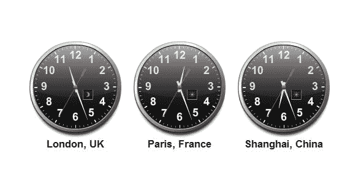

# Java–在时区之间转换日期和时间

> 原文：<http://web.archive.org/web/20230101150211/https://www.mkyong.com/java/java-convert-date-and-time-between-timezone/>



在本教程中，我们将向您展示几个示例( [ZonedDateTime (Java 8)](http://web.archive.org/web/20220627214124/https://docs.oracle.com/javase/8/docs/api/java/time/ZonedDateTime.html) 、 [Date](http://web.archive.org/web/20220627214124/https://docs.oracle.com/javase/8/docs/api/java/util/Date.html) 、 [Calendar](http://web.archive.org/web/20220627214124/https://docs.oracle.com/javase/8/docs/api/java/util/Calendar.html) 和 [Joda Time](http://web.archive.org/web/20220627214124/http://www.joda.org/joda-time/) )来转换不同时区之间的日期和时间。

所有示例都将日期和时间从

```java
 (UTC+8:00) Asia/Singapore - Singapore Time
Date : 22-1-2015 10:15:55 AM 
```

到

```java
 (UTC-5:00) America/New_York - Eastern Standard Time
Date : 21-1-2015 09:15:55 PM 
```

**Which to use?**
For time zone, avoid both `Date` and `Calendar`

1.  如果您使用的是> = 8 的 JDK，请使用新的`java.time.*`框架。
2.  如果您使用 JDK < 8，请使用 Joda 时间。(新的 Java 8 `java.time.*`框架就是受这个库的启发)

## 1.ZonedDateTime

总是使用这个新的 Java 8 `java.time.ZonedDateTime`来表示包含时区的日期和时间。

ZonedDateTimeExample.java

```java
 package com.mkyong.date;

import java.time.LocalDateTime;
import java.time.ZoneId;
import java.time.ZonedDateTime;
import java.time.format.DateTimeFormatter;

public class ZonedDateTimeExample {

    private static final String DATE_FORMAT = "dd-M-yyyy hh:mm:ss a";

    public static void main(String[] args) {

        String dateInString = "22-1-2015 10:15:55 AM";
        LocalDateTime ldt = LocalDateTime.parse(dateInString, DateTimeFormatter.ofPattern(DATE_FORMAT));

        ZoneId singaporeZoneId = ZoneId.of("Asia/Singapore");
        System.out.println("TimeZone : " + singaporeZoneId);

        //LocalDateTime + ZoneId = ZonedDateTime
        ZonedDateTime asiaZonedDateTime = ldt.atZone(singaporeZoneId);
        System.out.println("Date (Singapore) : " + asiaZonedDateTime);

        ZoneId newYokZoneId = ZoneId.of("America/New_York");
        System.out.println("TimeZone : " + newYokZoneId);

        ZonedDateTime nyDateTime = asiaZonedDateTime.withZoneSameInstant(newYokZoneId);
        System.out.println("Date (New York) : " + nyDateTime);

        DateTimeFormatter format = DateTimeFormatter.ofPattern(DATE_FORMAT);
        System.out.println("\n---DateTimeFormatter---");
        System.out.println("Date (Singapore) : " + format.format(asiaZonedDateTime));
        System.out.println("Date (New York) : " + format.format(nyDateTime));

    }

} 
```

输出

```java
 TimeZone : Asia/Singapore
Date (Singapore) : 2015-01-22T10:15:55+08:00[Asia/Singapore]
TimeZone : America/New_York
Date (New York) : 2015-01-21T21:15:55-05:00[America/New_York]

---DateTimeFormatter---
Date (Singapore) : 22-1-2015 10:15:55 AM
Date (New York) : 21-1-2015 09:15:55 PM 
```

**Note**
Refer to this [ZonedDateTime tutorial](http://web.archive.org/web/20220627214124/http://www.mkyong.com/java8/java-8-zoneddatetime-examples/) for more time zone, custom offset and daylight saving time (DST) examples.

## 2.日期

**Note**
The `java.util.Date` has no concept of time zone, and only represents the number of seconds passed since the Unix epoch time – 1970-01-01T00:00:00Z. But, if you print the Date object directly, the Date object will be always printed with the default system time zone. Check the `Date.toString()` source code.

2.1 将时区设置为`DateFormat`并格式化`java.util.Date`

```java
 SimpleDateFormat sdfAmerica = new SimpleDateFormat("dd-M-yyyy hh:mm:ss a");
sdfAmerica.setTimeZone(TimeZone.getTimeZone("America/New_York"));
String sDateInAmerica = sdfAmerica.format(date); 
```

2.2 完整示例

DateExample.java

```java
 package com.mkyong.date;

import java.text.ParseException;
import java.text.SimpleDateFormat;
import java.util.Date;
import java.util.TimeZone;

public class DateExample {

    private static final String DATE_FORMAT = "dd-M-yyyy hh:mm:ss a";

    public static void main(String[] args) throws ParseException {

        SimpleDateFormat formatter = new SimpleDateFormat(DATE_FORMAT);

        String dateInString = "22-01-2015 10:15:55 AM";
        Date date = formatter.parse(dateInString);
        TimeZone tz = TimeZone.getDefault();

        // From TimeZone Asia/Singapore
        System.out.println("TimeZone : " + tz.getID() + " - " + tz.getDisplayName());
        System.out.println("TimeZone : " + tz);
        System.out.println("Date (Singapore) : " + formatter.format(date));

        // To TimeZone America/New_York
        SimpleDateFormat sdfAmerica = new SimpleDateFormat(DATE_FORMAT);
        TimeZone tzInAmerica = TimeZone.getTimeZone("America/New_York");
        sdfAmerica.setTimeZone(tzInAmerica);

        String sDateInAmerica = sdfAmerica.format(date); // Convert to String first
        Date dateInAmerica = formatter.parse(sDateInAmerica); // Create a new Date object

        System.out.println("\nTimeZone : " + tzInAmerica.getID() + " - " + tzInAmerica.getDisplayName());
        System.out.println("TimeZone : " + tzInAmerica);
        System.out.println("Date (New York) (String) : " + sDateInAmerica);
        System.out.println("Date (New York) (Object) : " + formatter.format(dateInAmerica));

    }

} 
```

输出

```java
 TimeZone : Asia/Kuala_Lumpur - Malaysia Time
TimeZone : sun.util.calendar.ZoneInfo[id="Asia/Kuala_Lumpur",...]
Date (Singapore) : 22-1-2015 10:15:55 AM

TimeZone : America/New_York - Eastern Standard Time
TimeZone : sun.util.calendar.ZoneInfo[id="America/New_York",...]
Date (New York) (String) : 21-1-2015 09:15:55 PM
Date (New York) (Object) : 21-1-2015 09:15:55 PM 
```

## 3.日历

3.1 设置时区的日历示例:

```java
 Calendar calendar = new GregorianCalendar();
	calendar.setTime(date);
	calendar.setTimeZone(tzInAmerica); 
```

一个超级常见的错误是像这样直接得到`java.util.Date`:

```java
 //Wrong, it will display 22-1-2015 10:15:55 AM, time is still in the system default time zone!
	Date dateInAmerican = calendar.getTime()); 
```

在上面的示例中，无论您在日历中设置了什么时区，Date 对象总是使用默认的系统时区进行打印。(查看`Date.toString()`源代码)

3.2 正确的做法应该是用`DateFormat`来格式化:

```java
 SimpleDateFormat sdfAmerica = new SimpleDateFormat("dd-M-yyyy hh:mm:ss a");
	TimeZone tzInAmerica = TimeZone.getTimeZone("America/New_York");
	sdfAmerica.setTimeZone(tzInAmerica);
	sdfAmerica.format(calendar.getTime()) 
```

或者通过`calendar.get()`获取日期:

```java
 int year = calendar.get(Calendar.YEAR);
	int month = calendar.get(Calendar.MONTH); // Jan = 0, dec = 11
	int dayOfMonth = calendar.get(Calendar.DAY_OF_MONTH);
	int hour = calendar.get(Calendar.HOUR); // 12 hour clock
	int hourOfDay = calendar.get(Calendar.HOUR_OF_DAY); // 24 hour clock
	int minute = calendar.get(Calendar.MINUTE);
	int second = calendar.get(Calendar.SECOND);
	int ampm = calendar.get(Calendar.AM_PM); //0 = AM , 1 = PM 
```

3.3 完整示例

CalendarExample.java

```java
 package com.mkyong.date;

import java.text.ParseException;
import java.text.SimpleDateFormat;
import java.util.Calendar;
import java.util.Date;
import java.util.GregorianCalendar;
import java.util.TimeZone;

public class CalendarExample {

    private static final String DATE_FORMAT = "dd-M-yyyy hh:mm:ss a";

    public static void main(String[] args) throws ParseException {

        SimpleDateFormat formatter = new SimpleDateFormat(DATE_FORMAT);

        String dateInString = "22-01-2015 10:15:55 AM";
        Date date = formatter.parse(dateInString);
        TimeZone tz = TimeZone.getDefault();

        // From TimeZone Asia/Singapore
        System.out.println("TimeZone : " + tz.getID() + " - " + tz.getDisplayName());
        System.out.println("TimeZone : " + tz);
        System.out.println("Date (Singapore) : " + formatter.format(date));

        // To TimeZone America/New_York
        SimpleDateFormat sdfAmerica = new SimpleDateFormat(DATE_FORMAT);
        TimeZone tzInAmerica = TimeZone.getTimeZone("America/New_York");
        sdfAmerica.setTimeZone(tzInAmerica);

        Calendar calendar = new GregorianCalendar();
        calendar.setTime(date);
        calendar.setTimeZone(tzInAmerica);

        System.out.println("\nTimeZone : " + tzInAmerica.getID() + " - " + tzInAmerica.getDisplayName());
        System.out.println("TimeZone : " + tzInAmerica);

        //Wrong! It will print the date with the system default time zone
        System.out.println("Date (New York) (Wrong!): " + calendar.getTime());

        //Correct! need formatter
        System.out.println("Date (New York) (Correct!) : " + sdfAmerica.format(calendar.getTime()));

        int year = calendar.get(Calendar.YEAR);
        int month = calendar.get(Calendar.MONTH); // Jan = 0, dec = 11
        int dayOfMonth = calendar.get(Calendar.DAY_OF_MONTH);
        int hour = calendar.get(Calendar.HOUR); // 12 hour clock
        int hourOfDay = calendar.get(Calendar.HOUR_OF_DAY); // 24 hour clock
        int minute = calendar.get(Calendar.MINUTE);
        int second = calendar.get(Calendar.SECOND);
        int ampm = calendar.get(Calendar.AM_PM); //0 = AM , 1 = PM

        //Correct
        System.out.println("\nyear \t\t: " + year);
        System.out.println("month \t\t: " + month + 1);
        System.out.println("dayOfMonth \t: " + dayOfMonth);
        System.out.println("hour \t\t: " + hour);
        System.out.println("minute \t\t: " + minute);
        System.out.println("second \t\t: " + second);
        System.out.println("ampm \t\t: " + ampm);

    }

} 
```

输出

```java
 TimeZone : Asia/Kuala_Lumpur - Malaysia Time
TimeZone : sun.util.calendar.ZoneInfo[id="Asia/Kuala_Lumpur",...]
Date (Singapore) : 22-1-2015 10:15:55 AM

TimeZone : America/New_York - Eastern Standard Time
TimeZone : sun.util.calendar.ZoneInfo[id="America/New_York",...]]
Date (New York) (Wrong!): Thu Jan 22 10:15:55 MYT 2015
Date (New York) (Correct!) : 21-1-2015 09:15:55 PM

year 		: 2015
month 		: 01
dayOfMonth 	: 21
hour 		: 9
minute 		: 15
second 		: 55
ampm 		: 1 
```

## 4.Joda 时间

4.1 设置时区的 Joda 时间示例:

```java
 DateTime dt = new DateTime(date);
	DateTimeZone dtZone = DateTimeZone.forID("America/New_York");
	DateTime dtus = dt.withZone(dtZone); 
```

同样，一个常见的错误是像这样直接获取日期，时区会丢失。

```java
 //Output : 22-1-2015 10:15:55 AM
	Date dateInAmerica = dtus.toDate(); 
```

正确的做法是先转换成 Joda `LocalDateTime`。

```java
 //Output : 21-1-2015 09:15:55 PM
	Date dateInAmerica = dtus.toLocalDateTime().toDate(); 
```

4.2 完整示例

JodaTimeExample.java

```java
 package com.mkyong.date;

import org.joda.time.DateTime;
import org.joda.time.DateTimeZone;

import java.text.ParseException;
import java.text.SimpleDateFormat;
import java.util.Date;
import java.util.TimeZone;

public class JodaTimeExample {

    private static final String DATE_FORMAT = "dd-M-yyyy hh:mm:ss a";

    public static void main(String[] args) throws ParseException {

        SimpleDateFormat formatter = new SimpleDateFormat(DATE_FORMAT);

        String dateInString = "22-01-2015 10:15:55 AM";
        Date date = formatter.parse(dateInString);
        TimeZone tz = TimeZone.getDefault();

        // From TimeZone Asia/Singapore
        System.out.println("TimeZone : " + tz.getID() + " - " + tz.getDisplayName());
        System.out.println("TimeZone : " + tz);
        System.out.println("Date (Singapore) : " + formatter.format(date));

        // To TimeZone America/New_York
        SimpleDateFormat sdfAmerica = new SimpleDateFormat(DATE_FORMAT);
        DateTime dt = new DateTime(date);
        DateTimeZone dtZone = DateTimeZone.forID("America/New_York");
        DateTime dtus = dt.withZone(dtZone);
        TimeZone tzInAmerica = dtZone.toTimeZone();
        Date dateInAmerica = dtus.toLocalDateTime().toDate(); //Convert to LocalDateTime first

        sdfAmerica.setTimeZone(tzInAmerica);

        System.out.println("\nTimeZone : " + tzInAmerica.getID() + " - " + tzInAmerica.getDisplayName());
        System.out.println("TimeZone : " + tzInAmerica);
        System.out.println("DateTimeZone : " + dtZone);
        System.out.println("DateTime : " + dtus);

        System.out.println("dateInAmerica (Formatter) : " + formatter.format(dateInAmerica));
        System.out.println("dateInAmerica (Object) : " + dateInAmerica);

    }

} 
```

输出

```java
 TimeZone : Asia/Kuala_Lumpur - Malaysia Time
TimeZone : sun.util.calendar.ZoneInfo[id="Asia/Kuala_Lumpur",...]
Date (Singapore) : 22-1-2015 10:15:55 AM

TimeZone : America/New_York - Eastern Standard Time
TimeZone : sun.util.calendar.ZoneInfo[id="America/New_York",...]
DateTimeZone : America/New_York
DateTime : 2015-01-21T21:15:55.000-05:00
dateInAmerica (Formatter) : 21-1-2015 09:15:55 PM
dateInAmerica (Object) : Wed Jan 21 21:15:55 MYT 2015 
```

*用 Joda-time 2.9.4 测试的 P . S*

## 参考

1.  [使用 JodaTime 在 Java 中操作日期和时间](http://web.archive.org/web/20220627214124/http://blog.smartbear.com/programming/date-and-time-manipulation-in-java-using-jodatime/)
2.  [世界时间服务器](http://web.archive.org/web/20220627214124/http://www.worldtimeserver.com/)
3.  [Java 8 – ZonedDateTime examples](http://web.archive.org/web/20220627214124/http://www.mkyong.com/java8/java-8-zoneddatetime-examples/)
4.  [Java 8–将日期转换为本地日期和本地日期时间](http://web.archive.org/web/20220627214124/http://www.mkyong.com/java8/java-8-convert-date-to-localdate-and-localdatetime/)
5.  [ZonedDateTime Javadoc](http://web.archive.org/web/20220627214124/https://docs.oracle.com/javase/8/docs/api/java/time/ZonedDateTime.html)
6.  [日历 JavaDoc](http://web.archive.org/web/20220627214124/https://docs.oracle.com/javase/8/docs/api/java/util/Calendar.html)
7.  [日期 JavaDoc](http://web.archive.org/web/20220627214124/https://docs.oracle.com/javase/8/docs/api/java/util/Date.html)
8.  [简单日期格式 JavaDoc](http://web.archive.org/web/20220627214124/https://docs.oracle.com/javase/8/docs/api/java/text/SimpleDateFormat.html)

<input type="hidden" id="mkyong-current-postId" value="13578">