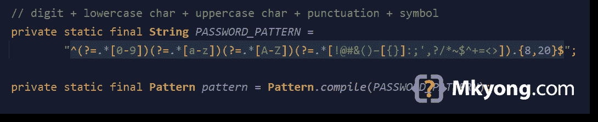
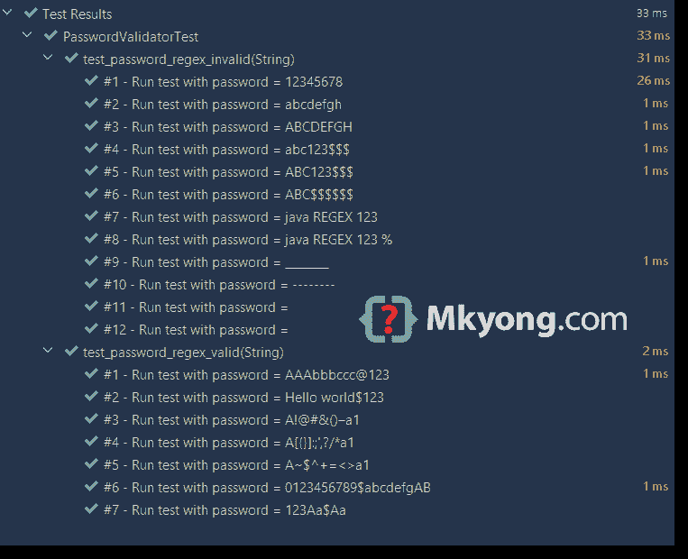

# Java regex 验证密码示例

> 原文：<http://web.archive.org/web/20230101150211/http://www.mkyong.com/regular-expressions/how-to-validate-password-with-regular-expression/>



本文展示了如何使用 regex 在 Java 中验证密码。

安全密码要求

1.  密码必须包含至少一个数字[0-9]。
2.  密码必须包含至少一个小写拉丁字符[a-z]。
3.  密码必须包含至少一个大写拉丁字符[A-Z]。
4.  密码必须包含至少一个特殊字符，如`! @ # & ( )`。
5.  密码必须包含至少 8 个字符，最多 20 个字符。

下面是符合上述所有要求的正则表达式。

```
 ^(?=.*[0-9])(?=.*[a-z])(?=.*[A-Z])(?=.*[!@#&()–[{}]:;',?/*~$^+=<>]).{8,20}$ 
```

## 1.正则表达式密码解释

密码必须包含至少一个小写字符、一个大写字符、一个数字、一个特殊字符，长度在 8 到 20 之间。下面的正则表达式使用[正向前瞻](http://web.archive.org/web/20220923123537/https://www.regular-expressions.info/lookaround.html)进行条件检查。

```
 ^                                   # start of line
  (?=.*[0-9])                       # positive lookahead, digit [0-9]
  (?=.*[a-z])                       # positive lookahead, one lowercase character [a-z]
  (?=.*[A-Z])                       # positive lookahead, one uppercase character [A-Z]
  (?=.*[!@#&()–[{}]:;',?/*~$^+=<>]) # positive lookahead, one of the special character in this [..]
  .                                 # matches anything
  {8,20}                            # length at least 8 characters and maximum of 20 characters
$                                   # end of line 
```

在 regex 中，有正前瞻`(?=)`和负前瞻`(?!)`:

*   积极的前瞻`(?=)`确保某事`followed by`某事。
*   消极的前瞻`(?!)`确保了某些东西`NOT followed by`某些别的东西。

例如，`b(?=c)`匹配后面跟有`c`的`b`。(正向前瞻)
例如，`b(?!c)`匹配后面没有`c`的`b`。(消极前瞻)

## 2.验证密码的正则表达式

下面是一个验证密码的 Java regex 示例。

PasswordValidator.java

```
 package com.mkyong.regex.password;

import java.util.regex.Matcher;
import java.util.regex.Pattern;

public class PasswordValidator {

    // digit + lowercase char + uppercase char + punctuation + symbol
    private static final String PASSWORD_PATTERN =
            "^(?=.*[0-9])(?=.*[a-z])(?=.*[A-Z])(?=.*[!@#&()–[{}]:;',?/*~$^+=<>]).{8,20}$";

    private static final Pattern pattern = Pattern.compile(PASSWORD_PATTERN);

    public static boolean isValid(final String password) {
        Matcher matcher = pattern.matcher(password);
        return matcher.matches();
    }

} 
```

## 3.正则表达式密码单元测试

下面是测试有效和无效密码列表的单元测试。

PasswordValidatorTest.java

```
 package com.mkyong.regex.password;

import org.junit.jupiter.params.ParameterizedTest;
import org.junit.jupiter.params.provider.MethodSource;

import java.util.stream.Stream;

import static org.junit.jupiter.api.Assertions.assertFalse;
import static org.junit.jupiter.api.Assertions.assertTrue;

public class PasswordValidatorTest {

    @ParameterizedTest(name = "#{index} - Run test with password = {0}")
    @MethodSource("validPasswordProvider")
    void test_password_regex_valid(String password) {
        assertTrue(PasswordValidator.isValid(password));
    }

    @ParameterizedTest(name = "#{index} - Run test with password = {0}")
    @MethodSource("invalidPasswordProvider")
    void test_password_regex_invalid(String password) {
        assertFalse(PasswordValidator.isValid(password));
    }

    static Stream<String> validPasswordProvider() {
        return Stream.of(
                "AAAbbbccc@123",
                "Hello world$123",
                "A!@#&()–a1",               // test punctuation part 1
                "A[{}]:;',?/*a1",           // test punctuation part 2
                "A~$^+=<>a1",               // test symbols
                "0123456789$abcdefgAB",     // test 20 chars
                "123Aa$Aa"                  // test 8 chars
        );
    }

    // At least
    // one lowercase character,
    // one uppercase character,
    // one digit,
    // one special character
    // and length between 8 to 20.
    static Stream<String> invalidPasswordProvider() {
        return Stream.of(
                "12345678",                 // invalid, only digit
                "abcdefgh",                 // invalid, only lowercase
                "ABCDEFGH",                 // invalid, only uppercase
                "abc123$$$",                // invalid, at least one uppercase
                "ABC123$$$",                // invalid, at least one lowercase
                "ABC$$$$$$",                // invalid, at least one digit
                "java REGEX 123",           // invalid, at least one special character
                "java REGEX 123 %",         // invalid, % is not in the special character group []
                "________",                 // invalid
                "--------",                 // invalid
                " ",                        // empty
                "");                        // empty
    }
} 
```

都通过了。



## 4.常见问题

以下是一些常见问题:

*   为什么密码越长越安全？
*   为什么必须混合至少一个特殊字符？

**回答** :
对于拉丁字符，小写和大写【a-zA-Z】，由 52 个字符组成；对于数字[0-9]，由 10 个字符组成，共 62 个字符。

*   如果密码长度为 1，则由`62`种可能性、【a-zA-Z0-9】组成。意思是最坏的情况；我们需要猜 62 次才能找到正确的密码。
*   长度为 2 时，为`62 x 62`或`62 ^ 2` = `3,844`
*   62 ^ 3 = `238,328`
*   62 ^ 4 = `14,776,336`
*   62 ^ 5 = `916,132,832`
*   62 ^ 6 = `56,800,235,584`
*   62 ^ 7 = `3,521,614,606,208`
*   62 ^ 8 = `218,340,105,584,896`
*   较长的密码更安全，因为它使攻击者更难猜出正确的密码。明白了吗？

如果我们将标点符号`! @ # & ( ) – [ { } ] : ; ' , ? / *` (18 个字符)和符号`~ $ ^ + = < >` (7 个字符)等[特殊字符](http://web.archive.org/web/20220923123537/https://docs.oracle.com/cd/E29584_01/webhelp/mdex_basicDev/src/cbdv_searchchar_indexing_non-alphanumeric_characters.html)包括在内，将会大大增加猜测正确密码的难度。我不是很确定有多少个特殊字符，姑且认为是 25 个字符(估计)。

对于 62 个字母数字字符+ 25 个特殊字符，总共是 87 个字符。

*   87 ^ 1 = `87`
*   87 ^ 2 = `7,569`
*   87 ^ 3 = `658,503`
*   87 ^ 4 = `57,289,761`
*   87 ^ 5 = `4,984,209,207`
*   87 ^ 6 = `433,626,201,009`
*   87 ^ 7 = `37,725,479,487,783`
*   87 ^ 8 = `3,282,116,715,437,121`

混有特殊字符会大大增加猜测正确密码的难度。

**密码哈希**
不将密码存储为明文。使用像 Argon2 这样的[慢速散列来散列密码是一个很好的做法。](/web/20220923123537/https://mkyong.com/java/java-password-hashing-with-argon2/)

**强密码生成器**
试试这个 [Java 密码生成器例子](/web/20220923123537/https://mkyong.com/java/java-password-generator-example/)生成一个安全健壮的密码。

## 下载源代码

$ git 克隆[https://github.com/mkyong/core-java](http://web.archive.org/web/20220923123537/https://github.com/mkyong/core-java)

$ cd java-regex/password

## 参考

*   [维基百科–字母数字](http://web.archive.org/web/20220923123537/https://en.wikipedia.org/wiki/Alphanumeric)
*   [维基百科–密码强度](http://web.archive.org/web/20220923123537/https://en.wikipedia.org/wiki/Password_strength)
*   [Regex–前视和后视零长度断言](http://web.archive.org/web/20220923123537/https://www.regular-expressions.info/lookaround.html)
*   [JUnit 5 参数化测试](/web/20220923123537/https://mkyong.com/junit5/junit-5-parameterized-tests/)
*   [密码&用户名最佳实践](http://web.archive.org/web/20220923123537/https://security.intuit.com/index.php/protect-your-information/password-username-best-practices)
*   [索引非字母数字字符](http://web.archive.org/web/20220923123537/https://docs.oracle.com/cd/E29584_01/webhelp/mdex_basicDev/src/cbdv_searchchar_indexing_non-alphanumeric_characters.html)
*   [前 5 名最强密码](/web/20220923123537/https://mkyong.com/computer-tips/top-5-strongest-password/)
*   [Java 密码生成器示例](/web/20220923123537/https://mkyong.com/java/java-password-generator-example/)

<input type="hidden" id="mkyong-current-postId" value="1900">