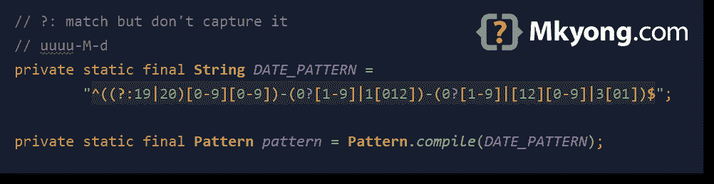
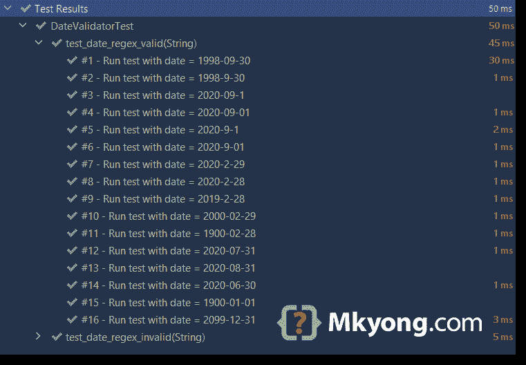
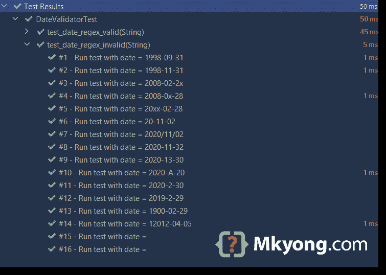

# Java regex 验证日期格式示例

> 原文：<http://web.archive.org/web/20230101150211/http://www.mkyong.com/regular-expressions/how-to-validate-date-with-regular-expression/>



本文展示了如何使用 regex +代码来验证日期格式，支持单个和前导零的月和日格式(1 或 01)，检查一个月中的第 30 天或第 31 天，以及闰年验证。

以下是有效日期的要求。

1.  年份格式，1900，2099 `regex`
2.  月份格式，1，01，2，02… 12 `regex`
3.  日格式，1，01… 31 `regex`
4.  闰年 2 月 29 日。`code`
5.  平年，二月二十八日。`code`
6.  一个月中的 31 天–1、3、5、7、8、10、12。`code`
7.  一个月的 30 天–4，6，9，11，.`code`
8.  、`yyyy-MM-dd`或`uuuu-M-d`，如 2020-11-03。`regex`

```
 ((?:19|20)[0-9][0-9])-(0?[1-9]|1[012])-(0?[1-9]|[12][0-9]|3[01]) 
```

上述正则表达式可以实现 1、2、3 和 8 的要求。对于 4，5，6，7 的需求，我们需要手工代码检查。可接受的日期范围从`1900-01-01`或`1900-1-1`到`2099-12-31`。

## 1.日期格式、年、月和日的正则表达式。

1.1 正则表达式验证年份，接受`1900-2099`。

```
 (19|20)[0-9][0-9]

  # explanation
  19[0-9][0-9]  # 1900-1999
  |             # ..or
  20[0-9][0-9]  # 2000-2099 
```

将来，如果我们想支持以`21xx`开始的年份，请更新正则表达式，如下所示:

```
 (19|20|21)[0-9][0-9] 
```

1.2 验证月份的正则表达式，接受`01-09`(前导零)、`1-9`(一位数)和`10,11,12`。

```
 0?[1-9]|1[012]

  # explanation
  0?[1-9]       #	01-09 or 1-9
  |             #	..or
  1[012]        #	10,11,12 
```

1.3 Regex 验证日，接受`01-09`(前导零)、`1-9`(个位数)、`10-19`、`20-29`和`30-31`。

```
 0?[1-9]|[12][0-9]|3[01]

  # explanation
  0?[1-9]       #  01-09 or 1-9
  |             #  ..or
  [12][0-9]     #  10-19 or 20-29
  |             #  ..or
  3[01]         #  30, 31 
```

1.4 我们有用于年、月和日的正则表达式，尝试结合不同的分隔符来形成不同的日期格式。

验证日期格式`dd/mm/yyyy (General)`或`d/M/uuuu (Java date formater)`的正则表达式

```
 # (dd)/(mm)/(yyyy)
  (0?[1-9]|[12][0-9]|3[01])/(0?[1-9]|1[012])/((?:19|20)[0-9][0-9]) 
```

验证日期格式`yyyy-mm-dd (General)`或`uuuu-M-d (Java date formater)`的正则表达式

```
 # (yyyy)-(mm)-(dd)
  ((?:19|20)[0-9][0-9])-(0?[1-9]|1[012])-(0?[1-9]|[12][0-9]|3[01]) 
```

验证日期格式`yyyy.mm.dd (General)`或`uuuu.M.d (Java date formater)`的正则表达式

```
 # (yyyy).(mm).(dd)
  ((?:19|20)[0-9][0-9])\\.(0?[1-9]|1[012])\\.(0?[1-9]|[12][0-9]|3[01])$ 
```

*P.S `?:`表示匹配但不捕捉。请参见下面的# 3 JavaDateValidator。*

## 2.30 或 31 天和闰年。

现在，我们可以使用上面的正则表达式来捕获年、月和日。稍后我们将检查一个月的 30 或 31 天以及闰年。

2.1 一个月的 30 天或 31 天。

*   12 月 1、3、5、7、8、10 有 31 天。
*   2011 年 4 月 6 日有 30 天。

```
 if ((month.equals("4") || month.equals("6") || month.equals("9") ||
        month.equals("04") || month.equals("06") || month.equals("09") ||
        month.equals("11")) && day.equals("31")) {
    isValid = false;
  } 
```

2.2 为闰年，每年 366 天，二月有 29 天；对于一个普通的年份，一年 365 天，二月有 28 天。

```
 if (month.equals("2") || month.equals("02")) {
    if (day.equals("30") || day.equals("31")) {
        isValid = false;
    } else if (day.equals("29")) {  // feb 29 days? leap year checking
        if (!isLeapYear(year)) {
            isValid = false;
        }
    }
  }

  private static boolean isLeapYear(int year) {
       return (year % 4 == 0 && (year % 100 != 0 || year % 400 == 0));
  } 
```

> “除了能被 100 整除的年份之外，每一个能被 4 整除的年份都是闰年，但如果能被 400 整除，这些百年就是闰年。比如 1700 年、1800 年、1900 年不是闰年，1600 年、2000 年是。”

来源:[维基百科闰年](http://web.archive.org/web/20211031173144/https://en.wikipedia.org/wiki/Leap_year)。

## 3.Java 正则表达式日期验证器

这是最终版本。

DateValidator.java

```
 package com.mkyong.regex.date;

import java.util.regex.Matcher;
import java.util.regex.Pattern;

public class DateValidatorRegex {

    // ?: match but don't capture it
    // uuuu-M-d
    private static final String DATE_PATTERN =
            "^((?:19|20)[0-9][0-9])-(0?[1-9]|1[012])-(0?[1-9]|[12][0-9]|3[01])$";

    private static final Pattern pattern = Pattern.compile(DATE_PATTERN);

    public static boolean isValid(final String date) {

        boolean result = false;

        Matcher matcher = pattern.matcher(date);

        if (matcher.matches()) {

            // it is a valid date format yyyy-mm-dd
            // assign true first, later we will check the leap year and odd or even months
            result = true;

            // (?:19|20), match but don't capture it, otherwise it will messy the group order
            // for example, 2020-2-30, it will create 4 groups.
            // group(1) = 2020, group(2) matches (19|20) = 20, group(3) = 2, group(4) = 30
            // So, we put (?:19|20), don't capture this group.

            int year = Integer.parseInt(matcher.group(1));
            // why string? month matches 02 or 2
            String month = matcher.group(2);
            String day = matcher.group(3);

            // 30 or 31 days checking
            // only 1,3,5,7,8,10,12 has 31 days
            if ((month.equals("4") || month.equals("6") || month.equals("9") ||
                    month.equals("04") || month.equals("06") || month.equals("09") ||
                    month.equals("11")) && day.equals("31")) {
                result = false;
            } else if (month.equals("2") || month.equals("02")) {
                if (day.equals("30") || day.equals("31")) {
                    result = false;
                } else if (day.equals("29")) {  // leap year? feb 29 days.
                    if (!isLeapYear(year)) {
                        result = false;
                    }
                }
            }

        }

        return result;
    }

    private static boolean isLeapYear(int year) {
        return (year % 4 == 0 && (year % 100 != 0 || year % 400 == 0));
    }
} 
```

## 4.单元测试

下面是针对上述 Java 日期验证器的 JUnit 5 参数化测试。

DateValidatorTest.java

```
 package com.mkyong.regex.date;

import org.junit.jupiter.params.ParameterizedTest;
import org.junit.jupiter.params.provider.MethodSource;

import java.util.stream.Stream;

import static org.junit.jupiter.api.Assertions.assertFalse;
import static org.junit.jupiter.api.Assertions.assertTrue;

public class DateValidatorTest {

    @ParameterizedTest(name = "#{index} - Run test with date = {0}")
    @MethodSource("validDateProvider")
    void test_date_regex_valid(String date) {
        assertTrue(DateValidatorRegex.isValid(date));
    }

    @ParameterizedTest(name = "#{index} - Run test with date = {0}")
    @MethodSource("invalidDateProvider")
    void test_date_regex_invalid(String date) {
        assertFalse(DateValidatorRegex.isValid(date));
    }

    static Stream<String> validDateProvider() {
        return Stream.of(
                "1998-09-30",
                "1998-9-30",
                "2020-09-1",
                "2020-09-01",
                "2020-9-1",
                "2020-9-01",
                "2020-2-29",             // leap year
                "2020-2-28",             // leap year
                "2019-2-28",             // common year
                "2000-02-29",            // 2000 is a leap year, % 400 == 0
                "1900-02-28",            // 1900 is a common year
                "2020-07-31",
                "2020-08-31",
                "2020-06-30",
                "1900-01-01",
                "2099-12-31");
    }

    static Stream<String> invalidDateProvider() {
        return Stream.of(
                "1998-09-31",               // invalid day, sep max 30
                "1998-11-31",               // invalid day, nov max 30
                "2008-02-2x",               // invalid day 2x
                "2008-0x-28",               // invalid month 0x
                "20xx-02-28",               // invalid year 20xx
                "20-11-02",                 // invalid year 20, must be yyyy
                "2020/11/02",               // invalid date format, yyyy-mm-dd
                "2020-11-32",               // invalid day, 32
                "2020-13-30",               // invalid month 13
                "2020-A-20",                // invalid month A
                "2020-2-30",                // leap year, feb max 29
                "2019-2-29",                // common year, feb max 28
                "1900-02-29",               // 1900 is a common year, feb max 28
                "12012-04-05",              // support only 4 digits years
                " ",                        // empty
                "");                        // empty
    }

} 
```

所有测试都通过了。



## 5.Java 8 datetime formatter+resolver style。严格的

对于反正则表达式开发人员，可以考虑使用 Java 8 `DateTimeFormatter` + `ResolverStyle.STRICT`解决方案来验证日期格式。关于完整的例子和单元测试，请参考本文—[检查 Java 中的日期是否有效](/web/20211031173144/https://mkyong.com/java/how-to-check-if-date-is-valid-in-java/)

```
 public static boolean isValid(final String date) {

    boolean valid = false;

    try {

        // ResolverStyle.STRICT for 30, 31 days checking, and also leap year.
        LocalDate.parse(date,
                DateTimeFormatter.ofPattern("uuuu-M-d")
                        .withResolverStyle(ResolverStyle.STRICT)
        );

        valid = true;

    } catch (DateTimeParseException e) {
        e.printStackTrace();
        valid = false;
    }

    return valid;
} 
```

## 下载源代码

$ git 克隆[https://github.com/mkyong/core-java](http://web.archive.org/web/20211031173144/https://github.com/mkyong/core-java)

$ cd java-regex/date

## 参考

*   [维基百科–闰年](http://web.archive.org/web/20211031173144/https://en.wikipedia.org/wiki/Leap_year)
*   [维基百科 ISO 8601](http://web.archive.org/web/20211031173144/https://en.wikipedia.org/wiki/ISO_8601)
*   [DateTimeFormatter JavaDoc](http://web.archive.org/web/20211031173144/https://docs.oracle.com/javase/8/docs/api/java/time/format/DateTimeFormatter.html)
*   [检查 Java 中的日期是否有效](/web/20211031173144/https://mkyong.com/java/how-to-check-if-date-is-valid-in-java/)

<input type="hidden" id="mkyong-current-postId" value="2039">