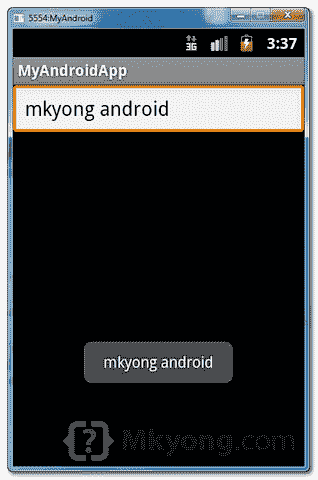
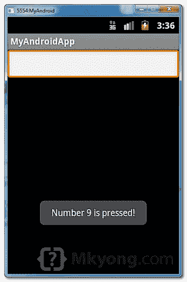

# Android 文本框示例

> 原文：<http://web.archive.org/web/20230101150211/http://www.mkyong.com/android/android-textbox-example/>

在 Android 中，你可以使用" [EditText](http://web.archive.org/web/20220905222753/https://developer.android.com/reference/android/widget/EditText.html) "类来创建一个可编辑的 textbox 来接受用户输入。

这个教程向你展示了如何在 XML 文件中创建一个 textbox，并演示了如何使用 key listener 来显示在 textbox 中输入的消息。

这个项目是在 Eclipse 中开发的，在 Android 2.3.3 中测试过。

## 1\. EditText

打开“ **res/layout/main.xml** 文件，添加一个“ **EditText** 组件。

*文件:res/layout/main.xml*

```java
 <?xml version="1.0" encoding="utf-8"?>
<LinearLayout xmlns:android="http://schemas.android.com/apk/res/android"
    android:layout_width="fill_parent"
    android:layout_height="fill_parent"
    android:orientation="vertical" >

    <EditText
        android:id="@+id/editText"
        android:layout_width="match_parent"
        android:layout_height="wrap_content" >

        <requestFocus />

    </EditText>

</LinearLayout> 
```

## 2.编辑文本监听器

在 activity " `onCreate()`"方法中附加一个关键监听器，以监视以下事件:

1.  如果按下“enter ”,显示一个浮动框，并在“EditText”框中键入消息。
2.  如果按下“数字 9”，显示一个浮动框，并显示消息“数字 9 已按下！”。

*文件:MyAndroidAppActivity.java*

```java
 package com.mkyong.android;

import android.app.Activity;
import android.os.Bundle;
import android.view.KeyEvent;
import android.view.View;
import android.view.View.OnKeyListener;
import android.widget.EditText;
import android.widget.Toast;

public class MyAndroidAppActivity extends Activity {

 private EditText edittext;

 @Override
 public void onCreate(Bundle savedInstanceState) {
	super.onCreate(savedInstanceState);
	setContentView(R.layout.main);

	addKeyListener();
 }

 public void addKeyListener() {

	// get edittext component
	edittext = (EditText) findViewById(R.id.editText);

	// add a keylistener to keep track user input
	edittext.setOnKeyListener(new OnKeyListener() {
	public boolean onKey(View v, int keyCode, KeyEvent event) {

		// if keydown and "enter" is pressed
		if ((event.getAction() == KeyEvent.ACTION_DOWN)
			&& (keyCode == KeyEvent.KEYCODE_ENTER)) {

			// display a floating message
			Toast.makeText(MyAndroidAppActivity.this,
				edittext.getText(), Toast.LENGTH_LONG).show();
			return true;

		} else if ((event.getAction() == KeyEvent.ACTION_DOWN)
			&& (keyCode == KeyEvent.KEYCODE_9)) {

			// display a floating message
			Toast.makeText(MyAndroidAppActivity.this,
				"Number 9 is pressed!", Toast.LENGTH_LONG).show();
			return true;
		}

		return false;
	}
 });
}
} 
```

## 3.演示

运行应用程序。

1.在文本框中键入一些内容，然后按“enter”键:



2.如果按下“数字 9”键:



## 下载源代码

Download it – [Android-EditText-Example.zip](http://web.archive.org/web/20220905222753/http://www.mkyong.com/wp-content/uploads/2011/11/Android-EditText-Example.zip) (15 KB)

## 参考

1.  [Android EditText JavaDoc](http://web.archive.org/web/20220905222753/https://developer.android.com/reference/android/widget/EditText.html)
2.  [Android EditText 示例](http://web.archive.org/web/20220905222753/https://developer.android.com/resources/tutorials/views/hello-formstuff.html#EditText)

<input type="hidden" id="mkyong-current-postId" value="10188">