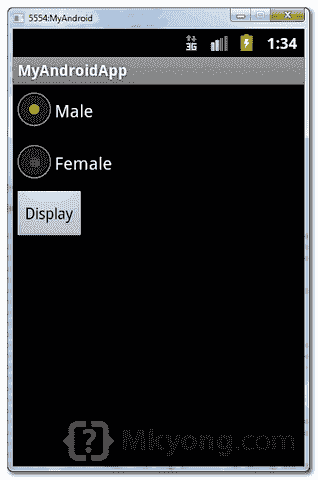
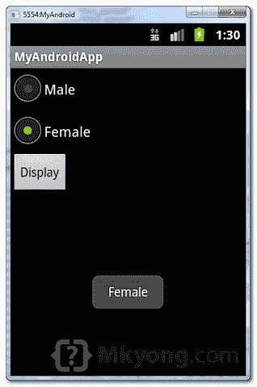

# Android 单选按钮示例

> 原文：<http://web.archive.org/web/20230101150211/http://www.mkyong.com/android/android-radio-buttons-example/>

在 Android 中，可以使用“[Android . widget . radio button](http://web.archive.org/web/20200615071623/http://developer.android.com/reference/android/widget/RadioButton.html)类来渲染单选按钮，而那些单选按钮通常是由[Android . widget . radio group](http://web.archive.org/web/20200615071623/http://developer.android.com/reference/android/widget/RadioGroup.html)分组的。如果`RadioButtons`在组中，当一个组中的一个`RadioButton`被选中时，所有其他的都被自动取消选中。

在本教程中，我们将向您展示如何使用 XML 创建两个单选按钮，并分组到一个单选按钮组中。单击按钮时，显示选中的单选按钮。

*P.S 这个项目是在 Eclipse 3.7 中开发的，用 Android 2.3.3 测试过。*

## 1.自定义字符串

打开" **res/values/strings.xml** "文件，为单选按钮添加一些自定义字符串。

*文件:res/values/strings.xml*

```
 <?xml version="1.0" encoding="utf-8"?>
<resources>
    <string name="hello">Hello World, MyAndroidAppActivity!</string>
    <string name="app_name">MyAndroidApp</string>
    <string name="radio_male">Male</string>
    <string name="radio_female">Female</string>
    <string name="btn_display">Display</string>
</resources> 
```

## 2.单选按钮

打开“ **res/layout/main.xml** 文件，在`LinearLayout`里面添加“ **RadioGroup** ”、“ **RadioButton** 和一个按钮。

*文件:res/layout/main.xml*

```
 <?xml version="1.0" encoding="utf-8"?>
<LinearLayout xmlns:android="http://schemas.android.com/apk/res/android"
    android:layout_width="fill_parent"
    android:layout_height="fill_parent"
    android:orientation="vertical" >

    <RadioGroup
        android:id="@+id/radioSex"
        android:layout_width="wrap_content"
        android:layout_height="wrap_content" >

        <RadioButton
            android:id="@+id/radioMale"
            android:layout_width="wrap_content"
            android:layout_height="wrap_content"
            android:text="@string/radio_male" 
            android:checked="true" />

        <RadioButton
            android:id="@+id/radioFemale"
            android:layout_width="wrap_content"
            android:layout_height="wrap_content"
            android:text="@string/radio_female" />

    </RadioGroup>

    <Button
        android:id="@+id/btnDisplay"
        android:layout_width="wrap_content"
        android:layout_height="wrap_content"
        android:text="@string/btn_display" />

</LinearLayout> 
```

**Radio button selected by default.**
To make a radio button is selected by default, put `android:checked="true"` within the `RadioButton` element. In this case, radio option “Male” is selected by default.

## 3.代码代码

在 activity " `onCreate()`"方法中，附加一个 click listener on 按钮。

*文件:MyAndroidAppActivity.java*

```
 package com.mkyong.android;

import android.app.Activity;
import android.os.Bundle;
import android.view.View;
import android.view.View.OnClickListener;
import android.widget.Button;
import android.widget.RadioButton;
import android.widget.RadioGroup;
import android.widget.Toast;

public class MyAndroidAppActivity extends Activity {

  private RadioGroup radioSexGroup;
  private RadioButton radioSexButton;
  private Button btnDisplay;

  @Override
  public void onCreate(Bundle savedInstanceState) {
	super.onCreate(savedInstanceState);
	setContentView(R.layout.main);

	addListenerOnButton();

  }

  public void addListenerOnButton() {

	radioSexGroup = (RadioGroup) findViewById(R.id.radioSex);
	btnDisplay = (Button) findViewById(R.id.btnDisplay);

	btnDisplay.setOnClickListener(new OnClickListener() {

		@Override
		public void onClick(View v) {

		        // get selected radio button from radioGroup
			int selectedId = radioSexGroup.getCheckedRadioButtonId();

			// find the radiobutton by returned id
		        radioSexButton = (RadioButton) findViewById(selectedId);

			Toast.makeText(MyAndroidAppActivity.this,
				radioSexButton.getText(), Toast.LENGTH_SHORT).show();

		}

	});

  }
} 
```

## 4.演示

运行应用程序。

1.结果，选择了单选选项“男性”。

<noscript></noscript>


2.选择"女性"并点击"显示"按钮，所选择的单选按钮值被显示。

<noscript></noscript>


## 下载源代码

Download it – [Android-RadioButton-Example.zip](http://web.archive.org/web/20200615071623/http://www.mkyong.com/wp-content/uploads/2011/11/Android-RadioButton-Example.zip) (15 KB)

## 参考

1.  [Android RadioGroup JavaDoc](http://web.archive.org/web/20200615071623/http://developer.android.com/reference/android/widget/RadioGroup.html)
2.  [安卓单选按钮 JavaDoc](http://web.archive.org/web/20200615071623/http://developer.android.com/reference/android/widget/RadioButton.html)
3.  [Android RadioGroup 示例](http://web.archive.org/web/20200615071623/http://developer.android.com/resources/samples/ApiDemos/src/com/example/android/apis/view/RadioGroup1.html)
4.  [Android 单选按钮示例](http://web.archive.org/web/20200615071623/http://developer.android.com/resources/tutorials/views/hello-formstuff.html#RadioButtons)

Tags : [android](http://web.archive.org/web/20200615071623/https://mkyong.com/tag/android/) [radio button](http://web.archive.org/web/20200615071623/https://mkyong.com/tag/radio-button/)<input type="hidden" id="mkyong-current-postId" value="10213">