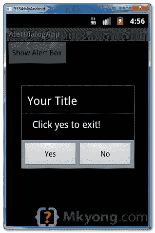

# Android 警告对话框示例

> 原文：<http://web.archive.org/web/20230101150211/http://www.mkyong.com/android/android-alert-dialog-example/>

在本教程中，我们将向您展示如何在 Android 中显示一个警告框。参见流程步骤:

1.  首先，使用`AlertDialog.Builder`创建警告框界面，如标题、要显示的消息、按钮和按钮 onclick 功能
2.  稍后将上述生成器附加到`AlertDialog`并显示。
3.  完成了。

*P.S 这个项目是在 Eclipse 3.7 中开发的，用 Android 2.3.3 测试过。*

## 1 个 Android 布局文件

简单布局文件，在屏幕上显示一个按钮。

文件:res/layout/main.xml

```
 <?xml version="1.0" encoding="utf-8"?>
<LinearLayout xmlns:android="http://schemas.android.com/apk/res/android"
    android:layout_width="fill_parent"
    android:layout_height="fill_parent"
    android:orientation="vertical" >

    <Button
        android:id="@+id/buttonAlert"
        android:layout_width="wrap_content"
        android:layout_height="wrap_content"
        android:text="Show Alert Box" />

</LinearLayout> 
```

## 2.活动

当用户点击此按钮时，显示警告框，带有您预先定义的警告对话框界面。

*文件:MainActivity.java*

```
 package com.mkyong.android;

import android.app.Activity;
import android.app.AlertDialog;
import android.content.Context;
import android.content.DialogInterface;
import android.os.Bundle;
import android.view.View;
import android.view.View.OnClickListener;
import android.widget.Button;

public class MainActivity extends Activity {

	final Context context = this;
	private Button button;

	public void onCreate(Bundle savedInstanceState) {

		super.onCreate(savedInstanceState);
		setContentView(R.layout.main);

		button = (Button) findViewById(R.id.buttonAlert);

		// add button listener
		button.setOnClickListener(new OnClickListener() {

		@Override
		public void onClick(View arg0) {

			AlertDialog.Builder alertDialogBuilder = new AlertDialog.Builder(
				context);

			// set title
			alertDialogBuilder.setTitle("Your Title");

			// set dialog message
			alertDialogBuilder
				.setMessage("Click yes to exit!")
				.setCancelable(false)
				.setPositiveButton("Yes",new DialogInterface.OnClickListener() {
					public void onClick(DialogInterface dialog,int id) {
						// if this button is clicked, close
						// current activity
						MainActivity.this.finish();
					}
				  })
				.setNegativeButton("No",new DialogInterface.OnClickListener() {
					public void onClick(DialogInterface dialog,int id) {
						// if this button is clicked, just close
						// the dialog box and do nothing
						dialog.cancel();
					}
				});

				// create alert dialog
				AlertDialog alertDialog = alertDialogBuilder.create();

				// show it
				alertDialog.show();
			}
		});
	}
} 
```

## 3.演示

启动它，显示一个按钮。


单击按钮时，显示警告框



如果点击“是”按钮，关闭活动并返回到您的 Android 主屏幕。


## 下载源代码

Download it – [Android-Alert-Dialogl-Example.zip](http://web.archive.org/web/20220629075039/http://www.mkyong.com/wp-content/uploads/2012/03/Android-Alert-Dialogl-Example.zip) (16 KB)

## 参考

1.  [Android alert dialog Javadoc](http://web.archive.org/web/20220629075039/https://developer.android.com/reference/android/app/AlertDialog.html)
2.  [安卓对话框示例](http://web.archive.org/web/20220629075039/https://developer.android.com/guide/topics/ui/dialogs.html)

<input type="hidden" id="mkyong-current-postId" value="10618">