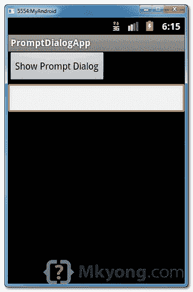

# Android 提示用户输入对话框示例

> 原文：<http://web.archive.org/web/20230101150211/http://www.mkyong.com/android/android-prompt-user-input-dialog-example/>

在本教程中，我们将增强前面的 [`AlertDialog`](http://web.archive.org/web/20220629075036/http://www.mkyong.com/android/android-alert-dialog-example/) 示例，使其能够接受用户输入，就像一个**提示对话框**。更具体地说，这是一个自定义的`AlertDialog`示例。

请参见以下步骤:

1.  创建提示对话框布局(XML 文件)。
2.  将提示对话框布局附加到`AlertDialog.Builder`。
3.  将`AlertDialog.Builder`连接到`AlertDialog`上。
4.  完成了。

*P.S 这个项目是在 Eclipse 3.7 中开发的，用 Android 2.3.3 测试过。*

**Note**
You may interest to read this [custom dialog example](http://web.archive.org/web/20220629075036/http://www.mkyong.com/android/android-custom-dialog-example/).

## 1 个 Android 布局文件

两个 XML 文件，一个用于主屏幕，一个用于提示对话框。

*文件:res/layout/main.xml*

```
 <?xml version="1.0" encoding="utf-8"?>
<LinearLayout xmlns:android="http://schemas.android.com/apk/res/android"
    android:layout_width="fill_parent"
    android:layout_height="fill_parent"
    android:orientation="vertical" >

    <Button
        android:id="@+id/buttonPrompt"
        android:layout_width="wrap_content"
        android:layout_height="wrap_content"
        android:text="Show Prompt Dialog" />

    <EditText
        android:id="@+id/editTextResult"
        android:layout_width="match_parent"
        android:layout_height="wrap_content" >

    </EditText>

</LinearLayout> 
```

*文件:res/layout/prompts.xml*

```
 <?xml version="1.0" encoding="utf-8"?>
<LinearLayout xmlns:android="http://schemas.android.com/apk/res/android"
    android:id="@+id/layout_root"
    android:layout_width="fill_parent"
    android:layout_height="fill_parent"
    android:orientation="vertical"
    android:padding="10dp" >

    <TextView
        android:id="@+id/textView1"
        android:layout_width="wrap_content"
        android:layout_height="wrap_content"
        android:text="Type Your Message : "
        android:textAppearance="?android:attr/textAppearanceLarge" />

    <EditText
        android:id="@+id/editTextDialogUserInput"
        android:layout_width="match_parent"
        android:layout_height="wrap_content" >

        <requestFocus />

    </EditText>

</LinearLayout> 
```

## 2.活动

阅读下一步的评论和演示，这应该是自我探索。

*文件:MainActivity.java*

```
 package com.mkyong.android;

import android.app.Activity;
import android.app.AlertDialog;
import android.content.Context;
import android.content.DialogInterface;
import android.os.Bundle;
import android.view.LayoutInflater;
import android.view.View;
import android.view.View.OnClickListener;
import android.widget.Button;
import android.widget.EditText;

public class MainActivity extends Activity {

	final Context context = this;
	private Button button;
	private EditText result;

	public void onCreate(Bundle savedInstanceState) {

		super.onCreate(savedInstanceState);
		setContentView(R.layout.main);

		// components from main.xml
		button = (Button) findViewById(R.id.buttonPrompt);
		result = (EditText) findViewById(R.id.editTextResult);

		// add button listener
		button.setOnClickListener(new OnClickListener() {

			@Override
			public void onClick(View arg0) {

				// get prompts.xml view
				LayoutInflater li = LayoutInflater.from(context);
				View promptsView = li.inflate(R.layout.prompts, null);

				AlertDialog.Builder alertDialogBuilder = new AlertDialog.Builder(
						context);

				// set prompts.xml to alertdialog builder
				alertDialogBuilder.setView(promptsView);

				final EditText userInput = (EditText) promptsView
						.findViewById(R.id.editTextDialogUserInput);

				// set dialog message
				alertDialogBuilder
					.setCancelable(false)
					.setPositiveButton("OK",
					  new DialogInterface.OnClickListener() {
					    public void onClick(DialogInterface dialog,int id) {
						// get user input and set it to result
						// edit text
						result.setText(userInput.getText());
					    }
					  })
					.setNegativeButton("Cancel",
					  new DialogInterface.OnClickListener() {
					    public void onClick(DialogInterface dialog,int id) {
						dialog.cancel();
					    }
					  });

				// create alert dialog
				AlertDialog alertDialog = alertDialogBuilder.create();

				// show it
				alertDialog.show();

			}
		});
	}
} 
```

## 3.演示

启动它，“`main.xml`”布局显示一个按钮和 edittext(结果)。



点击按钮，显示提示对话框“`prompts.xml`”布局，键入消息“ **mkyong** ”，并点击“确定”按钮。


用户输入“ *mkyong* ”将传递到“`main.xml`”布局，编辑文本(结果)，并显示它。


## 下载源代码

Download it – [Android-Prompt-Dialog-Example.zip](http://web.archive.org/web/20220629075036/http://www.mkyong.com/wp-content/uploads/2012/03/Android-Prompt-Dialog-Example.zip) (16 KB)

## 参考

1.  [Android alert dialog Javadoc](http://web.archive.org/web/20220629075036/https://developer.android.com/reference/android/app/AlertDialog.html)
2.  [安卓对话框示例](http://web.archive.org/web/20220629075036/https://developer.android.com/guide/topics/ui/dialogs.html)
3.  [Android 自定义对话框示例](http://web.archive.org/web/20220629075036/http://www.mkyong.com/android/android-custom-dialog-example/)

<input type="hidden" id="mkyong-current-postId" value="10627">