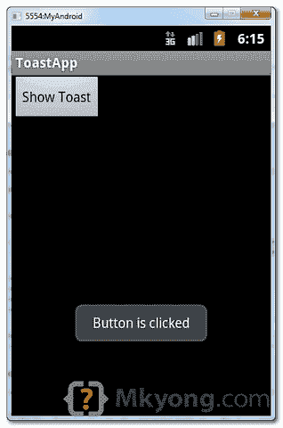
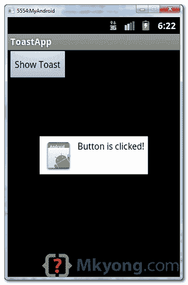

# Android 吐司示例

> 原文：<http://web.archive.org/web/20230101150211/http://www.mkyong.com/android/android-toast-example/>

在 Android 中，`Toast`是一个弹出通知消息，显示一定的时间，并自动淡入淡出，大多数人只是用它来调试。

创建`Toast`消息的代码片段:

```
 //display in short period of time
Toast.makeText(getApplicationContext(), "msg msg", Toast.LENGTH_SHORT).show();

//display in long period of time
Toast.makeText(getApplicationContext(), "msg msg", Toast.LENGTH_LONG).show(); 
```

在本教程中，我们将向您展示两个`Toast`示例:

1.  普通吐司视图。
2.  自定义吐司视图。

*P.S 这个项目是在 Eclipse 3.7 中开发的，用 Android 2.3.3 测试过。*

## 1.普通吐司视图

简单的`Toast`例子。

*文件:res/layout/main.xml*

```
 <?xml version="1.0" encoding="utf-8"?>
<LinearLayout xmlns:android="http://schemas.android.com/apk/res/android"
    android:layout_width="fill_parent"
    android:layout_height="fill_parent"
    android:orientation="vertical" >

    <Button
        android:id="@+id/buttonToast"
        android:layout_width="wrap_content"
        android:layout_height="wrap_content"
        android:text="Show Toast" />

</LinearLayout> 
```

*文件:MainActivity.java*

```
 package com.mkyong.android;

import android.app.Activity;
import android.os.Bundle;
import android.view.View;
import android.view.View.OnClickListener;
import android.widget.Button;
import android.widget.Toast;

public class MainActivity extends Activity {

	private Button button;

	public void onCreate(Bundle savedInstanceState) {

		super.onCreate(savedInstanceState);
		setContentView(R.layout.main);

		button = (Button) findViewById(R.id.buttonToast);

		button.setOnClickListener(new OnClickListener() {

			  @Override
			  public void onClick(View arg0) {

			     Toast.makeText(getApplicationContext(), 
                               "Button is clicked", Toast.LENGTH_LONG).show();

			  }
		});
	}
} 
```

看到演示，当一个按钮被点击，显示一个正常的祝酒辞信息。



## 2.自定义吐司视图

通过自定义原来的`Toast`视图来增强上面的例子。

*File:RES/layout/custom _ toast . XML*–这是自定义 Toast 视图。

```
 <?xml version="1.0" encoding="utf-8"?>
<LinearLayout xmlns:android="http://schemas.android.com/apk/res/android"
    android:id="@+id/custom_toast_layout_id"
    android:layout_width="fill_parent"
    android:layout_height="fill_parent"
    android:background="#FFF"
    android:orientation="horizontal"
    android:padding="5dp" >

    <ImageView
        android:id="@+id/image"
        android:layout_width="wrap_content"
        android:layout_height="fill_parent"
        android:layout_marginRight="5dp" />

    <TextView
        android:id="@+id/text"
        android:layout_width="wrap_content"
        android:layout_height="fill_parent"
        android:textColor="#000" />

</LinearLayout> 
```

*文件:MainActivity.java*–读取注释，获取上面的自定义视图并附加到`Toast`。

```
 package com.mkyong.android;

import android.app.Activity;
import android.os.Bundle;
import android.view.Gravity;
import android.view.LayoutInflater;
import android.view.View;
import android.view.View.OnClickListener;
import android.view.ViewGroup;
import android.widget.Button;
import android.widget.ImageView;
import android.widget.TextView;
import android.widget.Toast;

public class MainActivity extends Activity {

	private Button button;

	public void onCreate(Bundle savedInstanceState) {

		super.onCreate(savedInstanceState);
		setContentView(R.layout.main);

		button = (Button) findViewById(R.id.buttonToast);

		button.setOnClickListener(new OnClickListener() {

			@Override
			public void onClick(View arg0) {

				// get your custom_toast.xml ayout
				LayoutInflater inflater = getLayoutInflater();

				View layout = inflater.inflate(R.layout.custom_toast,
				  (ViewGroup) findViewById(R.id.custom_toast_layout_id));

				// set a dummy image
				ImageView image = (ImageView) layout.findViewById(R.id.image);
				image.setImageResource(R.drawable.ic_launcher);

				// set a message
				TextView text = (TextView) layout.findViewById(R.id.text);
				text.setText("Button is clicked!");

				// Toast...
				Toast toast = new Toast(getApplicationContext());
				toast.setGravity(Gravity.CENTER_VERTICAL, 0, 0);
				toast.setDuration(Toast.LENGTH_LONG);
				toast.setView(layout);
				toast.show();
			}
		});
	}
} 
```

参见演示，当一个按钮被点击时，显示自定义的 Toast 消息。



## 下载源代码

Download it – [Android-Toast-Example.zip](http://web.archive.org/web/20221028122535/http://www.mkyong.com/wp-content/uploads/2012/03/Android-Toast-Example.zip) (16 KB)

## 参考

1.  [安卓吐司示例](http://web.archive.org/web/20221028122535/https://developer.android.com/guide/topics/ui/notifiers/toasts.html)
2.  [Android Toast JavaDoc](http://web.archive.org/web/20221028122535/https://developer.android.com/reference/android/widget/Toast.html)

<input type="hidden" id="mkyong-current-postId" value="10650">