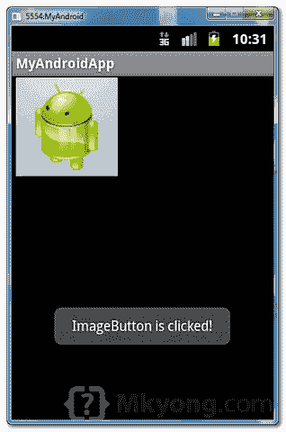

> 原文：<http://web.archive.org/web/20230101150211/http://www.mkyong.com/android/android-imagebutton-example/>

# Android ImageButton 示例

在 Android 中，您可以使用“[Android . widget . imagebutton](http://web.archive.org/web/20190215000650/http://developer.android.com/reference/android/widget/ImageButton.html)”来显示一个普通的“`Button`”，并带有自定义的背景图像。

在本教程中，我们将向您展示如何显示一个带有背景图片的按钮，名为“ **android_button.png** ”，当用户点击它时，会显示一条短消息。就这么简单。

**Note**
You may also like this [Android ImageButton selector example](http://web.archive.org/web/20190215000650/http://www.mkyong.com/android/android-imagebutton-selector-example/), which allow to change button’s images depends on button states.

*P.S 这个项目是在 Eclipse 3.7 中开发的，用 Android 2.3.3 测试过。*

## 1.将图像添加到资源

将 image "**Android _ button . png**"放入" *res/drawable-？dpi* 文件夹。以便 Android 知道在哪里可以找到您图像。

 <ins class="adsbygoogle" style="display:block; text-align:center;" data-ad-format="fluid" data-ad-layout="in-article" data-ad-client="ca-pub-2836379775501347" data-ad-slot="6894224149">## 2.添加 ImageButton

打开“ **res/layout/main.xml** 文件，添加一个“`ImageButton`标签，通过“`android:src`定义背景图片。

*文件:res/layout/main.xml*

```java
 <?xml version="1.0" encoding="utf-8"?>
<LinearLayout xmlns:android="http://schemas.android.com/apk/res/android"
    android:layout_width="fill_parent"
    android:layout_height="fill_parent"
    android:orientation="vertical" >

    <ImageButton
        android:id="@+id/imageButton1"
        android:layout_width="wrap_content"
        android:layout_height="wrap_content"
        android:src="@drawable/android_button" />

</LinearLayout> 
```

 <ins class="adsbygoogle" style="display:block" data-ad-client="ca-pub-2836379775501347" data-ad-slot="8821506761" data-ad-format="auto" data-ad-region="mkyongregion">## 3.代码代码

下面是代码，在图像按钮上添加一个点击监听器。

*文件:MyAndroidAppActivity.java*

```java
 package com.mkyong.android;

import android.app.Activity;
import android.os.Bundle;
import android.widget.ImageButton;
import android.widget.Toast;
import android.view.View;
import android.view.View.OnClickListener;

public class MyAndroidAppActivity extends Activity {

	ImageButton imageButton;

	@Override
	public void onCreate(Bundle savedInstanceState) {
		super.onCreate(savedInstanceState);
		setContentView(R.layout.main);

		addListenerOnButton();

	}

	public void addListenerOnButton() {

		imageButton = (ImageButton) findViewById(R.id.imageButton1);

		imageButton.setOnClickListener(new OnClickListener() {

			@Override
			public void onClick(View arg0) {

			   Toast.makeText(MyAndroidAppActivity.this,
				"ImageButton is clicked!", Toast.LENGTH_SHORT).show();

			}

		});

	}

} 
```

## 4.演示

运行应用程序。

1.结果，带有自定义背景图像的按钮。


2.点击按钮，显示一条短消息。



## 下载源代码

Download it – [Android-ImageButton-Example.zip](http://web.archive.org/web/20190215000650/http://www.mkyong.com/wp-content/uploads/2011/12/Android-ImageButton-Example.zip) (28 KB)

## 参考

1.  [Android ImageButton 示例](http://web.archive.org/web/20190215000650/http://developer.android.com/reference/android/widget/ImageButton.html)

[android](http://web.archive.org/web/20190215000650/http://www.mkyong.com/tag/android/) [imagebutton](http://web.archive.org/web/20190215000650/http://www.mkyong.com/tag/imagebutton/)


