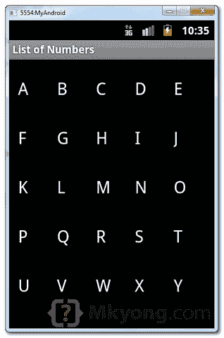
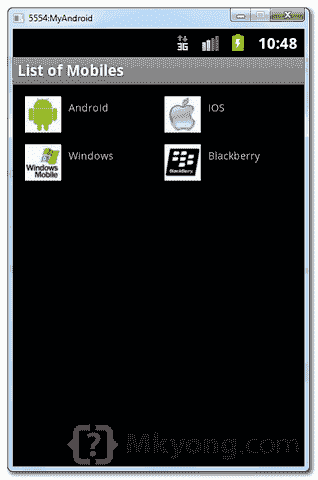

# Android GridView 示例

> 原文：<http://web.archive.org/web/20230101150211/http://www.mkyong.com/android/android-gridview-example/>

在 Android 中，`GridView`让你在二维滚动网格中排列组件。有关详细的属性解释，请参见 [GridView](http://web.archive.org/web/20220118195605/https://developer.android.com/reference/android/widget/GridView.html) 参考。

在本教程中，我们将向您展示两个常见的`GridView`示例:

1.  正常方式，只是在`GridView`布局中显示文本。
2.  创建自定义适配器以在`GridView`布局中显示图像和文本。

*P.S 这个项目是在 Eclipse 3.7 中开发的，用 Android 2.3.3 测试过。*

## 1.普通 GridView 示例

在`GridView`布局中显示从 A 到 Z 的字符。很简单，应该是不言自明的。

*1.1 Android 布局文件–RES/Layout/main . XML*

```java
 <?xml version="1.0" encoding="utf-8"?>
<GridView xmlns:android="http://schemas.android.com/apk/res/android"
    android:id="@+id/gridView1"
    android:numColumns="auto_fit"
    android:gravity="center"
    android:columnWidth="50dp"
    android:stretchMode="columnWidth"
    android:layout_width="fill_parent"
    android:layout_height="fill_parent" >

</GridView> 
```

*1.2 活动*

```java
 package com.mkyong.android;

import android.app.Activity;
import android.os.Bundle;
import android.widget.AdapterView;
import android.widget.ArrayAdapter;
import android.widget.GridView;
import android.widget.TextView;
import android.widget.Toast;
import android.view.View;
import android.widget.AdapterView.OnItemClickListener;

public class GridViewActivity extends Activity {

	GridView gridView;

	static final String[] numbers = new String[] { 
			"A", "B", "C", "D", "E",
			"F", "G", "H", "I", "J",
			"K", "L", "M", "N", "O",
			"P", "Q", "R", "S", "T",
			"U", "V", "W", "X", "Y", "Z"};

	@Override
	public void onCreate(Bundle savedInstanceState) {
		super.onCreate(savedInstanceState);

		setContentView(R.layout.main);

		gridView = (GridView) findViewById(R.id.gridView1);

		ArrayAdapter<String> adapter = new ArrayAdapter<String>(this,
				android.R.layout.simple_list_item_1, numbers);

		gridView.setAdapter(adapter);

		gridView.setOnItemClickListener(new OnItemClickListener() {
			public void onItemClick(AdapterView<?> parent, View v,
				int position, long id) {
			   Toast.makeText(getApplicationContext(),
				((TextView) v).getText(), Toast.LENGTH_SHORT).show();
			}
		});

	}

} 
```

*1.3 演示*



## 2.自定义适配器示例

在这个例子中，扩展一个`BaseAdapter`以在`GridView`布局中显示一组图像和文本。

*2.1 两个 Android 布局文件*

*File–RES/layout/main . XML*

```java
 <?xml version="1.0" encoding="utf-8"?>
<GridView xmlns:android="http://schemas.android.com/apk/res/android"
    android:id="@+id/gridView1"
    android:numColumns="auto_fit"
    android:gravity="center"
    android:columnWidth="100dp"
    android:stretchMode="columnWidth"
    android:layout_width="fill_parent"
    android:layout_height="fill_parent" >

</GridView> 
```

*File–RES/layout/mobile . XML*

```java
 <?xml version="1.0" encoding="utf-8"?>
<LinearLayout xmlns:android="http://schemas.android.com/apk/res/android"
    android:layout_width="wrap_content"
    android:layout_height="wrap_content"
    android:padding="5dp" >

    <ImageView
        android:id="@+id/grid_item_image"
        android:layout_width="50px"
        android:layout_height="50px"
        android:layout_marginRight="10px"
        android:src="@drawable/android_logo" >
    </ImageView>

    <TextView
        android:id="@+id/grid_item_label"
        android:layout_width="wrap_content"
        android:layout_height="wrap_content"
        android:text="@+id/label"
        android:layout_marginTop="5px"
        android:textSize="15px" >
    </TextView>

</LinearLayout> 
```

*2.2 定制适配器*

```java
 package com.mkyong.android.adapter;

import android.content.Context;
import android.view.LayoutInflater;
import android.view.View;
import android.view.ViewGroup;
import android.widget.BaseAdapter;
import android.widget.ImageView;
import android.widget.TextView;

import com.mkyong.android.R;

public class ImageAdapter extends BaseAdapter {
	private Context context;
	private final String[] mobileValues;

	public ImageAdapter(Context context, String[] mobileValues) {
		this.context = context;
		this.mobileValues = mobileValues;
	}

	public View getView(int position, View convertView, ViewGroup parent) {

		LayoutInflater inflater = (LayoutInflater) context
			.getSystemService(Context.LAYOUT_INFLATER_SERVICE);

		View gridView;

		if (convertView == null) {

			gridView = new View(context);

			// get layout from mobile.xml
			gridView = inflater.inflate(R.layout.mobile, null);

			// set value into textview
			TextView textView = (TextView) gridView
					.findViewById(R.id.grid_item_label);
			textView.setText(mobileValues[position]);

			// set image based on selected text
			ImageView imageView = (ImageView) gridView
					.findViewById(R.id.grid_item_image);

			String mobile = mobileValues[position];

			if (mobile.equals("Windows")) {
				imageView.setImageResource(R.drawable.windows_logo);
			} else if (mobile.equals("iOS")) {
				imageView.setImageResource(R.drawable.ios_logo);
			} else if (mobile.equals("Blackberry")) {
				imageView.setImageResource(R.drawable.blackberry_logo);
			} else {
				imageView.setImageResource(R.drawable.android_logo);
			}

		} else {
			gridView = (View) convertView;
		}

		return gridView;
	}

	@Override
	public int getCount() {
		return mobileValues.length;
	}

	@Override
	public Object getItem(int position) {
		return null;
	}

	@Override
	public long getItemId(int position) {
		return 0;
	}

} 
```

*2.3 活动*

```java
 package com.mkyong.android;

import com.mkyong.android.adapter.ImageAdapter;
import android.app.Activity;
import android.os.Bundle;
import android.widget.AdapterView;
import android.widget.GridView;
import android.widget.TextView;
import android.widget.Toast;
import android.view.View;
import android.widget.AdapterView.OnItemClickListener;

public class GridViewActivity extends Activity {

	GridView gridView;

	static final String[] MOBILE_OS = new String[] { 
		"Android", "iOS","Windows", "Blackberry" };

	@Override
	public void onCreate(Bundle savedInstanceState) {

		super.onCreate(savedInstanceState);
		setContentView(R.layout.main);

		gridView = (GridView) findViewById(R.id.gridView1);

		gridView.setAdapter(new ImageAdapter(this, MOBILE_OS));

		gridView.setOnItemClickListener(new OnItemClickListener() {
			public void onItemClick(AdapterView<?> parent, View v,
					int position, long id) {
				Toast.makeText(
				   getApplicationContext(),
				   ((TextView) v.findViewById(R.id.grid_item_label))
				   .getText(), Toast.LENGTH_SHORT).show();

			}
		});

	}

} 
```

2.4 演示



## 下载源代码

Download it – [Android-GridView-Example.zip](http://web.archive.org/web/20220118195605/http://www.mkyong.com/wp-content/uploads/2012/02/Android-GridView-Example.zip) (21 KB)

## 参考

1.  [GridView Javadoc](http://web.archive.org/web/20220118195605/https://developer.android.com/reference/android/widget/GridView.html)
2.  [Android GridView 示例](http://web.archive.org/web/20220118195605/https://developer.android.com/resources/tutorials/views/hello-gridview.html)
3.  [Android ListView 示例](http://web.archive.org/web/20220118195605/http://www.mkyong.com/android/android-listview-example/)

<input type="hidden" id="mkyong-current-postId" value="10545">