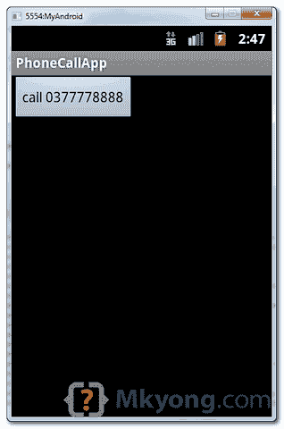
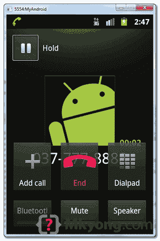

> 原文：<http://web.archive.org/web/20230101150211/http://www.mkyong.com/android/how-to-make-a-phone-call-in-android/>

# 如何用安卓打电话

在本教程中，我们将向您展示如何在 Android 中拨打电话，并通过`PhoneStateListener`监控电话通话状态。

*P.S 这个项目是在 Eclipse 3.7 中开发的，用 Android 2.3.3 测试过。*

## 1 个 Android 布局文件

Simpel 布局文件，显示一个按钮。

*文件:res/layout/main.xml*

```java
 <?xml version="1.0" encoding="utf-8"?>
<LinearLayout xmlns:android="http://schemas.android.com/apk/res/android"
    android:layout_width="fill_parent"
    android:layout_height="fill_parent"
    android:orientation="vertical" >

    <Button
        android:id="@+id/buttonCall"
        android:layout_width="wrap_content"
        android:layout_height="wrap_content"
        android:text="call 0377778888" />

</LinearLayout> 
```

 <ins class="adsbygoogle" style="display:block; text-align:center;" data-ad-format="fluid" data-ad-layout="in-article" data-ad-client="ca-pub-2836379775501347" data-ad-slot="6894224149">## 2.活动

使用下面的代码片段在 Android 中打电话。

```java
 Intent callIntent = new Intent(Intent.ACTION_CALL);
	callIntent.setData(Uri.parse("tel:0377778888"));
	startActivity(callIntent); 
```

*档:MainActivity.java*——当按钮为通话时，拨打 0377778888。

```java
 package com.mkyong.android;

import android.app.Activity;
import android.content.Intent;
import android.net.Uri;
import android.os.Bundle;
import android.view.View;
import android.view.View.OnClickListener;
import android.widget.Button;

public class MainActivity extends Activity {

	private Button button;

	public void onCreate(Bundle savedInstanceState) {

		super.onCreate(savedInstanceState);
		setContentView(R.layout.main);

		button = (Button) findViewById(R.id.buttonCall);

		// add button listener
		button.setOnClickListener(new OnClickListener() {

			@Override
			public void onClick(View arg0) {

				Intent callIntent = new Intent(Intent.ACTION_CALL);
				callIntent.setData(Uri.parse("tel:0377778888"));
				startActivity(callIntent);

			}

		});

	}

} 
```

 <ins class="adsbygoogle" style="display:block" data-ad-client="ca-pub-2836379775501347" data-ad-slot="8821506761" data-ad-format="auto" data-ad-region="mkyongregion">## 3 Android 清单

要打电话，Android 需要 **CALL_PHONE** 权限。

```java
 <uses-permission android:name="android.permission.CALL_PHONE" /> 
```

*文件:AndroidManifest.xml*

```java
 <?xml version="1.0" encoding="utf-8"?>
<manifest xmlns:android="http://schemas.android.com/apk/res/android"
    package="com.mkyong.android"
    android:versionCode="1"
    android:versionName="1.0" >

    <uses-sdk android:minSdkVersion="10" />

	<uses-permission android:name="android.permission.CALL_PHONE" />

    <application
        android:icon="@drawable/ic_launcher"
        android:label="@string/app_name" >

        <activity
            android:label="@string/app_name"
            android:name=".MainActivity" >
            <intent-filter >
                <action android:name="android.intent.action.MAIN" />
                <category android:name="android.intent.category.LAUNCHER" />
            </intent-filter>
        </activity>
    </application>

</manifest> 
```

## 4.PhoneStateListener 示例

好了，现在我们更新上面的活动，来监视电话呼叫状态，当一个电话呼叫结束时，回到原来的活动(实际上，它只是重新开始活动)。看评论，应该不言自明。

**Note**
Run it and refer to the logcat console to understand how `PhoneStateListener` works.

*文件:MainActivity.java*

```java
 package com.mkyong.android;

import android.app.Activity;
import android.content.Context;
import android.content.Intent;
import android.net.Uri;
import android.os.Bundle;
import android.telephony.PhoneStateListener;
import android.telephony.TelephonyManager;
import android.util.Log;
import android.view.View;
import android.view.View.OnClickListener;
import android.widget.Button;

public class MainActivity extends Activity {

	final Context context = this;
	private Button button;

	public void onCreate(Bundle savedInstanceState) {

		super.onCreate(savedInstanceState);
		setContentView(R.layout.main);

		button = (Button) findViewById(R.id.buttonCall);

		// add PhoneStateListener
		PhoneCallListener phoneListener = new PhoneCallListener();
		TelephonyManager telephonyManager = (TelephonyManager) this
			.getSystemService(Context.TELEPHONY_SERVICE);
		telephonyManager.listen(phoneListener,PhoneStateListener.LISTEN_CALL_STATE);

		// add button listener
		button.setOnClickListener(new OnClickListener() {

			@Override
			public void onClick(View arg0) {

				Intent callIntent = new Intent(Intent.ACTION_CALL);
				callIntent.setData(Uri.parse("tel:0377778888"));
				startActivity(callIntent);

			}

		});

	}

	//monitor phone call activities
	private class PhoneCallListener extends PhoneStateListener {

		private boolean isPhoneCalling = false;

		String LOG_TAG = "LOGGING 123";

		@Override
		public void onCallStateChanged(int state, String incomingNumber) {

			if (TelephonyManager.CALL_STATE_RINGING == state) {
				// phone ringing
				Log.i(LOG_TAG, "RINGING, number: " + incomingNumber);
			}

			if (TelephonyManager.CALL_STATE_OFFHOOK == state) {
				// active
				Log.i(LOG_TAG, "OFFHOOK");

				isPhoneCalling = true;
			}

			if (TelephonyManager.CALL_STATE_IDLE == state) {
				// run when class initial and phone call ended, 
				// need detect flag from CALL_STATE_OFFHOOK
				Log.i(LOG_TAG, "IDLE");

				if (isPhoneCalling) {

					Log.i(LOG_TAG, "restart app");

					// restart app
					Intent i = getBaseContext().getPackageManager()
						.getLaunchIntentForPackage(
							getBaseContext().getPackageName());
					i.addFlags(Intent.FLAG_ACTIVITY_CLEAR_TOP);
					startActivity(i);

					isPhoneCalling = false;
				}

			}
		}
	}

} 
```

再次更新 Android 清单文件，`PhoneStateListener`需要 **READ_PHONE_STATE** 权限。

```java
 <uses-permission android:name="android.permission.READ_PHONE_STATE" /> 
```

*文件:AndroidManifest.xml*

```java
 <?xml version="1.0" encoding="utf-8"?>
<manifest xmlns:android="http://schemas.android.com/apk/res/android"
    package="com.mkyong.android"
    android:versionCode="1"
    android:versionName="1.0" >

    <uses-sdk android:minSdkVersion="10" />

    <uses-permission android:name="android.permission.CALL_PHONE" />
    <uses-permission android:name="android.permission.READ_PHONE_STATE" />

    <application
        android:icon="@drawable/ic_launcher"
        android:label="@string/app_name" >

        <activity
            android:label="@string/app_name"
            android:name=".MainActivity" >
            <intent-filter >
                <action android:name="android.intent.action.MAIN" />
                <category android:name="android.intent.category.LAUNCHER" />
            </intent-filter>
        </activity>
    </application>

</manifest> 
```

## 5.演示

活动开始后，只显示一个按钮。



点击按钮后，拨打电话 0377778888。



当电话挂断或结束时，重新开始主要活动。


## 下载源代码

Download it – [Android-Make-Phone-Call-Example.zip](http://web.archive.org/web/20190301211214/http://www.mkyong.com/wp-content/uploads/2012/03/Android-Make-Phone-Call-Example.zip) (16 KB)

## 参考

1.  [Android PhoneStateListener Javadoc](http://web.archive.org/web/20190301211214/http://developer.android.com/reference/android/telephony/PhoneStateListener.html)
2.  [安卓手机管理器 Javadoc](http://web.archive.org/web/20190301211214/http://developer.android.com/reference/android/telephony/TelephonyManager.html)
3.  [Android Intent Javadoc](http://web.archive.org/web/20190301211214/http://developer.android.com/reference/android/content/Intent.html)

[android](http://web.archive.org/web/20190301211214/http://www.mkyong.com/tag/android/) [phone call](http://web.archive.org/web/20190301211214/http://www.mkyong.com/tag/phone-call/)</ins></ins> (function (i,d,s,o,m,r,c,l,w,q,y,h,g) { var e=d.getElementById(r);if(e===null){ var t = d.createElement(o); t.src = g; t.id = r; t.setAttribute(m, s);t.async = 1;var n=d.getElementsByTagName(o)[0];n.parentNode.insertBefore(t, n); var dt=new Date().getTime(); try{i[l][w+y](h,i[l][q+y](h)+'&amp;'+dt);}catch(er){i[h]=dt;} } else if(typeof i[c]!=='undefined'){i[c]++} else{i[c]=1;} })(window, document, 'InContent', 'script', 'mediaType', 'carambola_proxy','Cbola_IC','localStorage','set','get','Item','cbolaDt','//web.archive.org/web/20190301211214/http://route.carambo.la/inimage/getlayer?pid=myky82&amp;did=112239&amp;wid=0')<input type="hidden" id="mkyong-postId" value="10604">


