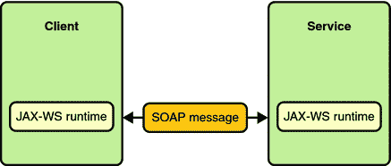

# JAX-WS 教程

> 原文：<http://web.archive.org/web/20230101150211/https://mkyong.com/tutorials/jax-ws-tutorials/>

[Java API for XML Web Services(JAX-WS)](http://web.archive.org/web/20220617011055/http://jax-ws.java.net/)，是一组用于创建 XML 格式(SOAP)的 Web 服务的 API。JAX-WS 提供了许多注释来简化 web 服务客户端和 web 服务提供者(端点)的开发和部署。

在本教程中，它提供了许多关于 JAX-WS 2.0 和 JAXWS 2.1 的分步示例和解释。

快乐学习 JAX🙂

## 快速启动

JAX-WS 2.x 的一些快速入门示例

图:JAX-WS 通讯-[图片来源](http://web.archive.org/web/20220617011055/https://download.oracle.com/javaee/5/tutorial/doc/bnayn.html)

*   [JAX-WS hello world 示例-RPC 样式](http://web.archive.org/web/20220617011055/http://www.mkyong.com/webservices/jax-ws/jax-ws-hello-world-example/)
    教程向您展示如何使用 JAX-WS，以及 Java、wsimport 和 Ruby 中的 web 服务客户端来创建 RPC 样式的 web 服务端点。
*   [JAX-WS Hello World 示例-文档样式](http://web.archive.org/web/20220617011055/http://www.mkyong.com/webservices/jax-ws/jax-ws-hello-world-example-document-style/)
    教程向您展示了如何使用 JAX-WS 创建文档样式的 web 服务端点，并展示了客户端和服务器之间的 SOAP 信封流。
*   [如何在 Eclipse IDE 中跟踪 SOAP 消息](http://web.archive.org/web/20220617011055/http://www.mkyong.com/webservices/jax-ws/how-to-trace-soap-message-in-eclipse-ide/)
    教程向您展示了如何在 Eclipse IDE 中启用这个“TCP/IP Monitor ”,并且还拦截 web 服务生成的 SOAP 消息。
*   [JAX-WS : wsimport 工具示例](http://web.archive.org/web/20220617011055/http://www.mkyong.com/webservices/jax-ws/jax-ws-wsimport-tool-example/)
    WS import 工具用于解析现有的 web 服务描述语言(WSDL)文件，并生成 web 服务客户端访问已发布的 Web 服务所需的文件(JAX-WS 可移植工件)。
*   [JAX-WS : wsgen 工具示例](http://web.archive.org/web/20220617011055/http://www.mkyong.com/webservices/jax-ws/jax-ws-wsgen-tool-example/)
    wsgen 工具用于解析现有的 web 服务实现类，并生成 web 服务部署所需的文件(JAX-WS 可移植工件)。

## JAX-WS 附件

如何在 JAX-WS 2.x 中处理附件

*   一个完整的基于 JAX-WS SOAP 的例子，展示了如何使用消息传输优化机制(MTOM)和 XML-二进制优化打包(XOP)技术在服务器和客户端之间发送二进制附件(图像)。

## JAX-WS 处理器

SOAP handler 是一个 SOAP 消息拦截器，它能够拦截传入或传出的 SOAP 消息并操纵其值。

*   [第 1 部分:JAX-WS–服务器端的 SOAP 处理程序](http://web.archive.org/web/20220617011055/http://www.mkyong.com/webservices/jax-ws/jax-ws-soap-handler-in-server-side/)
    在本文中，我们将向您展示如何创建一个 SOAP 处理程序并将其附加到服务器端，以便从每个传入的 SOAP 消息中检索 SOAP 头块中的 mac 地址。并进行验证以仅允许 MAC 地址为“90-4C-E5-44-B9-8F”计算机访问此发布的服务。
*   [第 2 部分:JAX-WS–客户端的 SOAP 处理程序](http://web.archive.org/web/20220617011055/http://www.mkyong.com/webservices/jax-ws/jax-ws-soap-handler-in-client-side/)
    在本文中，您将开发一个 web 服务客户端来访问上一篇文章中发布的服务，并附加一个处理程序来将客户端的 MAC 地址注入报头块，用于客户端发送的每个传出 SOAP 消息。
*   [第 3 部分:JAX-WS–客户端和服务器端的 SOAP 处理程序测试](http://web.archive.org/web/20220617011055/http://www.mkyong.com/webservices/jax-ws/jax-ws-soap-handler-testing-for-client-and-server-side/)
    以上两篇 SOAP 处理程序文章的测试结果。

## JAX-WS 集成

如何将 JAX WS 与 Web 应用和 Spring 框架集成？

*   [JAX-WS + Java Web 应用集成示例](http://web.archive.org/web/20220617011055/http://www.mkyong.com/webservices/jax-ws/jax-ws-java-web-application-integration-example/)
    这里我们向你展示如何将 JAX-WS 与 Java Web 应用集成。
*   [JAX-WS + Spring 集成示例](http://web.archive.org/web/20220617011055/http://www.mkyong.com/webservices/jax-ws/jax-ws-spring-integration-example/)
    这里我们向你展示如何将 JAX-WS 与 Spring 框架集成。
*   [无法定位 XML 模式名称空间的 Spring namespace handler【http://jax-ws.dev.java.net/spring/servlet】](http://web.archive.org/web/20220617011055/http://www.mkyong.com/webservices/jax-ws/unable-to-locate-spring-namespacehandler-for-xml-schema-namespace-httpjax-ws-dev-java-netspringservlet/)
    将 JAX-WS 与 Spring 框架集成时的常见错误消息。

## Tomcat 中的 JAX-WS 安全性

如何在 Tomcat 中实现 JAX-WS 安全性？

*   在 Tomcat
    上部署 JAX-WS 网络服务这里有一个指南向你展示如何在 Tomcat servlet 容器上部署 JAX-WS 网络服务。
*   在 Tomcat + SSL 连接上部署 JAX-WS web 服务
    这里有一个指南向您展示如何在启用了 Tomcat + SSL 连接的情况下部署 JAX-WS web 服务。
*   用 JAX-WS 进行应用程序认证这里有一个详细的例子向你展示如何用 JAX-WS 处理应用程序级认证。
*   [用 JAX-WS + (Tomcat 版本)](http://web.archive.org/web/20220617011055/http://www.mkyong.com/webservices/jax-ws/container-authentication-with-jax-ws-tomcat/)
    进行容器认证这里有一个详细的例子来展示如何在 Tomcat 下用 JAX-WS 实现容器认证。
*   [让 Tomcat 支持 SSL 或 https 连接](http://web.archive.org/web/20220617011055/http://www.mkyong.com/tomcat/how-to-configure-tomcat-to-support-ssl-or-https/)
*   [如何在 Java web 服务客户端中绕过证书检查](http://web.archive.org/web/20220617011055/http://www.mkyong.com/webservices/jax-ws/how-to-bypass-certificate-checking-in-a-java-web-service-client/)
*   [Java . security . cert . certificate 异常:找不到与本地主机匹配的名称](http://web.archive.org/web/20220617011055/http://www.mkyong.com/webservices/jax-ws/java-security-cert-certificateexception-no-name-matching-localhost-found/)
*   [SunCertPathBuilderException:无法找到请求目标的有效认证路径](http://web.archive.org/web/20220617011055/http://www.mkyong.com/webservices/jax-ws/suncertpathbuilderexception-unable-to-find-valid-certification-path-to-requested-target/)

## JAX-WS 错误消息

JAX-WS 开发中的一些常见错误消息。

*   [WebSphere 7 上的 Metro–com . IBM . XML . xlxp 2 . JAXB . jaxbcontextimpl 不兼容异常](http://web.archive.org/web/20220617011055/http://www.mkyong.com/webservices/jax-ws/metro-on-websphere-7-com-ibm-xml-xlxp2-jaxb-jaxbcontextimpl-incompatible-exception/)
*   [Spring + jax-ws : 'xxx '是接口，JAXB 不能处理接口](http://web.archive.org/web/20220617011055/http://www.mkyong.com/webservices/jax-ws/spring-jax-ws-xxx-is-an-interface-and-jaxb-cant-handle-interfaces/)
*   [Spring + jax-ws : '#xxx '不是' NCName '的有效值](http://web.archive.org/web/20220617011055/http://www.mkyong.com/webservices/jax-ws/spring-jax-ws-xxx-is-not-a-valid-value-for-ncname/)
*   [javax . XML . stream . XML stream exception:parse error at[row，col]:[x，xx]](http://web.archive.org/web/20220617011055/http://www.mkyong.com/webservices/jax-ws/javax-xml-stream-xmlstreamexception-parseerror-at-rowcolxxx/)
*   [java.net.BindException:地址已被使用:bind](http://web.archive.org/web/20220617011055/http://www.mkyong.com/webservices/jax-ws/java-net-bindexception-address-already-in-use-bind/)
*   [找不到包装类 package.jaxws.methodName。你有没有倾向于生成它们？](http://web.archive.org/web/20220617011055/http://www.mkyong.com/webservices/jax-ws/wrapper-class-package-jaxws-methodname-is-not-found-have-you-run-apt-to-generate-them/)
*   [Java . lang . classnotfoundexception:com . sun . XML . ws . transport . http . servlet . wsservletcontextlistener](http://web.archive.org/web/20220617011055/http://www.mkyong.com/webservices/jax-ws/java-lang-classnotfoundexception-com-sun-xml-ws-transport-http-servlet-wsservletcontextlistener/)
*   [Java . lang . classnotfoundexception:com/sun/XML/bind/v2/model/annotation/annotation reader](http://web.archive.org/web/20220617011055/http://www.mkyong.com/webservices/jax-ws/java-lang-classnotfoundexception-comsunxmlbindv2modelannotationannotationreader/)
*   [Java . lang . classnotfoundexception:com/sun/XML/stream/buffer/XML stream buffer](http://web.archive.org/web/20220617011055/http://www.mkyong.com/webservices/jax-ws/java-lang-classnotfoundexception-comsunxmlstreambufferxmlstreambuffer/)
*   [Java . lang . classnotfoundexception:com/sun/XML/ws/policy/policy exception](http://web.archive.org/web/20220617011055/http://www.mkyong.com/webservices/jax-ws/java-lang-classnotfoundexception-comsunxmlwspolicypolicyexception/)
*   [Java . lang . classnotfoundexception:javax . XML . ws . soap . addressing feature $ Responses](http://web.archive.org/web/20220617011055/http://www.mkyong.com/webservices/jax-ws/java-lang-classnotfoundexception-javax-xml-ws-soap-addressingfeatureresponses/)
*   [Java . lang . classnotfoundexception:org . jvnet . staxex . XML streamreaderex](http://web.archive.org/web/20220617011055/http://www.mkyong.com/webservices/jax-ws/java-lang-classnotfoundexception-org-jvnet-staxex-xmlstreamreaderex/)
*   [Java . lang . classnotfoundexception:org . glassfish . gmbal . managedobjectmanager](http://web.archive.org/web/20220617011055/http://www.mkyong.com/webservices/jax-ws/java-lang-classnotfoundexception-org-glassfish-gmbal-managedobjectmanager/)
*   [Java . lang . classnotfoundexception:org . glassfish . external . amx . amx glassfish](http://web.archive.org/web/20220617011055/http://www.mkyong.com/webservices/jax-ws/java-lang-classnotfoundexception-org-glassfish-external-amx-amxglassfish/)
*   [Java . lang . classnotfoundexception:org . spring framework . beans . factory . support . reader context](http://web.archive.org/web/20220617011055/http://www.mkyong.com/webservices/jax-ws/java-lang-classnotfoundexception-org-springframework-beans-factory-support-readercontext/)
*   [Java . lang . classnotfoundexception:org . Apache . xbean . spring . context . v2 . xbean namespace handler](http://web.archive.org/web/20220617011055/http://www.mkyong.com/webservices/jax-ws/java-lang-classnotfoundexception-org-apache-xbean-spring-context-v2-xbeannamespacehandler/)

## 参考

1.  [http://jax-ws.java.net/](http://web.archive.org/web/20220617011055/http://jax-ws.java.net/)
2.  [http://download.oracle.com/javaee/5/tutorial/doc/bnayn.html](http://web.archive.org/web/20220617011055/https://download.oracle.com/javaee/5/tutorial/doc/bnayn.html)
3.  [http://Java . sun . com/developer/technical articles/web services/high _ performance/](http://web.archive.org/web/20220617011055/http://java.sun.com/developer/technicalArticles/WebServices/high_performance/)
4.  [http://Java . sun . com/developer/technical articles/J2SE/jax _ ws _ 2/](http://web.archive.org/web/20220617011055/http://java.sun.com/developer/technicalArticles/J2SE/jax_ws_2/)
5.  [http://blogs.sun.com/kamna/entry/using_jax_ws_handlers_to](http://web.archive.org/web/20220617011055/http://blogs.sun.com/kamna/entry/using_jax_ws_handlers_to)
6.  [http://tomcat.apache.org/tomcat-6.0-doc/realm-howto.html](http://web.archive.org/web/20220617011055/https://tomcat.apache.org/tomcat-6.0-doc/realm-howto.html)
7.  [http://www . IBM . com/developer works/web services/library/ws-doc style . html](http://web.archive.org/web/20220617011055/https://www.ibm.com/developerworks/webservices/library/ws-docstyle.html)
8.  [http://www . Oracle . com/technology/sample _ code/tech/Java/J2EE/jind demo/tutorials/web services . html](http://web.archive.org/web/20220617011055/http://www.oracle.com/technology/sample_code/tech/java/j2ee/jintdemo/tutorials/webservices.html)
9.  [http://www.coderanch.com/how-to/java/WebServicesFaq](http://web.archive.org/web/20220617011055/http://www.coderanch.com/how-to/java/WebServicesFaq)
10.  [http://www . Oracle . com/tech network/articles/javase/index-137171 . html](http://web.archive.org/web/20220617011055/http://www.oracle.com/technetwork/articles/javase/index-137171.html)

<input type="hidden" id="mkyong-current-postId" value="8198">