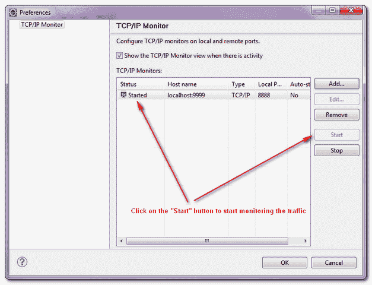

> 原文：<http://web.archive.org/web/20230101150211/https://mkyong.com/webservices/jax-ws/how-to-trace-soap-message-in-eclipse-ide/>

# 如何在 Eclipse IDE 中跟踪 SOAP 消息

在 SOAP web 服务中，每个 HTTP 请求或响应都封装了一个 SOAP 信封，使用 Eclipse IDE 内置的" **TCP/IP monitor** "工具可以很容易地跟踪这些消息。这个想法是在客户端和服务器之间托管另一个服务器，以执行端口转发功能来拦截 HTTP 流量。

## 1.正常的 SOAP 信封流

在普通的 SOAP 服务中，客户端向服务器发送 HTTP 请求，服务器直接向客户端发回 HTTP 响应。

```java
 1\. Client ----> SOAP envelope ----> Server:9999

2\. Server:9999 ----> SOAP envelope ---> Client 
```

 <ins class="adsbygoogle" style="display:block; text-align:center;" data-ad-format="fluid" data-ad-layout="in-article" data-ad-client="ca-pub-2836379775501347" data-ad-slot="6894224149">## 2.拦截的 SOAP 信封流

要拦截 SOAP 信封，您可以在客户端和服务器之间托管另一个服务器(“TcpMonitorServer”)，请参见新流:

```java
 1\. Client ----> SOAP envelope ----> TcpMonitorServer:8888

2\. TcpMonitorServer:8888 --> SOAP envelope ---> Server:9999

3\. Server:9999 ----> SOAP envelope ---> TcpMonitorServer:8888

4\. TcpMonitorServer:8888 ----> SOAP envelope ---> Client 
```

**Note**
This method required port changed in your web service client. <ins class="adsbygoogle" style="display:block" data-ad-client="ca-pub-2836379775501347" data-ad-slot="8821506761" data-ad-format="auto" data-ad-region="mkyongregion">## Eclipse IDE + TCP/IP 监视器

Eclipse IDE 附带了一个非常容易使用的流量拦截工具，称为“ **TCP/IP Monitor** ”。在本教程中，我们将向您展示如何在 Eclipse IDE 中启用这个“TCP/IP 监视器”,以及如何截取 web 服务生成的 SOAP 消息。

下面是在 Eclispe IDE 中启用“TCP/IP Monitor”的步骤。

1.在 IDE 中，进入*窗口*–>*首选项*–>*运行/调试*–>*TCP/IP 监控*


2.填写服务器信息，选择 type = " **TCP/IP**


3.单击“开始”按钮开始跟踪 web 服务流量。



4.在“TCP/IP 监视器”视图中显示跟踪的消息(如果有)。

**Note**
You can copy this [JAX-WS web service example](http://web.archive.org/web/20190214235009/http://www.mkyong.com/webservices/jax-ws/jax-ws-hello-world-example/) and do the testing yourself.**For Netbean users**
In Netbean IDE, you can use [TCP monitor](http://web.archive.org/web/20190214235009/https://tcpmon.dev.java.net/) to trace SOAP message.[eclipse](http://web.archive.org/web/20190214235009/http://www.mkyong.com/tag/eclipse/) [jax-ws](http://web.archive.org/web/20190214235009/http://www.mkyong.com/tag/jax-ws/) [soap](http://web.archive.org/web/20190214235009/http://www.mkyong.com/tag/soap/) [web services](http://web.archive.org/web/20190214235009/http://www.mkyong.com/tag/web-services/)


