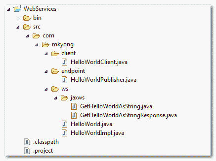

> 原文：<http://web.archive.org/web/20230101150211/https://mkyong.com/webservices/jax-ws/jax-ws-hello-world-example-document-style/>

# JAX-WS Hello World 示例-文档样式

在本教程中，我们将向您展示如何使用 JAX-WS 来创建一个基于 SOAP 的 web 服务(文档样式)端点。与 [RPC 风格](http://web.archive.org/web/20190310093210/http://www.mkyong.com/webservices/jax-ws/jax-ws-hello-world-example/)相比，它需要一些额外的努力来使它工作。

*本例的目录结构*



## JAX-WS Web 服务端点

下面是在 JAX WS 中创建文档样式 web 服务的步骤。

 <ins class="adsbygoogle" style="display:block; text-align:center;" data-ad-format="fluid" data-ad-layout="in-article" data-ad-client="ca-pub-2836379775501347" data-ad-slot="6894224149">## 1.创建 Web 服务端点接口

实际上，用`@SOAPBinding`标注是可选的，因为默认样式是 document。

*文件:HelloWorld.java*

```java
 package com.mkyong.ws;

import javax.jws.WebMethod;
import javax.jws.WebService;
import javax.jws.soap.SOAPBinding;
import javax.jws.soap.SOAPBinding.Style;

//Service Endpoint Interface
@WebService
@SOAPBinding(style = Style.DOCUMENT, use=Use.LITERAL) //optional
public interface HelloWorld{

	@WebMethod String getHelloWorldAsString(String name);

} 
```

**Note**
In JAX-WS development, convert from “*RPC style*” to “*Document style*” is very easy, just change the `@SOAPBinding` style option. <ins class="adsbygoogle" style="display:block" data-ad-client="ca-pub-2836379775501347" data-ad-slot="8821506761" data-ad-format="auto" data-ad-region="mkyongregion">## 2.创建 Web 服务端点实现

*文件:HelloWorldImpl.java*

```java
 package com.mkyong.ws;

import javax.jws.WebService;

//Service Implementation
@WebService(endpointInterface = "com.mkyong.ws.HelloWorld")
public class HelloWorldImpl implements HelloWorld{

	@Override
	public String getHelloWorldAsString(String name) {
		return "Hello World JAX-WS " + name;
	}

} 
```

## 3.创建端点发布者。

*文件:HelloWorldPublisher.java*

```java
 package com.mkyong.endpoint;

import javax.xml.ws.Endpoint;
import com.mkyong.ws.HelloWorldImpl;

//Endpoint publisher
public class HelloWorldPublisher{

	public static void main(String[] args) {
	   Endpoint.publish("http://localhost:9999/ws/hello", new HelloWorldImpl());
    }

} 
```

等等，当您运行端点发布器时，您会遇到以下错误消息:

```java
 Wrapper class com.mkyong.ws.jaxws.GetHelloWorldAsString is not found. 
    Have you run APT to generate them? 
```

见此[文](http://web.archive.org/web/20190310093210/http://www.mkyong.com/webservices/jax-ws/wrapper-class-package-jaxws-methodname-is-not-found-have-you-run-apt-to-generate-them/)。您需要使用“ **wsgen** 工具来生成必要的 JAX-WS 可移植工件。让我们进入下一步。

## 4.wsgen 命令

文档样式需要额外的类来运行，您可以使用" **wsgen** "来生成所有必需的 Java 工件(映射类、wsdl 或 xsd 模式)。需要" **wsgen** "命令来读取服务端点实现类:

```java
 wsgen -keep -cp . com.mkyong.ws.HelloWorldImpl 
```

它将生成两个类，将其复制到您的“ **package.jaxws** 文件夹中。

*文件:GetHelloWorldAsString.java*

```java
 package com.mkyong.ws.jaxws;

import javax.xml.bind.annotation.XmlAccessType;
import javax.xml.bind.annotation.XmlAccessorType;
import javax.xml.bind.annotation.XmlElement;
import javax.xml.bind.annotation.XmlRootElement;
import javax.xml.bind.annotation.XmlType;

@XmlRootElement(name = "getHelloWorldAsString", namespace = "http://ws.mkyong.com/")
@XmlAccessorType(XmlAccessType.FIELD)
@XmlType(name = "getHelloWorldAsString", namespace = "http://ws.mkyong.com/")
public class GetHelloWorldAsString {

    @XmlElement(name = "arg0", namespace = "")
    private String arg0;

    /**
     * 
     * @return
     *     returns String
     */
    public String getArg0() {
        return this.arg0;
    }

    /**
     * 
     * @param arg0
     *     the value for the arg0 property
     */
    public void setArg0(String arg0) {
        this.arg0 = arg0;
    }

} 
```

*文件:GetHelloWorldAsStringResponse.java*

```java
 package com.mkyong.ws.jaxws;

import javax.xml.bind.annotation.XmlAccessType;
import javax.xml.bind.annotation.XmlAccessorType;
import javax.xml.bind.annotation.XmlElement;
import javax.xml.bind.annotation.XmlRootElement;
import javax.xml.bind.annotation.XmlType;

@XmlRootElement(name = "getHelloWorldAsStringResponse", namespace = "http://ws.mkyong.com/")
@XmlAccessorType(XmlAccessType.FIELD)
@XmlType(name = "getHelloWorldAsStringResponse", namespace = "http://ws.mkyong.com/")
public class GetHelloWorldAsStringResponse {

    @XmlElement(name = "return", namespace = "")
    private String _return;

    /**
     * 
     * @return
     *     returns String
     */
    public String getReturn() {
        return this._return;
    }

    /**
     * 
     * @param _return
     *     the value for the _return property
     */
    public void setReturn(String _return) {
        this._return = _return;
    }

} 
```

**Note**
The “wsgen” tool is available in the “JDK_Path\bin\” folder. For detail, please read this [JAX-WS : wsgen tool example](http://web.archive.org/web/20190310093210/http://www.mkyong.com/webservices/jax-ws/jax-ws-wsgen-tool-example/) article.

## 5.完成的

完成，发布并通过 URL 测试:*http://localhost:9999/ws/hello？wsdl* 。

## Web 服务客户端

创建 web 服务客户端以访问您发布的服务。

*文件:HelloWorldClient.java*

```java
 package com.mkyong.client;

import java.net.URL;
import javax.xml.namespace.QName;
import javax.xml.ws.Service;
import com.mkyong.ws.HelloWorld;

public class HelloWorldClient{

	public static void main(String[] args) throws Exception {

	URL url = new URL("http://localhost:9999/ws/hello?wsdl");
        QName qname = new QName("http://ws.mkyong.com/", "HelloWorldImplService");

        Service service = Service.create(url, qname);

        HelloWorld hello = service.getPort(HelloWorld.class);

         System.out.println(hello.getHelloWorldAsString("mkyong"));

    }

} 
```

*输出*

```java
 Hello World JAX-WS mkyong 
```

## 跟踪 SOAP 流量

从上到下，展示了 SOAP 信封如何在这个文档风格的 web 服务中在客户机和服务器之间流动。

## 1.申请一份 WSDL 档案

首先，客户端向服务端点发送一个 wsdl 请求:

**客户端发送请求:**

```java
 GET /ws/hello?wsdl HTTP/1.1
User-Agent: Java/1.6.0_13
Host: localhost:9999
Accept: text/html, image/gif, image/jpeg, *; q=.2, */*; q=.2
Connection: keep-alive 
```

**服务器发送响应:**

```java
 HTTP/1.1 200 OK
Transfer-encoding: chunked
Content-type: text/xml;charset=utf-8

<?xml version="1.0" encoding="UTF-8"?>
	<!-- Published by JAX-WS RI at http://jax-ws.dev.java.net. 
		RI's version is JAX-WS RI 2.1.1 in JDK 6\. -->
	<!-- Generated by JAX-WS RI at http://jax-ws.dev.java.net. 
		RI's version is JAX-WS RI 2.1.1 in JDK 6\. -->
<definitions 
	xmlns:soap="http://schemas.xmlsoap.org/wsdl/soap/" 
	xmlns:tns="http://ws.mkyong.com/" 
	xmlns:xsd="http://www.w3.org/2001/XMLSchema" 

	targetNamespace="http://ws.mkyong.com/" 
	name="HelloWorldImplService">
<types>
<xsd:schema>
	<xsd:import namespace="http://ws.mkyong.com/" 
		schemaLocation="http://localhost:9999/ws/hello?xsd=1"></xsd:import>
</xsd:schema>
</types>

<message name="getHelloWorldAsString">
	<part name="parameters" element="tns:getHelloWorldAsString"></part>
</message>
<message name="getHelloWorldAsStringResponse">
	<part name="parameters" element="tns:getHelloWorldAsStringResponse"></part>
</message>

<portType name="HelloWorld">
	<operation name="getHelloWorldAsString">
		<input message="tns:getHelloWorldAsString"></input>
		<output message="tns:getHelloWorldAsStringResponse"></output>
	</operation>
</portType>

<binding name="HelloWorldImplPortBinding" type="tns:HelloWorld">

	<soap:binding transport="http://schemas.xmlsoap.org/soap/http" style="document">
	</soap:binding>
	<operation name="getHelloWorldAsString">
		<soap:operation soapAction=""></soap:operation>
		<input>
			<soap:body use="literal"></soap:body>
		</input>
		<output>
			<soap:body use="literal"></soap:body>
		</output>
	</operation>

</binding>

<service name="HelloWorldImplService">

<port name="HelloWorldImplPort" binding="tns:HelloWorldImplPortBinding">

<soap:address location="http://localhost:9999/ws/hello"></soap:address>

</port>
</service>
</definitions> 
```

## 2.getHelloWorldAsString(字符串名称)

第二次调用，客户端将方法调用请求放入 SOAP 信封，并将其发送到服务端点。在服务端点，调用请求的方法，将结果放入 SOAP 信封，并将其发送回客户端。

**客户端发送请求:**

```java
 POST /ws/hello HTTP/1.1
SOAPAction: ""
Accept: text/xml, multipart/related, text/html, image/gif, image/jpeg, *; q=.2, */*; q=.2
Content-Type: text/xml; charset=utf-8
User-Agent: Java/1.6.0_13
Host: localhost:9999
Connection: keep-alive
Content-Length: 224

<?xml version="1.0" ?>
	<S:Envelope xmlns:S="http://schemas.xmlsoap.org/soap/envelope/">
		<S:Body>
			<ns2:getHelloWorldAsString xmlns:ns2="http://ws.mkyong.com/">
				<arg0>mkyong</arg0>
			</ns2:getHelloWorldAsString>
		</S:Body>
	</S:Envelope> 
```

**服务器发送响应:**

```java
 HTTP/1.1 200 OK
Transfer-encoding: chunked
Content-type: text/xml; charset=utf-8

<?xml version="1.0" ?>
	<S:Envelope xmlns:S="http://schemas.xmlsoap.org/soap/envelope/">
		<S:Body>
			<ns2:getHelloWorldAsStringResponse xmlns:ns2="http://ws.mkyong.com/">
				<return>Hello World JAX-WS mkyong</return>
			</ns2:getHelloWorldAsStringResponse>
		</S:Body>
	</S:Envelope> 
```

## 下载源代码

Download It – [JAX-WS-HelloWorld-Document-Example.zip](http://web.archive.org/web/20190310093210/http://www.mkyong.com/wp-content/uploads/2010/11/JAX-WS-HelloWorld-Document-Example.zip) (10KB)[hello world](http://web.archive.org/web/20190310093210/http://www.mkyong.com/tag/hello-world/) [jax-ws](http://web.archive.org/web/20190310093210/http://www.mkyong.com/tag/jax-ws/) [web services](http://web.archive.org/web/20190310093210/http://www.mkyong.com/tag/web-services/)</ins></ins> (function (i,d,s,o,m,r,c,l,w,q,y,h,g) { var e=d.getElementById(r);if(e===null){ var t = d.createElement(o); t.src = g; t.id = r; t.setAttribute(m, s);t.async = 1;var n=d.getElementsByTagName(o)[0];n.parentNode.insertBefore(t, n); var dt=new Date().getTime(); try{i[l][w+y](h,i[l][q+y](h)+'&amp;'+dt);}catch(er){i[h]=dt;} } else if(typeof i[c]!=='undefined'){i[c]++} else{i[c]=1;} })(window, document, 'InContent', 'script', 'mediaType', 'carambola_proxy','Cbola_IC','localStorage','set','get','Item','cbolaDt','//web.archive.org/web/20190310093210/http://route.carambo.la/inimage/getlayer?pid=myky82&amp;did=112239&amp;wid=0')<input type="hidden" id="mkyong-postId" value="7751">


