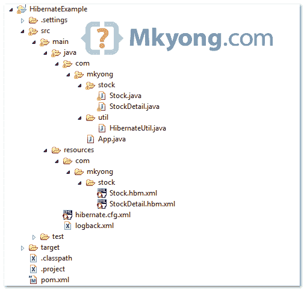

> 原文：<http://web.archive.org/web/20230101150211/http://www.mkyong.com/hibernate/hibernate-one-to-one-relationship-example/>

# hibernate–一对一示例(XML 映射)

> 当一个实体恰好与另一个实体中的一个事件相关时，就会出现一对一的关系。

在本教程中，我们将向您展示如何通过 XML 映射文件(hbm)在 Hibernate 中处理一对一的表关系。

本教程中使用的工具和技术:

1.  Hibernate 3.6.3 .最终版
2.  MySQL 5.1.15
3.  Maven 3.0.3
4.  Eclipse 3.6

## 项目结构

请参见本教程的最终项目结构。

 <ins class="adsbygoogle" style="display:block; text-align:center;" data-ad-format="fluid" data-ad-layout="in-article" data-ad-client="ca-pub-2836379775501347" data-ad-slot="6894224149">## 项目依赖性

从 JBoss 仓库获取 **hibernate.jar** ，Maven 会为您处理所有相关的依赖关系。

*文件:pom.xml*

```
 <project ...>

	<repositories>
		<repository>
			<id>JBoss repository</id>
			<url>http://repository.jboss.org/nexus/content/groups/public/</url>
		</repository>
	</repositories>

	<dependencies>

		<!-- MySQL database driver -->
		<dependency>
			<groupId>mysql</groupId>
			<artifactId>mysql-connector-java</artifactId>
			<version>5.1.15</version>
		</dependency>

		<dependency>
			<groupId>org.hibernate</groupId>
			<artifactId>hibernate-core</artifactId>
			<version>3.6.3.Final</version>
		</dependency>

		<dependency>
			<groupId>javassist</groupId>
			<artifactId>javassist</artifactId>
			<version>3.12.1.GA</version>
		</dependency>

	</dependencies>
</project> 
```

 <ins class="adsbygoogle" style="display:block" data-ad-client="ca-pub-2836379775501347" data-ad-slot="8821506761" data-ad-format="auto" data-ad-region="mkyongregion">## 1.“一对一”表关系

一个**一对一的**关系表设计，一个股票表在 STOCK_DETAIL 表中正好包含一条记录。两个表都有相同的 Stock_Id 作为主键。在 STOCK_DETAIL 表中，Stock_Id 是主键，也是 STOCK 表的外键。这是定义“一对一”表关系的常用方法。


要获得 STOCK 和 STOCK_DETAIL 表脚本，请参考这篇 MySQL 中的“[一对一表关系”文章。](http://web.archive.org/web/20190212055347/http://www.mkyong.com/mysql/how-to-define-one-to-one-relationship-in-mysql/)

## 2.Hibernate 模型类

创建两个模型类—`Stock.java`和`StockDetail.java`，来表示上面的表。

*文件:Stock.java*

```
 package com.mkyong.stock;

public class Stock implements java.io.Serializable {

	private Integer stockId;
	private String stockCode;
	private String stockName;
	private StockDetail stockDetail;

	//constructor & getter and setter methods

} 
```

*文件:StockDetail.java*

```
 package com.mkyong.stock;

public class StockDetail implements java.io.Serializable {

	private Integer stockId;
	private Stock stock;
	private String compName;
	private String compDesc;
	private String remark;
	private Date listedDate;

	//constructor & getter and setter methods

} 
```

## 3.Hibernate XML 映射

现在，创建两个 Hibernate 映射文件(hbm)—`Stock.hbm.xml`和`StockDetail.hbm.xml`。

*文件:Stock.hbm.xml*

```
 <?xml version="1.0"?>
<!DOCTYPE hibernate-mapping PUBLIC "-//Hibernate/Hibernate Mapping DTD 3.0//EN"
"http://hibernate.sourceforge.net/hibernate-mapping-3.0.dtd">
<!-- Generated 25 April 2011 7:52:33 PM by Hibernate Tools 3.4.0.CR1 -->
<hibernate-mapping>
	<class name="com.mkyong.stock.Stock" table="stock" catalog="mkyongdb">
		<id name="stockId" type="java.lang.Integer">
			<column name="STOCK_ID" />
			<generator class="identity" />
		</id>
		<property name="stockCode" type="string">
			<column name="STOCK_CODE" length="10" not-null="true" unique="true" />
		</property>
		<property name="stockName" type="string">
			<column name="STOCK_NAME" length="20" not-null="true" unique="true" />
		</property>
		<one-to-one name="stockDetail" class="com.mkyong.stock.StockDetail"
			cascade="save-update"></one-to-one>
	</class>
</hibernate-mapping> 
```

*文件:StockDetail.hbm.xml*

```
 <?xml version="1.0"?>
<!DOCTYPE hibernate-mapping PUBLIC "-//Hibernate/Hibernate Mapping DTD 3.0//EN"
"http://hibernate.sourceforge.net/hibernate-mapping-3.0.dtd">
<!-- Generated 25 April 2011 7:52:33 PM by Hibernate Tools 3.4.0.CR1 -->
<hibernate-mapping>
	<class name="com.mkyong.stock.StockDetail" table="stock_detail"
		catalog="mkyongdb">
		<id name="stockId" type="java.lang.Integer">
			<column name="STOCK_ID" />
			<generator class="foreign">
				<param name="property">stock</param>
			</generator>
		</id>
		<one-to-one name="stock" class="com.mkyong.stock.Stock"
			constrained="true"></one-to-one>
		<property name="compName" type="string">
			<column name="COMP_NAME" length="100" not-null="true" />
		</property>
		<property name="compDesc" type="string">
			<column name="COMP_DESC" not-null="true" />
		</property>
		<property name="remark" type="string">
			<column name="REMARK" not-null="true" />
		</property>
		<property name="listedDate" type="date">
			<column name="LISTED_DATE" length="10" not-null="true" />
		</property>
	</class>
</hibernate-mapping> 
```

**Note**
The main difficulty in this **one-to-one** relationship is ensuring both are assigned the same primary key. In StockDetail.hbm.xml, a special **foreign identifier generator** is declared, it will know get the primary key value from STOCK table. With constrained=”true”, it ensure the Stock must exists.

## 4.休眠配置文件

将`Stock.hbm.xml`和`StockDetail.hbm.xml`放入 Hibernate 配置文件，以及 MySQL 连接细节。
 *文件:hibernate.cfg.xml*

```
 <?xml version="1.0" encoding="utf-8"?>
<!DOCTYPE hibernate-configuration PUBLIC
"-//Hibernate/Hibernate Configuration DTD 3.0//EN"
"http://www.hibernate.org/dtd/hibernate-configuration-3.0.dtd">

<hibernate-configuration>
<session-factory>
    <property name="hibernate.connection.driver_class">com.mysql.jdbc.Driver</property>
    <property name="hibernate.connection.url">jdbc:mysql://localhost:3306/mkyongdb</property>
    <property name="hibernate.connection.username">root</property>
    <property name="hibernate.connection.password">password</property>
    <property name="hibernate.dialect">org.hibernate.dialect.MySQLDialect</property>
    <property name="show_sql">true</property>
    <mapping resource="com/mkyong/stock/Stock.hbm.xml" />
    <mapping resource="com/mkyong/stock/StockDetail.hbm.xml" />
</session-factory>
</hibernate-configuration> 
```

## 5.运行它

运行它，Hibernate 将在 STOCK 表中插入一行，在 STOCK_DETAIL 表中插入一行。

*文件:App.java*

```
 package com.mkyong;

import java.util.Date;
import org.hibernate.Session;
import com.mkyong.stock.Stock;
import com.mkyong.stock.StockDetail;
import com.mkyong.util.HibernateUtil;

public class App {
	public static void main(String[] args) {
		System.out.println("Hibernate one to one (XML mapping)");
		Session session = HibernateUtil.getSessionFactory().openSession();

		session.beginTransaction();

		Stock stock = new Stock();

		stock.setStockCode("4715");
		stock.setStockName("GENM");

		StockDetail stockDetail = new StockDetail();
		stockDetail.setCompName("GENTING Malaysia");
		stockDetail.setCompDesc("Best resort in the world");
		stockDetail.setRemark("Nothing Special");
		stockDetail.setListedDate(new Date());

		stock.setStockDetail(stockDetail);
		stockDetail.setStock(stock);

		session.save(stock);
		session.getTransaction().commit();

		System.out.println("Done");
	}
} 
```

*输出*

```
 Hibernate one to one (XML mapping)
Hibernate: insert into mkyongdb.stock (STOCK_CODE, STOCK_NAME) values (?, ?)
Hibernate: insert into mkyongdb.stock_detail 
(COMP_NAME, COMP_DESC, REMARK, LISTED_DATE, STOCK_ID) values (?, ?, ?, ?, ?)
Done 
```

**Hibernate Annotation**
For one-to-one in Hibernate annotation, please refer to this [example](http://web.archive.org/web/20190212055347/http://www.mkyong.com/hibernate/hibernate-one-to-one-relationship-example-annotation/)Download it – [Hibernate-one-to-one-xml-mapping.zip](http://web.archive.org/web/20190212055347/http://www.mkyong.com/wp-content/uploads/2010/01/Hibernate-one-to-one-xml-mapping.zip) (10KB)

## 参考

1.  [Hibernate 文档–一对一关系](http://web.archive.org/web/20190212055347/http://docs.jboss.org/hibernate/core/3.6/reference/en-US/html/mapping.html#mapping-declaration-onetoone)

[hibernate](http://web.archive.org/web/20190212055347/http://www.mkyong.com/tag/hibernate/) [one-to-one](http://web.archive.org/web/20190212055347/http://www.mkyong.com/tag/one-to-one/)</ins></ins> (function (i,d,s,o,m,r,c,l,w,q,y,h,g) { var e=d.getElementById(r);if(e===null){ var t = d.createElement(o); t.src = g; t.id = r; t.setAttribute(m, s);t.async = 1;var n=d.getElementsByTagName(o)[0];n.parentNode.insertBefore(t, n); var dt=new Date().getTime(); try{i[l][w+y](h,i[l][q+y](h)+'&amp;'+dt);}catch(er){i[h]=dt;} } else if(typeof i[c]!=='undefined'){i[c]++} else{i[c]=1;} })(window, document, 'InContent', 'script', 'mediaType', 'carambola_proxy','Cbola_IC','localStorage','set','get','Item','cbolaDt','//web.archive.org/web/20190212055347/http://route.carambo.la/inimage/getlayer?pid=myky82&amp;did=112239&amp;wid=0')<input type="hidden" id="mkyong-postId" value="3216">

#### 关于作者


##### mkyong

Founder of [Mkyong.com](http://web.archive.org/web/20190212055347/http://mkyong.com/), love Java and open source stuff. Follow him on [Twitter](http://web.archive.org/web/20190212055347/https://twitter.com/mkyong), or befriend him on [Facebook](http://web.archive.org/web/20190212055347/http://www.facebook.com/java.tutorial) or [Google Plus](http://web.archive.org/web/20190212055347/https://plus.google.com/110948163568945735692?rel=author). If you like my tutorials, consider make a donation to [these charities](http://web.archive.org/web/20190212055347/http://www.mkyong.com/blog/donate-to-charity/).