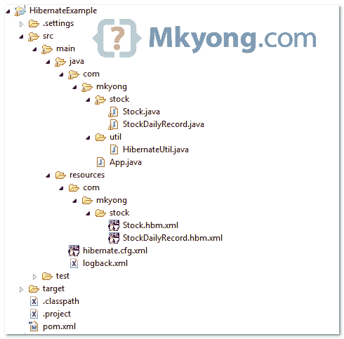

# hibernate–一对多示例(XML 映射)

> 原文：<http://web.archive.org/web/20230101150211/http://www.mkyong.com/hibernate/hibernate-one-to-many-relationship-example/>

> 当一个实体与另一个实体中的多个事件相关时，就会出现一对多关系。

在本教程中，我们将向您展示如何通过 XML 映射文件(hbm)在 Hibernate 中处理一对多表关系。

本教程中使用的工具和技术:

1.  Hibernate 3.6.3 .最终版
2.  MySQL 5.1.15
3.  Maven 3.0.3
4.  Eclipse 3.6

## 项目结构

本教程的项目结构。



## 项目依赖性

从 JBoss 仓库获取 **hibernate.jar** ，Maven 会为您处理所有相关的依赖关系

*文件:pom.xml*

```java
 <project ...>

	<repositories>
		<repository>
			<id>JBoss repository</id>
			<url>http://repository.jboss.org/nexus/content/groups/public/</url>
		</repository>
	</repositories>

	<dependencies>

		<!-- MySQL database driver -->
		<dependency>
			<groupId>mysql</groupId>
			<artifactId>mysql-connector-java</artifactId>
			<version>5.1.15</version>
		</dependency>

		<dependency>
			<groupId>org.hibernate</groupId>
			<artifactId>hibernate-core</artifactId>
			<version>3.6.3.Final</version>
		</dependency>

		<dependency>
			<groupId>javassist</groupId>
			<artifactId>javassist</artifactId>
			<version>3.12.1.GA</version>
		</dependency>

	</dependencies>
</project> 
```

## 1.“一对多”示例

这是一个**一对多**关系表的设计，一个股票表有多个出现次数 STOCK_DAILY_RECORD 表。


请参见 MySQL 表脚本

```java
 DROP TABLE IF EXISTS `stock`;
CREATE TABLE `stock` (
  `STOCK_ID` int(10) unsigned NOT NULL AUTO_INCREMENT,
  `STOCK_CODE` varchar(10) NOT NULL,
  `STOCK_NAME` varchar(20) NOT NULL,
  PRIMARY KEY (`STOCK_ID`) USING BTREE,
  UNIQUE KEY `UNI_STOCK_NAME` (`STOCK_NAME`),
  UNIQUE KEY `UNI_STOCK_ID` (`STOCK_CODE`) USING BTREE
) ENGINE=InnoDB AUTO_INCREMENT=34 DEFAULT CHARSET=utf8;

DROP TABLE IF EXISTS `mkyongdb`.`stock_daily_record`;
CREATE TABLE  `mkyongdb`.`stock_daily_record` (
  `RECORD_ID` int(10) unsigned NOT NULL AUTO_INCREMENT,
  `PRICE_OPEN` float(6,2) DEFAULT NULL,
  `PRICE_CLOSE` float(6,2) DEFAULT NULL,
  `PRICE_CHANGE` float(6,2) DEFAULT NULL,
  `VOLUME` bigint(20) unsigned DEFAULT NULL,
  `DATE` date NOT NULL,
  `STOCK_ID` int(10) unsigned NOT NULL,
  PRIMARY KEY (`RECORD_ID`) USING BTREE,
  UNIQUE KEY `UNI_STOCK_DAILY_DATE` (`DATE`),
  KEY `FK_STOCK_TRANSACTION_STOCK_ID` (`STOCK_ID`),
  CONSTRAINT `FK_STOCK_TRANSACTION_STOCK_ID` FOREIGN KEY (`STOCK_ID`) 
  REFERENCES `stock` (`STOCK_ID`) ON DELETE CASCADE ON UPDATE CASCADE
) ENGINE=InnoDB AUTO_INCREMENT=36 DEFAULT CHARSET=utf8; 
```

## 2.Hibernate 模型类

创建两个模型类—`Stock.java`和`StockDailyRecord.java`，来表示上面的表。

*文件:Stock.java*

```java
 package com.mkyong.stock;

import java.util.HashSet;
import java.util.Set;

public class Stock implements java.io.Serializable {

	private Integer stockId;
	private String stockCode;
	private String stockName;
	private Set<StockDailyRecord> stockDailyRecords = 
				new HashSet<StockDailyRecord>(0);

	//getter, setter and constructor
} 
```

*文件:StockDailyRecord.java*

```java
 package com.mkyong.stock;

import java.util.Date;

public class StockDailyRecord implements java.io.Serializable {

	private Integer recordId;
	private Stock stock;
	private Float priceOpen;
	private Float priceClose;
	private Float priceChange;
	private Long volume;
	private Date date;

	//getter, setter and constructor
} 
```

## 3.Hibernate XML 映射

现在，创建两个 Hibernate 映射文件(hbm)—`Stock.hbm.xml`和`StockDailyRecord.hbm.xml`。

*文件:Stock.hbm.xml*

```java
 <?xml version="1.0"?>
<!DOCTYPE hibernate-mapping PUBLIC "-//Hibernate/Hibernate Mapping DTD 3.0//EN"
"http://hibernate.sourceforge.net/hibernate-mapping-3.0.dtd">
<hibernate-mapping>
    <class name="com.mkyong.stock.Stock" table="stock" catalog="mkyongdb">
        <id name="stockId" type="java.lang.Integer">
            <column name="STOCK_ID" />
            <generator class="identity" />
        </id>
        <property name="stockCode" type="string">
            <column name="STOCK_CODE" length="10" not-null="true" unique="true" />
        </property>
        <property name="stockName" type="string">
            <column name="STOCK_NAME" length="20" not-null="true" unique="true" />
        </property>
        <set name="stockDailyRecords" table="stock_daily_record" 
				inverse="true" lazy="true" fetch="select">
            <key>
                <column name="STOCK_ID" not-null="true" />
            </key>
            <one-to-many class="com.mkyong.stock.StockDailyRecord" />
        </set>
    </class>
</hibernate-mapping> 
```

*文件:StockDailyRecord.hbm.xml*

```java
 <?xml version="1.0"?>
<!DOCTYPE hibernate-mapping PUBLIC "-//Hibernate/Hibernate Mapping DTD 3.0//EN"
"http://hibernate.sourceforge.net/hibernate-mapping-3.0.dtd">
<hibernate-mapping>
    <class name="com.mkyong.stock.StockDailyRecord" table="stock_daily_record" 
		catalog="mkyongdb">
        <id name="recordId" type="java.lang.Integer">
            <column name="RECORD_ID" />
            <generator class="identity" />
        </id>
        <many-to-one name="stock" class="com.mkyong.stock.Stock" fetch="select">
            <column name="STOCK_ID" not-null="true" />
        </many-to-one>
        <property name="priceOpen" type="java.lang.Float">
            <column name="PRICE_OPEN" precision="6" />
        </property>
        <property name="priceClose" type="java.lang.Float">
            <column name="PRICE_CLOSE" precision="6" />
        </property>
        <property name="priceChange" type="java.lang.Float">
            <column name="PRICE_CHANGE" precision="6" />
        </property>
        <property name="volume" type="java.lang.Long">
            <column name="VOLUME" />
        </property>
        <property name="date" type="date">
            <column name="DATE" length="10" not-null="true" unique="true" />
        </property>
    </class>
</hibernate-mapping> 
```

## 4.休眠配置文件

将`Stock.hbm.xml`和`StockDailyRecord.hbm.xml`放入 Hibernate 配置文件，以及 MySQL 连接细节。

*文件:hibernate.cfg.xml*

```java
 <?xml version="1.0" encoding="utf-8"?>
<!DOCTYPE hibernate-configuration PUBLIC
"-//Hibernate/Hibernate Configuration DTD 3.0//EN"
"http://www.hibernate.org/dtd/hibernate-configuration-3.0.dtd">

<hibernate-configuration>
<session-factory>
    <property name="hibernate.connection.driver_class">com.mysql.jdbc.Driver</property>
    <property name="hibernate.connection.url">jdbc:mysql://localhost:3306/mkyongdb</property>
    <property name="hibernate.connection.username">root</property>
    <property name="hibernate.connection.password">password</property>
    <property name="hibernate.dialect">org.hibernate.dialect.MySQLDialect</property>
    <property name="show_sql">true</property>
    <property name="format_sql">true</property>
    <mapping resource="com/mkyong/stock/Stock.hbm.xml" />
    <mapping resource="com/mkyong/stock/StockDailyRecord.hbm.xml" />
</session-factory>
</hibernate-configuration> 
```

## 5.运行它

运行它，Hibernate 将在 STOCK 表中插入一行，在 STOCK_DAILY_RECORD 表中插入一行。

*文件:App.java*

```java
 package com.mkyong;

import java.util.Date;

import org.hibernate.Session;

import com.mkyong.stock.Stock;
import com.mkyong.stock.StockDailyRecord;
import com.mkyong.util.HibernateUtil;

public class App {
	public static void main(String[] args) {

        System.out.println("Hibernate one to many (XML Mapping)");
	Session session = HibernateUtil.getSessionFactory().openSession();

	session.beginTransaction();

	Stock stock = new Stock();
        stock.setStockCode("7052");
        stock.setStockName("PADINI");
        session.save(stock);

        StockDailyRecord stockDailyRecords = new StockDailyRecord();
        stockDailyRecords.setPriceOpen(new Float("1.2"));
        stockDailyRecords.setPriceClose(new Float("1.1"));
        stockDailyRecords.setPriceChange(new Float("10.0"));
        stockDailyRecords.setVolume(3000000L);
        stockDailyRecords.setDate(new Date());

        stockDailyRecords.setStock(stock);        
        stock.getStockDailyRecords().add(stockDailyRecords);

        session.save(stockDailyRecords);

	session.getTransaction().commit();
	System.out.println("Done");
	}
} 
```

*输出…*

```java
 Hibernate one to many (XML Mapping)
Hibernate: 
    insert 
    into
        mkyongdb.stock
        (STOCK_CODE, STOCK_NAME) 
    values
        (?, ?)
Hibernate: 
    insert 
    into
        mkyongdb.stock_daily_record
        (STOCK_ID, PRICE_OPEN, PRICE_CLOSE, PRICE_CHANGE, VOLUME, DATE) 
    values
        (?, ?, ?, ?, ?, ?) 
```

**Hibernate Annotation**
For one-to-many in Hibernate annotation, please refer to this [example](http://web.archive.org/web/20210507003829/http://www.mkyong.com/hibernate/hibernate-one-to-many-relationship-example-annotation/).Download it – [Hibernate-one-to-many-xml-mapping.zip](http://web.archive.org/web/20210507003829/http://www.mkyong.com/wp-content/uploads/2010/02/Hibernate-one-to-many-xml-mapping.zip) (10KB)

## 参考

1.  Hibernate 文档–一对多关系。

Tags : [hibernate](http://web.archive.org/web/20210507003829/https://mkyong.com/tag/hibernate/) [one-to-many](http://web.archive.org/web/20210507003829/https://mkyong.com/tag/one-to-many/)<input type="hidden" id="mkyong-current-postId" value="3158">