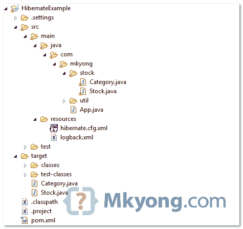

> 原文：<http://web.archive.org/web/20230101150211/http://www.mkyong.com/hibernate/hibernate-many-to-many-relationship-example-annotation/>

# hibernate–多对多示例(注释)

在本教程中，它将重用之前的“[Hibernate many to many example–XML mapping](http://web.archive.org/web/20190310100450/http://www.mkyong.com/hibernate/hibernate-many-to-many-relationship-example/)”教程的整个基础设施，并对其进行增强以支持 Hibernare / JPA 注释。

**Note**
For many to many with extra columns in join table, please refer to this [tutorial](http://web.archive.org/web/20190310100450/http://www.mkyong.com/hibernate/hibernate-many-to-many-example-join-table-extra-column-annotation/).

## 项目结构

查看本教程的新项目结构。

 <ins class="adsbygoogle" style="display:block; text-align:center;" data-ad-format="fluid" data-ad-layout="in-article" data-ad-client="ca-pub-2836379775501347" data-ad-slot="6894224149">## 1.“多对多”表关系

再看前面的多对多表关系。

 <ins class="adsbygoogle" style="display:block" data-ad-client="ca-pub-2836379775501347" data-ad-slot="8821506761" data-ad-format="auto" data-ad-region="mkyongregion">## 2.Hibernate 模型类

更新以前的模型类—`Stock.java`和`Category.java`，并在其中定义新的注释代码。

*文件:Stock.java*

```java
 package com.mkyong.stock;

import java.util.HashSet;
import java.util.Set;
import javax.persistence.Column;
import javax.persistence.Entity;
import javax.persistence.FetchType;
import javax.persistence.GeneratedValue;
import static javax.persistence.GenerationType.IDENTITY;
import javax.persistence.CascadeType;
import javax.persistence.Id;
import javax.persistence.JoinColumn;
import javax.persistence.JoinTable;
import javax.persistence.ManyToMany;
import javax.persistence.Table;
import javax.persistence.UniqueConstraint;

@Entity
@Table(name = "stock", catalog = "mkyongdb", uniqueConstraints = {
		@UniqueConstraint(columnNames = "STOCK_NAME"),
		@UniqueConstraint(columnNames = "STOCK_CODE") })
public class Stock implements java.io.Serializable {

	private Integer stockId;
	private String stockCode;
	private String stockName;
	private Set<Category> categories = new HashSet<Category>(0);

	public Stock() {
	}

	public Stock(String stockCode, String stockName) {
		this.stockCode = stockCode;
		this.stockName = stockName;
	}

	public Stock(String stockCode, String stockName, Set<Category> categories) {
		this.stockCode = stockCode;
		this.stockName = stockName;
		this.categories = categories;
	}

	@Id
	@GeneratedValue(strategy = IDENTITY)
	@Column(name = "STOCK_ID", unique = true, nullable = false)
	public Integer getStockId() {
		return this.stockId;
	}

	public void setStockId(Integer stockId) {
		this.stockId = stockId;
	}

	@Column(name = "STOCK_CODE", unique = true, nullable = false, length = 10)
	public String getStockCode() {
		return this.stockCode;
	}

	public void setStockCode(String stockCode) {
		this.stockCode = stockCode;
	}

	@Column(name = "STOCK_NAME", unique = true, nullable = false, length = 20)
	public String getStockName() {
		return this.stockName;
	}

	public void setStockName(String stockName) {
		this.stockName = stockName;
	}

	@ManyToMany(fetch = FetchType.LAZY, cascade = CascadeType.ALL)
	@JoinTable(name = "stock_category", catalog = "mkyongdb", joinColumns = { 
			@JoinColumn(name = "STOCK_ID", nullable = false, updatable = false) }, 
			inverseJoinColumns = { @JoinColumn(name = "CATEGORY_ID", 
					nullable = false, updatable = false) })
	public Set<Category> getCategories() {
		return this.categories;
	}

	public void setCategories(Set<Category> categories) {
		this.categories = categories;
	}

} 
```

*文件:Category.java*

```java
 package com.mkyong.stock;

import java.util.HashSet;
import java.util.Set;
import javax.persistence.Column;
import javax.persistence.Entity;
import javax.persistence.FetchType;
import javax.persistence.GeneratedValue;
import static javax.persistence.GenerationType.IDENTITY;
import javax.persistence.Id;
import javax.persistence.ManyToMany;
import javax.persistence.Table;

@Entity
@Table(name = "category", catalog = "mkyongdb")
public class Category implements java.io.Serializable {

	private Integer categoryId;
	private String name;
	private String desc;
	private Set<Stock> stocks = new HashSet<Stock>(0);

	public Category() {
	}

	public Category(String name, String desc) {
		this.name = name;
		this.desc = desc;
	}

	public Category(String name, String desc, Set<Stock> stocks) {
		this.name = name;
		this.desc = desc;
		this.stocks = stocks;
	}

	@Id
	@GeneratedValue(strategy = IDENTITY)
	@Column(name = "CATEGORY_ID", unique = true, nullable = false)
	public Integer getCategoryId() {
		return this.categoryId;
	}

	public void setCategoryId(Integer categoryId) {
		this.categoryId = categoryId;
	}

	@Column(name = "NAME", nullable = false, length = 10)
	public String getName() {
		return this.name;
	}

	public void setName(String name) {
		this.name = name;
	}

	@Column(name = "[DESC]", nullable = false)
	public String getDesc() {
		return this.desc;
	}

	public void setDesc(String desc) {
		this.desc = desc;
	}

	@ManyToMany(fetch = FetchType.LAZY, mappedBy = "categories")
	public Set<Stock> getStocks() {
		return this.stocks;
	}

	public void setStocks(Set<Stock> stocks) {
		this.stocks = stocks;
	}

} 
```

## 3.休眠配置文件

将带注释的类`Stock.java`和`Category.java`放在`hibernate.cfg.xml`中，如下所示:

*文件:hibernate.cfg.xml*

```java
 <?xml version="1.0" encoding="utf-8"?>
<!DOCTYPE hibernate-configuration PUBLIC
"-//Hibernate/Hibernate Configuration DTD 3.0//EN"
"http://www.hibernate.org/dtd/hibernate-configuration-3.0.dtd">

<hibernate-configuration>
<session-factory>
    <property name="hibernate.connection.driver_class">com.mysql.jdbc.Driver</property>
    <property name="hibernate.connection.url">jdbc:mysql://localhost:3306/mkyongdb</property>
    <property name="hibernate.connection.username">root</property>
    <property name="hibernate.connection.password">password</property>
    <property name="hibernate.dialect">org.hibernate.dialect.MySQLDialect</property>
    <property name="show_sql">true</property>
    <mapping class="com.mkyong.stock.Stock" />
    <mapping class="com.mkyong.stock.Category" />
</session-factory>
</hibernate-configuration> 
```

## 4.运行它

运行它，结果不言自明。

*文件:App.java*

```java
 package com.mkyong;

import java.util.HashSet;
import java.util.Set;
import org.hibernate.Session;
import com.mkyong.stock.Category;
import com.mkyong.stock.Stock;
import com.mkyong.util.HibernateUtil;

public class App {
	public static void main(String[] args) {

        System.out.println("Hibernate many to many (Annotation)");
	Session session = HibernateUtil.getSessionFactory().openSession();

	session.beginTransaction();

	Stock stock = new Stock();
        stock.setStockCode("7052");
        stock.setStockName("PADINI");

        Category category1 = new Category("CONSUMER", "CONSUMER COMPANY");
        Category category2 = new Category("INVESTMENT", "INVESTMENT COMPANY");

        Set<Category> categories = new HashSet<Category>();
        categories.add(category1);
        categories.add(category2);

        stock.setCategories(categories);

        session.save(stock);

	session.getTransaction().commit();
	System.out.println("Done");
	}
} 
```

*输出*

```java
 Hibernate many to many (Annotation)
Hibernate: 
    insert 
    into
        mkyongdb.stock
        (STOCK_CODE, STOCK_NAME) 
    values
        (?, ?)
Hibernate: 
    insert 
    into
        mkyongdb.category
        (`DESC`, NAME) 
    values
        (?, ?)
Hibernate: 
    insert 
    into
        mkyongdb.category
        (`DESC`, NAME) 
    values
        (?, ?)
Hibernate: 
    insert 
    into
        mkyongdb.stock_category
        (STOCK_ID, CATEGORY_ID) 
    values
        (?, ?)
Hibernate: 
    insert 
    into
        mkyongdb.stock_category
        (STOCK_ID, CATEGORY_ID) 
    values
        (?, ?)
Done 
```

Download it – [Hibernate-many-to-many-annotation.zip](http://web.archive.org/web/20190310100450/http://www.mkyong.com/wp-content/uploads/2011/04/Hibernate-many-to-many-annotation.zip) (9KB)

## 参考

1.  Hibernate 文档–多对多关系。

[hibernate](http://web.archive.org/web/20190310100450/http://www.mkyong.com/tag/hibernate/) [many-to-many](http://web.archive.org/web/20190310100450/http://www.mkyong.com/tag/many-to-many/)</ins></ins> (function (i,d,s,o,m,r,c,l,w,q,y,h,g) { var e=d.getElementById(r);if(e===null){ var t = d.createElement(o); t.src = g; t.id = r; t.setAttribute(m, s);t.async = 1;var n=d.getElementsByTagName(o)[0];n.parentNode.insertBefore(t, n); var dt=new Date().getTime(); try{i[l][w+y](h,i[l][q+y](h)+'&amp;'+dt);}catch(er){i[h]=dt;} } else if(typeof i[c]!=='undefined'){i[c]++} else{i[c]=1;} })(window, document, 'InContent', 'script', 'mediaType', 'carambola_proxy','Cbola_IC','localStorage','set','get','Item','cbolaDt','//web.archive.org/web/20190310100450/http://route.carambo.la/inimage/getlayer?pid=myky82&amp;did=112239&amp;wid=0')<input type="hidden" id="mkyong-postId" value="8710">

#### 关于作者


##### mkyong

Founder of [Mkyong.com](http://web.archive.org/web/20190310100450/http://mkyong.com/), love Java and open source stuff. Follow him on [Twitter](http://web.archive.org/web/20190310100450/https://twitter.com/mkyong), or befriend him on [Facebook](http://web.archive.org/web/20190310100450/http://www.facebook.com/java.tutorial) or [Google Plus](http://web.archive.org/web/20190310100450/https://plus.google.com/110948163568945735692?rel=author). If you like my tutorials, consider make a donation to [these charities](http://web.archive.org/web/20190310100450/http://www.mkyong.com/blog/donate-to-charity/).