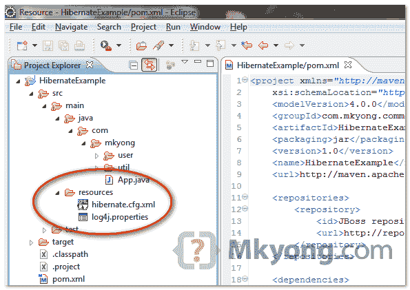
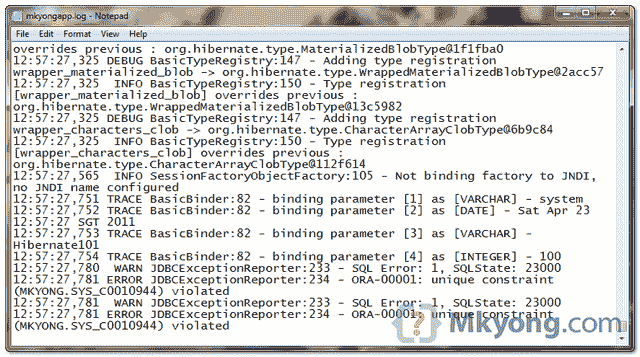

# 如何在 Hibernate 中配置日志记录–SLF4j+Log4j

> 原文：<http://web.archive.org/web/20230101150211/http://www.mkyong.com/hibernate/how-to-configure-log4j-in-hibernate-project/>

**Try logback**
Try logback logging framework, read this article for the “[reasons to prefer logback over log4j](http://web.archive.org/web/20220803011447/http://logback.qos.ch/reasonsToSwitch.html). To integrate logback with Hibernate, refer this – [How to configure logging in Hibernate – Logback](http://web.archive.org/web/20220803011447/http://www.mkyong.com/hibernate/how-to-configure-logging-in-hibernate-logback/)

Hibernate 使用[简单日志 Facade for Java (SLF4J)](http://web.archive.org/web/20220803011447/http://www.slf4j.org/) 将日志输出重定向到您的首选日志框架 is (log4j，JCL，JDK 日志，lofback…)。在本教程中，我们将向您展示如何使用 SLF4j + Log4j 日志框架在 **Hibernate 中进行日志记录。**

本文中使用的技术:

1.  Hibernate 3.6.3 .最终版
2.  slf4j-api-1.6.1
3.  slf4j-log4j12-1.6.1
4.  Eclipse 3.6
5.  Maven 3.0.3

## 1.获取 SLF4j + Log4j

要在 Hibernate 中进行日志记录，您需要“ **slf4j-api.jar** ”和您的首选绑定，如 log4j“**slf4j-log4j 12 . jar**”。只需在您的`pom.xml`中声明依赖关系。

*文件:pom.xml*

```
 <project ...>
	<repositories>
		<repository>
			<id>JBoss repository</id>
			<url>http://repository.jboss.org/nexus/content/groups/public/</url>
		</repository>
	</repositories>

	<dependencies>

		<dependency>
			<groupId>org.hibernate</groupId>
			<artifactId>hibernate-core</artifactId>
			<version>3.6.3.Final</version>
		</dependency>

		<!-- slf4j-log4j -->
		<dependency>
			<groupId>org.slf4j</groupId>
			<artifactId>slf4j-log4j12</artifactId>
			<version>1.6.1</version>
		</dependency>

	</dependencies>
</project> 
```

**Where is slf4j-api.jar?**
The **slf4j-api.jar** is defined as the dependency of “**hibernate-core**“, so , you do not need to declare it again.

## 2.Log4j 属性文件

创建一个" **log4j.properties** "文件，并将其放入项目的类路径中，见下图:



*文件:log4.properties*

```
 # Direct log messages to a log file
log4j.appender.file=org.apache.log4j.RollingFileAppender
log4j.appender.file.File=C:\\mkyongapp.log
log4j.appender.file.MaxFileSize=1MB
log4j.appender.file.MaxBackupIndex=1
log4j.appender.file.layout=org.apache.log4j.PatternLayout
log4j.appender.file.layout.ConversionPattern=%d{ABSOLUTE} %5p %c{1}:%L - %m%n

# Direct log messages to stdout
log4j.appender.stdout=org.apache.log4j.ConsoleAppender
log4j.appender.stdout.Target=System.out
log4j.appender.stdout.layout=org.apache.log4j.PatternLayout
log4j.appender.stdout.layout.ConversionPattern=%d{ABSOLUTE} %5p %c{1}:%L - %m%n

# Root logger option
log4j.rootLogger=INFO, file, stdout

# Log everything. Good for troubleshooting
log4j.logger.org.hibernate=INFO

# Log all JDBC parameters
log4j.logger.org.hibernate.type=ALL 
```

使用这个 log4j 配置，它会将所有日志记录输出重定向到控制台和一个位于“`C:\\mkyongapp.log`”的文件。

**Note**
Hibernate provides many settings to let developer to decide what to log. Always refer to this [Hibernate Log Categories](http://web.archive.org/web/20220803011447/http://docs.jboss.org/hibernate/core/3.6/reference/en-US/html/session-configuration.html#configuration-logging), choose some and implement it in your log file.

## 3.输出

试着运行你的 Hibernate web 应用程序，所有的日志输出将被记录在"`C:\\mkyongapp.log`"文件中。见下图:

Download it – [Log4j-Hibernate-Example.zip](http://web.archive.org/web/20220803011447/http://www.mkyong.com/wp-content/uploads/2009/12/Log4j-Hibernate-Example.zip) (7KB)

## 参考

1.  【Java 的简单日志门面(SLF4J)
2.  [http://logging.apache.org/log4j/1.2/](http://web.archive.org/web/20220803011447/https://logging.apache.org/log4j/1.2/)

<input type="hidden" id="mkyong-current-postId" value="2661">