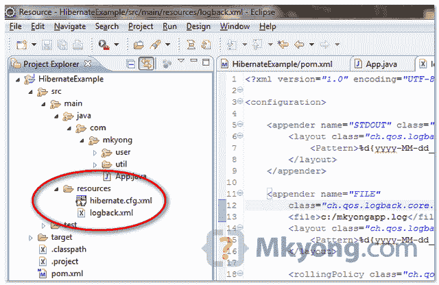

# 如何在 Hibernate–log back 中配置日志记录

> 原文：<http://web.archive.org/web/20230101150211/http://www.mkyong.com/hibernate/how-to-configure-logging-in-hibernate-logback/>

在本教程中，我们将展示如何将[日志记录框架](http://web.archive.org/web/20220517102855/http://logback.qos.ch/)与 Hibernate 集成。

本教程中使用的工具和技术:

1.  Hibernate 3.6.3 .最终版
2.  slf4j-api-1.6.1
3.  回溯-核心-0.9.28
4.  回溯-经典-0.9.28
5.  Eclipse 3.6
6.  Maven 3.0.3

## 1.获取 SLF4j + Logback

要在 Hibernate web 应用程序中使用 logback，您需要 3 个库:

1.  slf4j-api.jar
2.  测井岩心
3.  回溯-经典

*文件:pom.xml*

```
 <project ...>
	<repositories>
		<repository>
			<id>JBoss repository</id>
			<url>http://repository.jboss.org/nexus/content/groups/public/</url>
		</repository>
	</repositories>

	<dependencies>

		<dependency>
			<groupId>org.hibernate</groupId>
			<artifactId>hibernate-core</artifactId>
			<version>3.6.3.Final</version>
		</dependency>

		<!-- logback -->
		<dependency>
			<groupId>ch.qos.logback</groupId>
			<artifactId>logback-core</artifactId>
			<version>0.9.28</version>
		</dependency>

		<dependency>
			<groupId>ch.qos.logback</groupId>
			<artifactId>logback-classic</artifactId>
			<version>0.9.28</version>
		</dependency>

	</dependencies>
</project> 
```

**Where is slf4j-api.jar?**
The **slf4j-api.jar** is defined as the dependency of “**hibernate-core**“, so , you do not need to declare it again.

## 2.logback.xml

创建一个" **logback.xml** "文件，并将其放入项目的类路径中，见下图:



一个经典的“`logback.xml`”例子。

```
 <?xml version="1.0" encoding="UTF-8"?>
<configuration>

 <appender name="STDOUT" class="ch.qos.logback.core.ConsoleAppender">
	<encoder class="ch.qos.logback.classic.encoder.PatternLayoutEncoder">
		<Pattern>%d{yyyy-MM-dd_HH:mm:ss.SSS} %-5level %logger{36} - %msg%n
                </Pattern>
	</encoder>
 </appender>

 <appender name="FILE"
	class="ch.qos.logback.core.rolling.RollingFileAppender">
	<file>c:/mkyongapp.log</file>
	<encoder class="ch.qos.logback.classic.encoder.PatternLayoutEncoder">
	   <Pattern>%d{yyyy-MM-dd_HH:mm:ss.SSS} [%thread] %-5level %logger{36} - %msg%n
           </Pattern>
	</encoder>

	<rollingPolicy class="ch.qos.logback.core.rolling.FixedWindowRollingPolicy">
		<FileNamePattern>c:/mkyongapp.%i.log.zip</FileNamePattern>
		<MinIndex>1</MinIndex>
		<MaxIndex>10</MaxIndex>
	</rollingPolicy>

	<triggeringPolicy
		class="ch.qos.logback.core.rolling.SizeBasedTriggeringPolicy">
		<MaxFileSize>2MB</MaxFileSize>
	</triggeringPolicy>

  </appender>

  <logger name="org.hibernate.type" level="ALL" />
  <logger name="org.hibernate" level="DEBUG" />

  <root level="INFO">
	<appender-ref ref="FILE" />
	<appender-ref ref="STDOUT" />
  </root>

</configuration> 
```

使用这个`logback.xml`配置，这意味着将所有 web 应用程序日志记录输出重定向到控制台和一个位于`c:/mkyongapp.log`的文件。

## 3.输出

参见下面“`C:\\mkyongapp.log`”处的日志记录输出:

```
 //...
2011-04-23_14:34:08.055 [main] DEBUG o.h.transaction.JDBCTransaction - commit
2011-04-23_14:34:08.056 [main] DEBUG o.h.e.d.AbstractFlushingEventListener - processing flush-time cascades
2011-04-23_14:34:08.056 [main] DEBUG o.h.e.d.AbstractFlushingEventListener - dirty checking collections
2011-04-23_14:34:08.058 [main] DEBUG o.h.e.d.AbstractFlushingEventListener - Flushed: 1 insertions, 0 updates, 0 deletions to 1 objects
2011-04-23_14:34:08.058 [main] DEBUG o.h.e.d.AbstractFlushingEventListener - Flushed: 0 (re)creations, 0 updates, 0 removals to 0 collections
2011-04-23_14:34:08.059 [main] DEBUG org.hibernate.pretty.Printer - listing entities:
2011-04-23_14:34:08.060 [main] DEBUG org.hibernate.pretty.Printer - com.mkyong.user.DBUser{username=Hibernate101, createdBy=system, userId=100, createdDate=Sat Apr 23 14:34:08 SGT 2011}
2011-04-23_14:34:08.064 [main] DEBUG org.hibernate.jdbc.AbstractBatcher - about to open PreparedStatement (open PreparedStatements: 0, globally: 0)
2011-04-23_14:34:08.066 [main] DEBUG org.hibernate.SQL - insert into MKYONG.DBUSER (CREATED_BY, CREATED_DATE, USERNAME, USER_ID) values (?, ?, ?, ?)
2011-04-23_14:34:08.150 [main] TRACE o.h.type.descriptor.sql.BasicBinder - binding parameter [1] as [VARCHAR] - system
2011-04-23_14:34:08.152 [main] TRACE o.h.type.descriptor.sql.BasicBinder - binding parameter [2] as [DATE] - Sat Apr 23 14:34:08 SGT 2011
2011-04-23_14:34:08.153 [main] TRACE o.h.type.descriptor.sql.BasicBinder - binding parameter [3] as [VARCHAR] - Hibernate101
2011-04-23_14:34:08.153 [main] TRACE o.h.type.descriptor.sql.BasicBinder - binding parameter [4] as [INTEGER] - 100 
```

Download it – [Logback-Hibernate-Example.zip](http://web.archive.org/web/20220517102855/http://www.mkyong.com/wp-content/uploads/2011/04/Logback-Hibernate-Example.zip) (8KB)

## 参考

1.  【Java 的简单日志门面(SLF4J)
2.  [回退日志框架](http://web.archive.org/web/20220517102855/http://logback.qos.ch/)

<input type="hidden" id="mkyong-current-postId" value="8632">