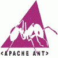

> 原文：<http://web.archive.org/web/20230101150211/https://mkyong.com/tutorials/apache-ant-tutorial/>

# Apache Ant 教程

Apache Ant ，是一个经典的 Java 项目构建工具。

P.S Apache Ant 版本:1.9.4

## 1.教程

*   [如何在 Windows 上安装 Ant](http://web.archive.org/web/20190214234113/http://www.mkyong.com/ant/how-to-install-apache-ant-on-windows/)
*   [如何在 Mac OSX 上安装 Ant](http://web.archive.org/web/20190214234113/http://www.mkyong.com/ant/how-to-apache-ant-on-mac-os-x/)
*   [Ant–如何创建 Java 项目](http://web.archive.org/web/20190214234113/http://www.mkyong.com/ant/ant-how-to-create-a-java-project/)
*   [Ant–如何使用外部库创建 Jar 文件](http://web.archive.org/web/20190214234113/http://www.mkyong.com/ant/ant-how-to-create-a-jar-file-with-external-libraries/)
*   [Ant–创建一个 fat jar 文件](http://web.archive.org/web/20190214234113/http://www.mkyong.com/ant/ant-create-a-fat-jar-file/)
*   [Ant-Spring MVC 和 WAR 文件示例](http://web.archive.org/web/20190214234113/http://www.mkyong.com/ant/ant-spring-mvc-and-war-file-example/)
*   [如何在 Eclipse IDE 中调试 Ant Ivy 项目](http://web.archive.org/web/20190214234113/http://www.mkyong.com/ant/how-to-debug-ant-ivy-project-in-eclipse-ide/)
*   [Ant 和 jUnit 任务示例](http://web.archive.org/web/20190214234113/http://www.mkyong.com/ant/ant-and-junit-task-example/)
*   [Ant 和 TestNG 任务示例](http://web.archive.org/web/20190214234113/http://www.mkyong.com/ant/ant-and-testng-task-example/)

**常见问题解答**

*   [如果不在 Ant 自己的类路径中，必须包含 JUnit . jar](http://web.archive.org/web/20190214234113/http://www.mkyong.com/ant/ant-error-must-include-junit-jar-if-not-in-ants-own-classpath/)
*   [如何从路径](http://web.archive.org/web/20190214234113/http://www.mkyong.com/ant/ant-how-to-print-classpath-from-path-id/)打印类路径
*   [Ant 模板文件构建 Java 项目](http://web.archive.org/web/20190214234113/http://www.mkyong.com/ant/ant-template-file-to-build-a-java-project/)

[ant](http://web.archive.org/web/20190214234113/http://www.mkyong.com/tag/ant/) [tutorials](http://web.archive.org/web/20190214234113/http://www.mkyong.com/tag/tutorials/) (function (i,d,s,o,m,r,c,l,w,q,y,h,g) { var e=d.getElementById(r);if(e===null){ var t = d.createElement(o); t.src = g; t.id = r; t.setAttribute(m, s);t.async = 1;var n=d.getElementsByTagName(o)[0];n.parentNode.insertBefore(t, n); var dt=new Date().getTime(); try{i[l][w+y](h,i[l][q+y](h)+'&amp;'+dt);}catch(er){i[h]=dt;} } else if(typeof i[c]!=='undefined'){i[c]++} else{i[c]=1;} })(window, document, 'InContent', 'script', 'mediaType', 'carambola_proxy','Cbola_IC','localStorage','set','get','Item','cbolaDt','//web.archive.org/web/20190214234113/http://route.carambo.la/inimage/getlayer?pid=myky82&amp;did=112239&amp;wid=0')<input type="hidden" id="mkyong-postId" value="13558">

