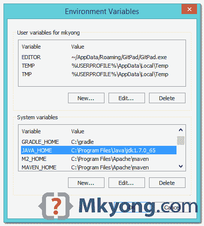
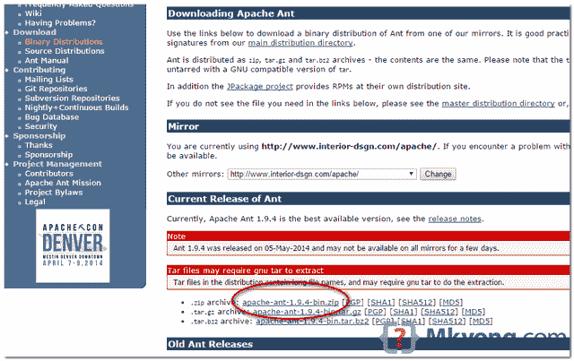
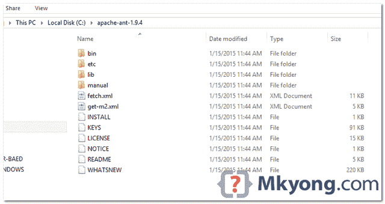
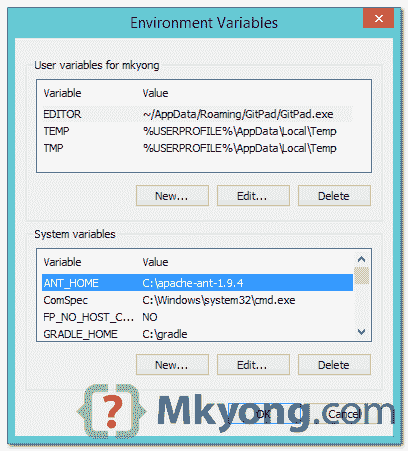
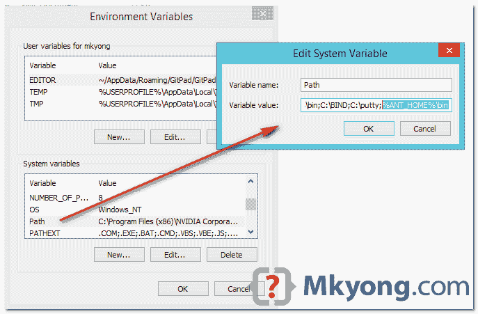

# 如何在 Windows 上安装 Apache Ant

> 原文：<http://web.archive.org/web/20230101150211/http://www.mkyong.com/ant/how-to-install-apache-ant-on-windows/>

要在 Windows 上安装 [Apache Ant](http://web.archive.org/web/20200511132528/http://ant.apache.org/) ，你只需要下载 Ant 的 zip 文件，并解压，配置`ANT_HOME` Windows 环境变量。

使用的工具:

1.  JDK 1.7
2.  Apache Ant 1.9.4
3.  Windows 8.1

## 1.JAVA_HOME

确保安装了 JDK，并且将`JAVA_HOME`配置为 Windows 环境变量。

<noscript></noscript>



## 2.下载 Apache Ant

访问 Apache Ant 官网，下载 Ant 二进制 zip 文件，比如:`apache-ant-1.9.4-bin.zip`，解压到你想要存放 Apache Ant 的文件夹。

<noscript></noscript>



假设你解压到这个文件夹-`C:\apache-ant-1.9.4`

<noscript></noscript>



## 3.添加 ANT_HOME

添加`ANT_HOME`作为 Windows 环境变量，并将其指向您的 Ant 文件夹。

<noscript></noscript>



## 4.更新路径

更新`PATH`变量，在末尾追加`%ANT_HOME%\bin`，这样就可以到处运行蚂蚁的命令了。

<noscript></noscript>



## 5.确认

```java
 C:\Users\mkyong>ant -v
Apache Ant(TM) version 1.9.4 compiled on April 29 2014
Trying the default build file: build.xml
Buildfile: build.xml does not exist!
Build failed 
```

如果您看到上面类似的消息，意味着 Apache Ant 已成功安装在 Windows 上。

## 参考

1.  [安装 Apache Ant](http://web.archive.org/web/20200511132528/http://ant.apache.org/manual/install.html)

Tags : [ant](http://web.archive.org/web/20200511132528/https://mkyong.com/tag/ant/) [windows](http://web.archive.org/web/20200511132528/https://mkyong.com/tag/windows/)<input type="hidden" id="mkyong-current-postId" value="13551">