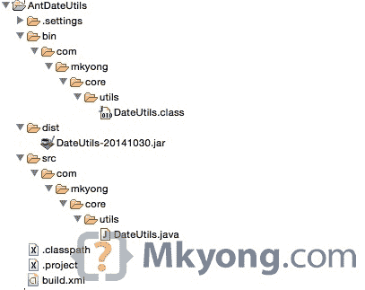

# ant——如何创建 Java 项目

> 原文：<http://web.archive.org/web/20230101150211/http://www.mkyong.com/ant/ant-how-to-create-a-java-project/>

在本教程中，我们将向您展示如何使用 Ant 构建工具来管理 Java 项目、编译并将其打包到 Jar 文件中。

使用的技术:

1.  Eclipse 4.2
2.  Ant 1.9.4
3.  JDK 1.7

## 1.创建一个 Java 项目

在 Eclipse IDE 中，创建一个名为“AntDateUtils”的新 Java 项目。


## 2.Java 源代码

创建一个新的 Java 类来打印当前日期:

src/com/mkyong/core/utils/DateUtils.java

```java
 package com.mkyong.core.utils;

import java.util.Date;

public class DateUtils {

	public static void main(String[] args) {

		System.out.println(getLocalCurrentDate());

	}

	private static Date getLocalCurrentDate() {
		return new Date();		
	}

} 
```

## 3.build.xml

在项目根文件夹中创建一个新的`build.xml`,阅读注释进行自我解释。

build.xml

```java
 <project name="AntJavaProject" default="main" basedir=".">
	<description>
		Create a Java Project (JAR) with Ant build script
	</description>

	<property name="projectName" value="DateUtils" />

	<!-- Java sources -->
	<property name="src.dir" location="src" />

	<!-- Java classes -->
	<property name="build.dir" location="bin" />

	<!-- Output, Jar -->
	<property name="dist.dir" location="dist" />

	<target name="init">
		<!-- Create the time stamp -->
		<tstamp />
		<!-- Create the build directory structure used by compile -->
		<mkdir dir="${build.dir}" />
	</target>

	<target name="compile" depends="init" description="compile the source ">
		<!-- Compile the java code from ${src.dir} into ${build.dir} -->
		<javac includeantruntime="false" srcdir="${src.dir}" destdir="${build.dir}" />
	</target>

	<target name="dist" depends="compile" description="package, output to JAR">

		<!-- Create the distribution directory -->
		<mkdir dir="${dist.dir}" />

		<!-- Put everything in ${build} into the {$projectName}-${DSTAMP}.jar file -->
		<jar jarfile="${dist.dir}/${projectName}-${DSTAMP}.jar" basedir="${build.dir}" >
		    <manifest>
			<!-- create an executable Jar -->
			<attribute name="Main-Class" value="com.mkyong.core.utils.DateUtils" />
		    </manifest>
		</jar>
	</target>

	<target name="clean" description="clean up">
		<delete dir="${build.dir}" />
		<delete dir="${dist.dir}" />
	</target>

	<!-- Default, run this -->
	<target name="main" depends="clean, compile, dist" />

</project> 
```

## 4.Ant 构建脚本

完成后，尝试几个 Ant 的命令

4.1 编译源代码

```java
 $ ant compile 
```

build.xml

```java
 <target name="compile" depends="init" description="compile the source ">
	<javac includeantruntime="false" srcdir="${src.dir}" destdir="${build.dir}" />
</target> 
```

4.2 将项目打包成一个可执行的 Jar 文件

```java
 $ ant dist 
```

build.xml

```java
 <target name="dist" depends="compile" description="package, output to JAR">
	<mkdir dir="${dist.dir}" />
	<jar jarfile="${dist.dir}/${projectName}-${DSTAMP}.jar" basedir="${build.dir}">
	  <manifest>
		<attribute name="Main-Class" value="com.mkyong.core.utils.DateUtils" />
	  </manifest>
	</jar>
</target> 
```

4.3 删除文件夹

```java
 $ ant clean 
```

build.xml

```java
 <target name="clean" description="clean up">
	<delete dir="${build.dir}" />
	<delete dir="${dist.dir}" />
</target> 
```

4.4 如果没有选项，默认目标将被执行，在本例中，默认目标是`main`

build.xml

```java
 <project name="AntJavaProject" default="main" basedir=".">
	...
	<target name="main" depends="clean, compile, dist" /> 
```

```java
 $ ant 
```

输出

```java
 Buildfile: /Users/mkyong/Documents/workspace/AntDateUtils/build.xml
clean:
   [delete] Deleting directory /Users/mkyong/Documents/workspace/AntDateUtils/bin
   [delete] Deleting directory /Users/mkyong/Documents/workspace/AntDateUtils/dist
init:
    [mkdir] Created dir: /Users/mkyong/Documents/workspace/AntDateUtils/bin
compile:
    [javac] Compiling 1 source file to /Users/mkyong/Documents/workspace/AntDateUtils/bin
dist:
    [mkdir] Created dir: /Users/mkyong/Documents/workspace/AntDateUtils/dist
      [jar] Building jar: /Users/mkyong/Documents/workspace/AntDateUtils/dist/DateUtils-20141030.jar
main:
BUILD SUCCESSFUL
Total time: 1 second 
```

最终目录结构



## 5.试验

5.1 在 Jar 文件中运行一个类。

```java
 $ pwd
/Users/mkyong/Documents/workspace/AntDateUtils

$ java -cp dist/DateUtils-20141030.jar com.mkyong.core.utils.DateUtils
Thu Oct 30 17:39:21 MYT 2014 
```

5.2 运行可执行的 Jar 文件

```java
 $ pwd
/Users/mkyong/Documents/workspace/AntDateUtils

$ java -jar dist/DateUtils-20141030.jar
Thu Oct 30 17:40:21 MYT 2014 
```

## 下载源代码

Download It – [AntDateUtils.zip](http://web.archive.org/web/20221225035500/http://www.mkyong.com/wp-content/uploads/2014/10/AntDateUtils.zip) (6 KB)

## 参考

1.  [阿帕奇蚂蚁 Hello 世界官方指南](http://web.archive.org/web/20221225035500/https://ant.apache.org/manual/tutorial-HelloWorldWithAnt.html)

<input type="hidden" id="mkyong-current-postId" value="13493">