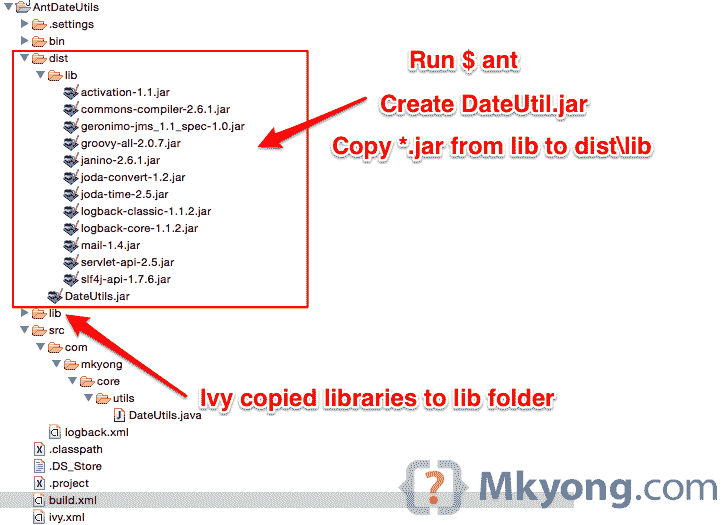

# ant——如何用外部库创建 Jar 文件

> 原文：<http://web.archive.org/web/20230101150211/http://www.mkyong.com/ant/ant-how-to-create-a-jar-file-with-external-libraries/>

在本教程中，我们将向您展示如何使用 Ant 构建脚本来创建 Jar 文件，以及如何使用项目的外部库/依赖项。

使用的技术:

1.  Eclipse 4.2
2.  JDK 1.7
3.  Ant 1.9.4
4.  蚂蚁常春藤 2.4
5.  回溯 1.1.2
6.  joda-时间 2.5

*P.S 之前的 [Ant Java 项目](http://web.archive.org/web/20221225035500/http://www.mkyong.com/ant/ant-how-to-create-a-java-project/)将被重用。*

## 1.项目结构

图 1.1:最终的项目目录结构，在 Eclipse IDE 中。



## 2.Java 项目+外部库

在 Eclipse IDE 中，重新打开之前的 Java 项目 [AntDateUtils](http://web.archive.org/web/20221225035500/http://www.mkyong.com/ant/ant-how-to-create-a-java-project/) ，更新源代码使用`logback`和`joda-time`。

src/com/mkyong/core/utils/DateUtils.java

```
 package com.mkyong.core.utils;

import org.joda.time.LocalDate;
import org.slf4j.Logger;
import org.slf4j.LoggerFactory;

public class DateUtils {

	private static final Logger logger = LoggerFactory.getLogger(DateUtils.class);

	public static void main(String[] args) {

		logger.debug("[MAIN] Current Date : {}", getLocalCurrentDate());
		System.out.println(getLocalCurrentDate());

	}

	private static String getLocalCurrentDate() {

		LocalDate date = new LocalDate();
		return date.toString();

	}

} 
```

创建一个`logback.xml`并把它放在项目`src`文件夹中。参见图 1.1

src/logback.xml

```
 <?xml version="1.0" encoding="UTF-8"?>
<configuration>

	<appender name="STDOUT" class="ch.qos.logback.core.ConsoleAppender">
	  <layout class="ch.qos.logback.classic.PatternLayout">

		<Pattern>
			ANT + LogBack : %-5level %logger{36} - %msg%n
		</Pattern>

	  </layout>
	</appender>

	<root level="debug">
	  <appender-ref ref="STDOUT" />
	</root>

</configuration> 
```

## 3.ivy–获取外部库

我们使用 Apache Ivy 来获取项目的外部库/依赖项。

3.1 创建该文件`ivy.xml`:

ivy.xml

```
 <ivy-module version="2.0">
	<info organisation="org.apache" module="dateUtilsProject" />
	<dependencies>
		<dependency org="joda-time" name="joda-time" rev="2.5"  />
		<dependency org="org.slf4j" name="slf4j-api" rev="1.7.6" />
		<dependency org="ch.qos.logback" name="logback-classic" rev="1.1.2" />
	</dependencies>
</ivy-module> 
```

3.2 更新`build.xml`，在顶部添加 ivy 名称空间，以及下载 ivy 模块的“ivy”任务，以及要求 Ivy 模块下载外部库的“resolve”任务。

build.xml

```
 <project xmlns:ivy="antlib:org.apache.ivy.ant" 
	name="dateUtilsProject" default="main" basedir=".">

	<!-- ivy start -->
	<!-- ivy to get dependencies and copy to project lib folder automatically -->
	<target name="resolve" description="retrieve dependencies with ivy">
		<ivy:retrieve />
	</target>

	<!-- install ivy -->
	<target name="ivy" description="Install ivy">
		<mkdir dir="${user.home}/.ant/lib" />
		<get dest="${user.home}/.ant/lib/ivy.jar" 
			src="http://search.maven.org/remotecontent?filepath=org/apache/ivy/ivy/2.4.0-rc1/ivy-2.4.0-rc1.jar" />
	</target>
	<!-- ivy end -->

</project> 
```

第一次，从 Maven center 资源库下载 ivy 模块到本地`${user.home}/.ant/lib/ivy.jar`。

```
 $ ant ivy 
```

要下载外部库，请运行任务“解决”。声明的库将被下载到项目`lib`文件夹。

```
 $ ant resolve 
```

## 4.build.xml

查看更新后的`build.xml`脚本，阅读注释以了解自明性。

要点:

1.  使用 Apache Ivy 管理项目外部库，检查顶层的 Ivy 名称空间，并执行“resolve”任务。
2.  要编译源代码，您需要声明类路径。查看任务“编译”和“classpathref”属性。
3.  在“jar”任务中，构建外部库的完整列表，并将其放入`manifest.mf`文件中。
4.  在“jar”任务中，项目 jar 将被打包到文件夹“dist ”,整个外部库将被从“lib”复制到“dist/lib”。

build.xml

```
 <project xmlns:ivy="antlib:org.apache.ivy.ant" 
       name="dateUtilsProject" default="main" basedir=".">
	<description>
		Create a Java Project (JAR) with Ant build script
	</description>

	<property name="projectName" value="DateUtils" />
	<property name="src.dir" location="src" />
	<property name="build.dir" location="bin" />
	<property name="dist.dir" location="dist" />
	<property name="dist.lib.dir" location="dist/lib" />
	<property name="lib.dir" value="lib" />
	<property name="main-class" value="com.mkyong.core.utils.DateUtils" />

	<!-- ivy start -->
	<!-- ivy to get dependencies and copy to project lib folder automatically -->
	<target name="resolve" description="retrieve dependencies with ivy">
		<ivy:retrieve />
	</target>

	<!-- install ivy -->
	<target name="ivy" description="Install ivy">
		<mkdir dir="${user.home}/.ant/lib" />
		<get dest="${user.home}/.ant/lib/ivy.jar" src="http://search.maven.org/remotecontent?filepath=org/apache/ivy/ivy/2.4.0-rc1/ivy-2.4.0-rc1.jar" />
	</target>
	<!-- ivy end -->

	<target name="init">
		<mkdir dir="${build.dir}" />
	</target>

	<!-- external libraries classpath, we don't need sources and javadoc -->
	<path id="classpath">
		<fileset dir="${basedir}/">
			<include name="${lib.dir}/*.jar" />
			<exclude name="${lib.dir}/*sources.jar"/>
			<exclude name="${lib.dir}/*javadoc.jar"/>
		</fileset>
	</path>

	<!-- To work with external libraries, need classpath to compile -->
	<target name="compile" depends="init" description="compile the source ">
		<javac includeantruntime="false" srcdir="${src.dir}" destdir="${build.dir}" classpathref="classpath" />
	</target>

	<!-- constructs the external libraries classpath name -->
	<pathconvert property="classpath.name" pathsep=" ">
		<path refid="classpath" />
		<mapper>
			<chainedmapper>
				<flattenmapper />
				<globmapper from="*.jar" to="lib/*.jar" />
			</chainedmapper>
		</mapper>
	</pathconvert>

	<target name="copy-dependencies">
		<copy todir="${dist.lib.dir}">
			<fileset dir="${lib.dir}" includes="**/*.jar" excludes="**/*sources.jar, **/*javadoc.jar" />
		</copy>
	</target>

	<!-- jar it, and declares the ext libraries in manifest.mf file -->
	<target name="jar" depends="compile, copy-dependencies" description="package, output to JAR">

		<echo message="classpath.name : ${classpath.name} " />

		<mkdir dir="${dist.dir}" />
		<mkdir dir="${dist.lib.dir}" />

		<jar jarfile="${dist.dir}/${projectName}.jar" basedir="${build.dir}">
			<manifest>
				<attribute name="Main-Class" value="${main-class}" />
				<attribute name="Class-Path" value="${classpath.name}" />
			</manifest>
		</jar>
	</target>

	<target name="clean" description="clean up">
		<delete dir="${build.dir}" />
		<delete dir="${dist.dir}" />
	</target>

	<!-- Default, run this -->
	<target name="main" depends="clean, compile, jar" />

</project> 
```

## 5.试验

用 Ant 构建脚本测试 Java 项目。

5.1 装罐。

```
 $ pwd
/Users/mkyong/Documents/workspace/AntDateUtils

$ ant
Buildfile: /Users/mkyong/Documents/workspace/AntDateUtils/build.xml

clean:
   [delete] Deleting directory /Users/mkyong/Documents/workspace/AntDateUtils/bin
   [delete] Deleting directory /Users/mkyong/Documents/workspace/AntDateUtils/dist

init:
    [mkdir] Created dir: /Users/mkyong/Documents/workspace/AntDateUtils/bin

compile:
    [javac] Compiling 1 source file to /Users/mkyong/Documents/workspace/AntDateUtils/bin

copy-dependencies:
     [copy] Copying 12 files to /Users/mkyong/Documents/workspace/AntDateUtils/dist/lib

jar:
     [echo] classpath.name : ... lib/joda-time-2.5.jar lib/logback-classic-1.1.2.jar lib/logback-core-1.1.2.jar lib/mail-1.4.jar ...

      [jar] Building jar: /Users/mkyong/Documents/workspace/AntDateUtils/dist/DateUtils.jar

main:

BUILD SUCCESSFUL
Total time: 1 second 
```

5.2 检查生成的 jar 文件。

```
 $ jar -tf dist/DateUtils.jar 

META-INF/
META-INF/MANIFEST.MF
com/
com/mkyong/
com/mkyong/core/
com/mkyong/core/utils/
com/mkyong/core/utils/DateUtils.class 
```

META-INF/MANIFEST.MF

```
 Manifest-Version: 1.0
Ant-Version: Apache Ant 1.9.4
Created-By: 1.7.0_05-b05 (Oracle Corporation)
Main-Class: com.mkyong.core.utils.DateUtils
Class-Path: lib/activation-1.1.jar lib/commons-compiler-2.6.1.jar lib/
 geronimo-jms_1.1_spec-1.0.jar lib/groovy-all-2.0.7.jar lib/janino-2.6
 .1.jar lib/joda-convert-1.2.jar lib/joda-time-2.5.jar lib/logback-cla
 ssic-1.1.2.jar lib/logback-core-1.1.2.jar lib/mail-1.4.jar lib/servle
 t-api-2.5.jar lib/slf4j-api-1.7.6.jar 
```

5.3 运行 Jar 文件。

```
 $ pwd
/Users/mkyong/Documents/workspace/AntDateUtils

$ java -jar dist/DateUtils.jar 

16:28:43.957 [main] DEBUG com.mkyong.core.utils.DateUtils - [MAIN] Current Date : 2014-11-21
2014-11-21 
```

5.4 用`logback.xml`再次运行 Jar 文件。

```
 $ pwd
/Users/mkyong/Documents/workspace/AntDateUtils

$ java -jar -Dlogback.configurationFile=src/logback.xml dist/DateUtils.jar

16:34:43,746 |-INFO in ch.qos.logback.classic.LoggerContext[default] - Found resource [src/logback.xml] at [file:/Users/mkyong/Documents/workspace/AntDateUtils/src/logback.xml]
//...

ANT + LogBack : DEBUG com.mkyong.core.utils.DateUtils - [MAIN] Current Date : 2014-11-21
2014-11-21 
```

## 下载源代码

Download it – [AntDateUtils-External-Libraries.zip](http://web.archive.org/web/20221225035500/http://www.mkyong.com/wp-content/uploads/2014/11/AntDateUtils-External-Libraries.zip) (8 KB)

## 参考

1.  [阿帕奇蚂蚁 Hello 世界官方指南](http://web.archive.org/web/20221225035500/https://ant.apache.org/manual/tutorial-HelloWorldWithAnt.html)
2.  [如何用 Maven 创建 Jar 文件](http://web.archive.org/web/20221225035500/http://www.mkyong.com/maven/how-to-create-a-jar-file-with-maven/)
3.  [蚂蚁罐子任务](http://web.archive.org/web/20221225035500/https://ant.apache.org/manual/Tasks/jar.html)
4.  [蚂蚁复制任务](http://web.archive.org/web/20221225035500/https://ant.apache.org/manual/Tasks/copy.html)

<input type="hidden" id="mkyong-current-postId" value="13500">