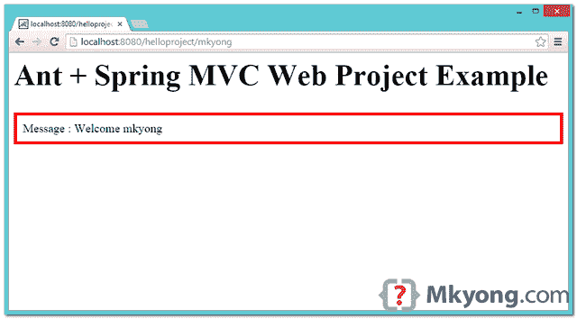

# ant-Spring MVC 和 WAR 文件示例

> 原文：<http://web.archive.org/web/20230101150211/http://www.mkyong.com/ant/ant-spring-mvc-and-war-file-example/>

在本教程中，我们将向您展示如何使用 Ant 构建脚本来管理 Spring MVC web 应用程序项目，创建 WAR 文件并部署到 Tomcat。

使用的技术:

1.  Eclipse 4.2
2.  JDK 1.7
3.  Ant 1.9.4
4.  蚂蚁常春藤 2.4
5.  回溯 1.1.2
6.  jstl 1.2
7.  弹簧 4.1.3 .释放
8.  Tomcat 7

## 1.项目目录

审查最终项目结构:


1.  资源——放置 Java 源代码所需的 xml 和属性文件。比如 log4j.properties，logback.xml，db.properties 等等。
2.  src–放 Java 源代码。
3.  目标–最终的 WAR 文件将存储在这里。
4.  战争——与网络相关的东西。
5.  WAR/WEB-INF–WAR 文件的标准 we b-INF 目录结构。
6.  war/resources–用于 css 和 js 文件

## 2.项目相关性

我们使用 Ivy 下载项目依赖关系:

ivy.xml

```
 <ivy-module version="2.0">
	<info organisation="org.apache" module="WebProject" />

	<!-- Classpath management, thanks Maven -->
	<configurations>
        <conf name="compile" description="compile dependencies"/>
        <conf name="runtime" description="runtime dependencies" extends="compile"/>
        <conf name="test"    description="test dependencies" extends="runtime"/>
    </configurations>

	<dependencies>
		<dependency org="org.slf4j" name="slf4j-api" rev="1.7.6" conf="compile->default"/>
		<dependency org="jstl" name="jstl" rev="1.2" conf="compile->default"/>
		<dependency org="ch.qos.logback" name="logback-classic" rev="1.1.2" conf="compile->default"/>
		<dependency org="org.springframework" name="spring-core" rev="4.1.3.RELEASE" conf="compile->default"/>
		<dependency org="org.springframework" name="spring-beans" rev="4.1.3.RELEASE" conf="compile->default"/>
		<dependency org="org.springframework" name="spring-context" rev="4.1.3.RELEASE" conf="compile->default"/>
		<dependency org="org.springframework" name="spring-web" rev="4.1.3.RELEASE" conf="compile->default"/>
		<dependency org="org.springframework" name="spring-webmvc" rev="4.1.3.RELEASE" conf="compile->default"/>
	</dependencies>
</ivy-module> 
```

## 3.Ant 构建脚本

Ant 脚本来管理这个 Spring MVC 项目，不言自明。

build.xml

```
 <project xmlns:ivy="antlib:org.apache.ivy.ant" name="HelloProject" default="main" basedir=".">
	<description>
		Create a Spring MVC (WAR) with Ant build script
	</description>

	<!-- Project Structure -->
	<property name="jdk.version" value="1.7" />
	<property name="projectName" value="WebProject" />
	<property name="src.dir" location="src" />
	<property name="resources.dir" location="resources" />
	<property name="web.dir" value="war" />
	<property name="web.classes.dir" location="${web.dir}/WEB-INF/classes" />
	<property name="target.dir" location="target" />
	<property name="target.temp.dir" location="target/temp" />
	<property name="lib.dir" value="lib" />

	<!-- ivy start -->
	<target name="resolve" description="retrieve dependencies with ivy">
		<echo message="Getting dependencies..." />
		<ivy:retrieve />

		<ivy:cachepath pathid="compile.path" conf="compile" />
		<ivy:cachepath pathid="runtime.path" conf="runtime" />
		<ivy:cachepath pathid="test.path" conf="test" />

	</target>

	<!-- install ivy if you don't have ivyide-->
	<target name="ivy" description="Install ivy">
		<mkdir dir="${user.home}/.ant/lib" />
		<get dest="${user.home}/.ant/lib/ivy.jar" 
		src="http://search.maven.org/remotecontent?filepath=org/apache/ivy/ivy/2.4.0-rc1/ivy-2.4.0-rc1.jar" />
	</target>
	<!-- ivy end -->

	<!-- Compile Java source from ${src.dir} and output it to ${web.classes.dir} -->
	<target name="compile" depends="init, resolve" description="compile source code">
		<mkdir dir="${web.classes.dir}" />
		<javac destdir="${web.classes.dir}" source="${jdk.version}" target="${jdk.version}" 
			debug="true" includeantruntime="false" classpathref="compile.path">
			<src path="${src.dir}" />
		</javac>
	</target>

	<!-- Copy *.xml or *.properties from ${resources.dir} to ${web.classes.dir} -->
	<target name="copy-resources" 
                description="copy Java resources like xml and properties files">
		<copy todir="${web.classes.dir}">
			<fileset dir="${resources.dir}">
				<include name="**/*.xml" />
				<include name="**/*.properties" />
			</fileset>
		</copy>
	</target>

	<!-- Create the final WAR file for deployment -->
	<target name="package" depends="clean, compile, copy-resources" 
                description="create a war file">

		<!-- ivy get dependencies and put it in ${lib.dir} -->
		<ivy:retrieve pattern="${lib.dir}/[artifact]-[revision].[ext]" conf="runtime" />

		<war destfile="${target.dir}/helloproject.war" webxml="${web.dir}/WEB-INF/web.xml">

			<webinf dir="${web.dir}/WEB-INF" />
			<lib dir="${lib.dir}" />
			<zipfileset dir="${web.dir}/resources" prefix="resources" />
		</war>
	</target>

	<!-- Create folders -->
	<target name="init">
		<mkdir dir="${src.dir}" />
		<mkdir dir="${target.dir}" />
		<mkdir dir="${web.classes.dir}" />
	</target>

	<!-- Delete folders -->
	<target name="clean" description="clean up">
		<delete dir="${web.classes.dir}" />
		<delete dir="${target.dir}" />
	</target>

	<target name="main" depends="package" />

</project> 
```

## 4.Spring MVC、JSP 和 XML 文件

如果您感兴趣，这里有完整的 Java、XML 和 JSP 文件。

4.1 Spring MVC 控制器类。

WelcomeController.java

```
 package com.mkyong.controller;

import org.slf4j.Logger;
import org.slf4j.LoggerFactory;
import org.springframework.stereotype.Controller;
import org.springframework.ui.ModelMap;
import org.springframework.web.bind.annotation.PathVariable;
import org.springframework.web.bind.annotation.RequestMapping;
import org.springframework.web.bind.annotation.RequestMethod;

@Controller
public class WelcomeController {

	private static final String VIEW_INDEX = "index";
	private final static Logger logger = LoggerFactory.getLogger(WelcomeController.class);

	@RequestMapping(value = "/", method = RequestMethod.GET)
	public String welcome(ModelMap model) {

		model.addAttribute("message", "");
		logger.debug("[welcome]");

		return VIEW_INDEX;

	}

	@RequestMapping(value = "/{name}", method = RequestMethod.GET)
	public String welcomeName(@PathVariable String name, ModelMap model) {

		model.addAttribute("message", "Welcome " + name);
		logger.debug("[welcomeName] name : {}", name);
		return VIEW_INDEX;

	}

} 
```

4.2 简单的日志返回配置文件，用于日志记录。

logback.xml

```
 <?xml version="1.0" encoding="UTF-8"?>
<configuration>

	<appender name="STDOUT" class="ch.qos.logback.core.ConsoleAppender">
	  <layout class="ch.qos.logback.classic.PatternLayout">

		<Pattern>
			ANT + LogBack : %-5level %logger{36} - %msg%n
		</Pattern>

	  </layout>
	</appender>

	<root level="debug">
	  <appender-ref ref="STDOUT" />
	</root>

</configuration> 
```

4.3 JSP 和 CSS 文件。

war/WEB-INF/pages/index.jsp

```
 <%@taglib prefix="c" uri="http://java.sun.com/jsp/jstl/core"%>
<c:url var="resources" value="/resources/theme1" scope="request" />

<html>
<head>
<link href="${resources}/css/core.css" rel="stylesheet">
</head>
<body>
<h1>Ant + Spring MVC Web Project Example</h1>

<p>Message : ${message}</p>	
</body>
</html> 
```

war/resources/theme1/css/core.css

```
 h1 {
	font-size: 50px;
}

p {
	font-size: 20px;
	border: 5px solid red;
	padding:10px;
} 
```

4.4 弹簧配置。

mvc-dispatcher-servlet.xml

```
 <beans 
	xmlns:context="http://www.springframework.org/schema/context"
	xmlns:xsi="http://www.w3.org/2001/XMLSchema-instance"
	xmlns:mvc="http://www.springframework.org/schema/mvc"
	xsi:schemaLocation="
        http://www.springframework.org/schema/beans     
        http://www.springframework.org/schema/beans/spring-beans.xsd
        http://www.springframework.org/schema/context 
        http://www.springframework.org/schema/context/spring-context.xsd
        http://www.springframework.org/schema/mvc 
		http://www.springframework.org/schema/mvc/spring-mvc.xsd">

	<context:component-scan base-package="com.mkyong.controller" />

	<bean
		class="org.springframework.web.servlet.view.InternalResourceViewResolver">
		<property name="prefix">
			<value>/WEB-INF/pages/</value>
		</property>
		<property name="suffix">
			<value>.jsp</value>
		</property>
	</bean>

	<!-- for web resources like images, css and js files -->
	<mvc:resources mapping="/resources/**" location="/resources/" />

	<mvc:annotation-driven />

</beans> 
```

4.5 一个标准的 web.xml，与 Spring 容器集成。

web.xml

```
 <web-app  
        xmlns:xsi="http://www.w3.org/2001/XMLSchema-instance"
		xsi:schemaLocation="http://java.sun.com/xml/ns/javaee 
	      http://java.sun.com/xml/ns/javaee/web-app_2_5.xsd"
	version="2.5">

	<display-name>Ant + Spring MVC Web Application</display-name>

	<servlet>
		<servlet-name>mvc-dispatcher</servlet-name>
		<servlet-class>org.springframework.web.servlet.DispatcherServlet</servlet-class>
		<load-on-startup>1</load-on-startup>
	</servlet>

	<servlet-mapping>
		<servlet-name>mvc-dispatcher</servlet-name>
		<url-pattern>/</url-pattern>
	</servlet-mapping>

	<context-param>
		<param-name>contextConfigLocation</param-name>
		<param-value>/WEB-INF/mvc-dispatcher-servlet.xml</param-value>
	</context-param>

	<listener>
		<listener-class>org.springframework.web.context.ContextLoaderListener</listener-class>
	</listener>
</web-app> 
```

## 5.运行和测试

5.1 默认情况下，它会运行`package`任务。

```
 $ pwd
/Users/mkyong/Documents/workspace/AntSpringMVC

$ ant

Buildfile: /Users/mkyong/Documents/workspace/AntSpringMVC/build.xml

clean:
   [delete] Deleting directory /Users/mkyong/Documents/workspace/AntSpringMVC/war/WEB-INF/classes
   [delete] Deleting directory /Users/mkyong/Documents/workspace/AntSpringMVC/target

init:
    [mkdir] Created dir: /Users/mkyong/Documents/workspace/AntSpringMVC/target
    [mkdir] Created dir: /Users/mkyong/Documents/workspace/AntSpringMVC/war/WEB-INF/classes

resolve:
     [echo] Getting dependencies...
[ivy:retrieve] :: Apache Ivy 2.4.0-rc1 - 20140315220245 :: http://ant.apache.org/ivy/ ::
[ivy:retrieve] :: loading settings :: url = jar:file:/Users/mkyong/.ant/lib/ivy.jar!/org/apache/ivy/core/settings/ivysettings.xml
[ivy:retrieve] :: resolving dependencies :: org.apache#WebProject;working@mkyong-mac
[ivy:retrieve] 	confs: [compile, runtime, test]
[ivy:retrieve] 	found org.slf4j#slf4j-api;1.7.6 in public
[ivy:retrieve] 	found jstl#jstl;1.2 in public
[ivy:retrieve] 	found ch.qos.logback#logback-classic;1.1.2 in public
[ivy:retrieve] 	found ch.qos.logback#logback-core;1.1.2 in public
[ivy:retrieve] 	found org.springframework#spring-core;4.1.3.RELEASE in public
[ivy:retrieve] 	found commons-logging#commons-logging;1.2 in public
[ivy:retrieve] 	found org.springframework#spring-beans;4.1.3.RELEASE in public
[ivy:retrieve] 	found org.springframework#spring-context;4.1.3.RELEASE in public
[ivy:retrieve] 	found org.springframework#spring-aop;4.1.3.RELEASE in public
[ivy:retrieve] 	found aopalliance#aopalliance;1.0 in public
[ivy:retrieve] 	found org.springframework#spring-expression;4.1.3.RELEASE in public
[ivy:retrieve] 	found org.springframework#spring-web;4.1.3.RELEASE in public
[ivy:retrieve] 	found org.springframework#spring-webmvc;4.1.3.RELEASE in public
[ivy:retrieve] :: resolution report :: resolve 974ms :: artifacts dl 19ms
	---------------------------------------------------------------------
	|                  |            modules            ||   artifacts   |
	|       conf       | number| search|dwnlded|evicted|| number|dwnlded|
	---------------------------------------------------------------------
	|      compile     |   13  |   0   |   0   |   0   ||   13  |   0   |
	|      runtime     |   13  |   0   |   0   |   0   ||   13  |   0   |
	|       test       |   13  |   0   |   0   |   0   ||   13  |   0   |
	---------------------------------------------------------------------
[ivy:retrieve] :: retrieving :: org.apache#WebProject
[ivy:retrieve] 	confs: [compile, runtime, test]
[ivy:retrieve] 	2 artifacts copied, 11 already retrieved (682kB/31ms)

compile:
    [javac] Compiling 1 source file to /Users/mkyong/Documents/workspace/AntSpringMVC/war/WEB-INF/classes

copy-resources:
     [copy] Copying 1 file to /Users/mkyong/Documents/workspace/AntSpringMVC/war/WEB-INF/classes

package:
[ivy:retrieve] :: retrieving :: org.apache#WebProject
[ivy:retrieve] 	confs: [runtime]
[ivy:retrieve] 	0 artifacts copied, 13 already retrieved (0kB/11ms)
      [war] Building war: /Users/mkyong/Documents/workspace/AntSpringMVC/target/helloproject.war

main:

BUILD SUCCESSFUL
Total time: 3 seconds 
```

根据您开发环境，上述结果可能会有所不同。如果构建成功，最终的 WAR 文件将被创建在`target`文件夹中。

5.2 查看生成的 WAR 文件的内容—`helloproject.war`

```
 mkyong-mac:AntSpringMVC mkyong$ tar -tvf target/helloproject.war 
drwxrwxrwx  0 0      0           0 Dec 26 16:55 META-INF/
-rwxrwxrwx  0 0      0         103 Dec 26 16:55 META-INF/MANIFEST.MF
drwxrwxrwx  0 0      0           0 Dec 26 16:55 WEB-INF/
-rwxrwxrwx  0 0      0         897 Dec 24 15:05 WEB-INF/web.xml
drwxrwxrwx  0 0      0           0 Dec 26 16:55 WEB-INF/classes/
drwxrwxrwx  0 0      0           0 Dec 26 16:55 WEB-INF/classes/com/
drwxrwxrwx  0 0      0           0 Dec 26 16:55 WEB-INF/classes/com/mkyong/
drwxrwxrwx  0 0      0           0 Dec 26 16:55 WEB-INF/classes/com/mkyong/controller/
drwxrwxrwx  0 0      0           0 Dec 24 17:05 WEB-INF/lib/
drwxrwxrwx  0 0      0           0 Dec 24 15:04 WEB-INF/pages/
-rwxrwxrwx  0 0      0        1903 Dec 26 16:55 WEB-INF/classes/com/mkyong/controller/WelcomeController.class
-rwxrwxrwx  0 0      0         372 Dec 26 16:55 WEB-INF/classes/logback.xml
-rwxrwxrwx  0 0      0        1030 Dec 25 13:41 WEB-INF/mvc-dispatcher-servlet.xml
-rwxrwxrwx  0 0      0         311 Dec 25 13:44 WEB-INF/pages/index.jsp
-rwxrwxrwx  0 0      0        4467 Aug  1  2005 WEB-INF/lib/aopalliance-1.0.jar
-rwxrwxrwx  0 0      0       61829 Jul  6 02:12 WEB-INF/lib/commons-logging-1.2.jar
-rwxrwxrwx  0 0      0      414240 Jul 22  2006 WEB-INF/lib/jstl-1.2.jar
-rwxrwxrwx  0 0      0      270750 Apr  3  2014 WEB-INF/lib/logback-classic-1.1.2.jar
-rwxrwxrwx  0 0      0      427729 Apr  3  2014 WEB-INF/lib/logback-core-1.1.2.jar
-rwxrwxrwx  0 0      0       28688 Feb  6  2014 WEB-INF/lib/slf4j-api-1.7.6.jar
-rwxrwxrwx  0 0      0      359018 Dec  9 18:48 WEB-INF/lib/spring-aop-4.1.3.RELEASE.jar
-rwxrwxrwx  0 0      0      707820 Dec  9 18:48 WEB-INF/lib/spring-beans-4.1.3.RELEASE.jar
-rwxrwxrwx  0 0      0     1026840 Dec  9 18:48 WEB-INF/lib/spring-context-4.1.3.RELEASE.jar
-rwxrwxrwx  0 0      0     1006709 Dec  9 18:48 WEB-INF/lib/spring-core-4.1.3.RELEASE.jar
-rwxrwxrwx  0 0      0      259164 Dec  9 18:48 WEB-INF/lib/spring-expression-4.1.3.RELEASE.jar
-rwxrwxrwx  0 0      0      713531 Dec  9 18:48 WEB-INF/lib/spring-web-4.1.3.RELEASE.jar
-rwxrwxrwx  0 0      0      781676 Dec  9 18:48 WEB-INF/lib/spring-webmvc-4.1.3.RELEASE.jar
drwxrwxrwx  0 0      0           0 Dec 26 16:48 resources/
drwxrwxrwx  0 0      0           0 Dec 25 13:30 resources/theme1/
drwxrwxrwx  0 0      0           0 Dec 25 13:27 resources/theme1/css/
-rwxrwxrwx  0 0      0          88 Dec 25 13:45 resources/theme1/css/core.css 
```

所有文件都是放置属性，要部署它只需复制`helloproject.war`并将其放入`$Tomcat/webapps`文件夹。

5.3 http://localhost:8080/hello project/


5.4 http://localhost:8080/hello project/mkyong

**Note**
Follow up : [how to debug this ant-ivy project in Eclipse IDE](http://web.archive.org/web/20221031160054/http://www.mkyong.com/ant/how-to-debug-ant-ivy-project-in-eclipse-ide/).

## 下载源代码

Download It – [Ant-SpringMVC-Example.zip](http://web.archive.org/web/20221031160054/http://www.mkyong.com/wp-content/uploads/2014/12/Ant-SpringMVC-Example.zip) (26 KB)

## 参考

1.  [蚂蚁常春藤检索模式](http://web.archive.org/web/20221031160054/https://ant.apache.org/ivy/history/latest-milestone/use/retrieve.html)
2.  [蚂蚁类型 zipfileset](http://web.archive.org/web/20221031160054/https://ant.apache.org/manual/Types/zipfileset.html)
3.  [蚂蚁大战任务](http://web.archive.org/web/20221031160054/https://ant.apache.org/manual/Tasks/war.html)
4.  [蚂蚁复制任务](http://web.archive.org/web/20221031160054/https://ant.apache.org/manual/Tasks/copy.html)
5.  [Stackoverflow : Ivy 类路径管理](http://web.archive.org/web/20221031160054/https://stackoverflow.com/questions/14029777/is-there-any-ant-feature-that-copies-classpath-dependencies-to-web-inf-lib)
6.  [W3schools CSS Border](http://web.archive.org/web/20221031160054/https://www.w3schools.com/css/css_border.asp)
7.  [Ant–如何使用外部库创建 Jar 文件](http://web.archive.org/web/20221031160054/http://www.mkyong.com/ant/ant-how-to-create-a-jar-file-with-external-libraries/)
8.  [伊夫德 WTP 集成](http://web.archive.org/web/20221031160054/https://ant.apache.org/ivy/ivyde/history/latest-milestone/cpc/wtp.html)
9.  [Maven:如何创建 web 项目](http://web.archive.org/web/20221031160054/http://www.mkyong.com/maven/how-to-create-a-web-application-project-with-maven/)
10.  [Spring IO : Spring MVC 步步为营](http://web.archive.org/web/20221031160054/https://docs.spring.io/docs/Spring-MVC-step-by-step/part1.html)

<input type="hidden" id="mkyong-current-postId" value="13508">