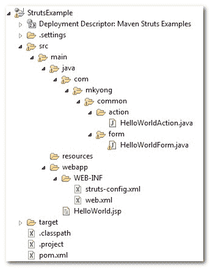
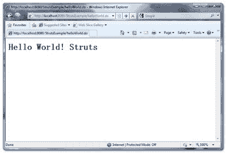

# Struts Hello World 示例

> 原文：<http://web.archive.org/web/20230101150211/http://www.mkyong.com/struts/struts-hello-world-example/>

在本教程中，我们将向您展示如何使用经典的 **Struts 1.3** 框架开发 hello world web 应用程序。

使用的工具和技术:

1.  Struts 1.3.10
2.  胃 2.x
3.  Eclipse 3.6

## 最终项目结构

我们先来看看最终的文件夹结构。



## 1.Maven 模板

用 Maven 命令“ **mvn 原型:生成**”生成快速入门 Java 项目结构，选择模板 18 为简单的 Java web 项目模板。

```
 Define value for groupId: : com.mkyong.common
Define value for artifactId: : StrutsExample
Define value for version:  1.0-SNAPSHOT: :
Define value for package:  com.mkyong.common: : com.mkyong.common
...
[INFO] ------------------------------------------------------------------------
[INFO] BUILD SUCCESSFUL
[INFO] ------------------------------------------------------------------------
[INFO] Total time: 1 minute 5 seconds
[INFO] Finished at: Thu Apr 08 11:29:30 SGT 2010
[INFO] Final Memory: 8M/14M
[INFO] ------------------------------------------------------------------------ 
```

## 2.pom.xml 文件配置

在 pom.xml 中添加 Struts 依赖项，在 Struts 1.x 中，核心模块需要 **struts-core.jar** ，标签库需要 **struts-taglib.jar** 。

```
 <project  
  xmlns:xsi="http://www.w3.org/2001/XMLSchema-instance"
  xsi:schemaLocation="http://maven.apache.org/POM/4.0.0 
  http://maven.apache.org/maven-v4_0_0.xsd">
  <modelVersion>4.0.0</modelVersion>
  <groupId>com.mkyong.common</groupId>
  <artifactId>StrutsExample</artifactId>
  <packaging>war</packaging>
  <version>1.0-SNAPSHOT</version>
  <name>StrutsExample Maven Webapp</name>
  <url>http://maven.apache.org</url>
  <dependencies>
    <dependency>
      <groupId>junit</groupId>
      <artifactId>junit</artifactId>
      <version>3.8.1</version>
      <scope>test</scope>
    </dependency>

    <dependency>
      <groupId>org.apache.struts</groupId>
	  <artifactId>struts-core</artifactId>
      <version>1.3.10</version>
    </dependency>

    <dependency>
      <groupId>org.apache.struts</groupId>
	  <artifactId>struts-taglib</artifactId>
      <version>1.3.10</version>
    </dependency>

  </dependencies>
  <build>
    <finalName>StrutsExample</finalName>
  </build>
</project> 
```

## 3.Eclipse IDE

用 Maven 命令“**mvn Eclipse:Eclipse-Dwtpversion = 1.5**”将这个项目转换成 Eclipse web 项目。所有 Struts 相关的库将自动下载到您的 Maven 本地存储库中，在您的项目类路径中链接它，并将其转换为 Eclipse 的 web 项目风格。

```
 E:\workspace\struts\StrutsExample>mvn eclipse:eclipse -Dwtpversion=1.5
[INFO] Scanning for projects...
[INFO] Searching repository for plugin with prefix: 'eclipse'.
[INFO] ------------------------------------------------------------------------
[INFO] Building StrutsExample Maven Webapp 
```

只需将其导入 Eclipse IDE。

## 4.动作形式

稍后创建一个 Struts 动作表单来保存“hello world”数据。

```
 package com.mkyong.common.form;

import org.apache.struts.action.ActionForm;

public class HelloWorldForm extends ActionForm{

	String message;

	public String getMessage() {
		return message;
	}

	public void setMessage(String message) {
		this.message = message;
	}

} 
```

## 5.动作(控制器)

创建一个 Struts Action (Action Controller)文件来控制 Struts 如何转发请求，只需在这里用自己的逻辑覆盖 **execute()** 方法。

```
 package com.mkyong.common.action;

import javax.servlet.http.HttpServletRequest;
import javax.servlet.http.HttpServletResponse;

import org.apache.struts.action.Action;
import org.apache.struts.action.ActionForm;
import org.apache.struts.action.ActionForward;
import org.apache.struts.action.ActionMapping;

import com.mkyong.common.form.HelloWorldForm;

public class HelloWorldAction extends Action{

	public ActionForward execute(ActionMapping mapping,ActionForm form,
		HttpServletRequest request,HttpServletResponse response)
        throws Exception {

		HelloWorldForm helloWorldForm = (HelloWorldForm) form;
		helloWorldForm.setMessage("Hello World! Struts");

		return mapping.findForward("success");
	}

} 
```

## 6.JSP 视图页面

创建一个 JSP 页面，通过 Struts 标记库访问动作表单对象，并打印它的消息属性。

```
<%@taglib uri="http://struts.apache.org/tags-bean" prefix="bean"%>

```

## 7.struts-config.xml

为 struts 配置细节创建一个 **struts-config.xml** 文件，放入 **WEB-INF** 文件夹。

```
 <?xml version="1.0" encoding="UTF-8"?>
<!DOCTYPE struts-config PUBLIC 
"-//Apache Software Foundation//DTD Struts Configuration 1.3//EN" 
"http://jakarta.apache.org/struts/dtds/struts-config_1_3.dtd">

<struts-config>

	<form-beans>
	   <form-bean name="helloWorldForm" 
		type="com.mkyong.common.form.HelloWorldForm"/>
	</form-beans>

	<action-mappings>
	   <action path="/helloWorld"
		type="com.mkyong.common.action.HelloWorldAction"
		name="helloWorldForm">
		<forward name="success" path="/HelloWorld.jsp"/>

	   </action>
	</action-mappings>

</struts-config> 
```

定义一个名为" **helloWorldForm** "的表单 bean 和动作控制器映射" **HelloWorldAction** ，将 **/helloWorld** web 路径匹配到 **HelloWorldAction** 。这意味着所有来自 **/helloWorld** web path 的请求都将被重定向到 **HelloWorldAction** 。“name”属性用于定义哪个动作形式将传递给这个 **HelloWorldAction** 。

## 8.Web 应用程序部署描述符

在 **web.xml** 文件中，配置 Struts **ActionServlet** 实例，并将其映射为 url-pattern "*。做”，以便容器意识到所有的 ***。do** "模式将重定向到 **Struts ActionServlet** 。

```
 <!DOCTYPE web-app PUBLIC
 "-//Sun Microsystems, Inc.//DTD Web Application 2.3//EN"
 "http://java.sun.com/dtd/web-app_2_3.dtd" >

<web-app>
  <display-name>Maven Struts Examples</display-name>

  <servlet>
    <servlet-name>action</servlet-name>
    <servlet-class>
        org.apache.struts.action.ActionServlet
    </servlet-class>
    <init-param>
        <param-name>config</param-name>
        <param-value>
         /WEB-INF/struts-config.xml
        </param-value>
    </init-param>
    <load-on-startup>1</load-on-startup>
  </servlet>

  <servlet-mapping>
       <servlet-name>action</servlet-name>
       <url-pattern>*.do</url-pattern>
  </servlet-mapping>

</web-app> 
```

## 9.Java EE 模块依赖性(可选)

如果您想在 Eclipse IDE 中进行调试工作，您必须确保检查了 **Java EE 模块依赖关系**，以便 Eclipse 将所有依赖关系部署到正确的文件夹中。[详见此处](http://web.archive.org/web/20221206155633/http://www.mkyong.com/maven/maven-dependency-libraries-not-deploy-in-eclipse-ide/)。

## 10.运行它

在 Eclipse IDE 中，创建一个新的服务器插件并启动它。您可以在下面的 URL 中访问这个示例。

> http://localhost:8080/struts example/hello world . do

**HttpServletRequest class not found?**
If you hit above error, make sure you include the `javaee.jar` (exists in your JDK/lib folder). Due to license issue, this `javaee.jar` is not able to use Maven to download it, you have to include it manually.

## [计] 下载

Download It – [Struts-Hello-World-Example.zip](http://web.archive.org/web/20221206155633/http://www.mkyong.com/wp-content/uploads/2010/04/Struts-Hello-World-Example.zip)

## 参考

*   [http://repo1.maven.org/maven2/org/apache/struts/](http://web.archive.org/web/20221206155633/https://repo1.maven.org/maven2/org/apache/struts/)
*   [http://struts . Apache . org/1 . 3 . 10/user guide/configuration . html](http://web.archive.org/web/20221206155633/https://struts.apache.org/1.3.10/userGuide/configuration.html)

<input type="hidden" id="mkyong-current-postId" value="4441">