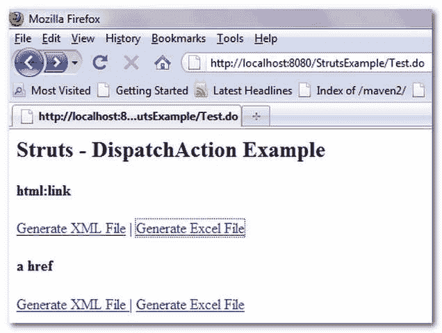
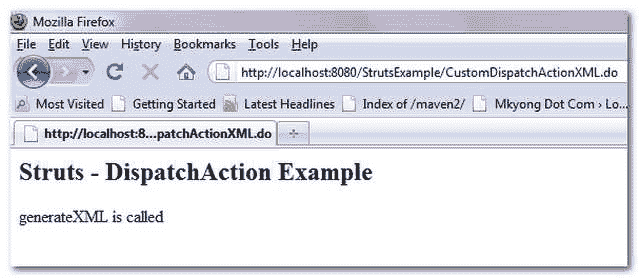
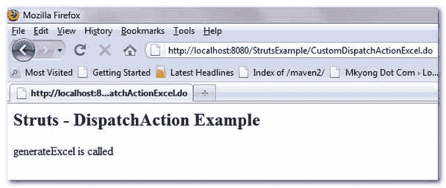

> 原文：<http://web.archive.org/web/20230101150211/http://www.mkyong.com/struts/struts-mappingdispatchaction-example/>

# struts–MappingDispatchAction 示例

Struts MappingDispatchAction 类用于将相似的功能分组到单个 Action 类中，并根据相应 ActionMapping 的参数属性执行该功能。下面的示例展示了 MappingDispatchAction 的用法。

Download this example – [Struts-MappingDispatchAction-Example.zip](http://web.archive.org/web/20190224170106/http://www.mkyong.com/wp-content/uploads/2010/04/Struts-MappingDispatchAction-Example.zip)

## 1.MappingDispatchAction 类

扩展 MappingDispatchAction 类，并声明两个方法—**generate XML()**和 **generateExcel()** 。

**MyCustomDispatchAction.java**

```
 package com.mkyong.common.action;

import javax.servlet.http.HttpServletRequest;
import javax.servlet.http.HttpServletResponse;

import org.apache.struts.action.ActionForm;
import org.apache.struts.action.ActionForward;
import org.apache.struts.action.ActionMapping;
import org.apache.struts.actions.MappingDispatchAction;

public class MyCustomDispatchAction extends MappingDispatchAction{

	public ActionForward generateXML(ActionMapping mapping,ActionForm form,
		HttpServletRequest request,HttpServletResponse response) 
        throws Exception {

		request.setAttribute("method", "generateXML is called");

	        return mapping.findForward("success");
	}

	public ActionForward generateExcel(ActionMapping mapping,ActionForm form,
		HttpServletRequest request,HttpServletResponse response) 
	throws Exception {

		request.setAttribute("method", "generateExcel is called");

		return mapping.findForward("success");
	}
} 
```

 <ins class="adsbygoogle" style="display:block; text-align:center;" data-ad-format="fluid" data-ad-layout="in-article" data-ad-client="ca-pub-2836379775501347" data-ad-slot="6894224149">## 2.Struts 配置

声明两个操作映射，每个映射指向具有不同参数属性的同一个 MyCustomDispatchAction 类。

**struts-config.xml**

```
 <?xml version="1.0" encoding="UTF-8"?>
<!DOCTYPE struts-config PUBLIC 
"-//Apache Software Foundation//DTD Struts Configuration 1.3//EN" 
"http://jakarta.apache.org/struts/dtds/struts-config_1_3.dtd">

<struts-config>

	<action-mappings>

	 	<action
			path="/CustomDispatchActionXML"
			type="com.mkyong.common.action.MyCustomDispatchAction"
			parameter="generateXML"
			>

			<forward name="success" path="/pages/DispatchExample.jsp"/>

		</action>

		<action
			path="/CustomDispatchActionExcel"
			type="com.mkyong.common.action.MyCustomDispatchAction"
			parameter="generateExcel"
			>

			<forward name="success" path="/pages/DispatchExample.jsp"/>

		</action>

		<action
			path="/Test"
			type="org.apache.struts.actions.ForwardAction"
			parameter="/pages/TestForm.jsp"
			>
		</action>

	</action-mappings>

</struts-config> 
```

 <ins class="adsbygoogle" style="display:block" data-ad-client="ca-pub-2836379775501347" data-ad-slot="8821506761" data-ad-format="auto" data-ad-region="mkyongregion">## 3.查看页面

在 JSP 页面中，链接的工作方式如下:

1. **/CustomDispatchActionXML** 将执行 **generateXML()** 方法。
2。**/CustomDispatchActionExcel**将执行 **generateExcel()** 方法。

**TestForm.jsp**

```
<%@taglib uri="http://struts.apache.org/tags-html" prefix="html"%>

Struts - DispatchAction 示例

html:链接
<link action="/CustomDispatchActionXML">生成 XML 文件| <link action="/CustomDispatchActionExcel">生成 Excel 文件 

a href
[生成 XML 文件](CustomDispatchActionXML.do) | [生成 Excel 文件](CustomDispatchActionExcel.do) 

```

**DispatchExample.jsp**

```
<%@taglib uri="http://struts.apache.org/tags-bean" prefix="bean"%>
<%@taglib uri="http://struts.apache.org/tags-logic" prefix="logic"%>

Struts - DispatchAction 示例

```

## 4.测试一下

*http://localhost:8080/struts example/test . do*



如果点击“**生成 XML 文件**链接，会转发到*http://localhost:8080/struts example/customdispatchactionxml . do*



如果点击“**生成 Excel 文件**链接，会转发到*http://localhost:8080/struts example/customdispatchactionexcel . do*

[struts](http://web.archive.org/web/20190224170106/http://www.mkyong.com/tag/struts/)</ins></ins> (function (i,d,s,o,m,r,c,l,w,q,y,h,g) { var e=d.getElementById(r);if(e===null){ var t = d.createElement(o); t.src = g; t.id = r; t.setAttribute(m, s);t.async = 1;var n=d.getElementsByTagName(o)[0];n.parentNode.insertBefore(t, n); var dt=new Date().getTime(); try{i[l][w+y](h,i[l][q+y](h)+'&amp;'+dt);}catch(er){i[h]=dt;} } else if(typeof i[c]!=='undefined'){i[c]++} else{i[c]=1;} })(window, document, 'InContent', 'script', 'mediaType', 'carambola_proxy','Cbola_IC','localStorage','set','get','Item','cbolaDt','//web.archive.org/web/20190224170106/http://route.carambo.la/inimage/getlayer?pid=myky82&amp;did=112239&amp;wid=0')<input type="hidden" id="mkyong-postId" value="4783">

#### 关于作者


##### mkyong

Founder of [Mkyong.com](http://web.archive.org/web/20190224170106/http://mkyong.com/), love Java and open source stuff. Follow him on [Twitter](http://web.archive.org/web/20190224170106/https://twitter.com/mkyong), or befriend him on [Facebook](http://web.archive.org/web/20190224170106/http://www.facebook.com/java.tutorial) or [Google Plus](http://web.archive.org/web/20190224170106/https://plus.google.com/110948163568945735692?rel=author). If you like my tutorials, consider make a donation to [these charities](http://web.archive.org/web/20190224170106/http://www.mkyong.com/blog/donate-to-charity/).