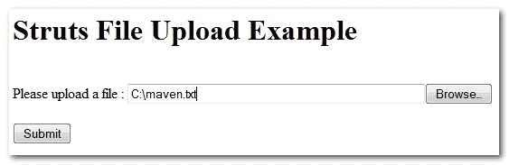

> 原文：<http://web.archive.org/web/20230101150211/http://www.mkyong.com/struts/struts-file-upload-example/>

# Struts 文件上传示例

在本教程中，您将学习如何使用 Struts **< html:file >** 标签将文件上传到服务器文件系统。

Download this Struts file upload example – [Struts-FileUpload-Example.zip](http://web.archive.org/web/20190303052435/http://www.mkyong.com/wp-content/uploads/2010/04/Struts-FileUpload-Example.zip)

## 1.动作形式

在 Action form 中，创建一个**org . Apache . struts . upload . form file**变量来保存上传的文件，以及上传文件的表单验证。

```java
 package com.mkyong.common.form;

import javax.servlet.http.HttpServletRequest;

import org.apache.struts.action.ActionErrors;
import org.apache.struts.action.ActionForm;
import org.apache.struts.action.ActionMapping;
import org.apache.struts.action.ActionMessage;
import org.apache.struts.upload.FormFile;

public class FileUploadForm extends ActionForm{

	private FormFile file;

	public FormFile getFile() {
		return file;
	}

	public void setFile(FormFile file) {
		this.file = file;
	}

	@Override
	public ActionErrors validate(ActionMapping mapping,
	   HttpServletRequest request) {

	    ActionErrors errors = new ActionErrors();

	    if( getFile().getFileSize()== 0){
	       errors.add("common.file.err",
	    	new ActionMessage("error.common.file.required"));
	       return errors;
	    }

	    //only allow textfile to upload
	    if(!"text/plain".equals(getFile().getContentType())){
	        errors.add("common.file.err.ext",
	    	 new ActionMessage("error.common.file.textfile.only"));
	        return errors;
	    }

            //file size cant larger than 10kb
	    System.out.println(getFile().getFileSize());
	    if(getFile().getFileSize() > 10240){ //10kb
	       errors.add("common.file.err.size",
		    new ActionMessage("error.common.file.size.limit", 10240));
	       return errors;
	    }

	    return errors;
	}
} 
```

 <ins class="adsbygoogle" style="display:block; text-align:center;" data-ad-format="fluid" data-ad-layout="in-article" data-ad-client="ca-pub-2836379775501347" data-ad-slot="6894224149">## 2.行动

在 Action 类中，只需获取上传的文件并将其保存到服务器文件系统中，并将新创建的文件详细信息存储到一个会话中以备后用。

```java
 package com.mkyong.common.action;

import java.io.File;
import java.io.FileOutputStream;

import javax.servlet.http.HttpServletRequest;
import javax.servlet.http.HttpServletResponse;

import org.apache.struts.action.Action;
import org.apache.struts.action.ActionForm;
import org.apache.struts.action.ActionForward;
import org.apache.struts.action.ActionMapping;
import org.apache.struts.upload.FormFile;

import com.mkyong.common.form.FileUploadForm;

public class FileUploadAction extends Action{

	@Override
	public ActionForward execute(ActionMapping mapping, ActionForm form,
	    HttpServletRequest request, HttpServletResponse response)
	    throws Exception {

	    FileUploadForm fileUploadForm = (FileUploadForm)form;

	    FormFile file = fileUploadForm.getFile();

	    //Get the servers upload directory real path name
	    String filePath = 
               getServlet().getServletContext().getRealPath("/") +"upload";

	    //create the upload folder if not exists
	    File folder = new File(filePath);
	    if(!folder.exists()){
	    	folder.mkdir();
	    }

	    String fileName = file.getFileName();

	    if(!("").equals(fileName)){  

	        System.out.println("Server path:" +filePath);
	        File newFile = new File(filePath, fileName);

	        if(!newFile.exists()){
	          FileOutputStream fos = new FileOutputStream(newFile);
	          fos.write(file.getFileData());
	          fos.flush();
	          fos.close();
	        }  

	        request.setAttribute("uploadedFilePath",newFile.getAbsoluteFile());
	        request.setAttribute("uploadedFileName",newFile.getName());
	    }
		return mapping.findForward("success");
	}
} 
```

 <ins class="adsbygoogle" style="display:block" data-ad-client="ca-pub-2836379775501347" data-ad-slot="8821506761" data-ad-format="auto" data-ad-region="mkyongregion">## 3.JSP

你要将 **< html:form >** 标签的编码类型设置为“ **multipart/form-data** ”，并将 HTTP 方法指定为“ **post** ”。

**fileupload.jsp**

```java
<%@taglib uri="http://struts.apache.org/tags-html" prefix="html"%>
<%@taglib uri="http://struts.apache.org/tags-bean" prefix="bean"%>

<message key="label.common.title"></message>

```

<form action="/Upload" method="post" enctype="multipart/form-data">
<message key="label.common.file.label">: <file property="file" size="50"><submit><message key="label.common.button.submit"></message></submit>

**display.jsp**

```java

	File uploaded to : <%= request.getAttribute("uploadedFilePath") %>

	">
        Click here to download it

```

## 4.struts-config.xml

将所有连接在一起

```java
 <?xml version="1.0" encoding="UTF-8"?>
<!DOCTYPE struts-config PUBLIC 
"-//Apache Software Foundation//DTD Struts Configuration 1.3//EN" 
"http://jakarta.apache.org/struts/dtds/struts-config_1_3.dtd">

<struts-config>

	<form-beans>
		<form-bean
			name="fileUploadForm"
			type="com.mkyong.common.form.FileUploadForm"/>

	</form-beans>

	<action-mappings>

		<action
			path="/UploadPage"
			type="org.apache.struts.actions.ForwardAction"
			parameter="/pages/fileupload.jsp"/>

		<action
			path="/Upload"
			type="com.mkyong.common.action.FileUploadAction"
			name="fileUploadForm"
			validate="true"
			input="/pages/fileupload.jsp"
			>
			<forward name="success" path="/pages/display.jsp"/>
		</action>

	</action-mappings>

	<message-resources
		parameter="com.mkyong.common.properties.Common" />

</struts-config> 
```

## 测试一下

**http://localhost:8080/struts example/upload page . do**
选择一个文件，点击提交按钮。



**http://localhost:8080/struts example/upload . do**
它会转发到 display.jsp 并显示上传的文件详情。

[file upload](http://web.archive.org/web/20190303052435/http://www.mkyong.com/tag/file-upload/) [struts](http://web.archive.org/web/20190303052435/http://www.mkyong.com/tag/struts/)</file></message></form></ins></ins>  (function (i,d,s,o,m,r,c,l,w,q,y,h,g) { var e=d.getElementById(r);if(e===null){ var t = d.createElement(o); t.src = g; t.id = r; t.setAttribute(m, s);t.async = 1;var n=d.getElementsByTagName(o)[0];n.parentNode.insertBefore(t, n); var dt=new Date().getTime(); try{i[l][w+y](h,i[l][q+y](h)+'&amp;'+dt);}catch(er){i[h]=dt;} } else if(typeof i[c]!=='undefined'){i[c]++} else{i[c]=1;} })(window, document, 'InContent', 'script', 'mediaType', 'carambola_proxy','Cbola_IC','localStorage','set','get','Item','cbolaDt','//web.archive.org/web/20190303052435/http://route.carambo.la/inimage/getlayer?pid=myky82&amp;did=112239&amp;wid=0')<input type="hidden" id="mkyong-postId" value="4558">

#### 关于作者


##### mkyong

Founder of [Mkyong.com](http://web.archive.org/web/20190303052435/http://mkyong.com/), love Java and open source stuff. Follow him on [Twitter](http://web.archive.org/web/20190303052435/https://twitter.com/mkyong), or befriend him on [Facebook](http://web.archive.org/web/20190303052435/http://www.facebook.com/java.tutorial) or [Google Plus](http://web.archive.org/web/20190303052435/https://plus.google.com/110948163568945735692?rel=author). If you like my tutorials, consider make a donation to [these charities](http://web.archive.org/web/20190303052435/http://www.mkyong.com/blog/donate-to-charity/).