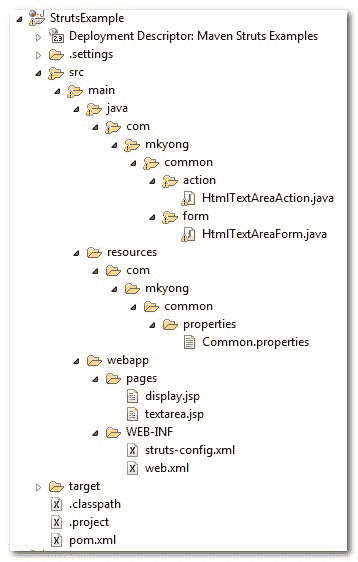
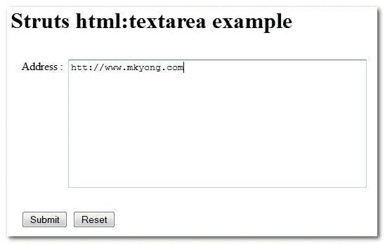

# Struts <textarea>TextArea 示例</textarea>

> 原文：<http://web.archive.org/web/20230101150211/http://www.mkyong.com/struts/struts-htmltextarea-textarea-example/>

Download this Struts text area example – [Struts-TextArea-Example.zip](http://web.archive.org/web/20200903072212/http://www.mkyong.com/wp-content/uploads/2010/04/Struts-TextArea-Example.zip)

在这个 Struts 示例中，您将学习如何使用 Struts <textarea>标记创建一个 HTML 文本区域输入字段。</textarea>

## 1.文件夹结构

这是 Maven 创建的最终项目结构。请创建相应的文件夹。

<noscript></noscript>


## 2.动作类

创建一个 Action 类，除了转发请求什么也不做。

**html text reaction . Java**

```
 package com.mkyong.common.action;

import javax.servlet.http.HttpServletRequest;
import javax.servlet.http.HttpServletResponse;

import org.apache.struts.action.Action;
import org.apache.struts.action.ActionForm;
import org.apache.struts.action.ActionForward;
import org.apache.struts.action.ActionMapping;

import com.mkyong.common.form.HtmlTextAreaForm;

public class HtmlTextAreaAction extends Action{

	public ActionForward execute(ActionMapping mapping,ActionForm form,
			HttpServletRequest request,HttpServletResponse response) 
        throws Exception {

	   HtmlTextAreaForm htmlTextAreaForm = (HtmlTextAreaForm)form;

	   return mapping.findForward("success");
	}

} 
```

## 3.属性文件

创建一个属性文件，并声明错误和标签消息。

**公共属性**

```
 #error message
error.common.html.textarea.required = "Address" field is required.

#label message
label.common.html.textarea.address = Address 
label.common.html.textarea.button.submit = Submit
label.common.html.textarea.button.reset = Reset 
```

## 4.动作形式

创建一个 ActionForm，包含一个地址变量来保存文本区域的输入值。

**HtmlTextAreaForm.java**

```
 package com.mkyong.common.form;

import javax.servlet.http.HttpServletRequest;

import org.apache.struts.action.ActionErrors;
import org.apache.struts.action.ActionForm;
import org.apache.struts.action.ActionMapping;
import org.apache.struts.action.ActionMessage;

public class HtmlTextAreaForm extends ActionForm{

	String address;

	public String getAddress() {
		return address;
	}

	public void setAddress(String address) {
		this.address = address;
	}

	@Override
	public ActionErrors validate(ActionMapping mapping,
		HttpServletRequest request) {

	    ActionErrors errors = new ActionErrors();

	    if( getAddress() == null || ("".equals(getAddress())))
	    {
	       errors.add("common.textarea.err",
	    	new ActionMessage("error.common.html.textarea.required"));
	    }

	    return errors;
	}

	@Override
	public void reset(ActionMapping mapping, HttpServletRequest request) {
		// reset properties
		address = "";
	}

} 
```

## 5.JSP 页面

使用 Struts HTML 标签<textarea>创建一个 HTML 文本区域输入字段。</textarea>

**textarea.jsp**

```
<%@taglib uri="http://struts.apache.org/tags-html" prefix="html"%>
<%@taglib uri="http://struts.apache.org/tags-bean" prefix="bean"%>

Struts html:textarea 示例

```

<form action="/TextArea"><messages id="err_name" property="common.textarea.err"></messages><message key="label.common.html.textarea.address">:</message><textarea property="address" cols="50" rows="10"></div> <div style="padding:16px"> <div style="float:left;padding-right:8px;"> <submit> <message key="label.common.html.textarea.button.submit"/> </submit> </div> <reset> <message key="label.common.html.textarea.button.reset"/> </reset> </div> </form> <p>从 htmlTextAreaForm 表单中获取文本区域输入值并显示它</p> <p><strong>display.jsp</strong></p> <pre lang="html"> <%@taglib uri="http://struts.apache.org/tags-bean" prefix="bean"%> <h1>您的地址是:<write name="htmlTextAreaForm" property="address"/></h1> </pre> <h2>6.struts-config.xml</h2> <p>创建一个 Struts 配置文件，并将它们链接在一起。</p> <pre><code class="language-markup"> <?xml version="1.0" encoding="UTF-8"?> <!DOCTYPE struts-config PUBLIC "-//Apache Software Foundation//DTD Struts Configuration 1.3//EN" "http://jakarta.apache.org/struts/dtds/struts-config_1_3.dtd"> <struts-config> <form-beans> <form-bean name="htmlTextAreaForm" type="com.mkyong.common.form.HtmlTextAreaForm"/> </form-beans> <action-mappings> <action path="/TextAreaPage" type="org.apache.struts.actions.ForwardAction" parameter="/pages/textarea.jsp"/> <action path="/TextArea" type="com.mkyong.common.action.HtmlTextAreaAction" name="htmlTextAreaForm" validate="true" input="/pages/textarea.jsp" > <forward name="success" path="/pages/display.jsp"/> </action> </action-mappings> <message-resources parameter="com.mkyong.common.properties.Common" /> </struts-config> </code></pre> <h2>7.web.xml</h2> <p>最后一步，创建一个 web.xml 并集成 Struts 框架。</p> <pre><code class="language-markup"> <!DOCTYPE web-app PUBLIC "-//Sun Microsystems, Inc.//DTD Web Application 2.3//EN" "http://java.sun.com/dtd/web-app_2_3.dtd" > <web-app> <display-name>Maven Struts Examples</display-name> <servlet> <servlet-name>action</servlet-name> <servlet-class> org.apache.struts.action.ActionServlet </servlet-class> <init-param> <param-name>config</param-name> <param-value> /WEB-INF/struts-config.xml </param-value> </init-param> <load-on-startup>1</load-on-startup> </servlet> <servlet-mapping> <servlet-name>action</servlet-name> <url-pattern>*.do</url-pattern> </servlet-mapping> </web-app> </code></pre> <p>访问它</p> <blockquote><p>http://localhost:8080/struts example/textarea page . do</p></blockquote> <div class="pic"> <noscript></noscript> </div> <p>填写地址并按下提交按钮，它将转发到</p> <blockquote><p>http://localhost:8080/struts example/textarea . do</p></blockquote> <p>并在地址中显示您的密钥。</p> <div class="pic"> <noscript></noscript> </div> <div class="post-tag d-none d-xl-block">Tags : <a href="http://web.archive.org/web/20200903072212/https://mkyong.com/tag/struts/" rel="tag">struts</a> <a href="http://web.archive.org/web/20200903072212/https://mkyong.com/tag/textarea/" rel="tag">textarea</a></div> <!-- related posts --> <input type="hidden" id="mkyong-current-postId" value="4522"/> <div id="afterpost-related-container"><h3>相关文章</h3> <div class="row no-gutters"> <div class="col"><ul><li><a href="/web/20200903072212/https://www.mkyong.com/java/how-to-download-file-from-website-java-jsp/?utm_source=self&utm_medium=referral&utm_campaign=afterpost-related&utm_content=link0">如何从网站下载文件- Java / Jsp </a></li><li><a href="/web/20200903072212/https://www.mkyong.com/jquery/add-maxlength-on-textarea-using-jquery/?utm_source=self&utm_medium=referral&utm_campaign=afterpost-related&utm_content=link1">使用 jQuery 在 textArea 上添加 maxlength</a></li><li><a href="/web/20200903072212/https://www.mkyong.com/wicket/wicket-textarea-example/?utm_source=self&utm_medium=referral&utm_campaign=afterpost-related&utm_content=link2"> Wicket textarea 示例</a></li><li><a href="/web/20200903072212/https://www.mkyong.com/tutorials/struts-tutorials/?utm_source=self&utm_medium=referral&utm_campaign=afterpost-related&utm_content=link3"> Struts 教程</a></li><li><a href="/web/20200903072212/https://www.mkyong.com/struts/configure-the-struts-tag-libraries/?utm_source=self&utm_medium=referral&utm_campaign=afterpost-related&utm_content=link4">配置 Struts 标签库</a></li></ul></div> <div class="col d-none d-xl-block"><ul><li><a href="/web/20200903072212/https://www.mkyong.com/struts/the-absolute-uri-httpstruts-apache-orgtags-bean-cannot-be-resolved-in-either-web-xml-or-the-jar-files-deployed-with-this-application/?utm_source=self&utm_medium=referral&utm_campaign=afterpost-related&utm_content=link5">绝对 uri:http://struts.apache.org/tags-be</a></li><li><a href="/web/20200903072212/https://www.mkyong.com/struts/struts-hello-world-example/?utm_source=self&utm_medium=referral&utm_campaign=afterpost-related&utm_content=link6"> Struts Hello World 示例</a></li><li><a href="/web/20200903072212/https://www.mkyong.com/struts/java-lang-classnotfoundexception-org-apache-struts-action-forwardaction/?utm_source=self&utm_medium=referral&utm_campaign=afterpost-related&utm_content=link7">Java . lang . classnotfoundexception:org . Apache . strut</a></li><li><a href="/web/20200903072212/https://www.mkyong.com/struts/configure-a-welcome-page-in-struts/?utm_source=self&utm_medium=referral&utm_campaign=afterpost-related&utm_content=link8">在 Struts 中配置欢迎页面</a></li><li><a href="/web/20200903072212/https://www.mkyong.com/struts/struts-forwardaction-example/?utm_source=self&utm_medium=referral&utm_campaign=afterpost-related&utm_content=link9"> Struts ForwardAction 示例</a></li></ul></div> </div></div><div class="container ads-container"> <div class="row"> <div class="col"> </div> </div> </div> <div id="comment-container"> <div class="wpdiscuz_top_clearing"/> <div id="wpdiscuz-loading-bar" class="wpdiscuz-loading-bar-unauth"/> <div id="wpdiscuz-comment-message" class="wpdiscuz-comment-message-unauth"/> </div> </body> </html></textarea></form>