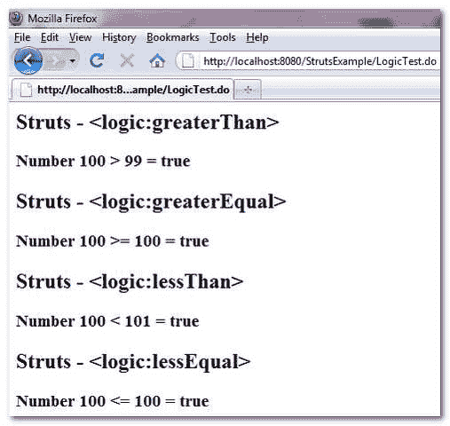

> 原文：<http://web.archive.org/web/20230101150211/http://www.mkyong.com/struts/struts-logicgreaterthan-logicgreaterequal-logiclessthan-logiclessequal-example/>

# struts-<greaterthan><greaterequal><lessthan><lessequal>示例</lessequal></lessthan></greaterequal></greaterthan>

Download this example – [Struts-Logic-Number-Condition-Tag-Example.zip](http://web.archive.org/web/20190209024221/http://www.mkyong.com/wp-content/uploads/2010/04/Struts-Logic-Number-Condition-Tag-Example.zip)

在 Struts 中，有四个数字条件标签可用…

1.  <greaterthan>–检查给定属性是否大于给定值。</greaterthan>
2.  <greaterequal>–检查给定属性是否大于或等于给定值。</greaterequal>
3.  <lessthan>–检查给定属性是否小于给定值。</lessthan>
4.  <lessequal>–检查给定属性是否小于或等于给定值。</lessequal>

如果条件匹配，标签的主体将被执行。

下面的例子展示了 Struts <greaterthan>、<greaterequal>、<lessthan>和<lessequal>的用法。</lessequal></lessthan></greaterequal></greaterthan>

**LogicExampleAction.java**

```
 package com.mkyong.common.action;

import javax.servlet.http.HttpServletRequest;
import javax.servlet.http.HttpServletResponse;

import org.apache.struts.action.Action;
import org.apache.struts.action.ActionForm;
import org.apache.struts.action.ActionForward;
import org.apache.struts.action.ActionMapping;

public class LogicExampleAction extends Action{

	public ActionForward execute(ActionMapping mapping,ActionForm form,
		HttpServletRequest request,HttpServletResponse response) 
        throws Exception {

		request.setAttribute("number", 100);

		return mapping.findForward("success");
	}

} 
```

**LogicExample.jsp**

```
<%@taglib uri="http://struts.apache.org/tags-bean" prefix="bean"%>
<%@taglib uri="http://struts.apache.org/tags-logic" prefix="logic"%>

Struts - <greaterthan></greaterthan>

 <ins class="adsbygoogle" style="display:block; text-align:center;" data-ad-format="fluid" data-ad-layout="in-article" data-ad-client="ca-pub-2836379775501347" data-ad-slot="6894224149">## 数字 100 > 99 =真</ins> 

 ## Struts - <greaterequal></greaterequal>

 <greaterequal name="number" value="100">## 数字 100 >= 100 =真</greaterequal> 

## Struts - <lessthan></lessthan>

 <lessthan name="number" value="101">## 数字 100 < 101 =真</lessthan> 

## Struts - <lessequal></lessequal>

 <lessequal name="number" value="100">## 数字 100 <= 100 =真</lessequal> 
```

**struts-config.xml**

```
 <?xml version="1.0" encoding="UTF-8"?>
<!DOCTYPE struts-config PUBLIC 
"-//Apache Software Foundation//DTD Struts Configuration 1.3//EN" 
"http://jakarta.apache.org/struts/dtds/struts-config_1_3.dtd">

<struts-config>
  <action-mappings>

	 <action
		path="/LogicTest"
		type="com.mkyong.common.action.LogicExampleAction">

		<forward name="success" path="/pages/LogicExample.jsp"/>

	</action>

  </action-mappings>
</struts-config> 
```

## 结果

*http://localhost:8080/struts example/logictest . do*

[struts](http://web.archive.org/web/20190209024221/http://www.mkyong.com/tag/struts/) (function (i,d,s,o,m,r,c,l,w,q,y,h,g) { var e=d.getElementById(r);if(e===null){ var t = d.createElement(o); t.src = g; t.id = r; t.setAttribute(m, s);t.async = 1;var n=d.getElementsByTagName(o)[0];n.parentNode.insertBefore(t, n); var dt=new Date().getTime(); try{i[l][w+y](h,i[l][q+y](h)+'&amp;'+dt);}catch(er){i[h]=dt;} } else if(typeof i[c]!=='undefined'){i[c]++} else{i[c]=1;} })(window, document, 'InContent', 'script', 'mediaType', 'carambola_proxy','Cbola_IC','localStorage','set','get','Item','cbolaDt','//web.archive.org/web/20190209024221/http://route.carambo.la/inimage/getlayer?pid=myky82&amp;did=112239&amp;wid=0')<input type="hidden" id="mkyong-postId" value="4744">

#### 关于作者


##### mkyong

Founder of [Mkyong.com](http://web.archive.org/web/20190209024221/http://mkyong.com/), love Java and open source stuff. Follow him on [Twitter](http://web.archive.org/web/20190209024221/https://twitter.com/mkyong), or befriend him on [Facebook](http://web.archive.org/web/20190209024221/http://www.facebook.com/java.tutorial) or [Google Plus](http://web.archive.org/web/20190209024221/https://plus.google.com/110948163568945735692?rel=author). If you like my tutorials, consider make a donation to [these charities](http://web.archive.org/web/20190209024221/http://www.mkyong.com/blog/donate-to-charity/).