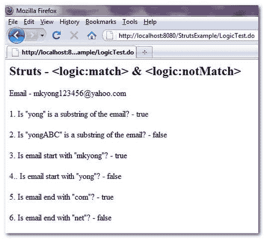

> 原文：<http://web.archive.org/web/20230101150211/http://www.mkyong.com/struts/struts-logicmatch-logicnotmatch-example/>

# struts-<match><notmatch>示例</notmatch></match>

Download this example – [Struts-Logic-Match-NotMatch-Example.zip](http://web.archive.org/web/20190209024038/http://www.mkyong.com/wp-content/uploads/2010/04/Struts-Logic-Match-NotMatch-Example.zip)

Struts 的<match>标签用于检查给定属性包含的给定值为**的子串**。例如，一个属性结果“Google 搜索引擎”，值“gle”将匹配，而值“ABC”将不匹配。如果条件匹配，标签的主体将被执行。Struts <逻辑:notMatch >正在做相反的事情。</match>

Struts 的匹配标记有一个必须知道的属性，名为" **location** "，值为" **start** 或" **end**

1.  **location = " start "**–仅当给定值作为给定属性的起始子串出现时才匹配。例如“谷歌搜索引擎”——匹配“Goog”，不匹配“gine”。
2.  **location = " end "**–仅当给定值作为给定属性的结束子串出现时才匹配。例如“谷歌搜索引擎”——不匹配“Goog”，匹配“gine”。
3.  **无位置定义**–如果给定值作为给定属性的子串出现，则匹配。例如“谷歌搜索引擎”——匹配“Goog”，匹配“gine”。

下面的例子展示了 <match>& <notmatch>的用法。</notmatch></match>

**LogicExampleAction.java**

```java
 package com.mkyong.common.action;

import javax.servlet.http.HttpServletRequest;
import javax.servlet.http.HttpServletResponse;

import org.apache.struts.action.Action;
import org.apache.struts.action.ActionForm;
import org.apache.struts.action.ActionForward;
import org.apache.struts.action.ActionMapping;

public class LogicExampleAction extends Action{

	public ActionForward execute(ActionMapping mapping,ActionForm form,
		HttpServletRequest request,HttpServletResponse response) 
        throws Exception {

		request.setAttribute("email", "mkyong123456@yahoo.com");

		return mapping.findForward("success");
	}

} 
```

**LogicExample.jsp**

```java
<%@taglib uri="http://struts.apache.org/tags-bean" prefix="bean"%>
<%@taglib uri="http://struts.apache.org/tags-logic" prefix="logic"%>

Struts - <match> & <notmatch></notmatch></match>

Email - mkyong123456@yahoo.com

1\. Is "yong" is a substring of the email? -
 true 
 false 

2\. Is "yongABC" is a substring of the email? -
 true 
 false 

3\. Is email start with "mkyong"? -
 true 
 false 

4.. Is email start with "yong"? -
 true 
 false 

5\. Is email end with "com"? -
 true 
 false 

6\. Is email end with "net"? -
 true 
 false 

```

**struts-config.xml**

```java
 <?xml version="1.0" encoding="UTF-8"?>
<!DOCTYPE struts-config PUBLIC 
"-//Apache Software Foundation//DTD Struts Configuration 1.3//EN" 
"http://jakarta.apache.org/struts/dtds/struts-config_1_3.dtd">

<struts-config>
  <action-mappings>

	 <action
		path="/LogicTest"
		type="com.mkyong.common.action.LogicExampleAction">

		<forward name="success" path="/pages/LogicExample.jsp"/>

	</action>

  </action-mappings>
</struts-config> 
```

 <ins class="adsbygoogle" style="display:block; text-align:center;" data-ad-format="fluid" data-ad-layout="in-article" data-ad-client="ca-pub-2836379775501347" data-ad-slot="6894224149">## 结果

*http://localhost:8080/struts example/logictest . do*



```java
 Struts - <logic:match> & <logic:notMatch>
Email - mkyong123456@yahoo.com

1\. Is "yong" is a substring of the email? - true

2\. Is "yongABC" is a substring of the email? - false

3\. Is email start with "mkyong"? - true

4.. Is email start with "yong"? - false

5\. Is email end with "com"? - true

6\. Is email end with "net"? - false 
```

[struts](http://web.archive.org/web/20190209024038/http://www.mkyong.com/tag/struts/)</ins> (function (i,d,s,o,m,r,c,l,w,q,y,h,g) { var e=d.getElementById(r);if(e===null){ var t = d.createElement(o); t.src = g; t.id = r; t.setAttribute(m, s);t.async = 1;var n=d.getElementsByTagName(o)[0];n.parentNode.insertBefore(t, n); var dt=new Date().getTime(); try{i[l][w+y](h,i[l][q+y](h)+'&amp;'+dt);}catch(er){i[h]=dt;} } else if(typeof i[c]!=='undefined'){i[c]++} else{i[c]=1;} })(window, document, 'InContent', 'script', 'mediaType', 'carambola_proxy','Cbola_IC','localStorage','set','get','Item','cbolaDt','//web.archive.org/web/20190209024038/http://route.carambo.la/inimage/getlayer?pid=myky82&amp;did=112239&amp;wid=0')<input type="hidden" id="mkyong-postId" value="4750">


