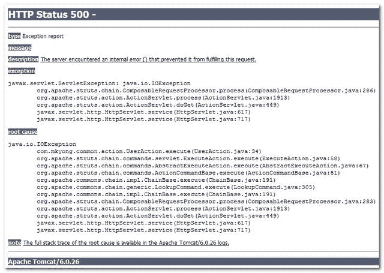

> 原文：<http://web.archive.org/web/20230101150211/http://www.mkyong.com/struts/struts-global-custom-exception-example/>

# struts–<global-exception>自定义异常处理程序示例</global-exception>

Download this <global-exception> example – [Struts-Global-Exception-Example.zip](http://web.archive.org/web/20190223082407/http://www.mkyong.com/wp-content/uploads/2010/04/Struts-Log4j-integration-Example.zip)

在 Struts 框架中， **<全局异常>** 用于显示您自定义的错误页面，而不是默认的经典 HTTP Status 500 错误页面:



默认错误页面看起来很难看，一点也不专业。此外，错误消息的描述性足以将您的系统信息泄露给最终用户。

## 1. <global-exception>+默认异常处理程序</global-exception>

这里有一个 **<全局异常>** 示例，在“struts.config.xml”中声明了默认异常处理程序，用您的自定义描述性错误页面替换默认 HTTP 500 错误页面。

```
 <?xml version="1.0" encoding="UTF-8"?>
<!DOCTYPE struts-config PUBLIC 
"-//Apache Software Foundation//DTD Struts Configuration 1.3//EN" 
"http://jakarta.apache.org/struts/dtds/struts-config_1_3.dtd">

<struts-config>

	<form-beans>
		//...
	</form-beans>

        <global-exceptions>
	    <exception
	      key="error.global.mesage"
	      type="java.io.IOException"
	      path="/pages/error.jsp" />
	</global-exceptions>

	<action-mappings>
		//...
	</action-mappings>

</struts-config> 
```

在上面的例子中，当一个动作抛出任何 IOException 时，都会调用默认的 Struts 异常处理程序"**org . Apache . Struts . Action . exception handler**，并将其转发到 error.jsp 文件**。该键是消息资源属性文件中的一个键。**

**公共属性**

```
 #common module error message
error.global.mesage = 
   Ooooppps... Sometime wraong in this site, please come back later 
```

**error.jsp**

```
<%@taglib uri="http://struts.apache.org/tags-html" prefix="html"%>

Struts 全局异常示例

```

 <ins class="adsbygoogle" style="display:block; text-align:center;" data-ad-format="fluid" data-ad-layout="in-article" data-ad-client="ca-pub-2836379775501347" data-ad-slot="6894224149">## 2. <global-exception>+自定义异常处理程序</global-exception>

在默认的异常处理程序中，您无法控制如何处理异常。在大多数情况下，您可能需要记录该异常以供进一步分析。为此，您需要一个定制的异常处理程序来将所有异常记录到另一个数据存储中，如文件系统或数据库。

这里有一个自定义异常处理程序的例子，可以为" **java.lang.Exception** "配置，这样它就可以被 Action 抛出的任何异常调用。要创建自定义异常处理程序，您需要子类化“**org . Apache . struts . action . exception handler**”并覆盖 execute 方法。

**MyCustomExceptionHandler.java**

```
 package com.mkyong.common.exception;

import javax.servlet.ServletException;
import javax.servlet.http.HttpServletRequest;
import javax.servlet.http.HttpServletResponse;

import org.apache.log4j.Logger;
import org.apache.struts.action.ActionForm;
import org.apache.struts.action.ActionForward;
import org.apache.struts.action.ActionMapping;
import org.apache.struts.action.ExceptionHandler;
import org.apache.struts.config.ExceptionConfig;

public class MyCustomExceptionHandler extends ExceptionHandler{

  private static final Logger logger = 
      Logger.getLogger(MyCustomExceptionHandler.class);

  @Override
  public ActionForward execute(Exception ex, ExceptionConfig ae,
	ActionMapping mapping, ActionForm formInstance,
	HttpServletRequest request, HttpServletResponse response)
	throws ServletException {

	//log the error message
	logger.error(ex);

	return super.execute(ex, ae, mapping, formInstance, request, response);
  }
} 
```

```
 <?xml version="1.0" encoding="UTF-8"?>
<!DOCTYPE struts-config PUBLIC 
"-//Apache Software Foundation//DTD Struts Configuration 1.3//EN" 
"http://jakarta.apache.org/struts/dtds/struts-config_1_3.dtd">

<struts-config>

	<form-beans>
		//...
	</form-beans>

        <global-exceptions>
	    <exception
	      key="error.global.mesage"
	      type="java.io.IOException"
	      handler="com.mkyong.common.exception.MyCustomExceptionHandler"
	      path="/pages/error.jsp" />
	</global-exceptions>

	<action-mappings>
		//...
	</action-mappings>

</struts-config> 
```

在上面的代码中，当异常被 Action 抛出时，它将调用您的自定义异常处理程序 MyCustomExceptionHandler 的 **execute()** 方法，而不是默认的异常处理程序。

 <ins class="adsbygoogle" style="display:block" data-ad-client="ca-pub-2836379775501347" data-ad-slot="8821506761" data-ad-format="auto" data-ad-region="mkyongregion">## 参考

1.  Struts 异常处理程序-[http://struts . Apache . org/1 . x/user guide/building _ controller . html](http://web.archive.org/web/20190223082407/http://struts.apache.org/1.x/userGuide/building_controller.html)

[exception handler](http://web.archive.org/web/20190223082407/http://www.mkyong.com/tag/exception-handler/) [struts](http://web.archive.org/web/20190223082407/http://www.mkyong.com/tag/struts/)</ins></ins> (function (i,d,s,o,m,r,c,l,w,q,y,h,g) { var e=d.getElementById(r);if(e===null){ var t = d.createElement(o); t.src = g; t.id = r; t.setAttribute(m, s);t.async = 1;var n=d.getElementsByTagName(o)[0];n.parentNode.insertBefore(t, n); var dt=new Date().getTime(); try{i[l][w+y](h,i[l][q+y](h)+'&amp;'+dt);}catch(er){i[h]=dt;} } else if(typeof i[c]!=='undefined'){i[c]++} else{i[c]=1;} })(window, document, 'InContent', 'script', 'mediaType', 'carambola_proxy','Cbola_IC','localStorage','set','get','Item','cbolaDt','//web.archive.org/web/20190223082407/http://route.carambo.la/inimage/getlayer?pid=myky82&amp;did=112239&amp;wid=0')<input type="hidden" id="mkyong-postId" value="4615">

#### 关于作者


##### mkyong

Founder of [Mkyong.com](http://web.archive.org/web/20190223082407/http://mkyong.com/), love Java and open source stuff. Follow him on [Twitter](http://web.archive.org/web/20190223082407/https://twitter.com/mkyong), or befriend him on [Facebook](http://web.archive.org/web/20190223082407/http://www.facebook.com/java.tutorial) or [Google Plus](http://web.archive.org/web/20190223082407/https://plus.google.com/110948163568945735692?rel=author). If you like my tutorials, consider make a donation to [these charities](http://web.archive.org/web/20190223082407/http://www.mkyong.com/blog/donate-to-charity/).