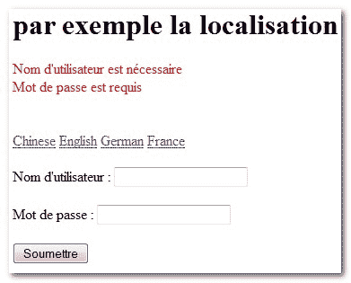

# Struts 国际化或本地化示例

> 原文：<http://web.archive.org/web/20230101150211/http://www.mkyong.com/struts/struts-internationalizing-or-localization-example/>

这是一个 Struts 本地化示例，根据指定的语言显示消息或内容。默认情况下，Struts 将为每个用户在其会话上下文中存储一个 Locale 属性，该属性位于关键字"**org . Apache . Struts . action . Locale**"下，您所需要做的就是使用这个会话属性。

Download this Struts localization example – [Struts-Localization-Example.zip](http://web.archive.org/web/20210507021650/http://www.mkyong.com/wp-content/uploads/2010/04/Struts-Localization-Example.zip)

## 1.项目结构

这是项目结构。


## 2.属性文件

所有本地化消息都在属性文件中声明，格式为“**filename _ locale _ code . properties**”。你可以在 **Java 中查看地区代码。Util.Locale** 类。例如

*   英语–Common . properties 或 Common_en_US.properties
*   中文–Common _ zh _ cn . properties
*   法国–Common _ fr .属性
*   德语–Common _ de .属性

**公共属性**

```java
 #error message
error.common.username.required = Username is required
error.common.password.required = Password is required

#label message
label.common.message = localization example
label.common.username = Username 
label.common.password = Password
label.common.button.submit = Submit 
```

**公共属性**

```java
 #error message
error.common.username.required = Benutzername ist erforderlich
error.common.password.required = Passwort ist erforderlich

#label message
label.common.message = Lokalisierung Beispiel
label.common.username = Benutzername 
label.common.password = Kennwort
label.common.button.submit = Einreichen 
```

## 3.动作类

创建一个 action 类，该类扩展 DispatchAction 以实现多种操作目的。

```java
 package com.mkyong.common.action;

import java.util.Locale;

import javax.servlet.http.HttpServletRequest;
import javax.servlet.http.HttpServletResponse;

import org.apache.struts.Globals;
import org.apache.struts.action.ActionForm;
import org.apache.struts.action.ActionForward;
import org.apache.struts.action.ActionMapping;
import org.apache.struts.actions.DispatchAction;

public class LanguageSelectAction extends DispatchAction{

	public ActionForward chinese(ActionMapping mapping,ActionForm form,
		HttpServletRequest request,HttpServletResponse response) 
	throws Exception {

		request.getSession().setAttribute(
				Globals.LOCALE_KEY, Locale.SIMPLIFIED_CHINESE);

		return mapping.findForward("success");
	}

	public ActionForward english(ActionMapping mapping,ActionForm form,
		HttpServletRequest request,HttpServletResponse response) 
	throws Exception {

		request.getSession().setAttribute(
				Globals.LOCALE_KEY, Locale.ENGLISH);

		return mapping.findForward("success");
	}

	public ActionForward german(ActionMapping mapping,ActionForm form,
		HttpServletRequest request,HttpServletResponse response) 
	throws Exception {

		request.getSession().setAttribute(
				Globals.LOCALE_KEY, Locale.GERMAN);

		return mapping.findForward("success");
	}

	public ActionForward france(ActionMapping mapping,ActionForm form,
		HttpServletRequest request,HttpServletResponse response) 
	throws Exception {

		request.getSession().setAttribute(
				Globals.LOCALE_KEY, Locale.FRANCE);

		return mapping.findForward("success");
	}

} 
```

## 4.动作形式

创建一个动作表单来保存用户名和密码数据，并用于表单验证。

```java
 package com.mkyong.common.form;

import javax.servlet.http.HttpServletRequest;

import org.apache.struts.action.ActionErrors;
import org.apache.struts.action.ActionForm;
import org.apache.struts.action.ActionMapping;
import org.apache.struts.action.ActionMessage;

public class UserForm extends ActionForm{

	String username;
	String password;

	public String getUsername() {
		return username;
	}

	public void setUsername(String username) {
		this.username = username;
	}

	public String getPassword() {
		return password;
	}

	public void setPassword(String password) {
		this.password = password;
	}

	@Override
	public ActionErrors validate(ActionMapping mapping,
		HttpServletRequest request) {

	    ActionErrors errors = new ActionErrors();

	    if( getUsername() == null || ("".equals(getUsername())))
	    {
	       errors.add("common.username.err",
	    	new ActionMessage("error.common.username.required"));
	    }

	    if( getPassword() == null || ("".equals(getPassword())))
	    {
	       errors.add("common.password.err",
	    	new ActionMessage("error.common.password.required"));
	    }

	    return errors;
	}

	@Override
	public void reset(ActionMapping mapping, HttpServletRequest request) {
		// reset properties
		username = "";
		password = "";
	}
} 
```

## 5.JSP

创建一个 JSP 页面来显示语言选择、表单值以及错误消息。" **/Locale.do？method=chinese** 将匹配 DispatchAction **chinese()** 方法。

```java
<%@taglib uri="http://struts.apache.org/tags-html" prefix="html"%>
<%@taglib uri="http://struts.apache.org/tags-bean" prefix="bean"%>

<message key="label.common.message"></message>

Chinese
English
German
France

```

<form action="/Submit">
<message key="label.common.username">: <text property="username"><message key="label.common.password">: <text property="password"><submit><message key="label.common.button.submit"></message></submit>

## 6.struts-config.xml

把这些放在一起。

```java
 <?xml version="1.0" encoding="UTF-8"?>
<!DOCTYPE struts-config PUBLIC 
"-//Apache Software Foundation//DTD Struts Configuration 1.3//EN" 
"http://jakarta.apache.org/struts/dtds/struts-config_1_3.dtd">

<struts-config>

	<form-beans>
		<form-bean
			name="userForm"
			type="com.mkyong.common.form.UserForm"/>

	</form-beans>

	<action-mappings>

		<action
			path="/LoginPage"
			type="org.apache.struts.actions.ForwardAction"
			parameter="/pages/multi-language.jsp"/>

		<action
			path="/Submit"
			type="com.mkyong.common.action.LanguageSelectAction"
			name="userForm"
			validate="true"
			input="/pages/multi-language.jsp"
			>
			<forward name="success" path="/pages/multi-language.jsp"/>
		</action>

		<action
			path="/Locale"
			type="com.mkyong.common.action.LanguageSelectAction"
			name="userForm"
			parameter="method"
			validate="false"
			>
			<forward name="success" path="/pages/multi-language.jsp"/>
		</action>

	</action-mappings>

	<message-resources
		parameter="com.mkyong.common.properties.Common" />

</struts-config> 
```

## 7 .好的. xml

将 Struts 框架集成到 web 部署描述符文件中。

```java
 <!DOCTYPE web-app PUBLIC
 "-//Sun Microsystems, Inc.//DTD Web Application 2.3//EN"
 "http://java.sun.com/dtd/web-app_2_3.dtd" >

<web-app>
  <display-name>Maven Struts Examples</display-name>

  <servlet>
    <servlet-name>action</servlet-name>
    <servlet-class>
        org.apache.struts.action.ActionServlet
    </servlet-class>
    <init-param>
        <param-name>config</param-name>
        <param-value>
         /WEB-INF/struts-config.xml
        </param-value>
    </init-param>
    <load-on-startup>1</load-on-startup>
  </servlet>

  <servlet-mapping>
       <servlet-name>action</servlet-name>
       <url-pattern>*.do</url-pattern>
  </servlet-mapping>

</web-app> 
```

## 屏幕截图

> http://localhost:8080/struts example/log in page . do

您可以通过语言链接更改界面。

**英文界面**


**中文界面**


**法国界面**



**德语界面**

Tags : [multiple languages](http://web.archive.org/web/20210507021650/https://mkyong.com/tag/multiple-languages/) [struts](http://web.archive.org/web/20210507021650/https://mkyong.com/tag/struts/)<input type="hidden" id="mkyong-current-postId" value="4534"></text></message></text></message></form>