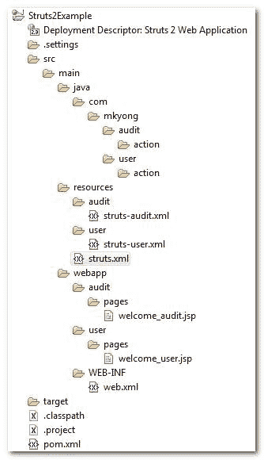

> 原文：<http://web.archive.org/web/20230101150211/http://www.mkyong.com/struts2/struts-2-include-multiple-struts-configuration-files/>

# Struts 2–包含多个 Struts 配置文件

Struts 2 带有“ **include file** ”特性，将多个 Struts 配置文件包含到一个单元中。

## 单个 Struts 配置文件

让我们看一个糟糕的 Struts 2 配置示例。

**struts.xml**

```
 <?xml version="1.0" encoding="UTF-8" ?>
<!DOCTYPE struts PUBLIC
"-//Apache Software Foundation//DTD Struts Configuration 2.0//EN"
"http://struts.apache.org/dtds/struts-2.0.dtd">

<struts>

<package name="default" namespace="/" extends="struts-default">
</package>

<package name="audit" namespace="/audit" extends="struts-default">
	<action name="WelcomeAudit">
		<result>pages/welcome_audit.jsp</result>
	</action>
</package>

<package name="user" namespace="/user" extends="struts-default">
	<action name="WelcomeUser">
		<result>pages/welcome_user.jsp</result>
	</action>
</package>

</struts> 
```

在上面的 Struts 配置文件中，它将所有的“**用户**”和“**审计**”、**设置放在一个文件中，这是不推荐的，必须避免**。您应该将这个 **struts.xml** 文件分成更多更小的模块相关部分。

Do not think this is a case study, it did happened in [real life](http://web.archive.org/web/20190214223406/http://www.mkyong.com/struts/struts-multiple-configuration-files-example/). I seen many Struts 1 or 2 developers just group everything in a single Struts configuration file. In fact, many are still don’t aware of the Struts’s include file feature. <ins class="adsbygoogle" style="display:block; text-align:center;" data-ad-format="fluid" data-ad-layout="in-article" data-ad-client="ca-pub-2836379775501347" data-ad-slot="6894224149">## 多个 Struts 配置文件

在 Struts 2 中，您应该总是为每个模块分配一个 Struts 配置文件。在这种情况下，您可以创建三个文件:

1.  struts-audit . XML–将所有审计模块设置放在这里。
2.  struts-user . XML–将所有用户模块设置放在这里。
3.  struts . XML–使用默认设置并包含 struts-audit.xml 和 struts-user.xml。

**struts-audit.xml**

```
 <?xml version="1.0" encoding="UTF-8" ?>
<!DOCTYPE struts PUBLIC
"-//Apache Software Foundation//DTD Struts Configuration 2.0//EN"
"http://struts.apache.org/dtds/struts-2.0.dtd">

<struts>

<package name="audit" namespace="/audit" extends="struts-default">
	<action name="WelcomeAudit">
		<result>pages/welcome_audit.jsp</result>
	</action>
</package>

</struts> 
```

**struts-user.xml**

```
 <?xml version="1.0" encoding="UTF-8" ?>
<!DOCTYPE struts PUBLIC
"-//Apache Software Foundation//DTD Struts Configuration 2.0//EN"
"http://struts.apache.org/dtds/struts-2.0.dtd">

<struts>

<package name="user" namespace="/user" extends="struts-default">
	<action name="WelcomeUser">
		<result>pages/welcome_user.jsp</result>
	</action>
</package>

</struts> 
```

**struts.xml**

```
 <?xml version="1.0" encoding="UTF-8" ?>
<!DOCTYPE struts PUBLIC
"-//Apache Software Foundation//DTD Struts Configuration 2.0//EN"
"http://struts.apache.org/dtds/struts-2.0.dtd">

<struts>

<package name="default" namespace="/" extends="struts-default">
</package>

<include file="user/struts-user.xml"></include>
<include file="audit/struts-audit.xml"></include>

</struts> 
```

看看文件夹结构是什么样的

Download this example – [Struts2-Multiple-Struts-Config-Files-Example.zip](http://web.archive.org/web/20190214223406/http://www.mkyong.com/wp-content/uploads/2010/06/Struts2-Mutiple-Struts-Config-Files-Example.zip) <ins class="adsbygoogle" style="display:block" data-ad-client="ca-pub-2836379775501347" data-ad-slot="8821506761" data-ad-format="auto" data-ad-region="mkyongregion">## 参考

1.  [http://www . mkyong . com/struts/struts-multiple-configuration-files-example/](http://web.archive.org/web/20190214223406/http://www.mkyong.com/struts/struts-multiple-configuration-files-example/)
2.  [http://www . mkyong . com/struts 2/struts-2-namespace-configuration-example-and-explain/](http://web.archive.org/web/20190214223406/http://www.mkyong.com/struts2/struts-2-namespace-configuration-example-and-explanation/)

[configuration file](http://web.archive.org/web/20190214223406/http://www.mkyong.com/tag/configuration-file/) [struts2](http://web.archive.org/web/20190214223406/http://www.mkyong.com/tag/struts2/)</ins></ins> (function (i,d,s,o,m,r,c,l,w,q,y,h,g) { var e=d.getElementById(r);if(e===null){ var t = d.createElement(o); t.src = g; t.id = r; t.setAttribute(m, s);t.async = 1;var n=d.getElementsByTagName(o)[0];n.parentNode.insertBefore(t, n); var dt=new Date().getTime(); try{i[l][w+y](h,i[l][q+y](h)+'&amp;'+dt);}catch(er){i[h]=dt;} } else if(typeof i[c]!=='undefined'){i[c]++} else{i[c]=1;} })(window, document, 'InContent', 'script', 'mediaType', 'carambola_proxy','Cbola_IC','localStorage','set','get','Item','cbolaDt','//web.archive.org/web/20190214223406/http://route.carambo.la/inimage/getlayer?pid=myky82&amp;did=112239&amp;wid=0')<input type="hidden" id="mkyong-postId" value="5709">

#### 关于作者


##### mkyong

Founder of [Mkyong.com](http://web.archive.org/web/20190214223406/http://mkyong.com/), love Java and open source stuff. Follow him on [Twitter](http://web.archive.org/web/20190214223406/https://twitter.com/mkyong), or befriend him on [Facebook](http://web.archive.org/web/20190214223406/http://www.facebook.com/java.tutorial) or [Google Plus](http://web.archive.org/web/20190214223406/https://plus.google.com/110948163568945735692?rel=author). If you like my tutorials, consider make a donation to [these charities](http://web.archive.org/web/20190214223406/http://www.mkyong.com/blog/donate-to-charity/).