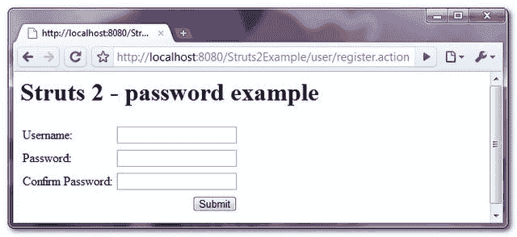

> 原文：<http://web.archive.org/web/20230101150211/http://www.mkyong.com/struts2/struts-2-spassword-password-example/>

# Struts 2 <password>密码示例</password>

Download It – [Struts2-Password-Example.zip](http://web.archive.org/web/20190304032242/http://www.mkyong.com/wp-content/uploads/2010/06/Struts2-Password-Example.zip)

在 Struts 2 中，你可以使用 **< s:password >** 来创建一个 HTML 密码字段。例如，您可以用一个 key 属性或 label 和 name 属性声明“ **s:password** ”。

```java
 <s:password key="password" />
//or
<s:textfield label="Password" name="password" /> 
```

两者都生成相同的 HTML 输出(默认的 xhtml 主题)。

```java
 <td class="tdLabel">
  <label for="registerUser_password" class="label">Password:</label>
</td> 
<td>
  <input type="password" name="password" id="registerUser_password"/>
</td> 
```

## Struts 2 <password>示例</password>

带有“密码”和“确认密码”字段的页面，并进行验证以确保“确认密码”与“密码”匹配。

 <ins class="adsbygoogle" style="display:block; text-align:center;" data-ad-format="fluid" data-ad-layout="in-article" data-ad-client="ca-pub-2836379775501347" data-ad-slot="6894224149">## 1.属性文件

**global.properties**

```java
 #Global messages
username = Username
password = Password
confirmPassword = Confirm Password
submit = Submit 
```

**register action . properties**

```java
 #error message
username.required = Username is required
password.required = Password is required
cpassword.required = Confirm password is required
cpassword.notmatch = Confirm password is not match 
```

 <ins class="adsbygoogle" style="display:block" data-ad-client="ca-pub-2836379775501347" data-ad-slot="8821506761" data-ad-format="auto" data-ad-region="mkyongregion">## 2.行动

**RegisterAction.java**

```java
 package com.mkyong.user.action;

import com.opensymphony.xwork2.ActionSupport;

public class RegisterAction extends ActionSupport{

	private String username;
	private String password;
	private String confirmPassword;

	public String getPassword() {
		return password;
	}

	public void setPassword(String password) {
		this.password = password;
	}

	public String getConfirmPassword() {
		return confirmPassword;
	}

	public void setConfirmPassword(String confirmPassword) {
		this.confirmPassword = confirmPassword;
	}

	public String getUsername() {
		return username;
	}

	public void setUsername(String username) {
		this.username = username;
	}

	//business logic
	public String execute() {

		return "SUCCESS";

	}

	//simple validation
	public void validate(){
		if("".equals(getUsername())){
			addFieldError("username", getText("username.required"));
		}
		if("".equals(getPassword())){
			addFieldError("password", getText("password.required"));
		}
		if("".equals(getConfirmPassword())){
			addFieldError("confirmPassword", getText("cpassword.required"));
		}

		if(!(getPassword().equals(getConfirmPassword()))){
			addFieldError("confirmPassword", getText("cpassword.notmatch"));
		}
	}

} 
```

## 3.查看页面

使用 Struts 2 " **s:password** "标记创建 HTML 密码字段的结果页面。

**register.jsp**

```java
 <%@ taglib prefix="s" uri="/struts-tags" %>
<html>
<head>
</head>

<body>
<h1>Struts 2 - password example</h1>

<s:form action="registerUser" namespace="/user">

	<s:textfield key="username" />
	<s:password key="password" />
	<s:password key="confirmPassword" />

	<s:submit key="submit" name="submit" />

</s:form>

</body>
</html> 
```

**welcome.jsp**

```java
 <%@ page contentType="text/html;charset=UTF-8" %>
<%@ taglib prefix="s" uri="/struts-tags" %>
<html>

<body>
<h1>Struts 2 - password example</h1>

<h2>Password : <s:property value="password"/></h2>
<h2>Confirm Password : <s:property value="%{confirmPassword}"/></h2> 

</body>
</html> 
```

## 4.struts.xml

链接在一起~

```java
 <?xml version="1.0" encoding="UTF-8" ?>
<!DOCTYPE struts PUBLIC
"-//Apache Software Foundation//DTD Struts Configuration 2.0//EN"
"http://struts.apache.org/dtds/struts-2.0.dtd">

<struts>

   <constant name="struts.custom.i18n.resources" value="global" />
   <constant name="struts.devMode" value="true" />

   <package name="user" namespace="/user" extends="struts-default">
	<action name="register">
		<result>pages/register.jsp</result>
	</action>
	<action name="registerUser" 
                class="com.mkyong.user.action.RegisterAction">
		<result name="SUCCESS">pages/welcome.jsp</result>
		<result name="input">pages/register.jsp</result>
	</action>
   </package>

</struts> 
```

## 5.演示

*http://localhost:8080/struts 2 example/user/register . action*



## 参考

1.  [Struts 2 密码文档](http://web.archive.org/web/20190304032242/http://struts.apache.org/2.x/docs/password.html)

[password](http://web.archive.org/web/20190304032242/http://www.mkyong.com/tag/password/) [struts2](http://web.archive.org/web/20190304032242/http://www.mkyong.com/tag/struts2/)</ins></ins> (function (i,d,s,o,m,r,c,l,w,q,y,h,g) { var e=d.getElementById(r);if(e===null){ var t = d.createElement(o); t.src = g; t.id = r; t.setAttribute(m, s);t.async = 1;var n=d.getElementsByTagName(o)[0];n.parentNode.insertBefore(t, n); var dt=new Date().getTime(); try{i[l][w+y](h,i[l][q+y](h)+'&amp;'+dt);}catch(er){i[h]=dt;} } else if(typeof i[c]!=='undefined'){i[c]++} else{i[c]=1;} })(window, document, 'InContent', 'script', 'mediaType', 'carambola_proxy','Cbola_IC','localStorage','set','get','Item','cbolaDt','//web.archive.org/web/20190304032242/http://route.carambo.la/inimage/getlayer?pid=myky82&amp;did=112239&amp;wid=0')<input type="hidden" id="mkyong-postId" value="5843">


