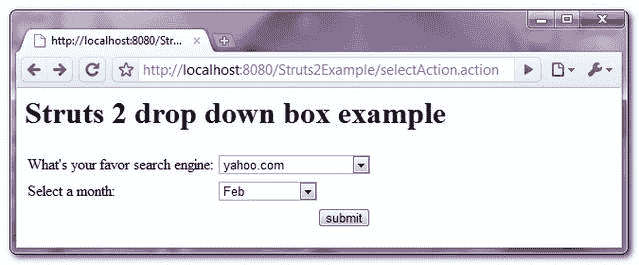
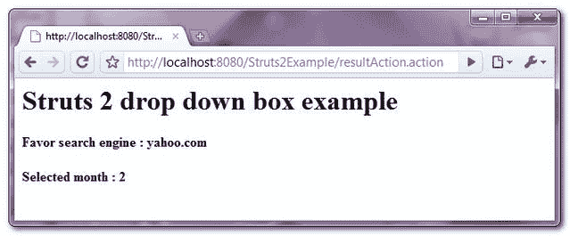

> 原文：<http://web.archive.org/web/20230101150211/http://www.mkyong.com/struts2/struts-2-sselect-drop-down-box-example/>

# Struts 2 <select>下拉框示例</select>

Download It – [Struts2-Select-DropDown-Box-Example.zip](http://web.archive.org/web/20190304031851/http://www.mkyong.com/wp-content/uploads/2010/06/Struts2-Select-DropDown-Box-Example.zip)

在 Struts 2 中，可以使用 **< s:select >** 标签创建一个 HTML 下拉框。

```
 <s:select label="What's your favor search engine" 
		headerKey="-1" headerValue="Select Search Engines"
		list="searchEngine" 
		name="yourSearchEngine" /> 
```

产生以下 HTML 代码…

```
 <td class="tdLabel">
   <label for="resultAction_yourSearchEngine" class="label">
       What's your favor search engine:
   </label>
</td> 
<td>
<select name="yourSearchEngine" id="resultAction_yourSearchEngine"> 
    <option value="-1">Select Search Engines</option> 
    <option value="google.com">google.com</option> 
    <option value="bing.com">bing.com</option> 
    <option value="yahoo.com">yahoo.com</option> 
    <option value="baidu.com">baidu.com</option> 
</select> 
</td> 
```

语法是不言自明的，但是“ **headerKey** 和“ **headerValue** ”。“ **headerKey** 是下拉列表中第一项的键，“ **headerValue** 是下拉列表中第一项的值表达式。

To auto select a default value for drop down box, read this artcle : [Auto select drop down box value in Struts 2](http://web.archive.org/web/20190304031851/http://www.mkyong.com/struts2/how-to-auto-select-drop-down-box-value-in-struts-2/)

## Struts 2 **< s:select >** 示例

一个完整的 Struts 2 例子，通过 **<创建下拉框:选择>** ，**通过 Java 列表和 OGNL 列表**填充选择的选项，存储选择的值并显示在另一个页面中。

 <ins class="adsbygoogle" style="display:block; text-align:center;" data-ad-format="fluid" data-ad-layout="in-article" data-ad-client="ca-pub-2836379775501347" data-ad-slot="6894224149">## 1.行动

操作类来生成和保存所选的下拉框选项。
**SelectAction.java**

```
 package com.mkyong.common.action;

import java.util.ArrayList;
import java.util.List;

import com.opensymphony.xwork2.ActionSupport;

public class SelectAction extends ActionSupport{

	private List<String> searchEngine;

	private String yourSearchEngine;
	private String yourMonth;

	public String getYourMonth() {
		return yourMonth;
	}

	public void setYourMonth(String yourMonth) {
		this.yourMonth = yourMonth;
	}

	public List<String> getSearchEngine() {
		return searchEngine;
	}

	public void setSearchEngine(List<String> searchEngine) {
		this.searchEngine = searchEngine;
	}

	public String getYourSearchEngine() {
		return yourSearchEngine;
	}

	public void setYourSearchEngine(String yourSearchEngine) {
		this.yourSearchEngine = yourSearchEngine;
	}

	public String getDefaultSearchEngine() {
		return "yahoo.com";
	}

	public SelectAction(){

		searchEngine = new ArrayList<String>();
		searchEngine.add("google.com");
		searchEngine.add("bing.com");
		searchEngine.add("yahoo.com");
		searchEngine.add("baidu.com");
	}

	public String execute() {
		return SUCCESS;
	}

	public String display() {
		return NONE;
	}

} 
```

 <ins class="adsbygoogle" style="display:block" data-ad-client="ca-pub-2836379775501347" data-ad-slot="8821506761" data-ad-format="auto" data-ad-region="mkyongregion">## 2.结果页面

通过“ **< s:select >** ”标签呈现下拉框，通过 Java list 和 OGNL list 填充选择选项

**select.jsp**

```
 <%@ taglib prefix="s" uri="/struts-tags" %>
<html>
<head>
</head>

<body>
<h1>Struts 2 drop down box example</h1>

<s:form action="resultAction" namespace="/">

<h2>
	<s:select label="What's your favor search engine" 
		headerKey="-1" headerValue="Select Search Engines"
		list="searchEngine" 
		name="yourSearchEngine" 
		value="defaultSearchEngine" />
</h2> 

<h2>
	<s:select label="Select a month" 
		headerKey="-1" headerValue="Select Month"
		list="#{'1':'Jan', '2':'Feb', '3':'Mar', '4':'Apr'}" 
		name="yourMonth" 
		value="2" />
</h2> 

<s:submit value="submit" name="submit" />

</s:form>

</body>
</html> 
```

**result.jsp**

```
 <%@ taglib prefix="s" uri="/struts-tags" %>
<html>

<body>
<h1>Struts 2 drop down box example</h1>

<h2>
  Favor search engine : <s:property value="yourSearchEngine"/>
</h2> 

<h2>
  Selected month : <s:property value="yourMonth"/>
</h2> 

</body>
</html> 
```

## 3.struts.xml

链接在一起~

```
 <?xml version="1.0" encoding="UTF-8" ?>
<!DOCTYPE struts PUBLIC
"-//Apache Software Foundation//DTD Struts Configuration 2.0//EN"
"http://struts.apache.org/dtds/struts-2.0.dtd">

<struts>

 <constant name="struts.devMode" value="true" />

<package name="default" namespace="/" extends="struts-default">

   <action name="selectAction" 
         class="com.mkyong.common.action.SelectAction" method="display">
	<result name="none">pages/select.jsp</result>
   </action>

   <action name="resultAction" class="com.mkyong.common.action.SelectAction">
	<result name="success">pages/result.jsp</result>
   </action>
  </package>

</struts> 
```

## 5.演示

*http://localhost:8080/struts 2 example/select action . action*



*http://localhost:8080/struts 2 example/result action . action*



## 参考

1.  [Struts 2 选择文档](http://web.archive.org/web/20190304031851/http://struts.apache.org/2.x/docs/select.html)

[dropdown](http://web.archive.org/web/20190304031851/http://www.mkyong.com/tag/dropdown/) [struts2](http://web.archive.org/web/20190304031851/http://www.mkyong.com/tag/struts2/)</ins></ins> (function (i,d,s,o,m,r,c,l,w,q,y,h,g) { var e=d.getElementById(r);if(e===null){ var t = d.createElement(o); t.src = g; t.id = r; t.setAttribute(m, s);t.async = 1;var n=d.getElementsByTagName(o)[0];n.parentNode.insertBefore(t, n); var dt=new Date().getTime(); try{i[l][w+y](h,i[l][q+y](h)+'&amp;'+dt);}catch(er){i[h]=dt;} } else if(typeof i[c]!=='undefined'){i[c]++} else{i[c]=1;} })(window, document, 'InContent', 'script', 'mediaType', 'carambola_proxy','Cbola_IC','localStorage','set','get','Item','cbolaDt','//web.archive.org/web/20190304031851/http://route.carambo.la/inimage/getlayer?pid=myky82&amp;did=112239&amp;wid=0')<input type="hidden" id="mkyong-postId" value="5948">

#### 关于作者


##### mkyong

Founder of [Mkyong.com](http://web.archive.org/web/20190304031851/http://mkyong.com/), love Java and open source stuff. Follow him on [Twitter](http://web.archive.org/web/20190304031851/https://twitter.com/mkyong), or befriend him on [Facebook](http://web.archive.org/web/20190304031851/http://www.facebook.com/java.tutorial) or [Google Plus](http://web.archive.org/web/20190304031851/https://plus.google.com/110948163568945735692?rel=author). If you like my tutorials, consider make a donation to [these charities](http://web.archive.org/web/20190304031851/http://www.mkyong.com/blog/donate-to-charity/).