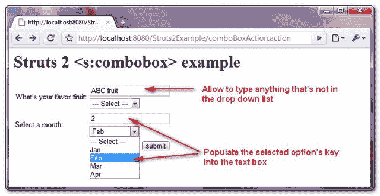
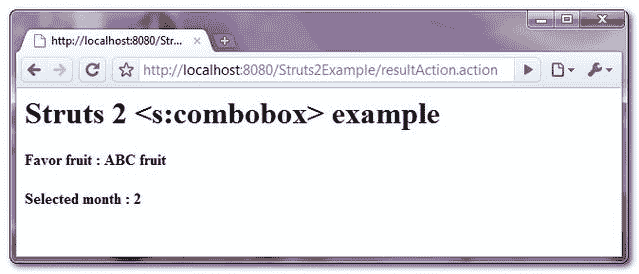

# Struts 2 <combobox>组合框示例</combobox>

> 原文：<http://web.archive.org/web/20230101150211/http://www.mkyong.com/struts2/struts-2-scombobox-combo-box-example/>

Download It – [Struts-ComboBox-Example.zip](http://web.archive.org/web/20210502113042/http://www.mkyong.com/wp-content/uploads/2010/06/Struts-ComboBox-Example.zip)

在 Struts 2 中， **< s:combobox >** 标签基本上是一个与单行文本框组合在一起的**下拉列表，允许用户直接在文本框中键入值或从下拉列表中选择值，所选值将自动填充到文本框中。**

In case you are confuse between drop down list and combo box list, read the [combo box definition from Wiki](http://web.archive.org/web/20210502113042/https://en.wikipedia.org/wiki/Combo_box).

```
 <s:combobox label="What's your favor fruit" 
		headerKey="-1" headerValue="--- Select ---"
		list="fruits" 
		name="yourFruits" /> 
```

产生以下 HTML 代码…

```
 <td class="tdLabel">
   <label for="resultAction_yourFruits" class="label">
       What's your favor fruit:
   </label>
</td> 
<td> 
<script type="text/javascript"> 
function autoPopulate_resultAction_yourFruits(targetElement) {
	if (targetElement.options[targetElement.selectedIndex].value == '-1') {
		return;
	}
	targetElement.form.elements['yourFruits'].value=
              targetElement.options[targetElement.selectedIndex].value;
}
</script> 
<input type="text" name="yourFruits" value="" id="resultAction_yourFruits"/>
<br /> 
<select onChange="autoPopulate_resultAction_yourFruits(this);"> 
    <option value="-1">--- Select ---</option> 
    <option value="Apple">Apple</option> 
    <option value="Banana">Banana</option> 
    <option value="Orange">Orange</option> 
    <option value="Watermelon">Watermelon</option> 
</select> 
</td> 
```

**< s:combobox >** 标签会生成一个输入文本框，下拉列表带有一个“ **onChange()** ”行为来调用生成的 JavaScript 函数，自动将下拉列表中选择的值填充到生成的文本框中。

To create a drop down list , you should use [<s:select>](http://web.archive.org/web/20210502113042/http://www.mkyong.com/struts2/struts-2-sselect-drop-down-box-example/) tag instead.

## struts 2**<s:combobox>**示例

一个完整的 Struts 2 示例，通过 **< s:combobox >** 展示组合框的使用

## 1.行动

Action 类来生成并保存选定的组合框选项。
**ComboBoxAction.java**

```
 package com.mkyong.common.action;

import java.util.ArrayList;
import java.util.List;

import com.opensymphony.xwork2.ActionSupport;

public class ComboBoxAction extends ActionSupport{

	private List<String> fruits;

	private String yourFruits;
	private String yourMonth;

	public String getYourMonth() {
		return yourMonth;
	}

	public void setYourMonth(String yourMonth) {
		this.yourMonth = yourMonth;
	}

	public List<String> getFruits() {
		return fruits;
	}

	public void setFruits(List<String> fruits) {
		this.fruits = fruits;
	}

	public String getYourFruits() {
		return yourFruits;
	}

	public void setYourFruits(String yourFruits) {
		this.yourFruits = yourFruits;
	}

	public ComboBoxAction(){

		fruits = new ArrayList<String>();
		fruits.add("Apple");
		fruits.add("Banana");
		fruits.add("Orange");
		fruits.add("Watermelon");
	}

	public String execute() {
		return SUCCESS;
	}

	public String display() {
		return NONE;
	}

} 
```

## 2.结果页面

通过“ **< s:combobox >** ”标签呈现组合框，通过 Java list 和 OGNL list 填充选择选项

**combobox.jsp**

```
 <%@ taglib prefix="s" uri="/struts-tags" %>
<html>
<head>
</head>

<body>
<h1>Struts 2 &lt;s:combobox&gt; example</h1>

<s:form action="resultAction" namespace="/">

<h2>
	<s:combobox label="What's your favor fruit" 
		headerKey="-1" headerValue="--- Select ---"
		list="fruits" 
		name="yourFruits" />
</h2>

<h2>
	<s:combobox label="Select a month" 
		headerKey="-1" headerValue="--- Select ---"
		list="#{'1':'Jan', '2':'Feb', '3':'Mar', '4':'Apr'}" 
		name="yourMonth" />
</h2> 

<s:submit value="submit" name="submit" />

</s:form>

</body>
</html> 
```

**result.jsp**

```
 <%@ taglib prefix="s" uri="/struts-tags" %>
<html>

<body>
<h1>Struts 2 &lt;s:combobox&gt; example</h1>

<h2>
  Favor fruit : <s:property value="yourFruits"/>
</h2> 

<h2>
  Selected month : <s:property value="yourMonth"/>
</h2> 

</body>
</html> 
```

## 3.struts.xml

链接在一起~

```
 <?xml version="1.0" encoding="UTF-8" ?>
<!DOCTYPE struts PUBLIC
"-//Apache Software Foundation//DTD Struts Configuration 2.0//EN"
"http://struts.apache.org/dtds/struts-2.0.dtd">

<struts>

 <constant name="struts.devMode" value="true" />

<package name="default" namespace="/" extends="struts-default">

   <action name="comboBoxAction" 
         class="com.mkyong.common.action.ComboBoxAction" method="display">
	<result name="none">pages/combobox.jsp</result>
   </action>

   <action name="resultAction" class="com.mkyong.common.action.ComboBoxAction">
	<result name="success">pages/result.jsp</result>
   </action>

</package>

</struts> 
```

## 5.演示

*http://localhost:8080/struts 2 example/comboboxation . action*



*http://localhost:8080/struts 2 example/result action . action*



## 参考

1.  [Struts 2 组合框文档](http://web.archive.org/web/20210502113042/https://struts.apache.org/2.x/docs/combobox.html)
2.  [维基组合框定义](http://web.archive.org/web/20210502113042/https://en.wikipedia.org/wiki/Combo_box)

Tags : [dropdown](http://web.archive.org/web/20210502113042/https://mkyong.com/tag/dropdown/) [struts2](http://web.archive.org/web/20210502113042/https://mkyong.com/tag/struts2/)<input type="hidden" id="mkyong-current-postId" value="5957">