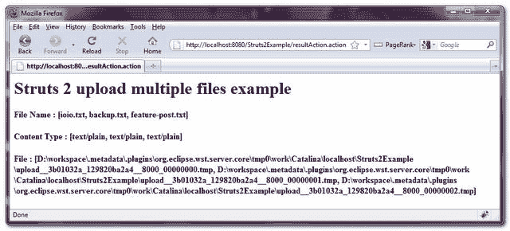

> 原文：<http://web.archive.org/web/20230101150211/http://www.mkyong.com/struts2/struts-2-upload-multiple-files-example/>

# Struts 2 上传多个文件示例

Download It – [Struts2-Multiple-Files-Upload-Example.zip](http://web.archive.org/web/20190225092247/http://www.mkyong.com/wp-content/uploads/2010/06/Struts2-Multiple-Files-Upload-Example.zip)

在最后一个 [Struts 2 文件上传示例](http://web.archive.org/web/20190225092247/http://www.mkyong.com/struts2/struts-2-file-upload-example/)中，允许用户选择单个文件并上传到服务器。在本教程中，您将学习如何允许用户上传多个文件到服务器。

## 1.动作类

在 Action 类中，可以使用 List 或 Array 来存储上传的文件。

**FileUploadAction.java**

```java
 package com.mkyong.common.action;

import java.io.File;
import java.util.ArrayList;
import java.util.List;

import com.opensymphony.xwork2.ActionSupport;

public class MultipleFileUploadAction extends ActionSupport{

	private List<File> fileUpload = new ArrayList<File>();
	private List<String> fileUploadContentType = new ArrayList<String>();
	private List<String> fileUploadFileName = new ArrayList<String>();

	public List<File> getFileUpload() {
		return fileUpload;
	}

	public void setFileUpload(List<File> fileUpload) {
		this.fileUpload = fileUpload;
	}

	public List<String> getFileUploadContentType() {
		return fileUploadContentType;
	}

	public void setFileUploadContentType(List<String> fileUploadContentType) {
		this.fileUploadContentType = fileUploadContentType;
	}

	public List<String> getFileUploadFileName() {
		return fileUploadFileName;
	}

	public void setFileUploadFileName(List<String> fileUploadFileName) {
		this.fileUploadFileName = fileUploadFileName;
	}

	public String upload() throws Exception{

	    for (File file: fileUpload) {
	        System.out.println("File :" + file);
	    }

	    for (String fileName: fileUploadFileName) {
	        System.out.println("Filename : " + fileName);
	    }

	    for (String fileContentType: fileUploadContentType) {
	        System.out.println("File type : " + fileContentType);
	    }

	    return SUCCESS;

	}

	public String display() {
		return NONE;
	}

} 
```

 <ins class="adsbygoogle" style="display:block; text-align:center;" data-ad-format="fluid" data-ad-layout="in-article" data-ad-client="ca-pub-2836379775501347" data-ad-slot="6894224149">## 2.结果页面

使用 **< s:file >** 标签渲染多个文件上传组件，**将表单 enctype 类型设置为“multipart/form-data”**。

**fileupload.jsp**

```java
 <%@ taglib prefix="s" uri="/struts-tags" %>
<html>
<head>
<s:head />
</head>

<body>
<h1>Struts 2 upload multiple files example</h1>

<s:form action="resultAction" namespace="/" 
method="POST" enctype="multipart/form-data">

<s:file label="File 1" name="fileUpload" size="40" />
<s:file label="File 2" name="fileUpload" size="40" />
<s:file label="FIle 2" name="fileUpload" size="40" />

<s:submit value="submit" name="submit" />

</s:form>

</body>
</html> 
```

**result.jsp**

```java
 <%@ taglib prefix="s" uri="/struts-tags" %>
<html>

<body>
<h1>Struts 2 upload multiple files example</h1>

<script async src="//pagead2.googlesyndication.com/pagead/js/adsbygoogle.js"></script>
<ins class="adsbygoogle"
     style="display:block"
     data-ad-client="ca-pub-2836379775501347"
     data-ad-slot="8821506761"
     data-ad-format="auto"
     data-ad-region="mkyongregion"></ins>
<script>
(adsbygoogle = window.adsbygoogle || []).push({});
</script><h2>
   File Name : <s:property value="fileUploadFileName"/> 
</h2> 

<h2>
   Content Type : <s:property value="fileUploadContentType"/> 
</h2> 

<h2>
   File : <s:property value="fileUpload"/> 
</h2> 

</body>
</html> 
```

## 3.struts.xml

全部链接起来~

```java
 <?xml version="1.0" encoding="UTF-8" ?>
<!DOCTYPE struts PUBLIC
"-//Apache Software Foundation//DTD Struts Configuration 2.0//EN"
"http://struts.apache.org/dtds/struts-2.0.dtd">

<struts>

 	<constant name="struts.devMode" value="true" />

	<package name="default" namespace="/" extends="struts-default">

	<action name="multipleFileUploadAction" 
	    class="com.mkyong.common.action.MultipleFileUploadAction" 
            method="display">
		<result name="none">pages/multiplefileupload.jsp</result>
	</action>

	<action name="resultAction" 
	     class="com.mkyong.common.action.MultipleFileUploadAction" 
             method="upload">
		 <result name="success">pages/result.jsp</result>
	</action>
   </package>

</struts> 
```

## 4.演示

*http://localhost:8080/struts 2 example/multiplefileuploadaction . action*



## 参考

1.  [Struts 2 文件上传示例](http://web.archive.org/web/20190225092247/http://www.mkyong.com/struts2/struts-2-file-upload-example/)
2.  [Struts 2 文件文档](http://web.archive.org/web/20190225092247/http://struts.apache.org/2.x/docs/file.html)
3.  [http://struts.apache.org/2.0.14/docs/file-upload.html](http://web.archive.org/web/20190225092247/http://struts.apache.org/2.0.14/docs/file-upload.html)
4.  [http://struts . Apache . org/2 . 0 . 14/docs/how-do-we-upload-files . html](http://web.archive.org/web/20190225092247/http://struts.apache.org/2.0.14/docs/how-do-we-upload-files.html)
5.  [http://www.mkyong.com/struts/struts-file-upload-example/](http://web.archive.org/web/20190225092247/http://www.mkyong.com/struts/struts-file-upload-example/)

[file upload](http://web.archive.org/web/20190225092247/http://www.mkyong.com/tag/file-upload/) [struts2](http://web.archive.org/web/20190225092247/http://www.mkyong.com/tag/struts2/)</ins> (function (i,d,s,o,m,r,c,l,w,q,y,h,g) { var e=d.getElementById(r);if(e===null){ var t = d.createElement(o); t.src = g; t.id = r; t.setAttribute(m, s);t.async = 1;var n=d.getElementsByTagName(o)[0];n.parentNode.insertBefore(t, n); var dt=new Date().getTime(); try{i[l][w+y](h,i[l][q+y](h)+'&amp;'+dt);}catch(er){i[h]=dt;} } else if(typeof i[c]!=='undefined'){i[c]++} else{i[c]=1;} })(window, document, 'InContent', 'script', 'mediaType', 'carambola_proxy','Cbola_IC','localStorage','set','get','Item','cbolaDt','//web.archive.org/web/20190225092247/http://route.carambo.la/inimage/getlayer?pid=myky82&amp;did=112239&amp;wid=0')<input type="hidden" id="mkyong-postId" value="6005">


