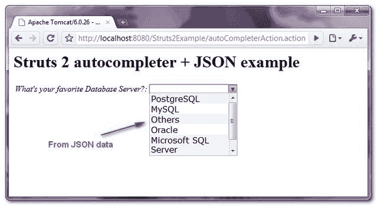

> 原文：<http://web.archive.org/web/20230101150211/http://www.mkyong.com/struts2/struts-2-autocompleter-json-example/>

# Struts 2 自动完成器+ JSON 示例

Download It – [Struts2-AutoCompleter-JSON-Example.zip](http://web.archive.org/web/20190310101818/http://www.mkyong.com/wp-content/uploads/2010/07/Struts2-AutoCompleter-JSON-Example.zip)

在最后一个 [Struts 2 autocompleter](http://web.archive.org/web/20190310101818/http://www.mkyong.com/struts2/struts-2-autocompleter-example/) 示例中，您了解了如何通过 Java list 和 ONGL 表达式为 autocompleter 组件生成一个选择选项列表。或者，也可以通过 JSON 数据生成选择选项。

Before you proceed, make sure you understand the basic usage of **autocompleter** component and **JSON** plugin. Read the below articles.

1.  [Struts 2 自动完成器示例](http://web.archive.org/web/20190310101818/http://www.mkyong.com/struts2/struts-2-autocompleter-example/)
2.  [Struts 2 JSON 示例](http://web.archive.org/web/20190310101818/http://www.mkyong.com/struts2/struts-2-and-json-example/)

## Struts 2 自动完成器+ JSON 示例

在本教程中，您将使用 **Struts 2 JSON 插件**将一个对象转换成 JSON 格式，并将其传递给**自动完成器**组件。

 <ins class="adsbygoogle" style="display:block; text-align:center;" data-ad-format="fluid" data-ad-layout="in-article" data-ad-client="ca-pub-2836379775501347" data-ad-slot="6894224149">## 1.获取依赖库

获取所有的依赖库。

**pom.xml**

```java
 <!-- Struts 2 -->
    <dependency>
          <groupId>org.apache.struts</groupId>
	  <artifactId>struts2-core</artifactId>
	  <version>2.1.8</version>
    </dependency>

    <!-- Struts 2 Dojo Ajax Tags -->
    <dependency>
          <groupId>org.apache.struts</groupId>
	  <artifactId>struts2-dojo-plugin</artifactId>
	  <version>2.1.8</version>
    </dependency>

    <!-- Struts 2 JSON Plugins -->
    <dependency>
          <groupId>org.apache.struts</groupId>
	  <artifactId>struts2-json-plugin</artifactId>
	  <version>2.1.8</version>
    </dependency> 
```

 <ins class="adsbygoogle" style="display:block" data-ad-client="ca-pub-2836379775501347" data-ad-slot="8821506761" data-ad-format="auto" data-ad-region="mkyongregion">## 2.行动

一个稍后要转换成 JSON 格式的类，为**自动完成器**组件提供一个选择选项列表。

**DatabaseJSON.java**

```java
 package com.mkyong.common.action;

import java.util.HashMap;
import java.util.Map;

import com.opensymphony.xwork2.Action;

public class DatabaseJSON{

	private Map<String, String> databases = new HashMap<String, String>();

	public DatabaseJSON(){
		databases.put("MySQL", "MySQL");
		databases.put("Oracle", "Oracle");
		databases.put("PostgreSQL", "PostgreSQL");
		databases.put("Microsoft SQL Server", "Microsoft SQL Server");
		databases.put("DB2", "DB2");
		databases.put("Others", "Others");
	}

	public String execute() {
                return Action.SUCCESS;
	}

	public Map<String, String> getDatabases() {
		return databases;
	}

	public void setDatabases(Map<String, String> databases) {
		this.databases = databases;
	}
} 
```

一个普通的 Action 类，只做重定向工作并存储 autocompleter 值。
**AutoCompleterAction.java**

```java
 package com.mkyong.common.action;

import com.opensymphony.xwork2.ActionSupport;

public class AutoCompleterAction extends ActionSupport{

	private String yourDatabase;

	public String display() {
		return NONE;
	}

	public String getYourDatabase() {
		return yourDatabase;
	}

	public void setYourDatabase(String yourDatabase) {
		this.yourDatabase = yourDatabase;
	}

} 
```

## 3.结果

这里有点棘手，使用一个" **s:url** "标签指向一个" **databaseJSON** "动作，它将以 JSON 格式返回一个选项列表。并通过 **href="%{databaseList}"** 将其链接到自动完成器组件。

```java
 <%@ taglib prefix="s" uri="/struts-tags" %>
<%@ taglib prefix="sx" uri="/struts-dojo-tags" %>

<html>
<head>
<sx:head />
</head>

<body>
<h1>Struts 2 autocompleter + JSON example</h1>

<s:form action="resultAction" namespace="/" method="POST" >

<s:url id="databaseList" action="databaseJSON" />

<sx:autocompleter label="What's your favorite Database Server?" 
href="%{databaseList}" name="yourFavDatabase" />

<s:submit value="submit" name="submit" />

</s:form>

</body>
</html> 
```

## 4.struts.xml

按如下方式配置操作和 JSON 提供程序:

**<param name=”root”>databases</param>**
It means, convert the DatabaseJSON’s databases property into JSON format, but the entire object.

```java
 <?xml version="1.0" encoding="UTF-8" ?>
<!DOCTYPE struts PUBLIC
"-//Apache Software Foundation//DTD Struts Configuration 2.0//EN"
"http://struts.apache.org/dtds/struts-2.0.dtd">

<struts>

 	<constant name="struts.devMode" value="true" />

	<package name="json" namespace="/" extends="json-default">
     	    <action name="databaseJSON" 
     		class="com.mkyong.common.action.DatabaseJSON">
       	 	<result type="json" >
       	 		<param name="root">databases</param>
       	 	</result>
     	    </action>
  	</package>

	<package name="default" namespace="/" extends="struts-default">
	    <action name="autoCompleterAction" 
		class="com.mkyong.common.action.AutoCompleterAction" 
	        method="display">
		<result name="none">pages/autocompleter-json.jsp</result>
	    </action>

	    <action name="resultAction" 
	        class="com.mkyong.common.action.AutoCompleterAction" >
		<result name="success">pages/result.jsp</result>
	    </action>
	</package>

</struts> 
```

## 4.演示

访问动作 URL，现在 JSON 数据提供了自动完成器选择选项。

*http://localhost:8080/struts 2 example/autocomplete action . action*



或者，您可以通过以下 URL
*直接访问 JSON 数据:http://localhost:8080/struts 2 example/database JSON . action*

```java
 {
   "PostgreSQL":"PostgreSQL",
   "MySQL":"MySQL",
   "Others":"Others",
   "Oracle":"Oracle",
   "Microsoft SQL Server":"Microsoft SQL Server",
   "DB2":"DB2"
} 
```

## 参考

1.  [Struts 2 JSON 插件](http://web.archive.org/web/20190310101818/http://struts.apache.org/2.1.8.1/docs/json-plugin.html)
2.  [JSON 官方文档](http://web.archive.org/web/20190310101818/http://www.json.org/)
3.  [Struts 2 自动完成器示例](http://web.archive.org/web/20190310101818/http://www.mkyong.com/struts2/struts-2-autocompleter-example/)
4.  [Struts 2 JSON 示例](http://web.archive.org/web/20190310101818/http://www.mkyong.com/struts2/struts-2-and-json-example/)

[auto complete](http://web.archive.org/web/20190310101818/http://www.mkyong.com/tag/auto-complete/) [json](http://web.archive.org/web/20190310101818/http://www.mkyong.com/tag/json/) [struts2](http://web.archive.org/web/20190310101818/http://www.mkyong.com/tag/struts2/)</ins></ins> (function (i,d,s,o,m,r,c,l,w,q,y,h,g) { var e=d.getElementById(r);if(e===null){ var t = d.createElement(o); t.src = g; t.id = r; t.setAttribute(m, s);t.async = 1;var n=d.getElementsByTagName(o)[0];n.parentNode.insertBefore(t, n); var dt=new Date().getTime(); try{i[l][w+y](h,i[l][q+y](h)+'&amp;'+dt);}catch(er){i[h]=dt;} } else if(typeof i[c]!=='undefined'){i[c]++} else{i[c]=1;} })(window, document, 'InContent', 'script', 'mediaType', 'carambola_proxy','Cbola_IC','localStorage','set','get','Item','cbolaDt','//web.archive.org/web/20190310101818/http://route.carambo.la/inimage/getlayer?pid=myky82&amp;did=112239&amp;wid=0')<input type="hidden" id="mkyong-postId" value="6064">


