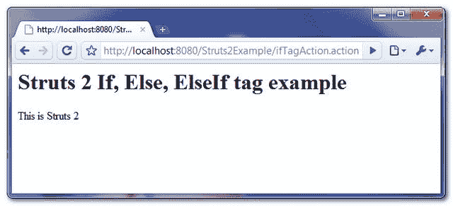

> 原文：<http://web.archive.org/web/20230101150211/http://www.mkyong.com/struts2/struts-2-if-elseif-else-tag-example/>

# Struts 2 If，ElseIf，Else 标签示例

Download It – [Struts2-If-ElseIf-Else-Tag-Example.zip](http://web.archive.org/web/20190304032820/http://www.mkyong.com/wp-content/uploads/2010/07/Struts2-If-ElseIf-Else-Tag-Example.zip)

Struts 2 **If、ElseIf 和 Else** 标签用于执行基本条件检查。

' **If** '标签可以单独使用

```
 <s:if test="%{#variable=='String 1'}">
	This is String 1
</s:if> 
```

或者用' **Else If** 标记

```
 <s:if test="%{#variable=='String 1'}">
	This is String 1
</s:if>
<s:elseif test="%{#variable=='String 2'}">
    This is String 2
</s:elseif> 
```

和/或单个/多个' **Else** 标签。

```
 <s:if test="%{#variable=='String 1'}">
	This is String 1
</s:if>
<s:elseif test="%{#variable=='String 2'}">
    This is String 2
</s:elseif>
<s:else>
    Other Strings
</s:else> 
```

以上说法都是对的。让我们看一个例子来展示 Struts 2 ' **If，ElseIf 和 Else** 标签的使用。

## 1.行动

一个带有字符串属性的 Action 类，它包含一个“ **Struts 2** 值。

**IfTagAction**

```
 package com.mkyong.common.action;

import com.opensymphony.xwork2.ActionSupport;

public class IfTagAction extends ActionSupport{

	private String framework = "Struts 2";

	public String getFramework() {
		return framework;
	}

	public void setFramework(String framework) {
		this.framework = framework;
	}

	public String execute() {
		return SUCCESS;
	}
} 
```

 <ins class="adsbygoogle" style="display:block; text-align:center;" data-ad-format="fluid" data-ad-layout="in-article" data-ad-client="ca-pub-2836379775501347" data-ad-slot="6894224149">## 2.If、ElseIf 和 Else 标签示例

一个 JSP 页面，展示了使用 **If、ElseIf 和 Else** 标签对“**框架**变量执行条件检查。

**if.jsp**

```
 <%@ taglib prefix="s" uri="/struts-tags" %>
 <html>
<head>
</head>

<body>
<h1>Struts 2 If, Else, ElseIf tag example</h1>

<s:set name="webFramework" value="framework"/>

<s:if test="%{#webFramework=='Struts 2'}">
	This is Struts 2
</s:if>
<s:elseif test="%{#webFramework=='Struts 1'}">
    This is Struts 1
</s:elseif>
<s:else>
    Other framework
</s:else>

</body>
</html> 
```

 <ins class="adsbygoogle" style="display:block" data-ad-client="ca-pub-2836379775501347" data-ad-slot="8821506761" data-ad-format="auto" data-ad-region="mkyongregion">## 3.struts.xml

链接一下~

```
 <?xml version="1.0" encoding="UTF-8" ?>
<!DOCTYPE struts PUBLIC
"-//Apache Software Foundation//DTD Struts Configuration 2.0//EN"
"http://struts.apache.org/dtds/struts-2.0.dtd">

<struts>

 	<constant name="struts.devMode" value="true" />

	<package name="default" namespace="/" extends="struts-default">

		<action name="ifTagAction" 
			class="com.mkyong.common.action.IfTagAction" >
			<result name="success">pages/if.jsp</result>
		</action>

	</package>

</struts> 
```

## 4.演示

*http://localhost:8080/struts 2 example/iftagaction . action*



## 参考

1.  [Struts 2 If 标签文档](http://web.archive.org/web/20190304032820/http://struts.apache.org/2.0.14/docs/if.html)
2.  [Struts 2 ElseIf 标签文档](http://web.archive.org/web/20190304032820/http://struts.apache.org/2.0.14/docs/elseif.html)
3.  [Struts 2 Else 文档](http://web.archive.org/web/20190304032820/http://struts.apache.org/2.0.14/docs/else.html)

[struts2](http://web.archive.org/web/20190304032820/http://www.mkyong.com/tag/struts2/)</ins></ins> (function (i,d,s,o,m,r,c,l,w,q,y,h,g) { var e=d.getElementById(r);if(e===null){ var t = d.createElement(o); t.src = g; t.id = r; t.setAttribute(m, s);t.async = 1;var n=d.getElementsByTagName(o)[0];n.parentNode.insertBefore(t, n); var dt=new Date().getTime(); try{i[l][w+y](h,i[l][q+y](h)+'&amp;'+dt);}catch(er){i[h]=dt;} } else if(typeof i[c]!=='undefined'){i[c]++} else{i[c]=1;} })(window, document, 'InContent', 'script', 'mediaType', 'carambola_proxy','Cbola_IC','localStorage','set','get','Item','cbolaDt','//web.archive.org/web/20190304032820/http://route.carambo.la/inimage/getlayer?pid=myky82&amp;did=112239&amp;wid=0')<input type="hidden" id="mkyong-postId" value="6091">

#### 关于作者


##### mkyong

Founder of [Mkyong.com](http://web.archive.org/web/20190304032820/http://mkyong.com/), love Java and open source stuff. Follow him on [Twitter](http://web.archive.org/web/20190304032820/https://twitter.com/mkyong), or befriend him on [Facebook](http://web.archive.org/web/20190304032820/http://www.facebook.com/java.tutorial) or [Google Plus](http://web.archive.org/web/20190304032820/https://plus.google.com/110948163568945735692?rel=author). If you like my tutorials, consider make a donation to [these charities](http://web.archive.org/web/20190304032820/http://www.mkyong.com/blog/donate-to-charity/).