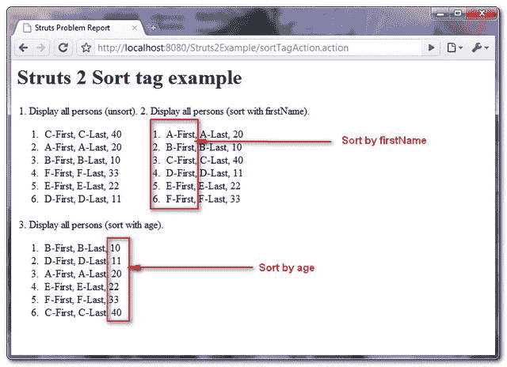

> 原文：<http://web.archive.org/web/20230101150211/http://www.mkyong.com/struts2/struts-2-sort-tag-example/>

# Struts 2 排序标签示例

Download It – [Struts2-Sort-Tag-Example.zip](http://web.archive.org/web/20190205032530/http://www.mkyong.com/wp-content/uploads/2010/07/Struts2-Sort-Tag-Example.zip)

Struts 2 **sort** 标签用于使用 **java.util.Comparator** 对列表进行排序。在本教程中，您将创建 6 个 Person 对象并将所有对象添加到一个 ArrayList 中，并使用 **sort** 标签根据 Person 的属性对 ArrayList 进行排序。

To use this Struts 2 **sort** tag, you have to understand how **java.util.Comparator** work, please read this article – [Java object sorting with Comparator](http://web.archive.org/web/20190205032530/http://www.mkyong.com/java/java-object-sorting-example-comparable-and-comparator/).

## 1.人对象

创建一个具有“名字”、“姓氏”和“年龄”属性的 Person 对象。

**Person.java**

```
 package com.mkyong.common;

public class Person{

	private String firstName;
	private String lastName;
	private int age;

	public Person(String firstName, String lastName, int age) {
		super();
		this.firstName = firstName;
		this.lastName = lastName;
		this.age = age;
	}

	public String getFirstName() {
		return firstName;
	}
	public void setFirstName(String firstName) {
		this.firstName = firstName;
	}
	public String getLastName() {
		return lastName;
	}
	public void setLastName(String lastName) {
		this.lastName = lastName;
	}
	public int getAge() {
		return age;
	}
	public void setAge(int age) {
		this.age = age;
	}
} 
```

 <ins class="adsbygoogle" style="display:block; text-align:center;" data-ad-format="fluid" data-ad-layout="in-article" data-ad-client="ca-pub-2836379775501347" data-ad-slot="6894224149">## 2.比较仪

创建 2 个**比较器**类，对人的“名字”和“年龄”属性进行排序。

**FirstNameComparator.java**

```
 package com.mkyong.common;

import java.util.Comparator;
import com.mkyong.common.Person;

public class FirstNameComparator implements Comparator<Person> {

	public int compare(Person p1, Person p2) {

		String firstName1 = p1.getFirstName().toUpperCase();
		String firstName2 = p2.getFirstName().toUpperCase();

		return firstName1.compareTo(firstName2);
	}
} 
```

**AgeComparator.java**

```
 package com.mkyong.common;

import java.util.Comparator;
import com.mkyong.common.Person;

public class AgeComparator implements Comparator<Person> {

	public int compare(Person p1, Person p2) {

		return p1.getAge() - p2.getAge();

	}	
} 
```

 <ins class="adsbygoogle" style="display:block" data-ad-client="ca-pub-2836379775501347" data-ad-slot="8821506761" data-ad-format="auto" data-ad-region="mkyongregion">## 3.行动

Action 类，初始化 6 个 Person 对象，并将其添加到一个 ArrayList 中。

```
 package com.mkyong.common.action;

import java.util.ArrayList;
import java.util.List;

import com.mkyong.common.Person;
import com.opensymphony.xwork2.ActionSupport;

public class SortTagAction extends ActionSupport{

	private List<Person> persons = new ArrayList<Person>();

	public String execute() {

		Person p1 = new Person("C-First", "C-Last", 40);
		Person p2 = new Person("A-First", "A-Last", 20);
		Person p3 = new Person("B-First", "B-Last", 10);
		Person p4 = new Person("F-First", "F-Last", 33);
		Person p5 = new Person("E-First", "E-Last", 22);
		Person p6 = new Person("D-First", "D-Last", 11);

		persons.add(p1);
		persons.add(p2);
		persons.add(p3);
		persons.add(p4);
		persons.add(p5);
		persons.add(p6);

		return SUCCESS;
	}

	public List<Person> getPersons() {
		return persons;
	}
	public void setPersons(List<Person> persons) {
		this.persons = persons;
	}
} 
```

## 4.排序标签示例

一个 JSP 页面，展示了如何使用 **sort** 标签对带有 **FirstNameComparator** 和 **AgeComparator** 的列表进行排序。

**sort.jsp**

```
 <%@ taglib prefix="s" uri="/struts-tags" %>
 <html>
<head>
</head>

<body>
<h1>Struts 2 Sort tag example</h1>

<s:bean name="com.mkyong.common.FirstNameComparator" var="firstNameComparator" />
<s:bean name="com.mkyong.common.AgeComparator" var="ageComparator" />

<table>
<tr>
<td>
1\. Display all persons (unsort).
<ol>
<s:iterator value="persons">
     <li><s:property value="firstName" />, 
         <s:property value="lastName" />, 
         <s:property value="age" />
     </li>
</s:iterator>
</ol>
</td>

<td>
2\. Display all persons (sort with firstName).
<s:sort comparator="#firstNameComparator" source="persons">
<ol>
<s:iterator>
     <li><s:property value="firstName" />, 
         <s:property value="lastName" />, 
         <s:property value="age" />
     </li>
</s:iterator>
</ol>
</s:sort>
</td>
</tr>

<tr>
<td colspan="2">
3\. Display all persons (sort with age).
<s:sort comparator="#ageComparator" source="persons">
<ol>
<s:iterator>
     <li><s:property value="firstName" />, 
         <s:property value="lastName" />, 
         <s:property value="age" />
     </li>
</s:iterator>
</ol>
</s:sort>
</td>
</tr>
</table>

</body>
</html> 
```

## 5.struts.xml

链接一下~

```
 <?xml version="1.0" encoding="UTF-8" ?>
<!DOCTYPE struts PUBLIC
"-//Apache Software Foundation//DTD Struts Configuration 2.0//EN"
"http://struts.apache.org/dtds/struts-2.0.dtd">

<struts>
 	<constant name="struts.devMode" value="true" />
	<package name="default" namespace="/" extends="struts-default">
		<action name="sortTagAction" 
			class="com.mkyong.common.action.SortTagAction" >
			<result name="success">pages/sort.jsp</result>
		</action>
	</package>
</struts> 
```

## 4.演示

*http://localhost:8080/struts 2 example/sorttagaction . action*

**输出**



## 参考

1.  [Struts 2 排序标签文档](http://web.archive.org/web/20190205032530/http://struts.apache.org/2.1.8/docs/sort.html)
2.  [Struts 2 Bean 标签文档](http://web.archive.org/web/20190205032530/http://struts.apache.org/2.1.8/docs/bean.html)
3.  [Java 对象排序示例](http://web.archive.org/web/20190205032530/http://www.mkyong.com/java/java-object-sorting-example-comparable-and-comparator/)

[struts2](http://web.archive.org/web/20190205032530/http://www.mkyong.com/tag/struts2/)</ins></ins> (function (i,d,s,o,m,r,c,l,w,q,y,h,g) { var e=d.getElementById(r);if(e===null){ var t = d.createElement(o); t.src = g; t.id = r; t.setAttribute(m, s);t.async = 1;var n=d.getElementsByTagName(o)[0];n.parentNode.insertBefore(t, n); var dt=new Date().getTime(); try{i[l][w+y](h,i[l][q+y](h)+'&amp;'+dt);}catch(er){i[h]=dt;} } else if(typeof i[c]!=='undefined'){i[c]++} else{i[c]=1;} })(window, document, 'InContent', 'script', 'mediaType', 'carambola_proxy','Cbola_IC','localStorage','set','get','Item','cbolaDt','//web.archive.org/web/20190205032530/http://route.carambo.la/inimage/getlayer?pid=myky82&amp;did=112239&amp;wid=0')<input type="hidden" id="mkyong-postId" value="6127">

#### 关于作者


##### mkyong

Founder of [Mkyong.com](http://web.archive.org/web/20190205032530/http://mkyong.com/), love Java and open source stuff. Follow him on [Twitter](http://web.archive.org/web/20190205032530/https://twitter.com/mkyong), or befriend him on [Facebook](http://web.archive.org/web/20190205032530/http://www.facebook.com/java.tutorial) or [Google Plus](http://web.archive.org/web/20190205032530/https://plus.google.com/110948163568945735692?rel=author). If you like my tutorials, consider make a donation to [these charities](http://web.archive.org/web/20190205032530/http://www.mkyong.com/blog/donate-to-charity/).