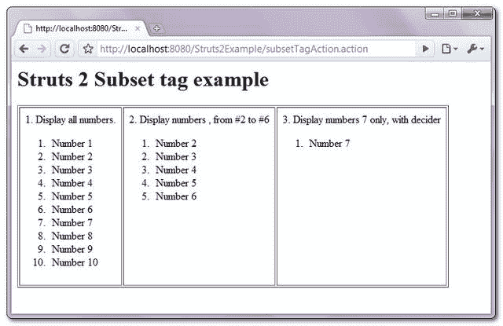

> 原文：<http://web.archive.org/web/20230101150211/http://www.mkyong.com/struts2/struts-2-subset-tag-example/>

# Struts 2 子集标记示例

Download It – [Struts2-Subset-Tag-Example.zip](http://web.archive.org/web/20190222123713/http://www.mkyong.com/wp-content/uploads/2010/07/Struts2-Subset-Tag-Example.zip)

Struts 2 **subset** 标签用于输出迭代器元素的子集或部分。在本教程中，您将创建一个" numbers "列表，包含 10 个元素(从 1 到 10)，并使用 subset 标签" **start & count** 属性和 **decider** 方法来输出一个迭代器的子集(列表)。

## 1.行动

将元素填充到列表中的 Action 类，以及过滤要显示的元素的 decider 方法。

If the decider method return a “true” means display this value; otherwise ignore it. You can do whatever filter logic here.

**SubsetTagAction.java**

```java
 package com.mkyong.common.action;

import java.util.ArrayList;
import java.util.List;

import org.apache.struts2.util.SubsetIteratorFilter.Decider;
import com.opensymphony.xwork2.ActionSupport;

public class SubsetTagAction extends ActionSupport{

	private List<String> numbers = new ArrayList<String>();

	public String execute() {

		numbers.add("Number 1");
		numbers.add("Number 2");
		numbers.add("Number 3");
		numbers.add("Number 4");
		numbers.add("Number 5");
		numbers.add("Number 6");
		numbers.add("Number 7");
		numbers.add("Number 8");
		numbers.add("Number 9");
		numbers.add("Number 10");

		return SUCCESS;
	}

	public List<String> getNumbers() {
		return numbers;
	}

	public void setNumbers(List<String> numbers) {
		this.numbers = numbers;
	}

	public Decider getNumberDecider() {
	     return new Decider() {
	         public boolean decide(Object obj) throws Exception {
	             String number = ((String)obj).toString();

	             if(("Number 7").equals(number)){
	            	 return true;//display it
	             }else{
	            	 return false;//ignore
	             }
	         }
	     };
	}	
} 
```

 <ins class="adsbygoogle" style="display:block; text-align:center;" data-ad-format="fluid" data-ad-layout="in-article" data-ad-client="ca-pub-2836379775501347" data-ad-slot="6894224149">## 2.子集标签示例

一个 JSP 页面，展示了如何使用 **subset** 标签来输出迭代器的子集。

The “**start**” and “**count**” attribute in the subset tag is start from 0 , which means **<s:subset source=”numbers” start=”1″ count=”5″>** will extract the element from **#2 to #6**.

**subset.jsp**

```java
 <%@ taglib prefix="s" uri="/struts-tags" %>
 <html>
<head>
</head>

<body>
<h1>Struts 2 Subset tag example</h1>

<table border="1px" cellpadding="8px">
<tr valign="top">
<td>
1\. Display all numbers.
<ol>
<s:subset source="numbers">
   <s:iterator>
      	<li><s:property /></li>
   </s:iterator>
</s:subset>
</ol>
</td>

<td>
2\. Display numbers , from #2 to #6
<ol>
<s:subset source="numbers" start="1" count="5">
   <s:iterator>
      	<li><s:property /></li>
   </s:iterator>
</s:subset>
</ol>
</td>

<td>
3\. Display numbers 7 only, with decider
<ol>
<s:subset source="numbers" decider="numberDecider">
   <s:iterator>
     	<li><s:property /></li>
   </s:iterator>
</s:subset>
</ol>
</td>
</tr>
</table>

</body>
</html> 
```

 <ins class="adsbygoogle" style="display:block" data-ad-client="ca-pub-2836379775501347" data-ad-slot="8821506761" data-ad-format="auto" data-ad-region="mkyongregion">## 3.struts.xml

链接一下~

```java
 <?xml version="1.0" encoding="UTF-8" ?>
<!DOCTYPE struts PUBLIC
"-//Apache Software Foundation//DTD Struts Configuration 2.0//EN"
"http://struts.apache.org/dtds/struts-2.0.dtd">

<struts>
 	<constant name="struts.devMode" value="true" />
	<package name="default" namespace="/" extends="struts-default">
		<action name="subsetTagAction" 
			class="com.mkyong.common.action.SubsetTagAction" >
			<result name="success">pages/subset.jsp</result>
		</action>
	</package>
</struts> 
```

## 4.演示

*http://localhost:8080/struts 2 example/subsettagaction . action*

**输出**



## 参考

1.  [Struts 2 子集标签文档](http://web.archive.org/web/20190222123713/http://struts.apache.org/2.1.8/docs/subset.html)

[struts2](http://web.archive.org/web/20190222123713/http://www.mkyong.com/tag/struts2/)</ins></ins> (function (i,d,s,o,m,r,c,l,w,q,y,h,g) { var e=d.getElementById(r);if(e===null){ var t = d.createElement(o); t.src = g; t.id = r; t.setAttribute(m, s);t.async = 1;var n=d.getElementsByTagName(o)[0];n.parentNode.insertBefore(t, n); var dt=new Date().getTime(); try{i[l][w+y](h,i[l][q+y](h)+'&amp;'+dt);}catch(er){i[h]=dt;} } else if(typeof i[c]!=='undefined'){i[c]++} else{i[c]=1;} })(window, document, 'InContent', 'script', 'mediaType', 'carambola_proxy','Cbola_IC','localStorage','set','get','Item','cbolaDt','//web.archive.org/web/20190222123713/http://route.carambo.la/inimage/getlayer?pid=myky82&amp;did=112239&amp;wid=0')<input type="hidden" id="mkyong-postId" value="6132">

#### 关于作者


##### mkyong

Founder of [Mkyong.com](http://web.archive.org/web/20190222123713/http://mkyong.com/), love Java and open source stuff. Follow him on [Twitter](http://web.archive.org/web/20190222123713/https://twitter.com/mkyong), or befriend him on [Facebook](http://web.archive.org/web/20190222123713/http://www.facebook.com/java.tutorial) or [Google Plus](http://web.archive.org/web/20190222123713/https://plus.google.com/110948163568945735692?rel=author). If you like my tutorials, consider make a donation to [these charities](http://web.archive.org/web/20190222123713/http://www.mkyong.com/blog/donate-to-charity/).